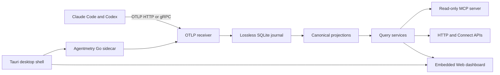

# Agentmetry Product Architecture

- Status: Current
- Last reviewed: 2026-08-17
- Product: Agentmetry 1.x
- Deployment: desktop app, standalone binary, and container

## Product boundary

Agentmetry is a local-first observability product for AI coding agents. It
receives OpenTelemetry data from Claude Code and Codex, persists accepted data
locally, derives agent-oriented projections, and exposes the same evidence
through a Web dashboard, HTTP/Connect APIs, and a read-only MCP server.

Normal operation does not require a hosted service or an external database.
Listeners bind to loopback by default. Source processes send telemetry to
Agentmetry; Agentmetry does not control or proxy their execution.

## Runtime topology

The standalone binary and container run the same Go server used as the desktop
sidecar. The Web application is compiled to static assets and embedded in that
binary, so installed runtime profiles do not require Node.js.

## Components and ownership

| Component | Location | Responsibility |
| --- | --- | --- |
| Process composition | `cmd/agentmetry`, `internal/app` | Startup, listener ownership, migration gating, graceful shutdown |
| OTLP ingestion | `internal/ingest/otel` | Protocol decoding, signal admission, replay input |
| Source profiles | `internal/source`, `sourceplugin` | Versioned Claude and Codex aliases and source-specific enrichment |
| Canonical model | `internal/canonical`, `internal/observation` | Vendor-neutral identity, activity, tokens, and semantic rules |
| Durable storage | `internal/storage/sqlite`, `internal/journal` | Transactional journal, projections, queries, migrations |
| Read models | `internal/query` | Dashboard, conversation, trace, pagination, and analysis contracts |
| Transports | `internal/transport` | HTTP, Connect, and MCP representations over shared query contracts |
| Web application | `web/src` | Dashboard state, components, navigation, and live updates |
| Desktop shell | `src-tauri` | Window and tray lifecycle, sidecar ownership, signed updates |
| Distribution | `build/desktop`, `.github/workflows` | Reproducible packages, signing, verification, and release assets |

Dependencies point from delivery adapters toward application and canonical
contracts. Protocol structs, SQL rows, browser effects, and Tauri APIs remain
at their boundaries. HTTP and MCP do not independently implement query rules.

## Ingestion and durability

Agentmetry accepts traces, logs, and metrics over OTLP/gRPC and OTLP/HTTP. A
successful export acknowledgement follows durable journal commit. Projection
rows are derived from accepted payloads and can be rebuilt from the journal.
Duplicate and out-of-order source data is handled through stable identities and
idempotent projection rules where the source provides sufficient identity.

The SQLite database uses declarative, in-process migrations. Older storage
generations are upgraded before ingestion listeners become ready. Compaction
builds and verifies a sibling database before replacing the source; interrupted
replacement is recovered from a durable manifest. Operational details are in
[storage maintenance](operations/storage-maintenance.md).

## Source and identity semantics

Source profiles convert vendor attributes into a canonical model without
making vendor SDK types part of core contracts. A conversation is identified
by `(source, run_id)`. Trace IDs remain correlation identifiers and do not
collapse separate source conversations into one item.

Missing information is preserved as unavailable rather than converted to zero
or inferred. Token presence is tracked separately from numeric value. Analysis
results report evidence, confidence, projection completeness, and source
coverage so callers can distinguish observations from heuristics.

## Read surfaces

The Web dashboard, versioned HTTP/Connect endpoints, and MCP tools depend on
the same query interfaces. MCP is read-only and stateless. Callers must first
retrieve `get_agent_context` and must provide source-qualified run identity;
the service never assumes the latest run belongs to the caller.

Content bodies are excluded from MCP results unless explicitly requested.
Telemetry availability does not imply task outcomes, repository changes, or
test results, so those facts are reported only when evidence exists.

## Privacy and security boundary

All core data is stored on the local machine. Prompts, responses, tool details,
file paths, and command output may contain secrets. Users control source-side
content logging and should leave it disabled when content collection is not
appropriate. Network exposure beyond loopback is outside the supported default
profile and requires an independently designed authentication boundary.

See [SECURITY.md](../SECURITY.md) for supported versions and reporting.

## Delivery and versioning

The repository produces macOS, Windows, and Linux desktop artifacts plus a
standalone Go binary and container image. Desktop updates use signed updater
artifacts. macOS releases are signed, notarized, and checked with Gatekeeper.

Release Please owns version selection, changelog updates, tags, and GitHub
Release creation. Product metadata used by Tauri, Cargo, and MCP is updated by
the Release Please PR. Distribution workflows own platform artifacts and do
not create product versions independently.

## Compatibility policy

Agentmetry 1.x uses explicit versions for public HTTP/Connect contracts,
canonical schema generations, normalizer rules, and migrations. Raw accepted
telemetry remains the recovery source when projections change. Source profiles
may evolve as Claude Code and Codex schemas evolve; fixtures and contract tests
protect observed semantics.

The SQLite physical schema is an internal implementation detail, not a public
integration API. Consumers should use HTTP, Connect, MCP, or documented export
surfaces.
