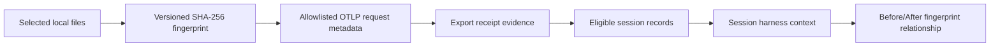

# Reported harness fingerprint relationship

## 0. Document scope

| Information | Normative document |
|---|---|
| Provider OTLP setup | [Codex telemetry](https://github.com/kotokumu/agentmetry/blob/main/docs/source-telemetry/codex.md) and [Claude Code telemetry](https://github.com/kotokumu/agentmetry/blob/main/docs/source-telemetry/claude-code.md) |
| Session diagnostic formulas | [Session rework analysis](https://github.com/kotokumu/agentmetry/blob/main/docs/design/session-rework-analysis.md) |
| Before/After metric comparison | [Session comparison](https://github.com/kotokumu/agentmetry/blob/main/docs/design/session-comparison.md) |
| Harness fingerprint generation, evidence classification, and relationship display | This document |

---

## 1. Purpose / out of scope

### Purpose

Agentmetry associates a user-declared, scoped fingerprint with every eligible
telemetry record in a session. The Before/After view then reports whether two
complete evidence sets contain the same or different reported fingerprint. This
context helps users investigate whether diagnostic changes coincide with a
harness change.

### Out of scope

- Claiming that a harness change caused a metric change.
- Claiming that the fingerprint covers the provider's complete effective configuration.
- Reading repository files from the Agentmetry server.
- Sending or retaining instruction/configuration file contents.
- Inferring a fingerprint for telemetry received without the dedicated metadata.
- Aggregating several sessions by fingerprint. Cohort analysis is a later feature.

---

## 2. Behavior design

### 2.1 Fingerprint generation and transport

`agentmetry harness fingerprint` gives users a deterministic generation path.
The user chooses the files that define the harness and a stable project scope.

```text
agentmetry harness fingerprint \
  --scope project-7f2a \
  --label "AGENTS v2" \
  --file AGENTS.md \
  --file .codex/config.toml
```

The command emits JSON containing `scope`, `fingerprint`, and optional `label`.
It does not emit file contents. Provider OTLP exporter configuration sends these
values as the following dedicated request metadata:

| HTTP/gRPC metadata key | Required | Meaning |
|---|---:|---|
| `x-agentmetry-harness-scope` | yes | Stable comparison namespace chosen by the user |
| `x-agentmetry-harness-fingerprint` | yes | Generated `sha256:<64 lowercase hex>` value |
| `x-agentmetry-harness-label` | no | Display-only label; it never changes identity |

Codex exporter headers are static: users copy the generated literal values into
the user-level `~/.codex/config.toml` and update them after regenerating the
fingerprint. `${ENV}` placeholders are not expanded, and project-local
`.codex/config.toml` files do not apply `otel` settings. Claude Code can use
`OTEL_EXPORTER_OTLP_HEADERS`. Agentmetry extracts only the three allowlisted
metadata keys; authorization and other request headers are never retained.

| ID | Rule |
|---|---|
| FR-1 | `--scope` matches `[A-Za-z0-9][A-Za-z0-9._:-]{0,127}`. Scope must be stable across the sessions a user intends to compare. |
| FR-2 | One or more `--file` arguments are required. Each path is valid UTF-8, resolves inside the physical command working directory, contains no symlink component, names a regular file, and has a unique slash-normalized relative path. |
| FR-3 | Files are ordered by ascending UTF-8 bytes of normalized relative path. Section 2.1.1 defines the exact versioned hash input. |
| FR-4 | Missing, unreadable, duplicate, symlinked, non-UTF-8, or outside-root files fail the command without producing a fingerprint. |
| FR-5 | `--label` is optional, trimmed, at most 80 Unicode code points, and contains neither control code points nor a comma. |
| FR-6 | Identity is the tuple `(scope, fingerprint)`. Label is not part of identity. |
| FR-7 | No metadata keys, or keys whose values are all empty, produce an `unreported` receipt. A partial or malformed tuple produces an `invalid` receipt. A valid tuple produces a `reported` receipt. |
| FR-8 | Invalid raw values are discarded. Only receipt state and validated values are persisted. |

Each metadata key must have exactly one raw value when any harness key is
present. Duplicate values are invalid even when equal. A comma in any raw value
is invalid, preventing HTTP comma-joining from having transport-specific
semantics. HTTP and gRPC apply the same rule before value validation.

#### 2.1.1 Fingerprint wire format

The hash input is the following byte sequence. `u32be` and `u64be` are unsigned
big-endian integers. Paths and the domain are UTF-8 bytes; file content is read
as exact bytes. Entry count and all lengths are byte counts.

```text
u32be(len(domain)) || domain ||
u32be(entry_count) ||
for each entry sorted by path UTF-8 bytes:
  u32be(len(path)) || path || u64be(len(content)) || content

domain = UTF8("agentmetry-harness-v1")
fingerprint = "sha256:" || lowercase_hex(SHA256(hash_input))
```

These vectors are normative:

| Entries (`path` → exact UTF-8 content) | Fingerprint |
|---|---|
| `AGENTS.md` → `hello\n` | `sha256:8643ebd621ce63157c7bdeaef885ab93885202e45a4ae7c185c4c7b42bb839db` |
| `AGENTS.md` → `hello\n`; `.codex/config.toml` → `model = "gpt-5"\n` | `sha256:dfbc1de58f3b905c7b0c0fd79361699336b5f9da617b1db8f35c76673f95b29d` |
| `指示.md` → `こんにちは\n` | `sha256:2fbba0adc4e6411315c9105e6b86d4e843f499291a32e4ebfea49abf773b4bc8` |

### 2.2 Session evidence classification

An eligible record is one retained semantic span or log observation whose
`activity_kind` is not `unknown` and whose source-qualified session belongs to
the canonical conversation. Metric points and unknown observations are excluded.

Every successful `GetSessionRework` evaluates the harness evidence in the same
read transaction as the diagnostic metrics. Database/query failures fail the
request and never become `unreported`.

| State | Invariant |
|---|---|
| `unreported` | Eligible records exist and every record came from an `unreported` receipt. No identity is exposed. |
| `uniform` | Every eligible record came from a valid reported receipt and every record has one identical `(scope, fingerprint)`. The identity and deterministic label are exposed. |
| `mixed` | Every eligible record came from a valid reported receipt, but more than one identity occurs. No single identity is exposed. |
| `incomplete` | At least one eligible record is reported and at least one is unreported. No single identity is exposed. |
| `invalid` | At least one eligible record came from an invalid receipt. No single identity is exposed. Invalid takes precedence over every other state. |
| `no_eligible_records` | The evidence population is empty and every count is zero. No identity is exposed. |

For `uniform`, the display label is the smallest distinct non-empty label by
unsigned UTF-8 byte comparison. All states expose eligible, reported,
unreported, invalid, and distinct-identity counts. Counts are non-negative and:

```text
eligible_record_count
  = reported_record_count
  + unreported_record_count
  + invalid_record_count
```

Late telemetry is evaluated on the next live refresh. A previously `uniform`
session can therefore become `mixed`, `incomplete`, or `invalid`; the UI must not
cache the prior relationship.

### 2.3 Before/After relationship

The UI derives a relationship from the two session contexts. Relationship is
independent from metric direction.

| Baseline | Current | Relationship | Reason |
|---|---|---|---|
| `uniform` | `uniform`, same scope and fingerprint | `reported_same` | — |
| `uniform` | `uniform`, same scope and different fingerprint | `reported_changed` | — |
| `uniform` | `uniform`, different scope | `not_comparable` | `scope_mismatch` |
| any other combination | any | `not_comparable` | side-qualified issue set |
| API field absent or malformed | any | `not_comparable` | side-qualified issue set |

The interface uses “Reported fingerprint same/changed,” never “Configuration
same/changed” or “correlation.” Supporting copy states that the relationship is
an association for one session pair and does not establish causality or complete
effective-configuration equality.

The Web context includes two client-only unavailable variants:
`server_unsupported` for an absent field and `invalid_server_payload` for an
unknown/unspecified classification, missing uniform identity, identity on a
non-uniform classification, invalid identity, or inconsistent counts. A
`not_comparable` result contains optional `baseline_issue` and `current_issue`
from this closed set:

```text
server_unsupported | invalid_server_payload | no_eligible_records |
unreported | mixed | incomplete | invalid
```

Both side issues are returned when both sides are non-uniform/unavailable. Scope
is not examined in that case. When both sides are valid `uniform` but scopes
differ, the result instead contains relationship issue `scope_mismatch`.

### 2.4 Acceptance criteria

| ID | Given / When / Then |
|---|---|
| AC-1 | Given the same scope, selected relative paths, and exact bytes in any CLI argument order, when fingerprints are generated, then the values are identical. |
| AC-2 | Given any selected file differs by path or byte content, when fingerprints are generated, then the values differ. |
| AC-3 | Given a path outside the working root, duplicate normalized path, symlink component, invalid UTF-8 path, invalid scope, invalid label, missing file, or non-regular file, when generation is requested, then it fails without JSON output. |
| AC-4 | Given HTTP or gRPC OTLP metadata, when a request is accepted, then only the three dedicated metadata values are parsed and retained; unrelated headers are ignored. |
| AC-5 | Given complete, partial, malformed, empty, and absent metadata, when parsed, then receipt states follow FR-7 and invalid raw values are not persisted. |
| AC-6 | Given parent and child session records with one identity, when the canonical root is queried, then all members contribute and state is `uniform`. |
| AC-7 | Given two sources reuse a session ID, when either source-qualified conversation is queried, then evidence never crosses the source boundary. |
| AC-8 | Given the five evidence populations in section 2.2, when the session is queried, then the matching state, counts, identity presence, and label are returned. |
| AC-9 | Given a storage failure, when rework is queried, then the API returns an error rather than an `unreported` context. |
| AC-10 | Given all relationship rows in section 2.3, when the comparison model is built, then it returns the exact relationship/reason and does not affect metric delta classifications. |
| AC-11 | Given late evidence changes a session state, when the live event arrives, then current and selected-baseline contexts refresh without selecting another baseline. |
| AC-12 | Given an old server omits both additive fields, when the Web client maps the response, then harness context becomes `server_unsupported` and rework token ratios retain the legacy `SessionSummary` denominator. A response with `harness_context` but no `session_tokens`, or a present `session_tokens` message with missing totals, never falls back. |
| AC-13 | Given keyboard or screen-reader use, when relationship help is focused or activated, then the same non-causal explanation available on pointer hover is exposed. |
| AC-14 | Given each normative vector in section 2.1.1, when the fingerprint is generated, then its complete value matches exactly. |
| AC-15 | Given duplicate equal, duplicate conflicting, or comma-containing HTTP/gRPC metadata, when the receipt is parsed, then both transports classify it as `invalid`. |
| AC-16 | Given zero eligible records, when facts are classified, then the state is `no_eligible_records`, all counts are zero, and comparison is unavailable with the side-qualified issue. |
| AC-17 | Given an API classification/count/identity combination that violates the public contract, when mapped, then the affected side is `invalid_server_payload`; it never produces `reported_same` or `reported_changed`. |

### 2.5 Non-functional requirements

| Requirement | Threshold | Verification |
|---|---|---|
| Snapshot consistency | Each session's report, harness context, and total-token denominator are read in one SQLite transaction. | Store integration test |
| Query scope | Evidence lookup is source/session constrained and uses an index beginning with `(source, session_id)`. | `EXPLAIN QUERY PLAN` test |
| Privacy | No file contents, arbitrary request headers, or invalid raw values enter the database or API. | Schema/receiver/API tests |
| Compatibility | Existing telemetry and an old API response preserve current diagnostic behavior. | Go and Web regression suites |
| Determinism | Same valid inputs produce byte-identical JSON values across repeated runs. | CLI test |

---

## 3. Structure design

### 3.1 Conceptual model

| Concept | Meaning | Identity / invariant |
|---|---|---|
| Harness manifest | Explicit ordered set derived from user-selected relative file paths and exact bytes | Fingerprint generation input; content stays local |
| Harness identity | Reported comparison key | `(scope, sha256 fingerprint)` |
| Receipt evidence | Validated allowlisted metadata on one OTLP export | Exactly `unreported`, `reported`, or `invalid` |
| Eligible record | Retained semantic span/log observation in a canonical conversation | Counted once by observation identity |
| Session harness context | Classification of all eligible-record receipt evidence | Exactly one state from section 2.2 |
| Fingerprint relationship | Neutral pairwise relation between baseline and current contexts | Exactly `reported_same`, `reported_changed`, or `not_comparable` |



### 3.2 Responsibility assignment

| Package | Responsibility | Does not own |
|---|---|---|
| `internal/harness` | Validate scope/fingerprint/label, generate deterministic file fingerprint, parse allowlisted values into receipt evidence | OTLP transport, SQL, UI copy |
| `internal/ingest/otel` | Extract the three HTTP/gRPC metadata values and attach parsed receipt evidence to an accepted export | Identity comparison or session classification |
| `internal/storage/sqlite` | Persist receipt evidence, count source/session-scoped eligible records, and return evidence facts in the rework read transaction | State precedence or UI relationship |
| `internal/query` | Classify evidence facts into closed context variants | SQL and protobuf representation |
| `internal/transport/connectapi` | Map context variants to additive enum/message fields | Evidence classification |
| `web/src/api` | Preserve field absence and map protocol enums into Web variants | Pairwise relationship policy |
| `web/src/model` | Derive closed relationship/reason variants | Loading lifecycle or DOM |
| `web/src/controllers` | Refresh baseline/current contexts on live changes | Comparison rules |
| `web/src/components` | Render accessible, non-causal context and help | Fingerprint inference |
| `cmd/agentmetry` | Parse CLI arguments and serialize the generated identity | Hash construction details |

### 3.3 Internal interfaces

Storage returns facts; the query model owns semantic state precedence.

```go
type ReceiptEvidence struct {
	State       ReceiptState // unreported, reported, invalid
	Scope       string
	Fingerprint string
	Label       string
}

type HarnessEvidenceFacts struct {
	EligibleRecords    int64
	ReportedRecords    int64
	UnreportedRecords  int64
	InvalidRecords     int64
	DistinctIdentities int64
	ReportedIdentities []ReportedIdentityEvidence
}

type HarnessContext interface {
	isHarnessContext()
	Counts() HarnessEvidenceCounts
}

func ClassifyHarnessEvidence(HarnessEvidenceFacts) (HarnessContext, error)
```

Concrete context variants are `NoEligibleRecordsHarnessContext`,
`UnreportedHarnessContext`, `UniformHarnessContext`, `MixedHarnessContext`,
`IncompleteHarnessContext`, and `InvalidHarnessContext`. Constructors enforce
identity presence and count invariants; callers cannot create arbitrary status
strings.

`ReportedIdentityEvidence` contains a validated identity, a positive record
count, and its distinct validated labels. Classification rejects negative
counts; a failed count equation; `distinct > reported`; a distinct count unequal
to the unique identity list length; duplicate/invalid identities; non-positive
identity record counts; identity counts whose sum differs from reported records;
and invalid labels. These are storage/query errors and never degrade to an
evidence state.

### 3.4 Public API

Harness context belongs to `GetSessionReworkResponse`, not `SessionSummary`.
This keeps list-session responses small, distinguishes a missing new field from
evaluated `unreported`, and returns metrics/context from one snapshot.

```protobuf
message HarnessIdentity {
  string scope = 1;
  string fingerprint = 2;
  string label = 3;
}

message HarnessEvidenceCounts {
  int64 eligible_records = 1;
  int64 reported_records = 2;
  int64 unreported_records = 3;
  int64 invalid_records = 4;
  int64 distinct_identities = 5;
}

message NoEligibleHarnessEvidence {}
message UnreportedHarnessEvidence {}
message MixedHarnessEvidence {}
message IncompleteHarnessEvidence {}
message InvalidHarnessEvidence {}

message UniformHarnessEvidence {
  HarnessIdentity identity = 1;
}

message HarnessContext {
  HarnessEvidenceCounts counts = 1;
  oneof classification {
    NoEligibleHarnessEvidence no_eligible_records = 2;
    UnreportedHarnessEvidence unreported = 3;
    UniformHarnessEvidence uniform = 4;
    MixedHarnessEvidence mixed = 5;
    IncompleteHarnessEvidence incomplete = 6;
    InvalidHarnessEvidence invalid = 7;
  }
}

message GetSessionReworkResponse {
  // Existing fields 1-6 remain unchanged.
  HarnessContext harness_context = 7;
  TokenUsage session_tokens = 8;
}
```

The marker messages are empty. `UniformHarnessEvidence` contains one required-by-
contract `HarnessIdentity`; the Web adapter still validates field presence and
all count invariants because protobuf cannot enforce required message fields.

The new server always sets `harness_context` on a successful response. Identity
is present only for `uniform`; transport mapping rejects impossible internal
variants rather than silently omitting the classification. `session_tokens` is
loaded in the same transaction and becomes the Web denominator for Rework token
share. Only when an old server omits both additive messages does the Web client
retain the legacy, separately fetched `SessionSummary` denominator. A response
with harness context but no token message, or a present token message with an
unavailable total, does not fall back across snapshots.

### 3.5 Database design

The `otlp_exports` lossless-journal table receives four additive columns:

| Column | Type / default | Meaning |
|---|---|---|
| `harness_receipt_state` | `TEXT NOT NULL DEFAULT 'unreported'` | Parsed receipt state |
| `harness_scope` | `TEXT NOT NULL DEFAULT ''` | Validated scope for `reported` only |
| `harness_fingerprint` | `TEXT NOT NULL DEFAULT ''` | Validated fingerprint for `reported` only |
| `harness_label` | `TEXT NOT NULL DEFAULT ''` | Validated display label for `reported` only |

Compaction and journal replacement preserve these columns. Legacy rows migrate
to `unreported`. Reprojection does not reinterpret stored transport metadata.
`ingest.JournalMetadata` owns exactly one `ReceiptEvidence`; observations retain
only their existing `export_id` reference and do not duplicate receipt columns.

Evidence aggregation joins `observations.export_id` to `otlp_exports.id`, filters
semantic trace/log observations by source and canonical member session IDs, and
groups by the validated receipt columns. Add index
`observations(source, session_id, kind, signal, export_id)` so the query does not
scan unrelated observations.

---

## 4. Design decisions

| Topic | Decision | Rejected alternative and reason |
|---|---|---|
| Acquisition | Generate a local digest and transport it in three dedicated OTLP metadata fields. | Arbitrary resource attributes are not a documented configuration path for every supported provider. |
| Meaning | Report a fingerprint relationship, not configuration equality or correlation. | Pairwise observational data cannot establish causality or effective-config completeness. |
| Scope | Require an explicit namespace and compare only within it. | Equal digests from unrelated projects are not a useful product comparison. |
| Coverage | Require every eligible record to have valid, identical evidence for `uniform`. | A partial sample can falsely label a whole session as unchanged. |
| Persistence | Store validated allowlisted receipt evidence in the replay journal. | Storing only a derived table would lose evidence during replay/compaction; storing all headers would violate the privacy boundary. |
| API boundary | Add context to the rework response. | Adding it to `SessionSummary` makes list/get presence ambiguous and separates it from the diagnostic snapshot. |
| State model | Closed variants internally, enum in protobuf, reason union in Web. | Free-form strings allow impossible field combinations and unstable UI copy. |
| Label conflict | Select the lexicographically smallest non-empty label for a uniform identity. | First/last observed depends on arrival order; treating labels as identity creates false changes. |

---

## 5. Impact, migration, and rollback

| Area | Impact |
|---|---|
| Existing databases | Additive columns default legacy exports to `unreported`; a covering observation index is added. |
| Existing telemetry | Existing diagnostics are unchanged; fingerprint relationship is not comparable. |
| Existing clients | The protobuf message is additive. Old clients ignore it; the new Web client handles field absence from old servers. |
| New telemetry | Users opt in by generating a fingerprint and configuring exporter metadata. |
| Privacy | Selected contents remain local; only an opaque scope, digest, and optional label are stored. Users must not put secrets or configuration content in scope/label. |
| Rollback | UI/API code can stop reading the additive fields. Journal columns remain harmless and preserve already received evidence. |
