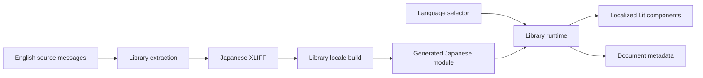

# Web UI internationalization

## 1. Risk assessment

Risk level: **Medium**. The change introduces shared presentation state and a build-time translation
workflow across Lit components. It does not change network APIs, persisted application data,
authentication, billing, or telemetry semantics.

---

## 2. Requirements

### Problem, goal, and context

The web UI has no internationalization workflow. The goal is to establish a standard, library-owned
i18n foundation before adding English and Japanese content.

### Current behavior

- The default-branch UI embeds English text directly in Lit components.
- There is no standard message extraction or translation interchange workflow.

### Desired behavior

- An established i18n library owns active locale state, message resolution, and Lit invalidation.
- English is the source locale and Japanese is the first target locale.
- Message extraction, XLIFF translation, and locale-module generation use the library toolchain.
- The initial locale follows a saved supported choice, then browser preferences, then English.
- Language changes apply without reloading and persist on a best-effort basis.
- Adding a language does not require editing feature-component locale logic.

### Constraints and approved assumptions

- The same web build runs in browsers and the Tauri desktop shell.
- Runtime mode is required because language switching must not reload the page.
- Telemetry values, identifiers, protocol names, model/tool names, source labels, and producer error
  details remain verbatim.
- English remains available synchronously as the source and fallback locale.
- Preference storage failure cannot prevent rendering or an in-memory language change.
- The library boundary replaces custom locale state, catalog resolution, and subscriber code.

### Requirement summary

Provide a library-backed i18n runtime, standard translation workflow, English and Japanese message
coverage, locale-aware formatting, automatic Lit updates, document metadata updates, and saved
language restoration.

### Functional requirements

- **FR-1:** The UI shall support English and Japanese through the i18n library.
- **FR-2:** The initial locale shall use saved choice, supported browser preference, then English.
- **FR-3:** Selecting a supported language shall update connected Lit components without reload.
- **FR-4:** A selected language shall be saved when browser storage is available.
- **FR-5:** Application-authored UI and accessibility text shall use extractable source messages.
- **FR-6:** The translation workflow shall extract source messages to XLIFF and build target locale
  modules.
- **FR-7:** Locale-sensitive numbers and dates shall use the active locale.
- **FR-8:** Document language and title shall follow the active locale.
- **FR-9:** Adding a locale shall be limited to configuration, translated XLIFF content, and locale
  metadata rather than feature-component locale branches.

### Non-functional requirements

- Locale state, translated message lookup, and connected-component invalidation shall not be
  reimplemented in application code.
- The production build shall generate locale modules before TypeScript and Vite compilation.
- Source messages shall have stable explicit identifiers.
- Existing navigation, loading, filtering, clipboard, update, and telemetry behavior shall remain
  unchanged.

### Inputs and outputs

- Inputs: saved locale, browser languages, language selector choice, English source messages, and
  Japanese XLIFF translations.
- Outputs: active locale, translated UI, generated locale module, locale-formatted values, persisted
  preference, document language, and document title.

### Normal cases

- A Japanese browser without saved preference starts in Japanese.
- A saved supported preference takes precedence over browser language.
- Selecting English or Japanese updates connected components and document metadata without reload.
- Extraction preserves translations while adding new source messages to the interchange file.

### Error and edge cases

- Unsupported or malformed saved/browser values fall back to English.
- Regional tags such as `ja-JP` match Japanese.
- Storage read/write failures leave runtime language switching usable.
- Locale-module loading failure keeps the previous active locale.
- Producer-authored values remain unchanged inside translated UI framing.

### Acceptance criteria

- **AC-1 / FR-1, FR-5:** Representative root and nested UI states render in English and Japanese.
- **AC-2 / FR-2:** Saved, regional-browser, unsupported, and fallback precedence cases pass tests.
- **AC-3 / FR-3:** An already-connected root and nested component update after language selection.
- **AC-4 / FR-4:** Preference persistence and storage failure behavior pass tests.
- **AC-5 / FR-6:** Library extraction and locale build commands succeed from checked-in XLIFF.
- **AC-6 / FR-7, FR-8:** Formatting and document metadata follow the active locale.
- **AC-7 / FR-9:** The documented language-addition path requires no feature-component branches.
- **AC-8:** Web, desktop, and Go regression suites pass.

### Non-goals

- Translating telemetry payloads, source/model/tool identifiers, or arbitrary producer error text.
- Localized routes, backend locale negotiation, remote catalogs, or cross-window synchronization.
- Right-to-left layout before an RTL locale is selected.

### Risks and open questions

- Generated locale modules and XLIFF can drift unless extraction/build verification is part of the
  normal build.
- Japanese terminology may require product-language review.
- Open material questions: none.

### Current-system evidence

Evidence packet ID: **localization-i18n-v2**

| Fact | Source | Relevance |
|---|---|---|
| The UI uses Lit custom elements with independent shadow roots. | [Application root](https://github.com/kotokumu/agentmetry/blob/main/web/src/app/agentmetry-app.ts), [components](https://github.com/kotokumu/agentmetry/tree/main/web/src/components) | The i18n integration must invalidate connected Lit elements. |
| English text is embedded across render methods. | [Application root](https://github.com/kotokumu/agentmetry/blob/main/web/src/app/agentmetry-app.ts), [components](https://github.com/kotokumu/agentmetry/tree/main/web/src/components) | Source messages need systematic extraction. |
| The same web build is embedded in Tauri. | [Root package manifest](https://github.com/kotokumu/agentmetry/blob/main/package.json), [Tauri configuration](https://github.com/kotokumu/agentmetry/blob/main/src-tauri/tauri.conf.json) | The runtime cannot rely on server-side locale negotiation. |
| Lit provides first-party runtime localization with automatic component rerender and an XLIFF toolchain. | [Lit localization overview](https://lit.dev/docs/localization/overview/), [runtime mode](https://lit.dev/docs/localization/runtime-mode/) | The library owns locale resolution and component invalidation. |

---

## 3. Initial design

### Conceptual model

| Concept | Meaning | State | Behavior | Constraint / invariant |
|---|---|---|---|---|
| Source message | Extractable application-authored English text | Stable message ID and source content | Supplies source/fallback rendering | Every translated UI message originates from an extractable source message |
| Target translation | Locale-specific XLIFF translation and generated runtime template | Message ID and localized content | Replaces the matching source message | IDs match extracted source messages |
| Active locale | The language currently presented by one application instance | Library-owned supported locale | Loads translation and invalidates localized components | Only configured locales become active |
| Locale preference | Optional saved user choice | Supported locale code or absence | Influences startup and records explicit selection | Failure never blocks active in-memory state |

### Relationships and ownership

| Relationship or decision | Owner | Invariant |
|---|---|---|
| Source message to target translation identity | i18n toolchain | Extraction and build use one stable ID |
| Active locale and component invalidation | i18n runtime | Connected localized elements reflect the loaded active locale |
| Saved/browser/English startup precedence | Application bootstrap | Only a configured locale is requested |
| Number and date presentation | Standard `Intl` using active locale | Formatting uses the same locale as translated text |
| Document language and title | Root application | Metadata reflects the rendered locale and route |

### Minimality check

| Candidate | Remove or merge result | Decision |
|---|---|---|
| Source message | No extractable source or fallback remains | Keep |
| Target translation | Japanese content cannot vary independently | Keep |
| Active locale | Components cannot agree on one rendered language | Keep; representation belongs to the library |
| Locale preference | Startup cannot restore an explicit user choice | Keep as optional browser data |
| Application-owned localization session | Duplicates the library active-locale contract | Remove |
| Application-owned catalog runtime | Duplicates library message resolution and build output | Remove |
| Application-owned subscription implementation | Duplicates library component invalidation | Remove; retain only a thin call to the library controller |

The model passes the initial minimality gate before independent scenarios are revealed.

---

## 4. Scenario and boundary review

### Independent evolution scenarios

| Scenario | Layer | Confidence | Change source or evidence | Changed condition |
|---|---|---|---|---|
| Add languages with plural rules, reordered interpolation, regional variants, or RTL presentation | Business and presentation | Committed | FR-9 and the initial English/Japanese scope | Message and locale semantics become richer without feature-level language branches |
| Add screens, helper messages, accessibility states, or dynamically connected elements | Product evolution | Observed | Distributed Lit UI and FR-3/5 | Extraction and runtime invalidation cover new surfaces |
| Revise Japanese terminology after review | Content operations | Evidence-backed plausible | Recorded translation-quality risk | Translation content changes independently of application behavior |
| Synchronize preference across tabs, webviews, or devices | Lifecycle and storage | Evidence-backed plausible | Current instance-local preference | Preference ownership and conflict rules cross runtime boundaries |
| Translate producer-authored errors, telemetry, or identifiers | Integration | Evidence-backed plausible | Explicit application-text boundary | Text ownership expands to producer contracts |
| Add localized URLs or backend locale negotiation | Navigation and integration | Evidence-backed plausible | Current browser-only locale state | Locale becomes navigation or request state |
| Deliver translations independently from application releases | Deployment | Evidence-backed plausible | Current build-time delivery | Catalog availability and version compatibility become runtime concerns |
| Expand formatting to currency, units, relative time, lists, ranges, or collation | Presentation policy | Evidence-backed plausible | FR-7 | Locale-sensitive behavior expands beyond number/date output |
| Add non-Lit UI | Technology | Evidence-backed plausible | Current Lit-only evidence | Component invalidation crosses renderer boundaries |
| Adopt a translation-management review process | Development workflow | Evidence-backed plausible | Standard XLIFF workflow | Translation artifacts gain an external review lifecycle |
| Parallel changes leave XLIFF or generated modules stale | Build operation | Observed | Distributed source messages and generated output | CI must detect source/translation drift |
| Upgrade TypeScript, Lit, Vite, Tauri, or the i18n library | External dependency | Evidence-backed plausible | Shared build pipeline and new dependency | Tool contracts change while accepted behavior remains stable |
| Library initialization, locale loading, or invalidation fails | Runtime operation | Evidence-backed plausible | Delegated runtime behavior | Previous locale and component consistency need defined failure behavior |
| Storage is unavailable or throws | Storage operation | Committed | Best-effort preference requirement | In-memory switching remains available without durable restoration |
| Browser and Tauri expose different host capabilities | Platform integration | Observed | One web build targets both hosts | Bootstrap handles missing language, storage, or document capabilities |
| Source/fallback locale varies by market | Business policy | Speculative | English fallback is currently fixed | Source-message and fallback authority change |
| Library becomes unmaintained or incompatible | Technology replacement | Speculative | New external dependency | Dependency selection is reconsidered without prebuilding a second runtime |

No evidence-backed database, authentication, billing, or public API migration scenario exists.

### Scenario impact and responsibility assignment

| Responsibility | Owner | Scenario result |
|---|---|---|
| Message extraction, translation identity, locale loading, and Lit invalidation | Lit localization library and toolchain | Language growth, content revision, and new Lit surfaces propagate through the standard workflow |
| Supported locale metadata and startup precedence | Application bootstrap | Regional variants and host differences change one composition module |
| Preference persistence | Browser boundary in application bootstrap | Storage failure stays isolated from the i18n runtime |
| Locale-sensitive values | `Intl` called with the library active locale | New format types extend focused formatting functions |
| Document metadata | Root application | Route and locale changes remain a composition concern |
| Producer-authored values | Their existing producers | The i18n boundary does not reinterpret identifiers or telemetry |

The committed and evidence-backed scenarios pass after removing the application-owned session,
catalog runtime, and subscriber implementation. Remote delivery, localized navigation, profile
preference, and non-Lit rendering require new boundaries only when those requirements are accepted.
Speculative source-locale and library-replacement scenarios remain reconsideration triggers.

### Architecture boundary plan

| Boundary candidate | Consumer and evidence | Owner | Constraint | Dependency direction | Decision |
|---|---|---|---|---|---|
| Lit localization runtime | All Lit UI; FR-1/3/5 | External library | One active locale and automatic component invalidation | UI source messages → library runtime | Accept |
| XLIFF extraction/build | Developers and CI; FR-6/9 | External library toolchain | Standard translation interchange and deterministic generated modules | Source messages/XLIFF → generated locale module | Accept |
| Locale bootstrap | Application entry and selector; FR-2/4 | Application composition | Supported-only negotiation and optional persistence | Host capabilities → library `setLocale` | Accept as functions, not a class |
| Custom session/catalog/subscription implementation | No distinct remaining consumer | Application | Duplicates accepted library behavior | N/A | Remove |
| Backend or remote catalog adapter | No current requirement | N/A | No current boundary | N/A | Reject |

Expected propagation is proportionate: library upgrades affect dependency/configuration/generated
artifacts/tests; storage or host differences affect bootstrap tests; translation drift affects the
extraction/build verification. No policy decision is duplicated.

---

## 5. Interfaces and tests

### Public contracts

| Name | Consumer | Contract | Errors and side effects |
|---|---|---|---|
| Library `msg` and `str` | UI source-message module | Return the active-locale message for a stable explicit ID | Source English is the fallback |
| Library `getLocale` and `setLocale` | Bootstrap, selector, formatting, root metadata | Read or asynchronously activate a configured locale | Failed target load leaves the prior locale active |
| `initializeLocale` | Application entry | Apply saved/browser/English precedence before normal rendering | Storage and host access are best-effort |
| `selectLocale` | Language selector and tests | Activate a supported locale and save it after success | Rejects unsupported values; storage failure is ignored |
| `number` and `dateTime` | UI value presentation | Format with the library active locale | Standard `Intl` behavior |

Application code does not publish its own translation engine, subscription protocol, catalog
resolver, or locale-state class.

### Requirement coverage

| Requirement | Observable verification |
|---|---|
| FR-1/3/5 | Root and already-connected nested Lit elements render English, then Japanese after library locale change |
| FR-2/4 | Bootstrap tests cover saved preference, regional browser tag, fallback, and throwing storage |
| FR-6/9 | Extraction and locale build commands regenerate valid XLIFF/module artifacts |
| FR-7/8 | Number/date output and document language/title follow the library locale |
| AC-8 | Full web, desktop, and Go regression commands pass |

### TDD and construction plan

| Behavior or criterion | Mode | Baseline or red test | Smallest implementation | Refactor target |
|---|---|---|---|---|
| Preserve English/Japanese UI while replacing the runtime | Baseline-green refactor | Existing web behavior tests | Configure runtime and source messages, then remove custom lookup | Library owns state, messages, and invalidation |
| Standard extraction/build workflow | Red-Green-Refactor | New workflow command fails before config/dependency | Add configuration, XLIFF, and generated locale module | Build runs generation before compilation |
| Startup and saved preference | Red-Green-Refactor | Existing locale precedence tests target removed session | Retarget behavior tests to bootstrap functions | Only host/persistence policy remains local |
| Connected Lit invalidation | Baseline-green refactor | Existing connected-component behavior test | Use the library localization controller | Remove custom subscription lifecycle |
| Regression safety | Verification | Existing web/desktop/Go suites | No behavior change outside presentation | Record exact evidence |

The detailed design uses the library runtime and toolchain as the simplest viable representation.
No custom stateful class, subscription protocol, or provider interface remains for behavior supplied
by the dependency.

---

## 6. Construction

### Runtime and component integration

- `@lit/localize` 0.12.2 owns active locale state and translated message resolution.
- The library localization controller owns connected Lit component invalidation.
- Application code retains pure startup negotiation, best-effort browser persistence, locale names,
  locale module loaders, `Intl` formatting, and document metadata.
- The application entry waits for initial locale activation before registering the root custom
  element.

### Translation workflow

- `@lit/localize-tools` 0.8.2 extracts 468 stable message IDs.
- English source messages generate one Japanese XLIFF file with 468 translated units.
- The library build produces locale-code metadata and the Japanese runtime module.
- Development, test, and production build commands generate runtime locale modules before loading
  the application.

### Adding a language

1. Add the locale code to the Lit localization configuration.
2. Run `npm run i18n:extract` in the web package.
3. Translate every unit in the new XLIFF file.
4. Register the locale self-name, `Intl` locale, and generated-module loader in bootstrap metadata.
5. Run `npm test` and `npm run build` in the web package.

Feature components do not receive locale-specific branches when a language is added.

---

## 7. Review

### Design conformance

| Implementation element | Approved owner | Result |
|---|---|---|
| `msg` and `str` source messages | Lit localization runtime | Conforms |
| XLIFF extraction and generated locale modules | Lit localization toolchain | Conforms |
| Active locale and connected-element updates | Lit localization runtime/controller | Conforms |
| Startup negotiation and persistence | Application bootstrap | Conforms |
| Number/date formatting | `Intl` with library active locale | Conforms |
| Document language and title | Root application | Conforms |

The final implementation contains no custom localization session, translated catalog resolver,
subscriber set, locale event bus, provider hierarchy, or backend boundary.

### Verification

- XLIFF extraction succeeds with 468 source units and 468 Japanese targets.
- Runtime locale generation succeeds.
- All 263 tests across 25 web test files pass.
- TypeScript and the production Vite build pass.
- All 35 desktop tests pass.
- All Go package tests pass.
- `git diff --check` passes.
