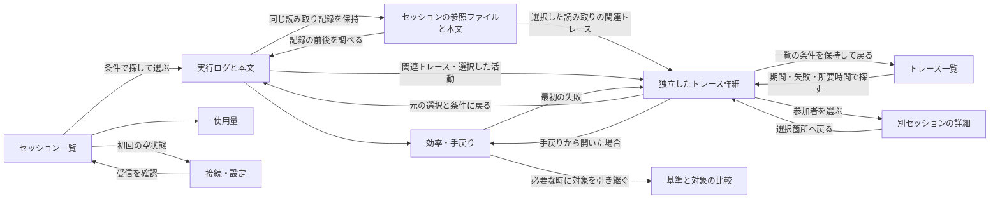

# Agentmetry UI・UX改善設計

## 1. 方針

Agentmetryの入口をセッション一覧にし、選択した実行を調べる作業に画面の面積を使う。推奨は「一覧 → 調査専用画面」の構成。大きなキャッチコピー、装飾的な専門用語、常時点灯する受信表示を除き、画面名・対象・操作を直接示す。

実行内容の調査と、開発の進め方の振り返りを両方支援する。開発効率に関する既存の診断指標は保持し、詳細の「効率・手戻り」で主要指標を常時表示する。比較はセッション詳細から使う補助操作とし、メインナビゲーションには置かない。

本書は採用したUX設計と製品への実装範囲を記録する。第2章は改善前の評価、第8章は設計レビュー用ワイヤーモックの確認記録、第11章は製品の実装・検証記録である。ワイヤーモックのID・本文・日時・数値は架空のサンプル。ユーザーテストによる効果測定は未実施。

作業ブランチ `codex/ui-ux-refresh` は `origin/main` の `12a182ab`（v1.15.0）を取り込んでいる。ファイル表示の共通化 `97e0ed9c`、活動行全体からの詳細表示、テレメトリー由来のClaude生成名を含む。改善前の評価はv1.14.0時点の確認を基にし、上記の表示改善を取り込んだうえで実装した。

---

## 2. 改善前の評価

優先度は、利用者が誤った判断をする問題、主要操作の妨げ、見た目の統一の順に決める。

| 優先度 | 確認した状態 | 利用への影響 | 改善案 |
| --- | --- | --- | --- |
| 高 | `Local trace observatory // Live` と二段のキャッチコピーをヘッダーに表示する | 何をする画面かより演出が先に目に入る | ページ名を「セッション」にする。キャッチコピーとeyebrowを削除する |
| 高 | `statusText()` はダッシュボード読み込み失敗時も受信表示を返す | 表示の成功・受信の継続・接続状態を区別できない | 実際に確認できる状態だけを表示する。受信の根拠がなければ「受信中」を表示しない |
| 高 | 会話数は読み込み済みセッションの件数、活動数はその行の合計。エージェント数・トークン数は別の概要取得結果 | 同じKPI列の数値が同一範囲の集計に見える。詳細条件も概要の取得引数には含まれない | 一覧は「N件を表示」と表記。期間全体の統計は集計条件・単位を揃えた使用量画面へ移す |
| 高 | 264pxの一覧欄にソース・検索・保存・詳細条件・表示説明が積み重なる | 最初の候補が画面下方へ押し出される。IDが省略され候補を比較しにくい | 一覧を全幅にし、検索と主要条件を横に置く。詳細条件と保存操作は必要な時に開く |
| 高 | セッション詳細の上に全体概要とプラン上限が残り、詳細内でもKPI・通信量・構成図の後に実行ログが続く | ログと本文の確認までのスクロール量が増える | 個別の概要は短い数値列にする。実行ログと選択本文をその直下に置く |
| 中 | プラン使用量未接続の説明が常に概要下に表示される | 未接続の機能が日常の調査面積を占有する | 使用量・接続画面に置く。調査画面には常設しない |
| 中 | 一覧の補助文字は `.68rem`、ソースは `.58rem`。強調に枠・グラデーション・発光・大文字を重ねる | 必要な情報が小さい一方、装飾の主張が強い | 基本文字14px、補助12pxを目安にする。中立色を基本に、選択・観測した異常を強調する |
| 中 | 実行ログは一覧と詳細に二分され、一覧テーブル自体にも最小幅530pxがある | セッション一覧と共存すると横幅が足りず、本文と行を見比べにくい | 調査に十分な横幅を割り当てる。狭い幅では一列へ切り替える |
| 中 | 手戻り画面は多数の指標カードが先に並び、失敗の証拠はその後にある | 数値から調べる箇所へ進む導線が弱い | 主要な診断と失敗エピソードを先に置き、補助指標・算出根拠を展開する |
| 中 | 比較は個別会話の中にあり、基準候補をIDと終了時刻で選ぶ | 比較対象の関係を把握しにくい | 補助操作として詳細から対象を引き継ぐ。Before/Afterと比較できない理由を明示する |
| 中 | トレース画面はヘッダーを置き換え、概要・参加者・調査条件・時系列を縦積みする | セッション調査の文脈が見えにくく、時系列まで遠い | アプリのナビゲーションを維持し、元の活動・条件へ戻れる操作を表示する |

根拠： [アプリシェル](https://github.com/kotokumu/agentmetry/blob/main/web/src/app/agentmetry-app.ts)、[文言](https://github.com/kotokumu/agentmetry/blob/main/web/src/localization/messages.ts)、[会話ワークスペース](https://github.com/kotokumu/agentmetry/blob/main/web/src/components/conversation-workspace.ts)、[一覧](https://github.com/kotokumu/agentmetry/blob/main/web/src/components/session-list.ts)、[概要](https://github.com/kotokumu/agentmetry/blob/main/web/src/components/dashboard-summary.ts)、[実行ログ](https://github.com/kotokumu/agentmetry/blob/main/web/src/components/activity-table.ts)、[手戻り](https://github.com/kotokumu/agentmetry/blob/main/web/src/components/rework-summary.ts)、[比較](https://github.com/kotokumu/agentmetry/blob/main/web/src/components/rework-comparison.ts)、[トレース](https://github.com/kotokumu/agentmetry/blob/main/web/src/components/trace-explorer.ts)。

既存の履歴復元、正確なスパンへのリンク、本文の欠損理由、親子関係の制限、比較の適格性は維持する。観測情報の限界を明示する設計は製品の強みとして扱う。

### 現行UIから取り込む良さ

採用基準は、調べたい実行を見つける、原因を絞る、証拠を確かめる操作に役立つかどうか。画面を簡素にするために調査能力を落とさない。

| 現行UIの良さ | 最初のモックでの不足 | 取り込み方 |
| --- | --- | --- |
| 一覧を残したまま別セッションへ移れる | 推奨案では一覧への往復が必要 | 詳細上部に同じ一覧条件を使う切り替え操作を追加。一覧併設案も残す |
| エージェントの親子関係と消費量を見て、選択したエージェントのログを調べられる | 人数しか分からず、調査の手がかりが減る | 「エージェント構成・トークン内訳」を展開すると関係と消費量を確認できる。ノード選択でログを絞る |
| セッションの入力・出力・キャッシュ・推論の報告値を同じ場所で確認できる | 合計しかなく、消費の内訳を調べられない | 個別のトークン内訳を詳細に残す。期間全体の使用量とは役割を分ける |
| ID以外のプロンプトやメッセージを検索できる | ID検索だけでは目的の会話を見つけにくい | 検索欄を「セッションID・本文を検索」にする。受信・保持している内容だけを検索する |
| 名前を付けた条件を保存・再適用できる | モックに呼び出し操作がない | 「条件・保存済み」から呼び出す。相対期間の再評価は既存仕様を維持する |
| 選択した本文を独立して読み、表示範囲外の状態も区別できる | 表示条件の変更で選択が別の行へ移る | 選択を維持し、条件から外れた場合はその旨を本文の横に表示する |
| ファイル名・正確なパス・取得元を構造化し、ツール入力も残している | 本文だけではファイルの指定と読み取り結果を区別しにくい | ファイル名・パスと対応する読み取り出力を先に表示する。受信したツール入力、取得元フィールド・入力キーは展開して確認できる |
| 証拠・欠損・比較の分母を明示している | 注意事項を隠しすぎると誤読する | 未報告・秘匿・比較不可は常に対象の近くへ置く。詳しい算出根拠だけを展開する |

根拠： [エージェント構成と選択](https://github.com/kotokumu/agentmetry/blob/main/web/src/components/agent-tree.ts)、[トークンの分類](https://github.com/kotokumu/agentmetry/blob/main/web/src/components/token-chart.ts)、[内訳の展開](https://github.com/kotokumu/agentmetry/blob/main/web/src/components/token-breakdown.ts)、[検索](https://github.com/kotokumu/agentmetry/blob/main/web/src/components/session-filter.ts)、[条件の保存・再適用](https://github.com/kotokumu/agentmetry/blob/main/web/src/components/investigation-filter.ts)、[選択本文の維持](https://github.com/kotokumu/agentmetry/blob/main/web/src/components/activity-table.ts)。

キャッシュ・推論の数値はソースによって入力・出力と重なるため、独立した補助報告として表示する。積み上げ図は入力と出力だけを対象とする。親子関係を確認できないエージェントは、実装時に親を推測して接続しない。

プロンプト・ファイルの表示は[共通の本文表示](https://github.com/kotokumu/agentmetry/blob/main/web/src/components/activity-content.ts)と[証拠の分類](https://github.com/kotokumu/agentmetry/blob/main/web/src/components/content-evidence.ts)に合わせ、実行ログとトレースで統一する。

- 受信したプロンプトは見出しと読みやすい本文で表示する。要約や補完を受信内容として扱わない。
- ファイルとして表示する根拠は、明示的な `file_path`、または構造化された `tool_input` / `tool_parameters` の `file_path` / `file_paths` とする。プロンプトやシェル文字列に出てくるパスだけでは読み込み済みと判定しない。
- ファイルの指定、参照先だけの報告、読み取り出力、明示的なモデル入力を区別する。ファイルの指定だけで内容取得・モデル入力を断定しない。
- `body_ref` は「リクエスト本文の参照」とする。ファイル読み込みの一覧に混ぜない。参照先のみの場合は本文を保持していないことを表示する。
- 秘匿された本文・参照先は表示しない。切り詰められた値から完全なファイル名・パスを推測しない。

### ファイルの内容を確認する導線

目的は、そのセッションでエージェントが何を材料に作業したかを確認すること。本文を開く操作だけでなく、対象を探す、読み取り時点を選ぶ、内容を確かめる、前後の活動を調べる流れを設計する。ファイルを見渡す利用頻度は未検証のため、ファイル起点を既定の入口とする判断は保留する。

| 調査の目的 | 入口 | 保持する文脈 |
| --- | --- | --- |
| この活動で何を読んだか | 実行ログの活動から読み取り内容を開く | セッション、選択活動、時刻、エージェントとモデル、前後のログ |
| このセッションでどんなファイルを参照したか | 同じセッションの記録をファイル起点で見渡す | 対象セッション、ファイル一覧、選択した読み取り記録 |
| 読み取った内容と後続の処理を調べたい | 読み取り記録から対応する活動へ移る | 同じ時点の記録、元のファイル選択、絞り込み条件 |

情報の単位は「読み取り記録」とする。同じファイルでも複数回読み取られれば別の記録であり、モデル・時刻・取得範囲・内容が異なり得る。ファイル起点で見渡す場合も、最新の本文だけにまとめず、どの読み取り記録を見ているかを明示する。

| 構成の考え方 | 利点 | 主な負担 | 判断 |
| --- | --- | --- | --- |
| 本文を独立画面で読む | 長文に面積を使いやすい | 前後の活動とほかの候補が見えなくなり、往復が増える | 標準操作にはしない。長文の拡大を補助操作として検討する |
| 活動の文脈を維持して本文を読む | 前後の処理と本文を照合しやすい | 狭い画面での表示量に制約がある | ログからの標準操作とする |
| セッションの記録をファイル起点で見る | 何を参照したかをまとめて確認しやすい | 時系列が弱まり、同じパスの異なる読み取りを混同しやすい | 同じセッション内の補助的な見方として提供する |

セッションを主な調査単位として維持し、実行ログとファイル起点の見方を行き来できるようにする。統合ワイヤーでは「実行ログ」「参照ファイル」「効率・手戻り」を同じセッション内のタブに置く。実行ログでは活動一覧と選択した本文、参照ファイルではファイル一覧と選択した読み取り記録を並べる。狭い幅では縦に並べる。本文を開くための独立画面は設けない。

ファイルごとに選択した読み取り記録を保持する。「この記録の前後をログで見る」で対応する活動を選択し、ログから「このセッションの参照ファイルを見る」で同じ記録へ戻れる。参照ファイルはセッション内の報告されたファイルを対象とし、ログの絞り込み条件では減らさない。ログへ戻った記録が条件外の場合は、条件と本文を保持して範囲外であることを示す。

| 保持された証拠 | ファイル付近の表示 | 内容の表示 |
| --- | --- | --- |
| ファイルと対応づけられた読み取り出力 | 本文あり | パス、出力の観測時刻、エージェントとモデル、受信した出力、取得範囲 |
| 出力が途中で省略 | 本文あり・一部省略 | 保持した部分だけを表示し、省略の位置・範囲を分かる限り示す。未報告の行番号・省略量は補わない |
| 参照先のみ | 本文未報告 | 参照先だけを保持していることを示す |
| 出力の秘匿・未取得 | 秘匿・未取得の理由 | 本文未報告と区別する。保持していない本文は表示しない |

同じ活動で複数ファイルが報告された場合は、活動の文脈を保ってファイルを切り替えられる。現在のローカルファイルを当時の本文として表示しない。受信した出力がファイル全体か不明な場合は、その範囲も明記する。

UXの確認では、ログから本文と前後の活動を照合できること、セッションの参照ファイルを順に確認できること、同じファイルの異なる読み取り時点を識別できることを扱う。操作数・戻り操作・対象の取り違えを観察し、どちらの入口を既定にすべきかは利用者の調査行動を見て判断する。

ファイル単位の本文閲覧には、パス表示とは別に出力との対応を示す証拠が必要である。ファイルパスとツール出力の対応を、受信した呼び出しID・出力内の明示的な対応情報から確認する。パスの一致、時刻の近さ、配列の順番だけでは割り当てない。対応を確認できない出力は活動の出力全体として表示する。モックでは対応が明示された架空の出力を使った。実際の取得契約と実装上の制限は9-3および11-5に記録する。

### ログ一覧のエージェントとモデル

ログの各行に `agent-01 (GPT-6 Astra)` の形式でエージェントと実行モデルを併記する。ツール名・ファイル名とは別の行に置き、詳細を開かなくても確認できるようにする。活動詳細・読み取り内容にも同じ表示を使う。

モデルは[活動モデル](https://github.com/kotokumu/agentmetry/blob/main/web/src/model/telemetry.ts)の活動ごとの報告値を使う。同じエージェントでも活動によってモデルが異なり得るため、最新モデルで過去の行を上書きしない。未報告の活動は `agent-01 (モデル未報告)` とし、エージェント名や隣接する活動から推測しない。モデル名を整形する場合も受信した識別子を保持する。

大きな全体KPI、詳細の前に常設する構成図、未接続プランの常設説明、装飾的な見出し・発光は戻さない。ミント系の選択色、読み取り専用MCP、詳細URLと履歴復元は維持する。最初のモックは見通しの良さを優先しすぎており、改訂案では調査の手がかりを必要な時に開ける形で補う。

---

## 3. 情報構成と主要な流れ

ナビゲーションは利用目的で分ける。「セッション」は作業を特定した調査と振り返り、「トレース」は失敗や所要時間からの探索、「使用量」は集計、「接続・設定」は準備と保守を担当する。「比較」は詳細の「効率・手戻り」から開く補助操作とする。

「セッション」「トレース」をメインメニューの並列の入口にする。トレース一覧と、セッション詳細の「関連トレース」・実行ログ・手戻りの証拠は、同じ独立したトレース詳細へつながる。



| 画面 | 最初に答える問い | 主な構成 |
| --- | --- | --- |
| セッション | どの実行を調べるか | 検索、期間、ソース、条件、ID・観測時間・活動数・トークンの一覧 |
| 実行ログ | 何が行われ、何が返ったか | 小さなセッション概要、時系列、選択した本文。エージェント構成とトークン内訳を展開できる |
| 参照ファイル | このセッションで何を参照したか | ファイル一覧、読み取り時点の選択、当時の出力・欠損状態、対応するログへの入口 |
| 効率・手戻り | どこに改善の余地があるか | 初回検証成功率、手戻りトークン比率、反復失敗、診断指標、証拠へのリンク |
| トレース一覧 | どの処理に失敗や時間のかかる箇所があるか | 期間・失敗の観測・最小所要時間の条件、トレースID・開始時刻・所要時間・参加セッション |
| トレース詳細（独立画面） | セッションをまたいで活動がどうつながっているか | 参加セッション・エージェント、共通の時間軸、選択スパンと本文、一覧または元の調査への戻り先 |
| 比較（詳細の補助操作） | 2つの実行で何が違うか | Before/After、比較の可否と理由、5つの既存診断指標、分母と観測範囲 |
| 使用量 | どれだけ使ったか | 集計対象を明示したトークン・費用。プラン上限は別区画 |
| 接続・設定 | 記録を受け取れるか | ソース別の接続案内、取得範囲、MCP、言語、表示、アプリ更新 |

タイトルがテレメトリーに含まれない場合は、IDを使う。プロンプトを公式タイトルに変換しない。短縮IDの衝突時は識別できる長さまで伸ばし、完全なIDは詳細で確認・コピー可能にする。

### セッションとトレースの関係

既存の[トレース設計](https://github.com/kotokumu/agentmetry/blob/main/docs/design/trace-explorer.md)では、セッションとトレースは多対多の関係にある。1セッションに0件以上のトレースが関連し、1トレースに複数セッション・ソース・エージェントが参加し得る。セッションがトレースを所有する構造にはしない。

- セッション内のタブは「実行ログ」「参照ファイル」「効率・手戻り」とする。「関連トレース」は別画面への入口として件数と参加セッション数を示す。
- トレースでは参加セッションとソースを識別し、エージェントのレーンにもセッションIDを添える。元セッションの概要値をトレース全体の数値として表示しない。
- 関連づけには受信した識別子を使う。時間の近さや同じコマンドだけで関係を作らない。欠けた親スパンや不明なセッションを推測で補わない。
- トレースから参加セッションの詳細へ進み、同じトレースの選択箇所に戻れる。元の調査への戻り先は別に保持し、タブ・活動・ファイルと読み取り記録・エージェント・種類の条件を復元する。
- 独立した `/traces/{traceId}` と正確なスパンへのリンクを維持する。一覧の期間条件で参加セッションや保持されたトレースを切り落とさない。直接開いた場合は存在しない戻り先を作らず、トレース一覧への入口を示す。

### トレース一覧の範囲

対象セッションが分からない段階でも、失敗や所要時間から調べ始められる一覧にする。初期案は期間・失敗の観測・最小所要時間の3条件と、開始時刻の降順表示に絞る。

| 項目 | 表示・動作 |
| --- | --- |
| 期間 | 保持された開始時刻で対象を絞る。詳細の関連記録は期間で切り落とさない |
| 失敗の観測 | 「失敗あり」「失敗未観測」「結果未報告」を区別する。失敗未観測をタスク全体の成功と解釈しない |
| 所要時間 | 保持された開始・終了情報から分かる時間範囲を使い、並行する活動の時間を加算しない。算出できない値は未報告とし、下限指定時は除外する |
| 参加セッション | 取得できた識別子を表示する。同じセッションが複数トレースに参加しても統合しない。狭い幅ではトレースIDの下へ移す |
| 一覧からの復帰 | 詳細・参加セッションを経由してもトレース一覧の条件を保持する。セッション一覧の条件とは独立させる |

一覧用の取得契約は実装前に確認する。検索・ページング・欠損の扱いをサーバー側でも一致させ、読み込み済みセッションに含まれるトレースだけを全体一覧として扱わない。高度なクエリ、集計グラフ、アラート設定は初期案に含めない。

### 開発効率の情報を残す配置

トークン数・活動数・所要時間は使用量や作業量であり、それだけで効率を判断しない。検証や手戻りの観測と合わせて、調べる箇所を特定する。根拠は既存の [手戻り分析コンポーネント](https://github.com/kotokumu/agentmetry/blob/main/web/src/components/rework-summary.ts) とする。

| 利用者の問い | 維持する指標 | 配置 |
| --- | --- | --- |
| 検証が最初に通っているか | 初回検証成功率、対象件数、検証失敗数 | 「効率・手戻り」の先頭。タスク全体の成功率とは区別する |
| やり直しにどれだけ使っているか | 手戻りトークン比率、手戻りの工数比率 | トークン比率は先頭、工数比率は直下。未報告理由も表示する |
| 同じ失敗を繰り返しているか | 反復失敗ループ、失敗試行数、解消・未解消件数 | 主要値と該当エピソードを隣接させる |
| 解消にどれだけかかったか | 解消までの時間・トークン | 失敗エピソード付近。観測できた対象だけを集計する |
| 何が進行を妨げているか | ツール失敗率、API再試行、コマンド反復、ファイル再編集 | 診断表から本文・トレースを調べる。反復を一律に無駄と判定しない |
| どのエージェントが資源を使ったか | エージェント別トークン、入力・出力と補助内訳 | 構成・内訳を展開してログを絞る |

「効率・手戻り」は実行ログから明示的に開ける同列のタブとし、主要指標を説明用の折りたたみに入れない。算出方法や補助的な件数だけを展開する。初回モックにない既存指標も製品から削除する判断には含めない。

期間全体の効率傾向は追加設計が必要。セッションごとの比率を単純平均したり、読み込み済みページだけを全体としたりしない。集計対象・分子分母・欠損・親子の重複を定義するまでは、個別セッションの診断を提供する。今回のモックも1セッションの振り返りを対象とし、全体傾向や架空の生産性スコアは表示しない。

---

## 4. 構成の選択肢

| 案 | 画面構成 | 向く作業 | トレードオフ |
| --- | --- | --- | --- |
| A：調査に集中・推奨 | 全幅一覧から調査専用画面へ移動。詳細上部から対象を切り替えられる | 長いログ・本文・トレースを読む | 他のセッションの数値を並べて見比べる時は一覧へ戻る。検索条件・位置を復元する |
| B：一覧を残して切り替え | 調査画面の左側にも小さい一覧を置く | 短い実行を連続して調べる | 本文の幅が減る。狭い画面ではAと同じ構成にする |

ワイヤーの調整メニューで詳細画面のA/B、外観、一覧の行間を切り替えられる。既定はA。既存のミント系アクセントは控えめに残し、発光・装飾グラデーションは使わない。

---

## 5. 文言と状態の設計

| 現行の表現・見せ方 | 提案 | 理由 |
| --- | --- | --- |
| Local trace observatory // Live | 削除 | 操作にも判断にも必要ない |
| Agent conversations, decoded. / エージェントの会話を、読み解く。 | セッション | 現在の画面を直接示す |
| Cross-conversation causality | トレース | 観測から因果を過大に読み取らせない |
| 観測モデル通信量 | トークン。集計の説明で「報告された入力＋出力」を示す | 数値の単位を先に伝える |
| エージェントトポロジー | エージェント構成 | 内容が分かる一般的な表現にする |
| 常時の「受信中」 | 受信待ち / 最終受信時刻 / 接続を確認できません | 実際に取得できる情報と対応づける |
| 結果がない領域に一律の待機表示 | 初回・検索0件・取得失敗・未選択を分ける | 次の操作が異なるため |

「失敗」はツールや検証など、失敗を観測した対象と一緒に表示する。セッション全体の失敗やユーザーのタスク未達成に読み替えない。「成功」も同様に対象を限定する。

| 状態 | 表示 | 次の操作 |
| --- | --- | --- |
| 初回・記録なし | まだセッションがありません | 接続手順を開く |
| 条件に一致しない | 条件に一致するセッションがありません | 条件を変更・クリア |
| 読み込み中 | 一覧または本文の読み込み中 | 画面構造と既存の選択を保つ |
| 更新失敗 | 更新できません。表示中のデータの取得時刻を示す | 再試行。技術的な詳細は展開 |
| 本文未報告 | 本文は報告されていません | 接続側の送信設定を確認 |
| 送信元で秘匿 | 送信元で本文が秘匿されています | 保持されていない本文は表示できないと示す |
| 本文未取得 | 本文をまだ取得していません | 本文を取得 |
| 比較不可 | 理由を同じ場所に表示する | 同一ソース・適格な基準を選ぶ |

受信状態と画面の自動更新状態は別物とする。実装時に信頼できる最終受信情報を取得できなければ、受信状態を表示するためのAPI対応を先に行う。フロントエンドの時刻だけで受信中と表示しない。

---

## 6. 操作上の保証

- 一覧の条件は詳細へ移動しても保持する。戻ると同じ条件・表示範囲・位置になる。
- 比較は基準と対象を明示する。期間の重複、同一性、ソースなど既存の適格性検証を維持する。ハーネスの同一性が不明でも、その理由と診断値の比較可能性を別々に示す。
- トレースの正確なスパンURLを維持する。時間範囲・活動種類・失敗条件・選択スパンも履歴復元の対象にする。
- ライブ更新で閲覧位置や選択対象を移動させない。新しい活動は件数を示し、利用者が表示を切り替えられる案を採る。
- 保存済みフィルターは条件メニューから呼び出す。保存時の相対期間は再適用時点で評価し、現在の仕様を維持する。
- 本文の非表示、未報告、秘匿、未取得、表示フィルターによる除外を区別する。欠損値を0で埋めない。
- エージェント・活動種類の絞り込みで本文の選択を勝手に変更しない。条件から外れた選択は維持し、範囲外であることを表示する。セッションを切り替えた場合は前の対象に固有の選択を解除する。
- 狭い幅では一覧の補助列を畳み、必要な情報を詳細へ移す。実行ログと本文を縦に並べ、押せる戻り先を残す。
- キーボード操作時は画面遷移で見出し、証拠選択で本文の見出しへ適切にフォーカスを移す。状態変化は読み上げ可能にする。色だけで失敗・選択を伝えない。

---

## 7. 実装範囲と段階

| 段階 | 変更 | 完了条件 |
| --- | --- | --- |
| 1 | 装飾見出し・発光を削除、文言の統一、KPIの表示範囲を明示、エラー表示を整理 | 実装済み。英日とも画面名が操作目的を示し、取得失敗時に受信継続を断言しない |
| 2 | 一覧と詳細を分離、検索条件を上部へ移動、実行ログ・参照ファイルと本文を統合 | 実装済み。参照ファイルは同一セッション内のread projectionから取得し、選択した記録から対応活動へ戻る |
| 3 | 効率指標と証拠導線、比較の補助操作、トレース一覧と独立した詳細 | トレース一覧・既存詳細への入口を実装。効率・比較は既存の根拠と導線を保持 |
| 4 | 使用量・接続画面、受信状態、ライブ更新の扱い | メインナビと使用量/接続・設定入口を実装。ライブ更新は既存controllerの選択保持・再同期をテストで確認 |

一覧のID・時刻・件数・トークン、調査フィルター、本文の根拠、手戻り診断、比較結果は既存のモデルを活用できる。ただし、画面を移すだけで集計範囲が一致するわけではない。使用量は既存の期間集計APIが返すセッション数・エージェント数・トークン数を使い、読み込み済みページの件数を代用しない。正しい期間集計の契約がない活動数は表示しない。ソースごとの最終受信時刻や集計の完全性を新たに保証する機能は今回の実装範囲に含めない。

確認対象： [セッションモデル](https://github.com/kotokumu/agentmetry/blob/main/web/src/model/telemetry.ts)、[一覧モデル](https://github.com/kotokumu/agentmetry/blob/main/web/src/model/session-catalog.ts)、[比較の適格性](https://github.com/kotokumu/agentmetry/blob/main/web/src/model/rework-comparison.ts)、[調査条件](https://github.com/kotokumu/agentmetry/blob/main/web/src/model/investigation-conditions.ts)、[タイトル・親子関係の制限](https://github.com/kotokumu/agentmetry/blob/main/openspec/changes/improve-session-list-model/proposal.md)。

---

## 8. ワイヤーの確認範囲

設計レビューには独立した `agentmetry-integrated.html` を使った。このワイヤーは製品に同梱するファイルではない。説明用に先頭セッションの実行ログと読み取り内容を初期表示する。製品の起動時の入口はセッション一覧とする。

| 対象 | モックの範囲 |
| --- | --- |
| セッション一覧 | 検索、ソース・期間・失敗・経過時間の条件、条件の保存・呼び出し、子セッション表示、対象の切り替え |
| 先頭セッション | 全48件から8行の抜粋。エージェントと実行モデル、活動選択、絞り込み、構成・トークン内訳 |
| 参照ファイル | 3ファイル・4記録。`session-list.ts` の14:04:01と14:09:01の出力、`AGENTS.md` の一部省略、`README.md` の本文未報告 |
| 効率・手戻り | 主要な診断指標、失敗の証拠、別セッションとの比較。期間全体の効率傾向は含まない |
| トレース | 一覧5件。`demo-trace-01` は2セッション・3エージェントの9活動、残り4件は各1活動。先頭セッションには2件のトレースが関連する |
| その他のセッション | 子セッションは1行のログ、ほかは概要。ファイル記録のサンプルは先頭セッションのみ |
| 使用量・接続 | 架空の集計と接続状態。実データ取得・設定変更は行わない |

統合部分はブラウザーで次の操作を確認した。

- ログ内で本文を表示し、同じ活動の複数ファイルを切り替える。
- 参照ファイルで読み取り時点を変更し、対応するログへ移る。ファイル起点へ戻っても同じ本文と時刻を保持する。
- 別のファイルを確認した後、元のファイルで選択した読み取り時点へ戻る。一部省略と本文未報告を区別する。
- ログの活動種類を絞った状態でファイル起点を経由して戻る。条件外の選択と本文を保持する。
- 参照ファイルから対応するトレース活動へ進み、元のファイル・時点へ戻る。
- トレースの子セッションや参照ファイルを経由して選択箇所へ戻り、一覧の失敗条件を保持する。
- 効率指標、最初の失敗への遷移、比較と振り返りへの復帰を確認する。

統合版の実行ログと参照ファイルを1024pxのダーク表示、参照ファイルを736pxと360pxのライト表示で確認した。JavaScriptの構文エラーとブラウザーの実行エラーは検出されていない。

保存条件はモックの再読み込みで初期状態に戻る。モックで対象外だった実データ取得、条件の永続保存・更新・削除、全イベントのページング、トレース詳細の時間範囲操作、URL・ブラウザー履歴・スクロール位置の復元は製品の既存機能・追加契約で継続検証する。モックの操作確認は製品のAPIやデータの正しさを保証しない。現行provider証拠で確認できないファイル単位の本文対応は `NOT_CONFIRMED` として表示する。

製品実装後の検証結果は11-5を参照する。

---

## 9. 既存契約との差分と採用した追加契約

基準はブランチ `codex/ui-ux-refresh` のコミット `12a182ab`。以下の「現行契約」は基準コミット時点の契約を指す。受け入れUXに必要な差分を評価し、既存 `GetTrace` の意味を維持したまま、生成コードを含めて追加の読み取り契約を実装した。型の記述は設計上の要約であり、正確なフィールド名はproto/query定義を参照する。

### 9-1. トレース一覧の取得

| 項目 | 現行契約 | 受け入れ UX との差分 | 根拠ファイル・対象型 |
| --- | --- | --- | --- |
| 一覧取得 | `GetTrace(trace_id, page, live_tail, anchor_span_id)` だけがある | セッションを知らない状態で、期間・失敗観測・最小所要時間からトレースを探せない | `proto/agentmetry/v1/agentmetry.proto` の `AgentmetryQueryService`、`GetTraceRequest`、`GetTraceResponse` |
| 保存済み集約 | `trace_rollups` に開始・終了・状態・活動数・root 数・missing parent 数がある | 一覧の行に必要な集約値の保存基盤はあるが、query/transport の一覧契約がない | `internal/storage/sqlite/schema.hcl` の `trace_rollups`、`internal/storage/sqlite/trace.go` の `loadTraceSummary` |
| 参加セッション | `GetTrace` のレスポンス内に `repeated ConversationRef conversations` がある | 一覧で参加セッション数と識別子を表示する取得単位がない | proto の `ConversationRef`、`Trace` の `Conversations`、`trace_conversations` |
| ページング | 個別トレース活動の `PageRequest` と opaque token がある | トレース集合をページングする `ListTraces` の token がない | proto の `PageRequest`/`PageInfo`、`internal/transport/connectapi/server.go` の `boundedPageSize`/`parsePageToken` |
| 時間・失敗条件 | `GetTrace` は ID 指定。`Trace` は非 optional の開始・終了・status | 一覧条件の意味、欠損時間、未報告結果を集合レベルで表す契約がない | `internal/query/trace.go` の `TraceFilter`、`Trace`、`TraceStatus` |

採用した追加契約の設計上の要約は次のとおり。既存 `GetTrace` の意味とページングを変更しない。

```text
query.TraceListFilter
  Since, SourceID, FailureObservation, MinDurationMS, Page

query.TraceListEntry
  TraceID, StartedAt?, EndedAt?, DurationMS?, Status,
  ActivityCount, RootSpanCount, MissingParentCount,
  Conversations

query.TracePage
  Traces, NextOffset, HasMore, AppliedConditions

TraceReader.ListTraces(context.Context, TraceListFilter) (TracePage, error)
```

Connect 契約では `ListTracesRequest` と `ListTracesResponse` を追加し、既存の `PageRequest`/`PageInfo` を再利用する。条件は `TimeFilter` と分離し、失敗観測は次の三値を区別できる enum とする。

```text
TraceFailureObservation:
  UNSPECIFIED / OBSERVED / NOT_OBSERVED / NOT_REPORTED

ListTracesRequest:
  TimeFilter filter
  TraceConditions conditions
  PageRequest page

TraceSummary:
  trace_id
  optional started_at
  optional ended_at
  optional duration_ms
  TraceStatus status
  activity_count
  root_span_count
  missing_parent_count
  repeated ConversationRef conversations
```

`NOT_OBSERVED` は保持された対象に失敗を観測していない状態、`NOT_REPORTED` は結果を判定できない状態とする。status が `unknown` であることだけを成功に読み替えない。`duration_ms` は開始・終了の両方を受信し、同一の trace snapshot で算出できる場合だけ返す。時間を算出できない行は下限時間条件から除外し、0 で埋めない。並列活動の時間を加算しない。

実装時は `trace_rollups` を集合の母集団にし、`trace_conversations` を参加セッションの表示に使う。読み込み済みセッションや `GetTrace` の活動ページから一覧を組み立てる方式は、未読み込みの trace を欠落させるため採用しない。期間条件は trace の保持された開始時刻で評価し、詳細画面の `GetTrace` は期間条件で切り落とさない。

### 9-2. ページを跨ぐセッションのファイル集合

| 項目 | 現行契約 | 受け入れ UX との差分 | 根拠ファイル・対象型 |
| --- | --- | --- | --- |
| 活動取得 | `ListSessionActivities` は cursor/offset、agent、anchor で一ページを返す | 全ページに分散したファイル参照を、完全な集合として取得する契約がない | proto の `ListSessionActivitiesRequest/Response`、`internal/query.ActivityPageFilter`、`ActivityPage` |
| 参照の表現 | `Activity` は `content` と一つの `ContentEvidence` を持つ | 一つの活動に複数の `file_path` がある場合、参照集合と各読み取り記録の取得単位がない | proto/query の `Activity`、`ContentEvidence`、`web/src/components/activity-content.ts` の `ReportedReference` |
| session summary | `GetSession` は `trace_ids` を返すが本文・参照一覧を返さない | ファイル起点の入口がなく、活動を全ページ取得するまで集合を確定できない | proto の `GetSessionResponse`、`internal/storage/sqlite/session_summary.go` |
| ライブ更新 | session 単位の mutation は活動 ID を upsert/remove できる | ファイル集合の追加・削除と、選択した読み取り記録の安定性を表す契約がない | proto の `SyncSessionActivities*`、`web/src/controllers/conversations-controller.ts` |

既存 API だけで実装する場合、Web が活動ページを順に読み、各ページの `ReportedReference` を集約する方法になる。ただし、最終ページまで到達する前に「このセッションの全ファイル」と表示できず、ページング中の部分集合と完全集合を明示的に区別する必要がある。ライブ更新時もページの再取得だけでは、古い読み取り記録の保持と集合の削除を安全に保証できない。

追加する場合は、ファイルという実体をローカル現在のパスから復元せず、受信した参照文字列の集合として扱う。読み取り記録を一覧の行単位にして、同一参照の複数時点を統合しない。

```text
query.SessionFileReadFilter
  Identity, Page, Reference?

query.SessionFileRead
  ID                  // source/session/activity/reference/occurrence の安定した観測 ID。path/time だけでは作らない
  SourceID, SessionID
  Reference           // 受信した file_path/file_paths の値
  ActivityID          // 参照を報告した活動
  ObservedAt
  AgentID, Model      // その活動に報告された値。欠損は空値のまま
  Content             // 明示的に対応づけられた出力だけ
  ContentEvidence
  OutputActivityID?   // 別活動の出力なら、明示的対応がある場合だけ
  OutputMapping       CONFIRMED / NOT_CONFIRMED

query.SessionFileReadPage
  Reads, DistinctReferenceCount, NextOffset, HasMore, Coverage

SessionFileReadReader.ListSessionFileReads(
  context.Context, SessionFileReadFilter,
) (SessionFileReadPage, error)
```

Connect の追加 RPC は `ListSessionFileReads` とする。`Coverage` は少なくとも `complete`、`partial`、`unavailable` を持ち、`complete` は活動ページの全件を内部で走査・同一 snapshot で集約できた場合だけ返す。`partial` は対象範囲が一部であることを表し、ファイル一覧を全件と表示しない。

`Coverage` とページングの `hasMore` は別の意味である。`Coverage=complete` は同一 snapshot で観測された対象投影範囲を query が完全に評価できたことを示すが、応答は有限ページなので `hasMore=true` になり得る。`hasMore` は次の opaque cursor に結果が残っていることだけを示す。サーバーは一リクエストへ全件を無制限に詰め込まない。入力指定だけが観測された記録は参照記録として返し、読み取り成功や本文取得とは呼ばない。

ファイル起点の UI は `SessionFileRead.Reference` でグループ化し、選択は常に `SessionFileRead.ID` を保持する。別の読み取り時点を選んでも `ActivityID`、`ObservedAt`、`Model`、`ContentEvidence` を置き換えない。セッションの `agent_id` や隣接活動からモデルを補完しない。

### 9-3. 単一ファイルの明示的読み取り出力対応

| 項目 | 現行契約 | 受け入れ UX との差分 | 根拠ファイル・対象型 |
| --- | --- | --- | --- |
| file_path | structured `tool_input`/`tool_parameters` 内の `file_path`/`file_paths` を参照として抽出できる | 抽出した参照は、同一活動の本文がそのファイルの出力であることを証明しない | `web/src/components/activity-content.ts` の `reportedReferences`/`ReportedReference`、`internal/query/activity_content.go` |
| body_ref | `body_ref` は `request_body` の参照として表示される | HTTP body 参照をファイル一覧へ混ぜない必要がある | `web/src/components/activity-content.ts` の `role: request_body`、`ContentEvidence` |
| 出力本文 | `Activity.content` と単一 `ContentEvidence` は活動全体の出力 | 複数ファイル指定のとき、本文を特定ファイルへ割り当てる output identity がない | proto/query の `Activity.content`/`content_evidence`、`web/src/components/content-evidence.ts` |
| raw 属性 | SQLite には `attributes_json` が保持される | raw 保持だけでは、対応関係を製品 UI の canonical evidence として保証できない | `internal/storage/sqlite/schema.hcl` の `attributes_json`、`internal/query.Activity.Attributes` |
| モデル入力 | `model_input` は明示的な受信フィールドがある場合だけ | file reference/read output からモデル入力を推測できない | `internal/query.ContentEvidence`、`web/src/components/content-evidence.ts` |

単一ファイルの対応を表示する追加契約は、出力を次の三状態で返す。

```text
FileReadOutput
  availability: AVAILABLE / NOT_REPORTED / REDACTED / NOT_RETURNED
  mapping: CONFIRMED / NOT_CONFIRMED
  content: string                 // AVAILABLE かつ CONFIRMED の場合だけ
  evidence: ContentEvidence
  activity_id: string             // 出力を報告した活動。未対応なら参照活動 ID のみ
```

`mapping=CONFIRMED` の成立条件は、受信した telemetry が同一ファイルの出力を識別する活動 ID、参照 ID、または provider が定義した対応関係を持つこととする。時刻・パス・活動順・同一活動という理由だけでは `CONFIRMED` にしない。対応関係がない場合はファイル参照を表示し、本文は `NOT_CONFIRMED` として個別ファイルに割り当てない。`body_ref` はこの契約の `Reference` に入れず、活動本文の証拠として扱う。

現行の確認済み fixture は、Claude の `tool_use_id` と `file_path`、Codex の `call_id`/`output` などの観測を保持するが、単一ファイルの read call と対応 output を provider が保証する同一 identity は示していない。したがって現行実装の file-specific output は `NOT_CONFIRMED` とし、活動全体の `Activity.content` をファイル本文へ割り当てない。独自属性を fixture に追加して成功扱いにはしない。将来、provider が単一 file read call と明示的に対応する output を観測した場合だけ、既存 `ContentEvidence` と provider fixture の契約テストを追加して `CONFIRMED` にできる。

この対応を現行の単一 `Activity.content` だけで表すことはできない。最小の API 拡張は `Activity` に複数の出力を追加することではなく、`SessionFileRead` に明示的対応が確認できた場合だけ `FileReadOutput` を含める read projection を追加することとする。provider ごとの mapping が未確認のままの場合、追加フィールドを空で埋めず `NOT_CONFIRMED` を返す。現行 projection に provider-specific identity がない file-specific output は、今回の projection 内で `NOT_CONFIRMED` として返す。新しい収集設定や DB 移行が必要になる証拠が見つかった場合だけ、互換性・移行影響を別途報告する。

### 9-4. API変更の採否ゲート

| 契約 | 現行 UI の既存契約だけでの成立 | 追加契約の必要性 | 採否条件 |
| --- | --- | --- | --- |
| 文言・活動ごとのモデル表示 | 成立。`Activity.model` をその行に使い、欠損は未報告表示にする | 不要 | `activity-table.ts`、`activity-content.ts`、`telemetry.ts` の既存値を維持するテストが通る |
| セッション内ログ起点の本文 | 一部成立。活動単位の本文と証拠状態は表示できる | 単一活動内の複数ファイル対応は不足 | 出力対応が未確認ならファイルへの本文割当をしない |
| ファイル起点の完全集合 | 不成立。活動ページの収集だけでは完全性を宣言できない | `ListSessionFileReads` 相当 | 同一 snapshot、全件範囲、coverage、opaque paging を query/Connect/Web で一致させる |
| トレース独立一覧 | 不成立。`GetTrace` は ID 必須 | `ListTraces` 相当 | `trace_rollups` 母集団、失敗/時間欠損、参加セッション、多対多をテストする |
| 単一ファイルの明示的出力 | 不成立。現行 `Activity.content` は対応を証明しない | `FileReadOutput` または同等の read projection | 明示 identity がある fixture だけ `CONFIRMED` とする |

独立シナリオ適用後に必要性が確定した追加契約だけを製品コードへ入れている。既存境界で解ける表示は既存モデルを使い、`ListTraces` と `ListSessionFileReads` は同一 snapshot・opaque paging・条件/coverage acknowledgementを持つ read-only adapterとして実装する。

---

## 10. 設計ゲート記録

設計ゲートの正本はこのファイルとし、製品コードと同じブランチで保持する。独立シナリオ 1–16 の結果と再判定を 11 章へ記録済み。

| ゲート | 状態 | 記録 |
| --- | --- | --- |
| Risk assessment | 完了 | 高リスク。公開 read-only API を追加し、UI 状態・責務・API 境界を変更し得るため、単純な文言変更として扱わない |
| Requirements / evidence packet | 完了 | 本書1–6章のUX要件と、11章の独立シナリオ1–16 |
| 初案概念モデル | 完了 | 調査状態、活動、読み取り記録、ファイル参照、内容証拠状態、効率診断、セッション/トレース参加関係 |
| 初案 minimality | PASS | `Activity` は時点と identity を既に持つ。独立した読み取り記録が必要なのは、一活動に複数参照/出力があり、各対応と選択単位を保持するため。内容証拠状態は本文へ統合すると秘匿/省略/未報告を失う。他の候補概念は統合・棄却 |
| 独立シナリオ | PASS | 履歴なし・基準コミット `12a182ab` の要求パケットから受領したシナリオ 1–16 を適用済み |
| 責務・境界 | PASS | シナリオ適用結果を 11 章へ確定。既存 `query`/SQLite/Connect/Web/live/navigation の境界を維持する |
| Interface / test / TDD | PASS | レビュー済みの加算的 `ListTraces` と `ListSessionFileReads`/read projection を採用。既存 GetTrace/client を変更せず契約・振る舞いテストへ進む |
| Construction | PASS | 文言・活動モデル表示、追加 read API、Web統合、生成コード、契約/振る舞いテストを実装済み |

実装開始後の変更記録は、別の提案モックへ戻さず、この正本の「実装範囲と段階」「現行契約との差分」「設計ゲート記録」に追記する。実装済みの事実、未実装の追加契約案、架空 OTLP fixture による受け入れ結果を同じ表現で混ぜない。

---

## 11. 独立シナリオ適用と責務・境界判定

証拠パケット `OTEL-INVESTIGATION-1`、基準コミット `12a182ab`、初案概念モデルを入力に、独立担当が作成したシナリオ 1–16 を適用する。シナリオ 1–16 は Committed または Observed として検証対象にする。保持期間変更、exemplar 追加、任意属性検索、遠隔 trace 連携、テール補完、サンプリング修復は根拠不足の Speculative として今回の境界を広げない。

### 11-1. シナリオから責務への伝播

| シナリオ | 主な変更ドライバー | 主責務 | 正当な伝播 | 不必要な波及・判定 |
| --- | --- | --- | --- | --- |
| 1 同じパスの複数読取時点 | 一活動内の複数参照/出力と選択単位 | 読み取り記録/調査状態 | file reference、activity ID、観測時刻、前後の活動へ伝播 | `Activity` の時点/identity は維持する。独立記録は一活動内の複数参照・出力対応と個別選択を保持するために必要。ファイル実体取得や最新内容への置換は不要 |
| 2 証拠種別と欠損の混在 | 証拠解釈と可用性 | 内容証拠状態 | query の証拠分類を Connect/Web の表示へ伝播 | 欠損を空本文・成功・関連付け済みへ変換しない。collector 追加は不要 |
| 3 活動ごとのモデル欠損 | 活動観測値の正確な表示 | 活動 | `Activity.model` を同一活動の行・詳細へ伝播 | agent summary、隣接活動、最新モデルから補完しない |
| 4 複数 agent/委譲/親子 | agent/セッション関係 | セッション/トレース参加関係 | agent ID、親、source-qualified session を表示と復帰へ伝播 | span の近さだけで新しい親子を作らない。既存の明示/観測された関係を維持 |
| 5 効率指標の状態差 | 診断値・分母・coverage | 効率診断 | query/MCP/Web の値、欠損理由、根拠活動へ伝播 | 0 と未報告を統合しない。生産性スコアへ拡張しない |
| 6 セッション不明から trace 調査 | trace の独立性/多対多 | トレース一覧/参加関係 | trace rollup、参加 session、元の調査状態へ伝播 | 読み込み済み session の部分集合を全 trace としない |
| 7 root/子一覧切替 | session catalog の view | セッション一覧 | `SessionListView` と URL/ページングへ伝播 | root と child を暗黙に重複統合しない |
| 8 活動/trace ページ境界 | opaque paging と時系列 | query paging/調査状態 | total、offset、前後ページ、選択 ID へ伝播 | 配列 index、時刻の近さだけで選択・出力を対応付けない |
| 9 相対 range と保持範囲 | 集計対象と詳細対象の分離 | query filter/diagnostic coverage | 一覧条件、trace 全体、比較 snapshot の範囲へ伝播 | trace 詳細を一覧 range で切り落とさない。ページ読込数を全体集計にしない |
| 10 新規/削除/再同期/接続断 | live projection lifecycle | live update controller/調査状態 | upsert/remove/resync、接続状態、選択保持へ伝播 | 新規活動で閲覧位置を強制移動しない。断線を受信中と表示しない |
| 11 直接 URL/再読込/履歴 | 調査状態の復元 | navigation state | source/session、trace/span、条件、活動/読取選択へ伝播 | DOM 内の一時状態だけに依存しない。存在しない target を別 target に置換しない |
| 12 条件語彙/未適用サーバー | query 契約の acknowledgement | filter adapter/query boundary | 適用済み条件、未対応/不正状態、URL を Web へ伝播 | transport 成功だけで条件適用済みと判定しない。任意属性検索を追加しない |
| 13 unknown/invalid/out-of-range trace | 証拠 target の availability | trace query/調査状態 | target ID、未取得、保持範囲外、invalid を表示へ伝播 | 最初のエラーや近い trace を選ばない。遠隔 trace fallback を追加しない |
| 14 親欠落/root/spanなし log/空 session | 不完全な観測関係 | trace/session projection | missing parent、複数 root、session 空値を保持へ伝播 | 推測再親付け、空 ID の合成、span ID の生成をしない |
| 15 英日表示 | 表示文言と分類の一貫性 | presentation/localization | evidence kind、availability、reference role を同じ意味で翻訳へ伝播 | locale ごとに欠損意味や関連付けルールを変えない |
| 16 狭幅と長い値 | 表示可能性/操作性 | Web presentation | path、URL、structured content、output ID の折返しへ伝播 | 情報を省略して識別不能にしない。色だけで状態を伝えない |

全シナリオで、未説明の責務波及はない。追加されるのは既存 query の読み取り境界、Connect の read-only adapter、Web の調査状態・表示への伝播であり、ingestion、raw journal、MCP write 操作、外部連携へは波及させない。

### 11-2. アーキテクチャ境界

| 境界候補 | 利用者/根拠 | 状態・データ・ポリシーの所有者 | 守る制約 | 依存方向 | 単純な既存代替 | 判定 |
| --- | --- | --- | --- | --- | --- | --- |
| SQLite query → trace/file read | `trace_rollups`、`trace_conversations`、活動 projection。12a182ab の `GetTrace`/`ListSessionActivities` | `internal/query` が意味、SQLite が保存からの読み取りを担当 | 同一 read snapshot、全体 count、opaque page、source-qualified identity | Web/API → query → SQLite | Web が全活動を取得して集約 | 追加 query reader が必要。部分集合の誤表示を防ぐ |
| query → Connect read API | Web と既存 HTTP/Connect client | proto/Connect が wire、query が判定 | 条件 acknowledgement、欠損/coverage、read-only | Connect adapter → query | Web が SQLite/HTTP JSON を直接読む | API gateで `ListTraces`/`ListSessionFileReads` を採用 |
| Connect → Web client mapping | `agentmetry-client.ts` と generated protobuf | client mapping が wire validation、model が UI vocabulary | 不正 enum、missing、unsupported server を黙って適用しない | Web client → Connect | component が protobuf を直接読む | 既存パターンを再利用し、コンポーネントに契約判定を置かない |
| Web navigation → session investigation | `navigation.ts`、`AgentmetryApp`、`ConversationWorkspace` | navigation が URL/history、workspace が選択/表示状態 | 条件、活動、読み取り記録、trace/span、スクロールの復元 | app composition → components | component ごとに history を操作 | 既存 navigation 境界を拡張する。新しい汎用 state framework は不要 |
| content evidence → presentation | `activity-content.ts`、`content-evidence.ts` | query が証拠意味、presentation が翻訳/レイアウト | reference/request_body の分離、mapping 不明、秘匿/省略/未報告 | model → component → localization | path 文字列だけを表示 | 既存分類を維持し、ファイル本文取得責務を UI に置かない |
| live feed → investigation state | `live-update-controller.ts`、`conversations-controller.ts` | controller が identity merge/resync、workspace が選択保持 | 新着で selection/viewport を置換しない | feed → controller → component | 配列再描画に任せる | 既存 mutation/sync 境界を使う。推測的な offline cache は追加しない |
| trace/session relation → return navigation | `trace-participants.ts`、`AgentmetryApp`、`navigation.ts` | query が relation、app が origin/復帰 | 多対多、正確な span、一覧条件/元の活動復帰 | query → API → app | trace を session の子画面として扱う | trace を session-owned にしない |

追加契約が必要な場合も、既存の raw retention や ingestion schema を変更しない。`ListTraces` は `trace_rollups` を母集団にする。`ListSessionFileReads` は同一 snapshot の既存活動 projection から、明示的に取得できる参照/出力だけを返す。現行 projection に provider-specific identity がない file-specific output は、今回の projection 内で `NOT_CONFIRMED` として返す。新しい収集設定や DB 移行が必要になる証拠が見つかった場合だけ、互換性・移行影響を別途報告する。

### 11-3. 独立シナリオ後の minimality 再判定

シナリオ 1 は「読み取り記録」を活動やファイル参照へ統合できないことを確認する。シナリオ 2 は「内容証拠状態」を本文へ統合できないことを確認する。シナリオ 6/14 はセッションとトレースを所有関係へ統合できないことを確認する。シナリオ 10/11 は調査状態が表示コンポーネントの一時状態だけでは足りないことを確認する。

これらは初案で既に admitted した概念の意味を検証する結果であり、新しいドメイン概念を追加する根拠にはならない。`FileReadOutput`、`TraceListEntry`、`SessionFileRead` は API/read projection の値であり、独立した状態所有概念としては追加しない。シナリオ後の minimality は PASS とする。

### 11-4. ゲート更新

| ゲート | 状態 | 根拠 |
| --- | --- | --- |
| 独立シナリオ | PASS | 独立担当が作成したシナリオ 1–16。Committed/Observed の material driver を責務・境界へ適用 |
| シナリオ影響 | PASS | 11-1。各シナリオの主責務、正当な伝播、不必要な波及を記録 |
| minimality 再判定 | PASS | 11-3。新概念を追加せず、既存概念の意味を確認 |
| architecture boundary | PASS | 11-2。既存 query/Connect/Web/live/navigation 境界を再利用し、追加 read API の責務を確定 |
| interface decision | PASS | レビュー済みの加算的 `ListTraces` と `ListSessionFileReads`/read projection を採用。既存 `GetTrace`/既存 client は維持 |
| construction | PASS | 文言/活動モデル表示に加え、proto/generated code、query/SQLite/Connect/Web を構築済み。Web/API/browser確認と最終 `make build`（TypeScript/Vite/embedded Go）を完了 |

### 11-5. 実装検証記録

実装対象は `ListTraces`、`ListSessionFileReads`、活動ごとのモデル表示、メインナビ、セッション内の参照ファイル導線である。`ListTraces` は `trace_rollups` を母集団にし、`trace_conversations` の source/session 多対多を返す。`ListSessionFileReads` は同一 read snapshot でセッションの観測活動を集約し、ページ内の `hasMore` と集合の `coverage` を分離する。現行provider証拠で単一ファイルと出力の対応が確認できないため、本文をファイルへ割り当てず `NOT_CONFIRMED` を返す。file-specific mapping が未確認のときは、ファイル本文として偽装せず、exact activity から取得した保持済み入力・出力を別枠で表示する。

検証結果は次のとおり。

- Web: `npm test` — 32 files / 350 tests passed。
- Web build: `npm run build` — i18n生成、TypeScript、Vite build passed。
- Go: `go test ./...`、`go test -tags=integration ./...` — all packages passed。
- Desktop: `npm run desktop:test` — 35 tests passed。
- API: 修正後の `ListTraces`、file-read projection、モデル欠損、複数参加session、ページ終端を実APIで確認済み。
- Browser: トレース条件保持復帰、使用量の直接表示、ログ起点の参照ファイル選択、同一ファイルの複数読み取り時点、reload復元、英日・ライト/ダーク・狭幅表示、runtime errors 0を確認済み。
- Embedded binary: `make build` — TypeScript、Vite、embedded Go build passed。組み込みWeb UIでファイル・トレースの主要フローを確認済み。
- 画面確認: 専用一時DBへ標準 OTLP HTTP (`/v1/traces`) で架空データを投入し、トレース一覧、メインナビ、セッションの参照ファイル一覧、ファイルから活動への復帰を確認。これは実provider証拠の代替ではなく、UI/API接続の確認である。

最終レビューで、期間変更時のセクション保持、トレース詳細からの戻り先、途中ページからの活動探索、明示的な読み取り選択とファイルごとの記憶の優先順位を修正した。これらと、読み取り履歴のページ境界・秘匿状態・切り詰め表示を回帰テストで確認している。
