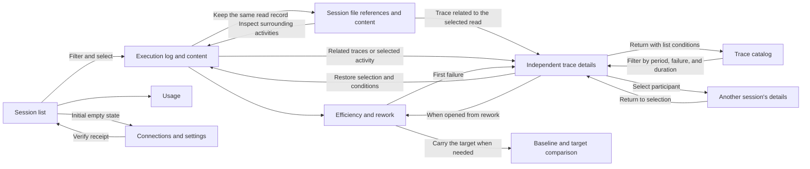

# Agentmetry UI and UX Refresh Design

## 1. Direction

Make the session list the entry point to Agentmetry and devote screen space to investigating the selected execution. The recommended structure is a list followed by a dedicated investigation view. Remove large taglines, decorative terminology, and permanently active receiving indicators; identify the page, target, and action directly.

Support both execution investigation and reflection on development practices. Preserve existing development-efficiency diagnostics and keep the primary metrics visible in the session's Efficiency and rework view. Comparison is a supporting action within session details, not a main navigation item.

This document records the accepted UX design and product implementation scope. Section 2 evaluates the UI before the refresh, section 8 records design-review wireframe checks, and section 11 records implementation and verification. Wireframe IDs, bodies, timestamps, and values are fictional samples. Effectiveness has not been measured through user testing.

The working branch `codex/ui-ux-refresh` includes `origin/main` commit `12a182ab` (v1.15.0), including shared file presentation from `97e0ed9c`, opening details from the entire activity row, and telemetry-derived Claude-generated names. The baseline assessment uses the v1.14.0 UI; implementation incorporates those subsequent presentation improvements.

---

## 2. Assessment Before the Refresh

Prioritize misleading information first, obstacles to primary actions second, and visual consistency third.

| Priority | Observed state | Impact on use | Proposed improvement |
| --- | --- | --- | --- |
| High | The header displays `Local trace observatory // Live` and a two-line tagline | Presentation attracts attention before the page's purpose | Name the page Sessions and remove the tagline and eyebrow |
| High | `statusText()` returns a receiving indicator even when dashboard loading fails | Successful rendering, continued receipt, and connection state are indistinguishable | Display only verifiable states; do not claim receipt without evidence |
| High | Conversation and activity counts come from loaded session rows; agent and token counts come from a separate summary | Adjacent KPIs appear to cover the same population, although detailed conditions are also absent from the summary request | Label the list as showing N items; move period statistics to Usage with consistent scope and units |
| High | Source, search, saving, detailed conditions, and explanations stack in a 264px sidebar | Candidates start low on the page and truncated IDs hinder comparison | Use a full-width list with horizontal search and primary conditions; expand detailed conditions and saving when needed |
| High | Global summaries and plan limits remain above session details; logs follow KPIs, traffic, and topology within details | Reading logs and content requires more scrolling | Use a compact session summary immediately above logs and selected content |
| Medium | An explanation of disconnected plan usage is always below the summary | An unconnected feature occupies everyday investigation space | Place it in Usage and Connections rather than permanently in investigation views |
| Medium | List metadata uses `.68rem` and source labels `.58rem`; emphasis combines borders, gradients, glow, and uppercase | Essential information is small while decoration dominates | Aim for 14px body and 12px secondary text; use neutral colors and emphasize selection and observed anomalies |
| Medium | Logs split list and detail, and the table itself has a 530px minimum width | Sharing width with the session list makes rows and content hard to compare | Give investigation sufficient width and stack content on narrow screens |
| Medium | Numerous rework metric cards precede failure evidence | Metrics provide a weak path to the relevant evidence | Put primary diagnostics and failure episodes first; expand secondary metrics and calculation details |
| Medium | Comparison is inside a conversation, with baselines selected by ID and end time | Relationships between comparison targets are difficult to understand | Carry the target from session details and show Before/After and ineligibility reasons |
| Medium | The trace view replaces the header and stacks summary, participants, conditions, and timeline | Session context is obscured and the timeline is distant | Preserve app navigation and provide a return to the original activity and conditions |

Sources: [app shell](https://github.com/kotokumu/agentmetry/blob/main/web/src/app/agentmetry-app.ts), [messages](https://github.com/kotokumu/agentmetry/blob/main/web/src/localization/messages.ts), [conversation workspace](https://github.com/kotokumu/agentmetry/blob/main/web/src/components/conversation-workspace.ts), [session list](https://github.com/kotokumu/agentmetry/blob/main/web/src/components/session-list.ts), [summary](https://github.com/kotokumu/agentmetry/blob/main/web/src/components/dashboard-summary.ts), [activity log](https://github.com/kotokumu/agentmetry/blob/main/web/src/components/activity-table.ts), [rework](https://github.com/kotokumu/agentmetry/blob/main/web/src/components/rework-summary.ts), [comparison](https://github.com/kotokumu/agentmetry/blob/main/web/src/components/rework-comparison.ts), and [trace explorer](https://github.com/kotokumu/agentmetry/blob/main/web/src/components/trace-explorer.ts).

Preserve history restoration, exact span links, missing-content reasons, limits on parent-child relationships, and comparison eligibility. Explicit limits on observed information are a product strength.

### Strengths to Retain from the Existing UI

Retain features that help users find an execution, narrow down a cause, or verify evidence. Simplifying the screen must not reduce investigation capability.

| Existing strength | Gap in the first mockup | How to retain it |
| --- | --- | --- |
| Switch sessions while keeping the list visible | The recommended layout requires returning to the list | Add switching at the top of details using the same list conditions; retain the alternative with a side list |
| Inspect agent relationships and usage, then filter logs by agent | A headcount alone removes investigation clues | Expand Agent structure and token breakdown to inspect relationships and usage; select a node to filter logs |
| Inspect reported input, output, cache, and reasoning tokens together | A total alone hides the breakdown | Keep session token details separate from period usage |
| Search prompts and messages as well as IDs | ID-only search makes conversations hard to find | Label search for session IDs and content; search only received and retained content |
| Save named conditions and reapply them | The mockup lacks a recall action | Open them from Conditions and saved filters; preserve relative-period reevaluation |
| Read selected content independently and distinguish selections outside the visible range | Changing display conditions can move selection to another row | Preserve selection and label content that falls outside the filter |
| Structure file names, exact paths, and provenance while retaining tool input | Content alone obscures the difference between a file argument and its read result | Show file name, path, and corresponding read output first; expand received tool input, source fields, and input keys |
| State evidence, missing values, and comparison denominators explicitly | Hiding caveats too deeply causes misinterpretation | Keep unreported, redacted, and ineligible states near the target; expand only detailed calculation explanations |

Sources: [agent structure and selection](https://github.com/kotokumu/agentmetry/blob/main/web/src/components/agent-tree.ts), [token classification](https://github.com/kotokumu/agentmetry/blob/main/web/src/components/token-chart.ts), [expandable breakdown](https://github.com/kotokumu/agentmetry/blob/main/web/src/components/token-breakdown.ts), [search](https://github.com/kotokumu/agentmetry/blob/main/web/src/components/session-filter.ts), [saved conditions](https://github.com/kotokumu/agentmetry/blob/main/web/src/components/investigation-filter.ts), and [content selection preservation](https://github.com/kotokumu/agentmetry/blob/main/web/src/components/activity-table.ts).

Cache and reasoning values can overlap input and output depending on the source, so display them as separate supplementary reports. Stack only input and output in charts. Do not infer parent links for agents with unconfirmed relationships.

Align prompt and file presentation across logs and traces with [shared content presentation](https://github.com/kotokumu/agentmetry/blob/main/web/src/components/activity-content.ts) and [evidence classification](https://github.com/kotokumu/agentmetry/blob/main/web/src/components/content-evidence.ts).

- Display received prompts with headings and readable bodies. Do not present summaries or inferred additions as received content.
- Identify files only from explicit `file_path` or `file_path`/`file_paths` keys in structured `tool_input`/`tool_parameters`. A path in a prompt or shell string does not establish that a file was read.
- Distinguish file arguments, reference-only reports, read output, and explicit model input. A file argument alone establishes neither content retrieval nor model input.
- Treat `body_ref` as a request-body reference, not a file-read entry. State when only a reference is retained.
- Do not display redacted content or references. Do not reconstruct complete file names or paths from truncated values.

### Paths to Inspect File Content

The goal is to understand the material an agent used in a session. Design the full flow: find a target, choose a read time, inspect content, and examine surrounding activities. File-oriented investigation frequency is unverified, so making it the default entry point remains undecided.

| Investigation goal | Entry point | Context to preserve |
| --- | --- | --- |
| What did this activity read? | Open read content from an activity in the log | Session, selected activity, timestamp, agent/model, and surrounding logs |
| Which files did this session reference? | Browse the same session's records by file | Session, file list, and selected read record |
| How does the read content relate to later work? | Move from a read record to its activity | The same record, original file selection, and filters |

Use a read record as the information unit. Multiple reads of the same file are separate records whose models, times, retrieved ranges, and contents can differ. File-oriented browsing must identify the selected record rather than collapse everything into the latest content.

| Layout approach | Benefit | Main cost | Decision |
| --- | --- | --- | --- |
| Read content on a separate screen | More room for long content | Hides surrounding activities and alternatives and increases navigation | Not the standard flow; consider enlargement as a supporting action |
| Read content within activity context | Easier comparison with surrounding work | Limited information density on narrow screens | Standard action from the log |
| Browse session records by file | Easy overview of referenced material | Weaker chronology and risk of confusing repeated reads of one path | Provide as a supporting view within the same session |

Keep sessions as the main investigation unit and allow movement between logs and file-oriented browsing. The integrated wireframe places Execution log, Referenced files, and Efficiency and rework in session tabs. Logs pair the activity list with selected content; Referenced files pairs the file list with the selected read record. Stack these on narrow screens. Do not require a separate screen merely to open content.

Remember the selected read record for each file. View surrounding logs selects the corresponding activity, and returning to the session's referenced files restores the same record. The file view covers reported files in the session and is not reduced by log filters. If a returned log record is outside the filters, preserve the conditions and content and show its out-of-range state.

| Retained evidence | State near the file | Content presentation |
| --- | --- | --- |
| Read output explicitly mapped to the file | Content available | Path, output observation time, agent/model, received output, and retrieved range |
| Output truncated | Content available, partially omitted | Show only retained content and known omission positions/ranges; do not invent line numbers or omitted amounts |
| Reference only | Content not reported | State that only the reference is retained |
| Output redacted or not retrieved | Redaction or retrieval reason | Distinguish from unreported content; do not display content that is not retained |

When an activity reports multiple files, allow switching while preserving activity context. Do not present current local files as historical content. State when the received output's coverage of the whole file is unknown.

UX evaluation covers comparing log content with surrounding activities, browsing referenced files in sequence, and distinguishing read times for the same file. Observe action counts, return navigation, and target mix-ups; use actual investigation behavior to decide the default entry point.

Per-file content requires evidence mapping output to a file in addition to path display. Confirm that mapping through received call IDs or explicit correspondence in output. Path equality, nearby timestamps, and array order are insufficient. Display output without confirmed mapping as activity-wide output. The mockup uses fictional output with explicit mapping; sections 9-3 and 11-5 record the actual contract and implementation limits.

### Agents and Models in Log Rows

Show the agent and execution model together on each row, for example `agent-01 (GPT-6 Astra)`. Place them on a separate line from tool or file names so they are visible without opening details. Use the same presentation in activity details and read content.

Use the value reported for each activity in the [activity model](https://github.com/kotokumu/agentmetry/blob/main/web/src/model/telemetry.ts). An agent can use different models across activities; never overwrite historical rows with its latest model. Display missing values as `agent-01 (model not reported)` without inference from the agent name or adjacent activities. Preserve the received identifier when formatting model names.

Do not restore large global KPIs, topology permanently above details, persistent disconnected-plan explanations, or decorative headings and glow. Preserve the mint selection accent, read-only MCP, detail URLs, and history restoration. The first mockup prioritizes visual simplicity too heavily; the revised design restores investigation clues through optional expansion.

---

## 3. Information Architecture and Main Flows

Organize navigation by purpose: Sessions supports investigation and reflection on identified work; Traces supports discovery through failures and duration; Usage provides aggregates; Connections and settings supports setup and maintenance. Comparison is a supporting action within Efficiency and rework.

Sessions and Traces are parallel main-menu entry points. The trace catalog, Related traces in session details, execution logs, and rework evidence all lead to the same independent trace detail view.



| View | First question answered | Main elements |
| --- | --- | --- |
| Sessions | Which execution should I investigate? | Search, period, source, conditions, and a list of IDs, observation times, activity counts, and tokens |
| Execution log | What happened and what was returned? | Compact session summary, chronology, and selected content; expandable agent structure and token breakdown |
| Referenced files | What did this session reference? | File list, read-time selection, historical output or missing-content state, and a link to the corresponding log |
| Efficiency and rework | Where is there room for improvement? | First-pass verification rate, rework token ratio, repeated failures, diagnostics, and evidence links |
| Trace catalog | Which processing contains failures or slow work? | Period, failure observation, and minimum duration; trace ID, start time, duration, and participating sessions |
| Trace details, independent view | How do activities connect across sessions? | Participating sessions/agents, shared timeline, selected span and content, and a return to the list or original investigation |
| Comparison, supporting detail action | How do two executions differ? | Before/After, eligibility and reasons, five existing diagnostics, denominators, and observed scope |
| Usage | How much was used? | Tokens and cost with explicit aggregation scope; plan limits in a separate area |
| Connections and settings | Can records be received? | Source setup instructions, capture scope, MCP, language, appearance, and app updates |

Use the ID when telemetry provides no title. Do not convert a prompt into an official title. Extend shortened IDs enough to resolve collisions, and make the complete ID available for inspection and copying in details.

### Session and Trace Relationships

The existing [trace design](https://github.com/kotokumu/agentmetry/blob/main/docs/design/trace-explorer.md) defines a many-to-many relationship. A session can reference zero or more traces, and a trace can involve multiple sessions, sources, and agents. Sessions do not own traces.

- Session tabs are Execution log, Referenced files, and Efficiency and rework. Related traces is an entry to another view, with trace and participating-session counts.
- Identify participating sessions and sources in traces, and include session IDs in agent lanes. Do not present origin-session summaries as trace-wide totals.
- Use received identifiers for relationships. Nearby timestamps or identical commands alone do not establish relationships. Do not infer missing parents or unknown sessions.
- Allow navigation to a participating session and back to the same trace selection. Preserve the original investigation return separately, restoring the tab, activity, file/read record, agent, and kind filters.
- Preserve independent `/traces/{traceId}` URLs and exact span links. List periods must not truncate participating sessions or retained trace evidence. A direct entry should provide a trace-list entry point without inventing an origin.

### Trace Catalog Scope

Allow investigation by failure or duration before the session is known. The initial design limits conditions to period, failure observation, and minimum duration, ordered by start time descending.

| Item | Presentation and behavior |
| --- | --- |
| Period | Filter by retained start time; do not truncate related detail records |
| Failure observation | Distinguish observed failure, no observed failure, and result not reported; no observed failure does not establish task success |
| Duration | Use retained start/end bounds without summing parallel activity durations; label unavailable values as unreported and exclude them when a minimum is set |
| Participating sessions | Display received identifiers; do not merge a session's participation across traces; move identifiers below the trace ID on narrow screens |
| Return to the list | Preserve trace-list conditions through details and participating sessions, independently of session-list conditions |

Confirm the list contract before implementation. Align search, paging, and missing-value behavior with the server; traces from loaded sessions alone are not the complete catalog. Advanced queries, aggregate charts, and alert configuration are outside the initial design.

### Retaining Development-Efficiency Information

Tokens, activity counts, and duration describe usage or work volume and cannot establish efficiency alone. Combine them with verification and rework observations to identify investigation targets. Use the existing [rework analysis component](https://github.com/kotokumu/agentmetry/blob/main/web/src/components/rework-summary.ts) as the basis.

| User question | Metrics to retain | Placement |
| --- | --- | --- |
| Does verification pass on the first attempt? | First-pass verification rate, eligible count, and verification failures | Top of Efficiency and rework; distinguish from overall task success |
| How much goes into rework? | Rework token ratio and rework effort ratio | Token ratio first, effort ratio immediately below, including missing-value reasons |
| Does the same failure recur? | Repeated failure loops, failed attempts, and resolved/unresolved counts | Place primary values beside the relevant episodes |
| How much did resolution cost? | Time and tokens to resolution | Near failure episodes; aggregate only observed targets |
| What impedes progress? | Tool failure rate, API retries, repeated commands, and file re-edits | Navigate from diagnostics to content or traces; do not label every repetition as waste |
| Which agent consumed resources? | Per-agent tokens, input/output, and supplementary breakdowns | Expand structure/breakdown and filter logs |

Efficiency and rework is a peer tab explicitly accessible from logs. Keep primary metrics outside explanatory disclosures; expand only calculation methods and supplementary counts. Metrics absent from the first mockup are not thereby approved for removal from the product.

Period-wide efficiency trends require additional design. Do not average session ratios naively or treat loaded pages as the full population. Until aggregation scope, numerators/denominators, missing values, and parent-child duplication are defined, provide per-session diagnostics. The mockup likewise covers one session's reflection, without global trends or invented productivity scores.

---

## 4. Layout Alternatives

| Option | Layout | Best suited to | Tradeoff |
| --- | --- | --- | --- |
| A: Dedicated investigation, recommended | Navigate from a full-width list to a dedicated investigation view; switch targets at the top of details | Reading long logs, content, and traces | Return to the list to compare other sessions' values; restore search conditions and position |
| B: Retain the list for switching | Keep a small list to the left of the investigation view | Inspecting short executions in sequence | Less width for content; use option A on narrow screens |

The wireframe controls switch detail layouts A/B, appearance, and list row spacing. A is the default. Retain the existing mint accent sparingly, without glow or decorative gradients.

---

## 5. Wording and State Design

| Existing wording or presentation | Proposal | Reason |
| --- | --- | --- |
| Local trace observatory // Live | Remove | Unnecessary for actions or decisions |
| Agent conversations, decoded. / its Japanese equivalent | Sessions | Identify the current view directly |
| Cross-conversation causality | Traces | Avoid overstating causality from observations |
| Observed model traffic | Tokens; explain the total as reported input plus output | State the unit first |
| Agent topology | Agent structure | Use a familiar description of the content |
| Permanent Receiving indicator | Waiting for data / Last received at / Connection could not be verified | Match the information actually available |
| One waiting state for every empty area | Separate first use, zero search results, retrieval failure, and no selection | Each requires a different next action |

Qualify failure by the observed target, such as a tool or verification step. Do not reinterpret it as whole-session failure or failure to fulfill the user's task. Apply the same restriction to success.

| State | Message | Next action |
| --- | --- | --- |
| First use, no records | No sessions yet | Open connection instructions |
| No matching conditions | No sessions match these conditions | Change or clear conditions |
| Loading | Loading the list or content | Preserve layout and existing selection |
| Refresh failed | Could not refresh; show when the displayed data was retrieved | Retry; expand technical details |
| Content not reported | Content was not reported | Check the source's sending configuration |
| Source redaction | Content was redacted by the source | Explain that content which is not retained cannot be displayed |
| Content not retrieved | Content has not been retrieved yet | Retrieve content |
| Comparison unavailable | Show the reason in place | Choose an eligible baseline from the same source |

Receipt state is separate from automatic UI refresh state. If reliable last-received information is unavailable during implementation, provide the necessary API support before displaying it. Frontend time alone cannot establish that data is being received.

---

## 6. Interaction Guarantees

- Preserve list conditions when opening details. Returning restores the same conditions, visible range, and position.
- Identify the comparison baseline and target. Preserve eligibility checks for overlapping periods, identity, source, and other existing criteria. Explain unknown harness identity separately from whether diagnostic values can be compared.
- Preserve exact trace-span URLs. Restore time range, activity kinds, failure conditions, and selected span through history.
- Live updates must not move the reading position or selection. The proposed interaction shows new-activity counts and lets the user change the displayed range.
- Recall saved filters from the conditions menu. Preserve reevaluation of relative periods when filters are reapplied.
- Distinguish hidden, unreported, redacted, not-retrieved, and display-filter-excluded content. Do not replace missing values with zero.
- Agent or activity-kind filters must not silently change content selection. Preserve out-of-filter selections and label them accordingly. Clear target-specific selection when switching sessions.
- Collapse supplementary list columns on narrow screens and move necessary information into details. Stack logs and content while keeping an actionable return path.
- For keyboard use, move focus appropriately to the page heading on navigation and the content heading on evidence selection. Make state changes accessible to screen readers. Do not convey failure or selection through color alone.

---

## 7. Implementation Scope and Stages

| Stage | Change | Completion criteria |
| --- | --- | --- |
| 1 | Remove decorative headings/glow, unify wording, identify KPI scope, and clarify errors | Implemented. English and Japanese page names identify the purpose; retrieval failures do not claim continued receipt |
| 2 | Separate list and details, move search conditions upward, and integrate logs/files with content | Implemented. Referenced files come from the session's read projection; selected records lead back to the corresponding activity |
| 3 | Connect efficiency metrics to evidence, keep comparison supplementary, and provide a trace catalog with independent details | Trace catalog and entry to existing details implemented; efficiency and comparison retain their evidence and navigation |
| 4 | Usage/Connections views, receipt state, and live-update behavior | Main navigation and Usage/Connections and settings entry points implemented; existing-controller selection preservation and resynchronization verified by tests |

Existing models support list IDs, times, counts, tokens, investigation filters, content evidence, rework diagnostics, and comparison results. Moving screens alone does not align aggregation scope. Usage uses session, agent, and token counts from the existing period-aggregation API, not loaded-page counts. Omit activity counts without a correct period-aggregation contract. New guarantees for per-source last-received times and aggregation completeness are outside this implementation.

References: [session model](https://github.com/kotokumu/agentmetry/blob/main/web/src/model/telemetry.ts), [catalog model](https://github.com/kotokumu/agentmetry/blob/main/web/src/model/session-catalog.ts), [comparison eligibility](https://github.com/kotokumu/agentmetry/blob/main/web/src/model/rework-comparison.ts), [investigation conditions](https://github.com/kotokumu/agentmetry/blob/main/web/src/model/investigation-conditions.ts), and [title and parent-child constraints](https://github.com/kotokumu/agentmetry/blob/main/openspec/changes/improve-session-list-model/proposal.md).

---

## 8. Wireframe Verification Scope

Design review uses a standalone `agentmetry-integrated.html` wireframe, which is not shipped with the product. It initially displays the first session's logs and read content for demonstration. The product starts at the session list.

| Area | Mockup scope |
| --- | --- |
| Session list | Search; source, period, failure, and duration conditions; saved filters; child sessions; target switching |
| First session | Eight rows excerpted from 48 activities; agents/models, activity selection, filtering, structure, and token breakdown |
| Referenced files | Three files and four records: `session-list.ts` outputs at 14:04:01 and 14:09:01, truncated `AGENTS.md`, and unreported `README.md` content |
| Efficiency and rework | Primary diagnostics, failure evidence, and comparison with another session; no period-wide efficiency trends |
| Traces | Five catalog entries: `demo-trace-01` has nine activities from two sessions and three agents; the other four have one activity each. Two traces relate to the first session |
| Other sessions | A one-row log for the child session; summaries for the others. File-record samples exist only for the first session |
| Usage and Connections | Fictional aggregates and connection states; no real data retrieval or configuration changes |

Browser verification of the integrated mockup covers these interactions:

- Display content within logs and switch among multiple files in the same activity.
- Change read time in Referenced files and open the corresponding log. Return to the file view with the same content and timestamp.
- Inspect another file and return to the selected read time for the original file. Distinguish truncation from unreported content.
- Keep activity-kind filters while visiting the file view and returning to logs. Preserve out-of-filter selection and content.
- Navigate from a referenced file to its trace activity and return to the original file and time.
- Visit trace child sessions or referenced files, return to the selected location, and preserve the catalog's failure conditions.
- Inspect efficiency metrics, navigate to the first failure, compare sessions, and return to reflection.

The integrated logs and referenced files are checked in dark mode at 1024px; referenced files are also checked in light mode at 736px and 360px. No JavaScript syntax or browser runtime errors are detected.

Saved conditions reset when the mockup reloads. Real data retrieval, persistent filter creation/update/deletion, paging through all events, trace-detail time controls, and URL/history/scroll restoration require verification against existing product features and added contracts. Mockup interactions do not establish API or data correctness. Per-file content mapping unsupported by current provider evidence is displayed as `NOT_CONFIRMED`.

Product implementation verification is recorded in section 11-5.

---

## 9. Gaps in Existing Contracts and Adopted Extensions

The baseline is commit `12a182ab` on `codex/ui-ux-refresh`. Existing contract below refers to that commit. After evaluating the accepted UX requirements, the implementation adds read contracts and generated code while preserving existing `GetTrace` semantics. Type descriptions are design summaries; exact field names are defined in proto/query.

### 9-1. Retrieving the Trace Catalog

| Item | Existing contract | Gap relative to accepted UX | Source file or type |
| --- | --- | --- | --- |
| Catalog retrieval | Only `GetTrace(trace_id, page, live_tail, anchor_span_id)` exists | Cannot discover traces by period, observed failure, or minimum duration before identifying a session | `AgentmetryQueryService`, `GetTraceRequest`, and `GetTraceResponse` in `proto/agentmetry/v1/agentmetry.proto` |
| Stored aggregates | `trace_rollups` stores start/end, status, activity count, root count, and missing-parent count | Storage supports catalog summaries, but query/transport lacks a list contract | `trace_rollups` in `internal/storage/sqlite/schema.hcl`; `loadTraceSummary` in `internal/storage/sqlite/trace.go` |
| Participating sessions | `GetTrace` includes `repeated ConversationRef conversations` | No catalog retrieval unit for participant counts and identifiers | Proto `ConversationRef`, query `Trace.Conversations`, and `trace_conversations` |
| Paging | Trace activities have `PageRequest` and opaque tokens | No `ListTraces` token for paging the trace population | Proto `PageRequest`/`PageInfo`; `boundedPageSize`/`parsePageToken` in `internal/transport/connectapi/server.go` |
| Time/failure conditions | `GetTrace` requires an ID; `Trace` has non-optional start/end/status | No population-level contract for conditions, missing duration, or unreported outcomes | `TraceFilter`, `Trace`, and `TraceStatus` in `internal/query/trace.go` |

The adopted extension has the following design summary. It does not change existing `GetTrace` semantics or paging.

```text
query.TraceListFilter
  Since, SourceID, FailureObservation, MinDurationMS, Page

query.TraceListEntry
  TraceID, StartedAt?, EndedAt?, DurationMS?, Status,
  ActivityCount, RootSpanCount, MissingParentCount,
  Conversations

query.TracePage
  Traces, NextOffset, HasMore, AppliedConditions

TraceReader.ListTraces(context.Context, TraceListFilter) (TracePage, error)
```

The Connect contract adds `ListTracesRequest` and `ListTracesResponse`, reusing `PageRequest`/`PageInfo`. Conditions are separate from `TimeFilter`. A failure-observation enum distinguishes three outcomes in addition to an unspecified condition.

```text
TraceFailureObservation:
  UNSPECIFIED / OBSERVED / NOT_OBSERVED / NOT_REPORTED

ListTracesRequest:
  TimeFilter filter
  TraceConditions conditions
  PageRequest page

TraceSummary:
  trace_id
  optional started_at
  optional ended_at
  optional duration_ms
  TraceStatus status
  activity_count
  root_span_count
  missing_parent_count
  repeated ConversationRef conversations
```

`NOT_OBSERVED` means no failure is observed in retained evidence; `NOT_REPORTED` means the result cannot be determined. An `unknown` status is not success. Return `duration_ms` only when both start and end are received and the value can be computed from the same trace snapshot. Exclude unavailable durations from minimum-duration filters instead of filling them with zero. Do not sum parallel activity durations.

Use `trace_rollups` as the catalog population and `trace_conversations` for participating-session presentation. Building the catalog from loaded sessions or `GetTrace` activity pages would omit unloaded traces. Evaluate period conditions against retained trace start time; do not truncate `GetTrace` details with catalog period conditions.

### 9-2. Session File References Across Activity Pages

| Item | Existing contract | Gap relative to accepted UX | Source file or type |
| --- | --- | --- | --- |
| Activity retrieval | `ListSessionActivities` returns a page using cursor/offset, agent, and anchor | No contract retrieves file references scattered across all pages as a complete set | Proto `ListSessionActivitiesRequest/Response`; query `ActivityPageFilter` and `ActivityPage` |
| Reference representation | `Activity` has `content` and one `ContentEvidence` | No reference collection or read-record retrieval unit when an activity contains multiple `file_path` values | Proto/query `Activity` and `ContentEvidence`; `ReportedReference` in `web/src/components/activity-content.ts` |
| Session summary | `GetSession` returns `trace_ids`, not content or a reference catalog | No file-oriented entry point; the set remains unknown until all activity pages are loaded | Proto `GetSessionResponse`; `internal/storage/sqlite/session_summary.go` |
| Live updates | Session mutations upsert/remove activity IDs | No contract represents file-reference additions/removals and stable selected read records | Proto `SyncSessionActivities*`; `web/src/controllers/conversations-controller.ts` |

With existing APIs alone, Web would read activity pages sequentially and aggregate each page's `ReportedReference` values. It could not claim to show every file before reaching the final page and would need to distinguish partial and complete sets during paging. Refetching pages alone also cannot safely guarantee preservation of old read selections and removal from the set during live updates.

The extension treats files as a set of received reference strings, without reconstructing file entities from current local paths. Each row represents a read record; multiple times for the same reference remain distinct.

```text
query.SessionFileReadFilter
  Identity, Page, Reference?

query.SessionFileRead
  ID                  // Stable observed source/session/activity/reference/occurrence ID, not path/time alone
  SourceID, SessionID
  Reference           // Received file_path/file_paths value
  ActivityID          // Activity reporting the reference
  ObservedAt
  AgentID, Model      // Values reported by that activity; missing values remain empty
  Content             // Only explicitly mapped output
  ContentEvidence
  OutputActivityID?   // Another activity's output only when explicitly related
  OutputMapping       CONFIRMED / NOT_CONFIRMED

query.SessionFileReadPage
  Reads, DistinctReferenceCount, NextOffset, HasMore, Coverage

SessionFileReadReader.ListSessionFileReads(
  context.Context, SessionFileReadFilter,
) (SessionFileReadPage, error)
```

The added Connect RPC is `ListSessionFileReads`. `Coverage` supports at least `complete`, `partial`, and `unavailable`. Return `complete` only when the full activity population is scanned and aggregated within one snapshot. `partial` describes incomplete scope and must not be presented as all files.

`Coverage` and paging `hasMore` have different meanings. `Coverage=complete` means query fully evaluated the observed projection scope in one snapshot. A bounded response can still have `hasMore=true`, which indicates results remain at the next opaque cursor. The server does not pack an unbounded full population into one response. Records containing only an observed input argument remain references, not successful reads or retrieved content.

Group file-oriented UI by `SessionFileRead.Reference`, but always preserve selection by `SessionFileRead.ID`. Keep each record's `ActivityID`, `ObservedAt`, `Model`, and `ContentEvidence` associated with that record when changing read time. Do not infer models from the session's `agent_id` or adjacent activities.

### 9-3. Explicit Output Mapping for a Single File

| Item | Existing contract | Gap relative to accepted UX | Source file or type |
| --- | --- | --- | --- |
| file_path | Extracts `file_path`/`file_paths` from structured `tool_input`/`tool_parameters` | A reference does not prove that the same activity's content is output for that file | `reportedReferences`/`ReportedReference` in `web/src/components/activity-content.ts`; `internal/query/activity_content.go` |
| body_ref | Presented as a `request_body` reference | HTTP body references must stay out of the file list | `role: request_body` in `web/src/components/activity-content.ts`; `ContentEvidence` |
| Output content | `Activity.content` and one `ContentEvidence` describe activity-wide output | Multiple file arguments lack output identity assigning content to an individual file | Proto/query `Activity.content`/`content_evidence`; `web/src/components/content-evidence.ts` |
| Raw attributes | SQLite retains `attributes_json` | Raw retention alone cannot guarantee a mapping as canonical UI evidence | `attributes_json` in `internal/storage/sqlite/schema.hcl`; `internal/query.Activity.Attributes` |
| Model input | `model_input` requires an explicit received field | File references/read output do not establish model input | `internal/query.ContentEvidence`; `web/src/components/content-evidence.ts` |

The additional contract represents single-file output availability separately from mapping status:

```text
FileReadOutput
  availability: AVAILABLE / NOT_REPORTED / REDACTED / NOT_RETURNED
  mapping: CONFIRMED / NOT_CONFIRMED
  content: string                 // Only when AVAILABLE and CONFIRMED
  evidence: ContentEvidence
  activity_id: string             // Output activity; reference activity ID only if unmapped
```

`mapping=CONFIRMED` requires received telemetry with an activity ID, reference ID, or provider-defined relationship identifying output for the same file. Time, path, activity order, or co-location in one activity alone is insufficient. Without a mapping, display the reference and mark content `NOT_CONFIRMED` without assigning it to a file. Treat `body_ref` as activity-content evidence rather than this contract's `Reference`.

Verified fixtures retain observations such as Claude `tool_use_id`/`file_path` and Codex `call_id`/`output`, but do not demonstrate a provider-guaranteed shared identity between a single-file read call and its output. The implementation therefore returns `NOT_CONFIRMED` for file-specific output and does not assign activity-wide `Activity.content` as file content. Do not add invented fixture attributes to manufacture a successful mapping. `CONFIRMED` requires an observed provider output explicitly tied to a single-file read call, supported by `ContentEvidence` and provider-fixture contract tests.

A single existing `Activity.content` cannot express this mapping. The minimum extension is a read projection on `SessionFileRead` containing `FileReadOutput` only when mapping is explicit, rather than adding multiple outputs to `Activity`. Return `NOT_CONFIRMED` while provider mapping is unverified instead of hiding the uncertainty behind empty added fields. File-specific output lacking provider identity in the existing projection remains `NOT_CONFIRMED`. Report compatibility and migration impacts separately only if evidence establishes the need for new collection settings or a database migration.

### 9-4. API Extension Decision Gate

| Contract | Supported by existing UI contracts alone? | Extension needed | Acceptance criteria |
| --- | --- | --- | --- |
| Wording and per-activity model display | Yes; use the row's `Activity.model` and label missing values unreported | None | Tests preserve existing values in `activity-table.ts`, `activity-content.ts`, and `telemetry.ts` |
| Content reached from session logs | Partly; activity content and evidence state are available | Multiple-file mapping within one activity is insufficient | Never assign content to a file without confirmed output mapping |
| Complete file-oriented collection | No; collecting activity pages alone cannot establish completeness | Equivalent to `ListSessionFileReads` | Align snapshot, full scope, coverage, and opaque paging across query/Connect/Web |
| Independent trace catalog | No; `GetTrace` requires an ID | Equivalent to `ListTraces` | Test the `trace_rollups` population, missing failure/time data, participants, and many-to-many relationships |
| Explicit single-file output | No; `Activity.content` does not prove mapping | `FileReadOutput` or an equivalent read projection | Only fixtures with explicit identity can establish `CONFIRMED` |

Only extensions whose need is established after applying independent scenarios enter product code. Presentation supported by existing boundaries uses existing models. `ListTraces` and `ListSessionFileReads` are read-only adapters with a consistent snapshot, opaque paging, and explicit acknowledgement of conditions/coverage.

---

## 10. Design Gate Record

This file is the authoritative design-gate record and is maintained on the same branch as product code. Section 11 records the results and reassessment for independent scenarios 1–16.

| Gate | Status | Record |
| --- | --- | --- |
| Risk assessment | Complete | High risk: adds public read-only APIs and can change UI state, responsibilities, and API boundaries; not a simple wording change |
| Requirements / evidence packet | Complete | UX requirements in sections 1–6 and independent scenarios 1–16 in section 11 |
| Initial conceptual model | Complete | Investigation state, activity, read record, file reference, content evidence state, efficiency diagnostics, and session/trace participation |
| Initial minimality | PASS | `Activity` already owns time and identity. A separate read record preserves mappings and individual selections for multiple references/outputs within an activity. Merging content evidence state into content would lose redacted/truncated/unreported distinctions. Other candidate concepts are merged or rejected |
| Independent scenarios | PASS | Applies scenarios 1–16 derived independently from the requirements packet at baseline `12a182ab`, without conversation history |
| Responsibilities and boundaries | PASS | Section 11 records scenario outcomes; existing query/SQLite/Connect/Web/live/navigation boundaries are preserved |
| Interface / test / TDD | PASS | Adopts reviewed, additive `ListTraces` and `ListSessionFileReads`/read projections; contract and behavior tests preserve existing GetTrace/client behavior |
| Construction | PASS | Implements wording, activity models, added read APIs, Web integration, generated code, and contract/behavior tests |

Record implementation changes in this document's implementation scope, contract gaps, and design-gate sections rather than reverting to a separate proposal mockup. Distinguish implemented facts, unimplemented contract proposals, and acceptance results from synthetic OTLP fixtures.

---

## 11. Independent Scenarios and Responsibility/Boundary Decisions

Apply independently developed scenarios 1–16 using evidence packet `OTEL-INVESTIGATION-1`, baseline `12a182ab`, and the initial conceptual model. Treat those scenarios as Committed or Observed verification targets. Retention changes, exemplars, arbitrary attribute search, remote trace federation, tail completion, and sampling repair remain Speculative because evidence is insufficient; they do not expand the current boundary.

### 11-1. Propagation from Scenarios to Responsibilities

| Scenario | Main change driver | Primary responsibility | Justified propagation | Unnecessary propagation and decision |
| --- | --- | --- | --- | --- |
| 1 Multiple read times for one path | Multiple references/outputs within an activity and individual selection | Read record / investigation state | File reference, activity ID, observation time, and surrounding activities | Preserve `Activity` time/identity. Separate records retain individual reference/output mappings and selections. Retrieving file entities or substituting current content is unnecessary |
| 2 Mixed evidence and missing states | Evidence interpretation and availability | Content evidence state | Query evidence classification to Connect/Web presentation | Do not convert missing data into empty content, success, or confirmed mapping; no added collector |
| 3 Missing activity models | Accurate presentation of activity observations | Activity | `Activity.model` to the same activity's row and details | No inference from agent summaries, adjacent activities, or latest models |
| 4 Multiple agents, delegation, and parent-child relationships | Agent/session relationships | Session/trace participation | Agent ID, parent, and source-qualified session to presentation and return navigation | Do not derive parents from span proximity; preserve explicit or observed relationships |
| 5 Different efficiency-metric states | Diagnostic values, denominators, and coverage | Efficiency diagnostics | Query/MCP/Web values, missing-value reasons, and evidence activities | Keep zero distinct from unreported; do not add productivity scores |
| 6 Trace investigation before identifying a session | Trace independence and many-to-many relationships | Trace catalog / participation | Trace rollups, participating sessions, and original investigation state | Loaded-session traces are not the complete population |
| 7 Root/child list switching | Session catalog view | Session list | `SessionListView`, URL, and paging | Do not implicitly merge or duplicate roots and children |
| 8 Activity/trace page boundaries | Opaque paging and chronology | Query paging / investigation state | Total, offset, preceding/following pages, and selected IDs | Array position or nearby time cannot establish selection/output mapping |
| 9 Relative periods and retained scope | Separation of aggregate and detail populations | Query filters / diagnostic coverage | List conditions, whole traces, and comparison snapshot scope | Do not truncate details with catalog periods or use loaded-page counts as full aggregates |
| 10 Additions, removals, resynchronization, and disconnects | Live projection lifecycle | Live-update controller / investigation state | Upsert/remove/resync, connection state, and selection preservation | New activity must not force reading-position changes; disconnected is not receiving |
| 11 Direct URLs, reload, and history | Investigation-state restoration | Navigation state | Source/session, trace/span, conditions, and activity/read selection | Do not rely solely on temporary DOM state or replace missing targets with others |
| 12 Condition vocabulary and servers that do not apply conditions | Query contract acknowledgement | Filter adapter / query boundary | Applied conditions, unsupported/invalid states, and URLs to Web | Transport success alone does not establish applied conditions; no arbitrary attribute search |
| 13 Unknown, invalid, or out-of-range traces | Evidence-target availability | Trace query / investigation state | Target ID, not-retrieved, outside-retention, and invalid states to presentation | Do not choose the first error or a nearby trace; no remote fallback |
| 14 Missing parents, roots, spanless logs, and empty sessions | Incomplete observed relationships | Trace/session projection | Missing parents, multiple roots, and empty session values | No inferred reparenting or synthesized empty/session/span IDs |
| 15 English and Japanese | Consistent wording and classification | Presentation / localization | Evidence kind, availability, and reference role with equivalent meaning | Locale must not change missing-value semantics or mapping rules |
| 16 Narrow screens and long values | Visibility and usability | Web presentation | Wrapping paths, URLs, structured content, and output IDs | Do not truncate identifiers beyond recognition or rely on color alone |

No scenario introduces unexplained responsibility propagation. Changes extend the existing query read boundary, Connect read-only adapters, and Web investigation state/presentation. They do not extend ingestion, the raw journal, MCP writes, or external integrations.

### 11-2. Architecture Boundaries

| Candidate boundary | Consumers and evidence | Owner of state, data, and policy | Constraints | Dependency direction | Simpler existing alternative | Decision |
| --- | --- | --- | --- | --- | --- | --- |
| SQLite query → trace/file reads | `trace_rollups`, `trace_conversations`, activity projection, and baseline `GetTrace`/`ListSessionActivities` | `internal/query` owns meaning; SQLite owns reading persisted data | One read snapshot, whole-population counts, opaque pages, and source-qualified identity | Web/API → query → SQLite | Web fetches and aggregates every activity | Additional query readers are necessary to avoid presenting partial populations as complete |
| Query → Connect read API | Web and existing HTTP/Connect clients | Proto/Connect owns wire format; query owns decisions | Condition acknowledgement, missing values/coverage, and read-only access | Connect adapter → query | Web reads SQLite/HTTP JSON directly | API gate adopts `ListTraces`/`ListSessionFileReads` |
| Connect → Web client mapping | `agentmetry-client.ts` and generated protobuf | Client mapping owns wire validation; models own UI vocabulary | Do not silently accept invalid enums, missing data, or unsupported servers | Web client → Connect | Components read protobuf directly | Reuse the existing pattern and keep contract decisions outside components |
| Web navigation → session investigation | `navigation.ts`, `AgentmetryApp`, and `ConversationWorkspace` | Navigation owns URL/history; workspace owns selection/display state | Restore conditions, activities, read records, trace/span, and scroll | App composition → components | Each component manages history | Extend the existing navigation boundary; no new generic state framework |
| Content evidence → presentation | `activity-content.ts` and `content-evidence.ts` | Query owns evidence semantics; presentation owns translation/layout | Separate reference/request_body; preserve unknown mapping and redacted/truncated/unreported states | Model → component → localization | Show only path strings | Preserve existing classifications; do not assign file-content retrieval to UI |
| Live feed → investigation state | `live-update-controller.ts` and `conversations-controller.ts` | Controller owns identity merge/resync; workspace owns selection preservation | New events must not replace selection/viewport | Feed → controller → component | Rely on array rerendering | Reuse mutation/sync boundaries; no speculative offline cache |
| Trace/session relationships → return navigation | `trace-participants.ts`, `AgentmetryApp`, and `navigation.ts` | Query owns relationships; app owns origin/return | Many-to-many relationships, exact spans, list conditions, and original-activity return | Query → API → app | Treat traces as session child screens | Traces are not session-owned |

Contract extensions do not change raw retention or the ingestion schema. `ListTraces` uses `trace_rollups` as its population. `ListSessionFileReads` returns only explicitly available references/outputs from existing activity projections within one snapshot. File-specific output lacking provider identity remains `NOT_CONFIRMED`. Report compatibility and migration effects separately only when evidence requires new collection settings or database migration.

### 11-3. Minimality Reassessment After Independent Scenarios

Scenario 1 confirms that a read record cannot be merged into an activity or file reference. Scenario 2 confirms that content evidence state cannot be merged into content. Scenarios 6/14 confirm that sessions and traces cannot be reduced to an ownership relationship. Scenarios 10/11 confirm that investigation state requires more than temporary presentation-component state.

These results validate concepts already admitted by the initial design; they do not justify new domain concepts. `FileReadOutput`, `TraceListEntry`, and `SessionFileRead` are API/read-projection values, not additional concepts owning independent state. Minimality after scenario application is PASS.

### 11-4. Gate Updates

| Gate | Status | Evidence |
| --- | --- | --- |
| Independent scenarios | PASS | Independently developed scenarios 1–16; material Committed/Observed drivers applied to responsibilities and boundaries |
| Scenario impact | PASS | Section 11-1 records primary responsibilities, justified propagation, and unnecessary propagation |
| Minimality reassessment | PASS | Section 11-3 validates existing concepts without adding new ones |
| Architecture boundary | PASS | Section 11-2 reuses query/Connect/Web/live/navigation boundaries and assigns added read API responsibilities |
| Interface decision | PASS | Adopts reviewed additive `ListTraces` and `ListSessionFileReads`/read projections while preserving existing GetTrace/client behavior |
| Construction | PASS | Wording, activity models, proto/generated code, and query/SQLite/Connect/Web implemented; Web/API/browser checks and final TypeScript/Vite/embedded Go `make build` completed |

### 11-5. Implementation Verification Record

The product implements the Sessions, Traces, Usage, and Connections & settings navigation. Sessions use comparison-friendly rows with reported titles, source-qualified identities, observed time, activity counts, paging, and copy feedback. The detail header switches sessions within the current catalog conditions, exposes further pages and retries, and keeps primary session metrics compact. Token and agent breakdowns remain expandable.

Execution logs show the model reported by each activity. Referenced files remain inside the session, with separate read identities for different reading times, exact activity input/output, keyboard focus, retries, and return navigation. Efficiency & rework presents first-pass success, rework token share, and recurring failure loops before failure episodes; supplemental diagnostics and comparison remain available. Trace participants link to source-qualified sessions without assigning another session's selected span to them. Navigation preserves the originating trace selection and catalog conditions.

Connections & settings contains copyable Claude Code and Codex configuration, the distinction between default OTLP receiver ports and the Web/MCP origin, retained-content limitations, the read-only MCP URL, language, persistent system/light/dark appearance, and the existing desktop update control. Appearance changes also follow OS changes outside the settings page and tolerate unavailable browser storage.

The completion work preserves the existing query/Connect/Web/live/navigation boundaries. It adds no API or database migration. The existing additive `ListTraces` and `ListSessionFileReads` APIs retain opaque paging and explicit conditions/coverage.

Two data limits remain explicit:

- The current session catalog query omits token aggregates. Rows say **Available in session details** when that value is not retrieved; session details and Usage use their existing aggregate queries. A missing catalog aggregate is not labeled as unreported source telemetry.
- Current provider evidence does not confirm single-file output mapping. The file projection retains `NOT_CONFIRMED` and shows input/output from the exact activity separately. It does not substitute the current local file or assign activity-wide output to one file.

Verification uses automated behavior tests and synthetic telemetry sent through standard OTLP HTTP to a dedicated local database. Synthetic fixtures establish UI/API integration, not real provider output-mapping evidence.

Completion checks passed:

- Web: 377 tests across 37 files; localization generation, TypeScript, and Vite production build.
- Backend: all Go unit and integration tests; the Go binary built with the verified Web assets embedded.
- Desktop: 35 build-input tests.
- Browser: source-qualified session switching, an older file read's exact activity and return selection across reload, filtered trace-to-session navigation and exact span restoration, efficiency comparisons and missing-value explanations, Usage aggregates, configuration copying, and language/appearance persistence.
- Responsive presentation: session rows at 736 px and session/file/settings views at 360 px, including long identifiers and paths.
