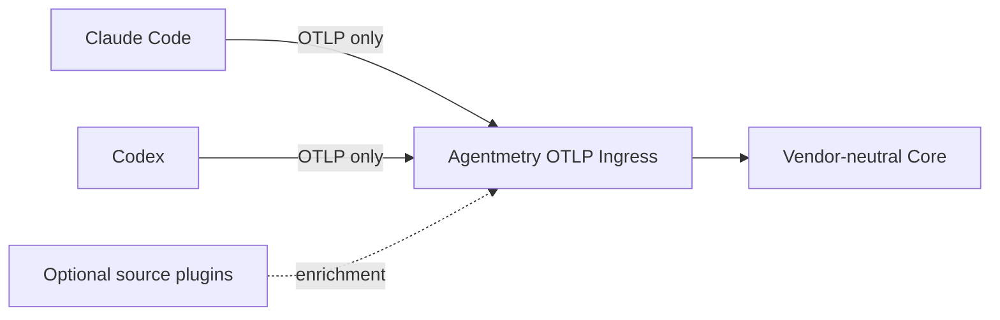
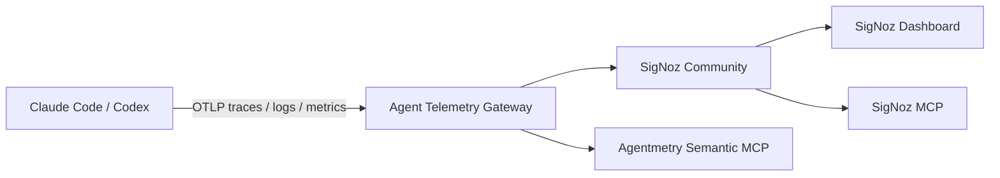
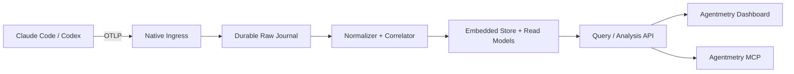
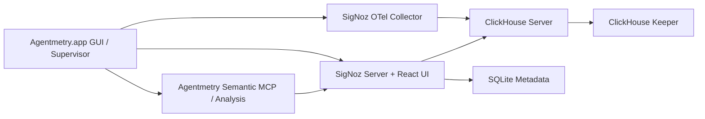
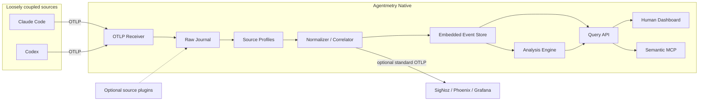

# Agentmetry Grand Architecture

- Status: Proposed
- Date: 2026-08-10
- Target: Claude Code / OpenAI Codex, macOS / Windows / Linux
- Product shape: A local-first GUI app installable from a `.dmg`, with a human dashboard and an AI-facing MCP interface

## 1. Decision

Design Agentmetry as a **loosely coupled local application that connects to Claude Code and Codex using OTLP alone**.

Normal operation must not require an SDK, wrapper, proxy, or patch in Claude Code or Codex. Users install Agentmetry from a `.dmg` and launch the GUI from its icon. They only configure the OTLP exporter in Claude Code or Codex; Agentmetry receives traces, logs, and metrics at an OTLP endpoint on `127.0.0.1`.

The product has five core assets:

1. Source Profiles and a Normalizer that convert vendor schemas into a common model
2. A Correlator that links sessions, turns, agents, subagents, tools, messages, and artifacts
3. An Analyzer that calculates token usage, critical paths, parallelism, waits, duplication, and conflicts
4. A dashboard specialized for multi-agent development
5. A read-only Semantic MCP that returns evidence and observation completeness

Use a staged backend strategy rather than treating the alternatives as mutually exclusive.

- **Short-term PoC:** Use an unmodified SigNoz Community deployment to validate value through OTLP ingestion, all three signals, its existing dashboard, and its official MCP server.
- **Desktop spike:** Compare SigNoz Embedded, using official Darwin binaries, with Agentmetry Native under the same fixture, UX, and resource conditions.
- **Product decision:** Adopt the option that passes the `.dmg` launch, signing, upgrade, memory, query, and agent-UX gates.
- **Interoperability:** Retain standard OTLP input and output in every product configuration.

Do not adopt a plan that forks an OSS project and carries custom modifications. Even if SigNoz Embedded is selected, combine upstream binaries with public contracts and preserve the ability to replace the vendor, storage, and UI. Concentrate proprietary value in the Normalizer, Correlator, Analyzer, Agent Dashboard, and Semantic MCP.

Under the integrated evaluation current as of 2026-08-10 in [ADR 0004](adr/0004-integrated-stack-evaluation.md), Go + Collector/pdata + SQLite is the production baseline, Rust + vendored Rotel + SQLite is the strong challenger, and OpenObserve is the no-fork OSS PoC. This is the ranking before the spikes, not a technology commitment that bypasses the hard gates.

## 2. Requirements Specification

### 2.1 Requirement Summary

The problem is that neither humans nor AI can observe, in an explainable form, how multiple AI agents divide work, where they wait, what they duplicate, how many tokens they consume, or which tools and artifacts fail.

The goal is to reconstruct and analyze multi-agent runs from locally transmitted telemetry without interfering with the normal operation of Claude Code or Codex.

### 2.2 Functional Requirements

| ID | Requirement |
|---|---|
| FR-01 | Receive traces, logs, and metrics over OTLP/gRPC and OTLP/HTTP |
| FR-02 | Generate Claude Code and Codex configuration snippets and verify connectivity |
| FR-03 | Preserve raw vendor events and normalize them into a common model with versioned rules |
| FR-04 | Correlate Run, Turn, Agent, Activity, AgentMessage, and Artifact entities |
| FR-05 | Track subagent dispatch, parent-child relationships, progress, result delivery, waits, interruptions, and approval requests wherever the source exposes them |
| FR-06 | Aggregate input, output, cache-read, cache-write, and reasoning tokens by call, turn, agent, run, and model |
| FR-07 | Analyze latency, errors, retries, tool usage, parallelism, critical paths, idle/wait time, duplicated work, and artifact conflicts |
| FR-08 | Visualize live runs, timelines, delegation DAGs, inter-agent communication, tokens, and artifacts in a human dashboard |
| FR-09 | Provide structured MCP access to run search, timelines, tokens, bottlenecks, coordination risks, and comparisons |
| FR-10 | Attach evidence, calculation-rule version, confidence, and source capability to every finding |
| FR-11 | Manage retention, export/import, redaction, and content-capture policies locally |
| FR-12 | Allow Hooks, App Server, `stream-json`, and JSONL import to be added as optional plugins |
| FR-13 | Fan out standard OTLP to external backends |
| FR-14 | Run the same Server Core as a `.app`, standalone binary, and single Docker container, with OTLP, Web UI, and MCP available in every profile |

### 2.3 Non-Functional Requirements

| Area | Requirement |
|---|---|
| Coupling | Do not make unpublished Claude Code/Codex APIs, internal databases, or transcript formats part of the normal-path contract |
| Local-first | All core features work without a cloud connection |
| Platform | Include macOS arm64/x64, Windows x64, and Linux x64 in CI |
| GUI | On macOS, install the `.app` from a `.dmg` and launch a native window from its icon |
| Installation | The normal production profile requires no Docker, WSL, Java, external database, or terminal operation |
| Distribution | Code-sign and notarize the macOS app; provide an `.msi` or signed `.exe` for Windows and derivative targets such as AppImage for Linux |
| Deployment parity | Desktop, binary, and container profiles use the same canonical schema, API, Web UI, and MCP contract |
| Privacy | Content collection is off by default. Identities and paths can be hashed. MCP is read-only by default |
| Reliability | Acknowledge after durable receipt, supporting at-least-once delivery and idempotent projection |
| Performance | Make ingestion, timeline, and aggregation targets release gates measured against a fixture corpus and real-machine benchmarks |
| Compatibility | Store source, schema, and normalizer versions so data can be renormalized |
| Operability | Detect port conflicts, disk pressure, schema mismatches, and drop counts in the UI |

### 2.4 Inputs and Outputs

Inputs:

- OTLP protobuf over gRPC/HTTP
- Optional Claude Code Hooks / `stream-json`
- Optional Codex Hooks / App Server / `exec --json`
- JSONL/ATIF for re-import
- User annotations and retention/content policies

Outputs:

- normalized run graph
- live dashboard and analytical views
- Structured results from MCP tools and resources
- findings with evidence/confidence
- ATIF trajectory export
- Optional OTLP export

### 2.5 Normal / Error / Edge Cases

Normal cases:

- A run appears automatically from OTLP configuration alone, showing whatever token, tool, and agent information is available
- Token usage and delegation relationships can be aggregated by agent
- AI can retrieve the activities that support latency or failure findings through MCP

Error cases:

- Quarantine invalid protobuf, unknown schemas, and oversized content without stopping all ingestion
- Surface full disks, database locks, and port conflicts; do not hide drop or queue counts
- Fail closed on redaction errors and do not store the content
- External sink failures do not stop local ingestion

Edge cases:

- Duplicates, out-of-order or late arrivals, missing parents, and clock skew
- A single session split across multiple traces
- Asynchronous subagents that outlive their parent
- The same action arriving through both OTLP and an optional plugin
- Token breakdowns or costs not provided by the vendor
- Restart immediately after a forced app termination, duplicate startup, or interrupted schema upgrade

### 2.6 Acceptance Criteria

1. Configure only OTLP in Claude Code or Codex and display a run without modifying their code.
2. State available and unavailable fields for every source fixture in the Capability Matrix.
3. Produce the same normalized graph when duplicates and arrival order are randomized.
4. For sources that expose inter-agent dispatch, messages, and results, display them with sender, receiver, task, and evidence.
5. Aggregate only observed token types; never treat missing values as zero.
6. Every MCP analysis result returns evidence IDs, confidence, and completeness.
7. Do not persist prompt, response, or tool bodies unless content capture is enabled.
8. Agentmetry or external-sink downtime does not interfere with Claude Code or Codex execution.
9. Pass install, ingest, and query smoke tests for macOS, Windows, and Linux in CI.
10. On a clean macOS system, install from a `.dmg` and launch the GUI, OTLP receiver, and MCP without Docker or a terminal.
11. Both `agentmetry serve` and the single-container image launch OTLP, Web UI, and MCP without an external service other than a persistent volume.

### 2.7 Non-Goals

- Controlling agent execution, acting as a tool-approval proxy, or providing a sandbox
- Recovering or inferring hidden chain of thought
- Treating internal Claude Code or Codex protocols as stable APIs
- Multi-tenant cloud observability for teams in v1
- Reimplementing all general-purpose APM, alerting, and infrastructure monitoring

## 3. Acquisition Levels and Loose-Coupling Contract

| Level | Required change | Position |
|---|---|---|
| L1: Standard | Configure only the OTLP endpoint/exporter | Required product baseline |
| L2: Enriched | Additional configuration such as Hooks or App Server | Optional plugin that supplements agent-message and artifact details |
| L3: Replay | JSONL / ATIF import | Historical runs, disaster recovery, and offline analysis |

The dashboard and MCP must work with L1 alone. When L2/L3 is absent, do not infer unobserved fields.

Dependencies always flow in the following single direction.



Agentmetry does not start or stop source processes and can be developed independently against standard OTLP fixtures even when the source is not installed.

### 3.1 Zero-instrumentation Capability Matrix

Based on official documentation as of 2026-08-10. Configuration using `OTLP alone` is L1; anything that enables a separate event source is classified as L2/L3.

| Capability | Claude Code L1: OTLP only | Codex L1: OTLP only | L2/L3 enrichment |
|---|---|---|---|
| session/thread | `session.id` | conversation/thread/session ID | Stable correlation through Hooks/App Server |
| turn/prompt | `prompt.id`, interaction | turn latency/event | Turn IDs from Hooks/App Server |
| traces | Interaction, LLM request, tool, tool execution, subagent, and hook. Enhanced Telemetry is Beta | OTLP HTTP/gRPC exporter available. Public span schema is limited | Generate synthetic activities from events |
| logs/events | Prompt, response, tool result/decision, API, MCP, hook, permission, compaction, and more | Conversation, API, SSE/WS, prompt, tool decision/result | Supplement bodies and ordering through the native event stream |
| metrics | Session, tokens, estimated cost, active time, LOC, commits/PRs, and more | API/tool/turn/TTFT, tokens, MCP, hook, thread, compaction, multi-agent, and more | Not required. Native events add fine-grained attribution |
| token | Input/output/cache-read/cache-create | Input/cached-input/output/reasoning-output | Supplement call/turn/agent attribution |
| agent/subagent | Agent ID, parent agent ID, and subagent span in traces | Multi-agent metrics/traces. Stable public span schema is limited | Claude Hooks/stream and Codex App Server/collaboration events |
| inter-agent message | Relationships and some events are available. Complete bodies are not guaranteed | Relationships and some events are available. Complete bodies are not guaranteed | Supplement sender/receiver, prompt, progress, result, and related data |
| tool input/output | Depends on detail/content gates | Depends on event attributes and content settings | Hooks/App Server/exec JSON |
| file/diff | Whatever the tool/trace exposes | Whatever tool events expose | Hooks/App Server file changes |
| prompt/response body | Redacted by default; explicit opt-in | Prompts are not collected by default; OTLP alone does not guarantee complete responses | Optional storage through ContentRef |
| cost | Estimated USD metric available | Not guaranteed in local OTLP | Store estimates from a versioned price table as separate values |

Resulting design constraints:

- Always use the subagent relationships and token data available at L1, but do not require a complete conversation graph.
- Preserve raw Codex trace schemas and do not treat a field without version-specific fixtures as a stable contract.
- Show Claude traces as a Beta capability in the health view.
- Treat metrics as aggregates and spans/events as the source of truth for individual actions; do not double-count the same tokens.
- Store the state of source content gates as a run capability.

### 3.2 Minimal OTLP Configuration

Representative Claude Code L1 configuration:

```bash
export CLAUDE_CODE_ENABLE_TELEMETRY=1
export OTEL_METRICS_EXPORTER=otlp
export OTEL_LOGS_EXPORTER=otlp
export OTEL_EXPORTER_OTLP_PROTOCOL=grpc
export OTEL_EXPORTER_OTLP_ENDPOINT=http://127.0.0.1:4317

# Enable this to use traces; Beta as of 2026-08-10
export CLAUDE_CODE_ENHANCED_TELEMETRY_BETA=1
export OTEL_TRACES_EXPORTER=otlp
```

Keep the following Claude Code content settings off by default.

```text
OTEL_LOG_USER_PROMPTS
OTEL_LOG_ASSISTANT_RESPONSES
OTEL_LOG_TOOL_DETAILS
OTEL_LOG_TOOL_CONTENT
OTEL_LOG_RAW_API_BODIES
```

Representative Codex OTLP log configuration:

```toml
[otel]
environment = "local"
exporter = { otlp-grpc = { endpoint = "http://127.0.0.1:4317" } }
log_user_prompt = false
```

For metrics and traces, select `otlp-http` or `otlp-grpc` with the official `otel.metrics_exporter` / `otel.trace_exporter` settings. Because Codex has OTel settings that cannot be overridden from project-local configuration, the setup wizard performs the following steps:

1. Detect the source version and active configuration scope.
2. Show the proposed diff and apply it to user/managed configuration only after explicit approval.
3. Verify test-event arrival and per-signal capabilities.
4. Preserve the previous configuration for rollback.

Keep the setup wizard limited to text generation, and recommend only profiles that pass fixture and contract tests for the source version.

### 3.3 OTLP Signals and Identity Semantics

OTLP is a transport protocol for telemetry signals; it does not define an agent session hierarchy. Agentmetry v1 admits OTLP traces, logs, and metrics as distinct signals. OTLP profiles are a separate signal and are not part of the current product contract.

Do not project every producer event into a trace merely because the dashboard presents a unified activity timeline.

| Signal | OTLP-native structure | Identity and correlation | Agentmetry treatment |
|---|---|---|---|
| Trace | `Span` records | `trace_id`, `span_id`, `parent_span_id`, links | Preserve the span graph and project relevant spans as activities |
| Log/Event | `LogRecord` records | Optional trace/span context plus attributes | Preserve standalone events; correlate them when identifiers are present |
| Metric | Instruments and data points | Resource/point attributes; exemplars may reference trace/span context | Preserve aggregation semantics; never treat an aggregate as an individual action |
| Profile | Profile samples | Profile-specific identifiers and optional correlation | Not admitted by v1; retain as a future independent signal |

`trace_id`, `span_id`, and `parent_span_id` are native fields of an OTLP span. A trace is the set of spans that share a trace ID; it is not a single exported record. A log record may also carry native trace/span context. `session_id` is not an OTLP span field.

Session, thread, conversation, model, agent, tool, and token information normally arrives as resource, span, log, or metric attributes. Source profiles interpret producer-specific attributes and expose common semantic aliases without replacing the original evidence.

| Source concept | Native source attribute | Common semantic alias | PoC projection name |
|---|---|---|---|
| Claude Code conversation | `session.id` | `gen_ai.conversation.id` | `session_id` / `run_id` |
| Codex conversation | `conversation.id` | `gen_ai.conversation.id` | `session_id` / `run_id` |

The PoC names this projection `session_id` or `run_id` for historical reasons. Those names do not make it an OTLP-native session field. The underlying concept is the source conversation, thread, or work context.

Conversation identity and trace identity are orthogonal:

- one conversation can contain operations from many traces;
- a propagated trace can cross process, agent-run, or source boundaries;
- a conversation ID must not be synthesized from a trace ID, a content hash, or a newly generated fallback ID;
- shared trace identity creates a correlation link and must not, by itself, merge two source conversations;
- missing conversation or trace identity remains missing rather than being inferred without evidence.

The dashboard may use conversation as its primary navigation view, but trace is a cross-cutting causal view. An activity can therefore link to both a conversation and a trace without either entity owning the other.

The PoC overview groups conversations by `(source, run_id)` and keeps shared trace IDs as correlation links. A shared trace does not collapse separate conversations into one dashboard item.

### 3.4 Optional Rich Sources

| Source | Rich data | Position |
|---|---|---|
| Claude Hooks | Session, prompt, assistant delta, tool, permission, subagent, task, file/worktree, compact, MCP, stop | Optional L2 enrichment for existing conversations |
| Claude `stream-json` | Message/tool, usage/cost, session/model, retry, `parent_tool_use_id` | Limited to runs launched by Agentmetry |
| Codex Hooks | Session/turn/model, tool, permission, subagent start/stop, compact | Optional L2; expose command-hook limitations |
| Codex App Server | Thread/Turn/Item, collaboration, approval, command, diff, MCP, token | For embedded or custom-host profiles |
| Codex `exec --json` | Thread/turn/item, message, command, file, MCP, plan, tokens | For non-interactive runs launched by Agentmetry |
| JSONL transcript | Historical conversations and tool metadata | L3 only; version-quarantine data because internal formats can change |

Claude's main correlation keys are `session.id`, `prompt.id`, `message.uuid`, `client_request_id`, `tool_use_id`, `agent_id`, `parent_agent_id`, `parent_tool_use_id`, and trace/span IDs. For Codex, retain thread/session, turn, item, agent, sender/receiver, and trace/span IDs in separate namespaces.

## 4. Architecture Options

### 4.1 A: Use an External OSS Product As-Is



The gateway handles only source profiles, redaction, GenAI normalization, synthetic spans, and correlation attributes. Do not fork SigNoz itself.

Advantages:

- Fastest path to all three signals, querying, dashboards, and MCP
- No need to reimplement retention, aggregation, or a trace explorer
- Allows the team to focus on validating the value of Agentmetry-specific analysis

Weaknesses:

- Requires Docker and multiple services; WSL2 deployment is recommended on Windows
- General-purpose trace UIs provide weak workflows for Run, Turn, AgentMessage, and Artifact entities
- Exposed to backend API/schema changes and resource consumption
- Distribution requires ongoing review of every component's license and commercial terms

SigNoz is not written in Java. Its server/backend and OTel Collector are primarily Go, its frontend is React/TypeScript, and the production UI is served from the SigNoz binary. ClickHouse is the telemetry store. Docker is not technically mandatory, and an official binary/systemd installation exists for Linux; however, the official local path on macOS is Docker Desktop, while Windows uses Docker Engine inside WSL2.

Official Darwin amd64/arm64 release artifacts exist for the SigNoz server and SigNoz OTel Collector, and ClickHouse also provides macOS x86_64/arm64 binaries. Metadata can use SQLite, allowing PostgreSQL to be omitted. It is therefore technically possible to embed SigNoz in a Docker-free `.dmg`, and this should be evaluated as a formal product candidate.

This is not an official SigNoz native macOS deployment recipe; it is an Agentmetry-specific distribution. Agentmetry must guarantee multi-process supervision, nested-binary signing, notarization, version locking, schema migration, crash recovery, and upgrade rollback. Do not assume Keeper can be omitted. Validate with Keeper first, and omit it only after the non-replicated configuration passes every migration and upgrade test.

OSS candidate summary:

| Candidate | Fit | Main limitation |
|---|---|---|
| SigNoz | Leading PoC candidate: all three signals, official MCP, and Claude/Codex guides | Docker/WSL, minimum memory, general-purpose UI |
| OpenObserve | Rust single server, all three signals, Web UI, MCP, and agent/session analysis | AGPL-3.0, guarantees for late corrections/raw wire data, native desktop integration |
| Arize Phoenix | Strong AI tracing/evaluation and local SQLite support | Primarily traces; distribution terms require review because the core uses ELv2 |
| Langfuse | Rich LLM-engineering APIs and MCP | Heavy local dependencies and primarily trace-oriented |
| Jaeger | Lightweight trace PoC | Lacks metrics, logs, MCP, and agent semantics |
| Grafana LGTM | Maximum flexibility | Complex components, operations, and licensing |

### 4.2 B: Fully Custom Implementation



Advantages:

- Consistent Docker-free distribution across macOS, Windows, and Linux
- Data model, privacy, MCP, and UX can be optimized for multi-agent use cases
- Local resource footprint and upgrades remain under product control

Weaknesses:

- Requires maintaining ingestion, storage migrations, querying, retention, and UI
- Risks reimplementing mature observability-backend features
- Assumes full responsibility for schema drift and high-volume benchmarking

### 4.3 C: SigNoz Embedded Desktop



Minimum resident processes:

1. GUI shell / supervisor
2. `signoz server`
3. SigNoz OTel Collector
4. `clickhouse server`
5. `clickhouse keeper` in the conservative baseline

SQLite is file-based and in-process; the migrator runs once during installation or upgrade. Using the official SigNoz MCP adds another process.

Advantages:

- Build a Docker-free `.dmg` without reimplementing storage, querying, dashboards, and MCP for all three signals
- Use version-pinned official Darwin arm64/amd64 artifacts
- Validate real-data scale sooner than with a custom store

Weaknesses and release gates:

- Because this is not an official native macOS deployment, guarantee compatibility of the integrated configuration ourselves
- Evaluate ClickHouse macOS support level, startup time, memory, and disk footprint on real hardware
- Pass Developer ID signing, hardened-runtime validation, and notarization for every bundled binary
- Obtain legal review of redistribution obligations, including the Collector's AGPL-3.0 license
- Validate schema migration, rollback, and old data-directory compatibility during upgrades

### 4.4 D: Recommended Staged Hybrid



Validate telemetry semantics against an external SigNoz deployment in the PoC. Then compare SigNoz Embedded with a native vertical slice using the same Tauri shell and onboarding. Do not hard-code the storage/backend; keep the Normalizer, analysis layer, and Semantic MCP portable.

## 5. Conceptual Model

### 5.1 Concepts

| Concept | Meaning | State | Behavior | Constraint / Invariant |
|---|---|---|---|---|
| RawEnvelope | A received observation | received/quarantined | fingerprint, redact, replay | Immutable; never lose source/version |
| SourceCapability | Signals/fields observable in a run | observed/unavailable/unknown | calculate completeness | Never convert unavailable into 0 or false |
| Conversation | A source-defined session, thread, or conversational work context | active/completed/unknown | group turns and activities for navigation | Independent from trace identity; preserve the native ID and namespace |
| Trace | A causal graph of spans sharing an OTLP trace ID | partial/complete/unknown | traverse parents, links, and critical paths | Never substitute for conversation identity |
| Run | A single user goal or work unit | running/waiting/succeeded/failed/cancelled/unknown | duration, outcome, critical path | Do not equate with a session or trace |
| Turn | A user-agent interaction | active/completed/failed | aggregate tokens/latency | Namespace source turn IDs |
| Agent | An agent/subagent instance | created/running/waiting/completed/failed | aggregate delegation/utilization | Allow agents without parents |
| Activity | An observed model/tool/MCP/shell/file/approval action | start/end/status | duration, link, error | Do not overwrite source spans |
| AgentMessage | Inter-agent communication or dispatch/result | sent/received/unknown | correlate sender/receiver | Separate content from metadata |
| TokenUsage | Token measurement for a model call | typed counts | roll up | Missing is not zero; separate observed from estimated |
| Artifact | A file, diff, command output, or similar object | current identity | correlate reads/writes/changes | Apply the privacy policy to paths |
| Link | causal/follows/dispatches/reads/writes/conflicts | relation/confidence | build graph | Distinguish original from derived links |
| Finding | An inference produced by an analyzer | open/acknowledged/dismissed | explain | Evidence, rule version, and confidence are required |
| ContentRef | Optional sensitive body | redacted/encrypted/absent | resolve with policy | Do not embed bodies in normal attributes |

### 5.2 Relationships

| Concept A | Relationship | Concept B | Notes |
|---|---|---|---|
| Conversation | groups | Turn/Activity | Product navigation relationship derived from explicit source identity |
| Trace | correlates | Activity | Cross-cutting causal relationship; does not imply conversation ownership |
| Conversation | relates to | Trace | Many-to-many evidence link; never merge conversations solely by trace ID |
| Run | contains | Turn | 0..n |
| Turn | invokes | Agent | Allow multiple turns for the same agent |
| Agent | dispatches | Agent | Parent/child or peer delegation |
| Agent | emits | Activity | Derived from source events/spans |
| Agent | sends | AgentMessage | Allow an unknown receiver |
| AgentMessage | references | Activity | Connect to dispatch/tool/approval activity |
| Activity | consumes | TokenUsage | Primarily model calls |
| Activity | reads/writes | Artifact | Derive simultaneous writes as a risk |
| Activity | links | Activity | Parent/follows/async/span-link |
| Finding | cites | Activity/Message/TokenUsage | Verifiable by both AI and humans |

### 5.3 Structural Risks

- Missing concepts: agent messages, successful outcomes, and costs may be absent when the source does not emit them.
- Hidden state: make redaction, truncation, sampling, clock skew, and correlation confidence explicit fields.
- Change-prone areas: vendor schemas, OTel GenAI Development conventions, pricing, and optional plugins.
- Boundary candidates: source adapters, content vault, store, exporter, analyzer, and MCP.

## 6. Canonical Event Model

Use OTLP as the transport contract and raw source of truth, and align vocabulary with the OTel GenAI Semantic Conventions. Treat OpenInference as an input/output adapter and ATIF v1.7 as a trajectory import/export view. Do not use ATIF as the internal source of truth.

```text
CanonicalEnvelope
  event_id
  observed_at / started_at / ended_at
  provider / source / source_version / source_schema_version
  conversation_id / source_session_id / thread_id / turn_id / prompt_id
  trace_id / span_id / parent_span_id
  agent_id / parent_agent_id / task_id / parent_task_id
  operation_kind / native_event_name
  status / native_error
  attributes
  token_usage[]
  content_refs[]
  redaction_state / truncation_state
  normalization_version
```

Do not collapse identifiers. Keep `trace_id`, source-native session/thread IDs, `gen_ai.conversation.id`, and ATIF `trajectory_id` in separate fields. A compatibility projection may expose `session_id` or `run_id`, but it must retain which source identifier produced that value.

Correlation priority:

1. Explicit parent/span/task/agent IDs
2. Source session/turn/message/tool IDs
3. W3C Trace Context / Span Links
4. Heuristics such as process, working-directory hash, and time window

Attach rule, confidence, and evidence to derived links. Do not destroy original relationships so data can later be reprojected with new rules.

### 6.1 AgentMessage

```text
AgentMessage
  id
  run_id / turn_id
  sender_agent_id / receiver_agent_id?
  kind: dispatch | instruction | progress | result | wait | interrupt | approval | peer_message
  related_activity_id? / related_task_id?
  sent_at / received_at?
  content_ref?
  native_message_id?
  observation_state / confidence
```

If OTLP contains no body, display only the kind and relationships. Bodies use opt-in ContentRef objects and are not returned through MCP by default.

### 6.2 TokenUsage

```text
TokenUsage
  activity_id
  model / provider
  type: input | output | cache_read | cache_write | reasoning | total | other
  count
  source: observed | provider_estimate | local_estimate
  source_event_id
```

Do not convert unknown values to zero during rollup. Do not double-count overlapping totals and breakdowns. Store costs calculated from a price table in a separate column from observed values and include the price version.

## 7. Responsibility Assignment

| Responsibility | Owner | Reason to change | SOLID concern | Not owner | Reason |
|---|---|---|---|---|---|
| OTLP protocol admission | Ingress | protocol/security/backpressure | DIP | Normalizer | Separate protocol handling from vendor semantics |
| vendor field mapping | Source Profile | source release/schema | OCP | Core model | Prevent vendor leakage |
| durable raw acceptance | Journal | durability/replay | SRP | External sink | Isolate sink failures |
| ID/link correlation | Correlator | causal rule | SRP | HTTP/MCP handler | Prevent procedural handler bloat |
| token rollup | Token Ledger | token semantics | SRP | Dashboard | Centralize aggregation rules |
| finding generation | Analyzer | analysis rule | OCP | Query API | Separate querying from judgment |
| content encryption/redaction | Content Policy/Vault | privacy policy | DIP | Source adapter | Prevent source-specific leaks |
| query/read model | Query Service | consumer query | ISP | Store driver | Prevent SQL/schema leakage |
| MCP contract | MCP Adapter | AI consumer contract | ISP | Analyzer | Separate transport from analysis |
| external OTLP export | Exporter | backend/protocol | OCP/DIP | Core model | Isolate backend dependencies |

SOLID risks:

| Principle | Risk | Mitigation |
|---|---|---|
| SRP | Gateway/handler becomes a giant transaction script | Separate admission, normalization, correlation, and projection |
| OCP | Vendor-specific if/switch branches accumulate in the core | Use a versioned Source Profile registry |
| LSP | Missing-value and redaction semantics differ by adapter | Standardize capability, error, and content contracts |
| ISP | One giant Repository/MCP tool emerges | Split raw writes, run reads, analysis reads, and content resolution |
| DIP | Database drivers or SigNoz/OTel DTOs leak into the core | Define canonical types and consumer-oriented ports |

Avoid premature abstractions in v1: do not introduce a pricing strategy without multiple implementations, a rule-engine DSL, or an arbitrary SQL provider.

## 8. Module / Package Boundary

```text
cmd/
  agentmetryd       native daemon
  agentmetry-mcp    stdio shim -> local daemon
  agentmetryctl     setup/doctor/import/export
internal/
  ingest/           OTLP admission and durable ack
  journal/          immutable raw envelopes
  source/claude/    Claude Source Profiles
  source/codex/     Codex Source Profiles
  canonical/        vendor-neutral model and invariants
  normalize/        mapping and deduplication
  correlate/        run/turn/agent/message graph
  tokenledger/      typed token accounting
  analyze/          critical path and coordination findings
  content/          redact/encrypt/resolve policy
  projection/       embedded read models
  query/            dashboard/MCP consumer queries
  export/           OTLP/OpenInference/ATIF
  transport/http/   local API + SSE
  transport/mcp/    read-only MCP
web/                dashboard SPA
fixtures/           sanitized versioned source payloads
```

Recommended implementation profile:

- Daemon/runtime: undecided. Compare Rust, Go, and TypeScript runtimes in [Runtime ADR 0002](adr/0002-server-runtime.md), then decide through measurements and the shared Desktop/binary/container contract.
- Store: under [Storage ADR 0001](adr/0001-local-telemetry-storage.md), the provisional MVP choice is SQLite WAL. Treat SQLite + Parquet/DuckDB as the scale-up path, DuckDB alone as a challenger, and ClickHouse as an optional SigNoz/large-scale profile. Decide with the same fixture benchmark.
- Storage boundary: only the daemon connects to the Storage Port; do not expose database-specific SQL or schemas to the UI or MCP.
- Archive/scale: adopt a two-tier hot-store/archive design only if a single store cannot meet retention or scale targets.
- Storage extensibility: implement and optimize only the selected backend in v1. Do not build multiple adapters, dynamic storage plugins, or a common query DSL. Retain only the minimum boundary required for future migration through raw OTLP reprojection and migrations.
- UI: serve a TypeScript + Lit + Vite SPA from the daemon. Implement dashboard building blocks such as filters, KPIs, charts, graphs, tables, and detail panels as standard Custom Elements; pages and dashboards form the composition layer. Limit Lit to a rendering adapter, keep state as immutable data, put transitions in a functional core, and isolate I/O behind imperative effect boundaries.
- Desktop: require a native shell such as Tauri and bundle the selected Server Core as a signed sidecar/helper.
- MCP: provide a stdio shim and localhost Streamable HTTP; do not connect MCP directly to the database.

### 8.1 Native GUI and Packaging

macOS package:

```text
Agentmetry.dmg
└── Agentmetry.app
    ├── Native WebView GUI
    ├── agentmetryd (universal or architecture-specific Server Core sidecar)
    ├── agentmetry-mcp (stdio shim)
    ├── web assets
    └── selected store runtime / migrations / source profiles
```

Startup sequence:

1. The GUI checks the single-instance lock and data directory.
2. It starts the sidecar/helper on loopback only and waits for the health endpoint.
3. It verifies OTLP ports, MCP, store migrations, and source capabilities.
4. It displays the dashboard in the native window.
5. First-run onboarding guides the user through the Claude Code/Codex configuration diff and test event.

On macOS, code signing, hardened runtime, notarization, and stapling are release gates. Store data under Application Support and private keys in Keychain. If continuous OTLP ingestion is required, provide a login item/background helper in a later phase that users enable explicitly. By default, manage the daemon within the GUI/tray lifecycle.

The Windows edition reuses the same SPA and Server Core and ships with a WebView2 shell in an `.msi` or signed installer. Confine OS-specific differences to process lifecycle, credential storage, autostart, code signing, and paths.

### 8.2 Deployment Profiles

Launch the same Server Core through three entry points.

```text
Agentmetry Server Core
├── OTLP/gRPC :4317
├── OTLP/HTTP :4318
├── Web UI/API/MCP :17890
├── MCP Streamable HTTP :8000/mcp
└── local store / analysis / retention
```

| Profile | User entrypoint | Process/storage rule |
|---|---|---|
| Desktop | `Agentmetry.app` | GUI shell supervises the server sidecar; embedded store by default |
| Binary | `agentmetry serve --data-dir <path>` | Prefer a single headless server process |
| Container | `docker run -p ... -v ... agentmetry` | One container, one persistent volume, and the same server binary |
| SigNoz Full | optional profile | May supervise multiple processes within one user-visible launcher/container; distinct from the Core profile |

Distinguish a "single artifact/container" from a "single OS process." The Core profile targets one process with an embedded store. ClickHouse/SigNoz Full requires child processes, so it remains optional and outside the default `agentmetry serve` contract.

Embed the Web UI in the server binary rather than creating a separate HTTP/UI implementation for Desktop. The MCP stdio shim also connects to the same local API, keeping analysis results consistent across all three profiles.

## 9. Proposed Interfaces

| Name | Consumer | Responsibility | Signature | Error Contract |
|---|---|---|---|---|
| AcceptTelemetry | OTLP transport | durable ingest | `Accept(ctx, RawEnvelopeBatch) -> Receipt` | Separate partial rejection, retryable errors, and quarantine |
| Normalize | projector | canonical conversion | `Normalize(profile, RawEnvelope) -> CanonicalEvent[]` | Explicitly report unsupported schemas |
| Correlate | projector | graph update | `Correlate(events, GraphSnapshot) -> GraphDelta` | Return confidence for uncertain links instead of errors |
| RecordTokens | projector | typed accounting | `RecordTokens(TokenObservation[]) -> LedgerDelta` | Report overlaps and invalid totals as diagnostics |
| AnalyzeRun | query/job | findings | `AnalyzeRun(RunID, RuleSetVersion) -> Finding[]` | Return incomplete sources in finding metadata |
| QueryRun | UI/MCP | read model | `QueryRun(RunID, DetailLevel) -> RunView` | not-found, not-ready, content-denied |
| QueryMessages | UI/MCP | agent communication | `QueryMessages(MessageFilter, Cursor) -> MessagePage` | Distinguish redacted content from metadata |
| QueryTokens | UI/MCP | token usage | `QueryTokens(TokenFilter, Grouping) -> TokenReport` | Distinguish missing, estimated, and observed values |
| ExportTelemetry | operator | external fan-out | `Export(batch, SinkProfile) -> ExportReceipt` | Do not propagate sink failures to local ingestion |

Example call site:

```go
report, err := queries.QueryTokens(ctx, TokenFilter{RunID: runID}, GroupByAgentAndModel)
// Always display report.Completeness and each bucket.SourceBreakdown.
```

Boundary decisions:

| Boundary | Hidden detail | Reason |
|---|---|---|
| Source Profile | Claude/Codex attributes/schemas | Keep the core vendor-neutral |
| Store boundary | Database tables/files/migrations | Prevent SQL leakage into the domain/UI/MCP; do not build multiple adapters or dynamic plugins in v1 |
| Content Vault | credential store/encryption/redaction | Isolate sensitive data from queries |
| Query Service | SQL/index/materialization | Provide a stable UI/MCP contract |
| Exporter | SigNoz/Phoenix/Grafana | Isolate optional sink failures |

## 10. Dashboard

1. **Live Runs:** status, duration, agents, tokens, errors, completeness
2. **Run Timeline:** agent swimlanes, span waterfall, wait/approval, critical path
3. **Delegation & Communication:** agent DAG, chronological dispatch/result/message view, orphan relationships
4. **Token & Cost:** breakdowns by agent/model/turn/type, context growth, cache effectiveness, and consumption before failure
5. **Tools & Artifacts:** tool success/retry, file reads/writes, simultaneous-write risks, and diff churn
6. **Findings:** bottlenecks, duplicated work, idle time, excessive fan-out, evidence, and confidence
7. **Compare Runs:** wall time, critical path, parallelism, tokens, errors, outcome
8. **Data Health:** source capabilities, schema versions, dropped/quarantined events, redaction

The UI must indicate that analytical indicators are derived metrics rather than observed facts.

Representative indicators:

- `parallelism_factor = sum(agent active duration) / run wall duration`
- critical path duration / run duration
- parent wait after dispatch
- duplicated tool signature among sibling agents
- overlapping artifact writes in a time window
- retry/error token waste
- input token growth per turn
- cache hit contribution

`duplicate`, `waste`, and `conflict` are heuristic judgments and must not be asserted without evidence and confidence.

## 11. Semantic MCP

The MVP is read-only and does not expose arbitrary SQL, filesystem reads, or agent control.

Tools:

```text
list_runs(filter, cursor)
get_run_summary(run_id)
get_run_timeline(run_id, detail_level, cursor)
get_agent_communications(run_id, agent_filter, cursor)
get_token_usage(run_id, grouping, cursor)
find_bottlenecks(run_id)
find_coordination_risks(run_id)
compare_runs(run_ids, dimensions)
get_artifact_activity(run_id, artifact_id)
explain_finding(finding_id)
get_source_capabilities(run_id)
```

Resources:

```text
agentmetry://schema/v1
agentmetry://analysis-rules/{version}
agentmetry://runs/{run_id}/summary
```

Every analysis response includes:

```text
result
evidence[]
confidence
source_completeness
redaction_state
rule_version
next_cursor
```

Treat prompt and tool output inside traces as untrusted input, never as instructions to the MCP server itself. Do not return bodies without explicit scope, and impose limits on item count, time range, and payload size.

## 12. Privacy, Security, Reliability

- Bind the OTLP receiver to loopback by default. LAN exposure requires explicit configuration and authentication.
- Content capture is off by default; the product remains useful with metadata alone.
- Separate opt-in content from attributes and encrypt it with a key derived from the OS credential store.
- Provide hash/alias policies for email addresses, accounts, organizations, and workspace paths.
- Do not allow raw API bodies or hidden reasoning to be stored in the normal profile.
- Persistence of pre-redaction raw bytes is off by default. Put them in a separate vault only in an explicitly enabled forensic mode.
- Project asynchronously after journal acknowledgment. Repeated projection must produce the same result.
- Expose batch queues, disk quotas, retention, drop counts, and quarantine state.
- Use an independent queue and circuit breaker for external export so it never blocks the local path.
- Database migrations include backup, version markers, and resume/rollback strategies.

## 13. Test Specifications

| Behavior | Given | When | Then | Level |
|---|---|---|---|---|
| Zero-touch ingest | Claude/Codex OTLP fixture | Send using exporter configuration alone | A run is created | E2E |
| Dedup | OTLP and plugin events for the same action | Arrive in any order | One activity with two evidence sources | Property/Integration |
| Late parent | Child arrives first | Parent arrives later | Graph is repaired without losing the original event | Integration |
| Agent message | Dispatch/result event | Normalize and correlate | Sender, receiver, and task are linked | Contract |
| Token rollup | Total and typed breakdown | Aggregate | Preserve unknowns without double-counting | Unit/Property |
| Content default | Source containing prompt/tool bodies | Ingest under the default policy | Bodies are not persisted | Security |
| MCP evidence | Run containing a bottleneck | Query through MCP | Return evidence, confidence, and completeness | Contract |
| Sink isolation | External backend is down | Ingest | Local acknowledgment and querying continue | Chaos |
| Cross-platform | Release artifact | Install on a clean OS | Setup, ingestion, and querying succeed | CI E2E |

Invariant tests:

| Invariant | Example | Expected result |
|---|---|---|
| raw immutable | Renormalize with v2 | Raw hash remains unchanged |
| missing != zero | Only output tokens observed | Input remains unknown |
| observed != estimated | Local cost calculation | Do not mix it with provider cost |
| derived != original | Heuristic parent repair | Do not overwrite the original parent field |
| content policy | Redaction failure | Do not store the body; record a diagnostic |

Testability feedback:

- Version real source schemas as sanitized golden fixtures.
- Test normalized graphs and query responses rather than private SQL or call order.
- Make the clock, ID generator, content key, and source profile replaceable at their boundaries.
- Avoid excessive mocks and verify projection contracts against ephemeral instances of the selected store.

## 14. TDD Construction Plan

| Behavior | Red test | Green implementation | Refactor target |
|---|---|---|---|
| durable raw ingest | OTLP fixture does not remain in the journal | HTTP OTLP + minimal journal adapter | Separate protocol from admission |
| Claude normalize | Golden event does not become canonical token/tool data | Claude profile v1 | Organize mapping tables |
| Codex normalize | Golden event does not become a turn/activity | Codex profile v1 | Extract shared GenAI mapper |
| dedup/correlation | Arrival permutation changes the graph | Deterministic fingerprint/link | Clarify Correlator responsibility |
| token ledger | Total is double-counted | Typed rollup | Strengthen measurement types |
| first dashboard query | Run summary cannot be retrieved | Read model + API | Separate query from store |
| first MCP tool | Result is returned without evidence | `get_run_summary` | Separate MCP transport |
| privacy | Content remains under the default policy | Content policy | Extract vault boundary |
| external export | Sink failure causes ingestion failure | Async exporter | Separate retry/circuit breaker |

## 15. Delivery Plan and Decision Gates

### Phase 0: Observability Spike

- Send Claude Code and Codex OTLP to SigNoz
- Send the same fixtures to OpenObserve and compare all three signals, agent/session UI, MCP, and late-event handling
- Capture a sanitized fixture corpus
- Finalize the Capability Matrix for tokens, subagents, tools, and messages
- Test the top five use cases through the SigNoz dashboard/MCP
- Benchmark SQLite, DuckDB, ClickHouse, and Parquet candidates with the same fixtures and query suite

Gate: if the general-purpose UI/MCP delivers sufficient value, ship the OSS composition first. If the Windows/Docker experience or agent semantics are unacceptable, proceed to Native. Before implementing a production schema for Native, approve the Storage ADR.

### Phase 1: Native Vertical Slice

- OTLP HTTP ingestion, raw journal, and Claude/Codex normalizers
- Projection of Run/Agent/Activity/Token into the selected store
- Live Runs + Timeline + Token dashboard
- `get_run_summary` / `get_token_usage` MCP
- Shared-contract smoke tests for `.dmg`, `agentmetry serve`, and the single-container profile
- macOS/Windows/Linux release smoke test

### Phase 2: Multi-Agent Analysis

- OTLP gRPC, AgentMessage, delegation DAG, and critical path
- Coordination risks, artifact analysis, and run comparison
- Optional source plugins and ATIF import/export
- External OTLP fan-out, retention, and encrypted content vault

### Phase 3: Scale and Ecosystem

- Archive/Parquet, large-run benchmark, and plugin SDK
- Design the remote/team profile in a separate ADR
- Stable public canonical schema and compatibility policy

## 16. Risks and Open Questions

| Risk / Question | Current decision |
|---|---|
| OTel GenAI conventions are Development | Preserve raw data, use versioned profiles, and version the internal canonical schema |
| OTLP alone does not provide complete agent messages | Make gaps explicit at L1 and enrich them with optional L2 plugins |
| Public information about the Codex trace schema is sparse | Preserve raw data, derive synthetic activities from logs/events, and maintain fixture contracts |
| Prompt/tool content leakage | Default off, separate ContentRef, fail closed |
| OSS licenses and redistribution terms | Do not fork; legally review every version before release |
| Selecting the wrong local store | Fixture benchmark, packaging validation, and Storage ADR as a gate before schema implementation |
| Definition of success/waste | Present as heuristic unless a user outcome/annotation exists |

The next product decision must resolve:

1. Whether v1 is strictly single-user/local-only or includes LAN sharing
2. Whether content capture is a product feature or the product remains metadata-only
3. Expected run count, retention period, and disk budget
4. Whether the primary KPI is speed, tokens, quality, or coordination
5. Whether PoC distribution may require Docker/WSL

## 17. Primary Sources

All sources were reviewed on 2026-08-10.

Claude Code:

- [Monitoring](https://code.claude.com/docs/en/monitoring-usage)
- [Hooks](https://code.claude.com/docs/en/hooks)
- [Programmatic usage](https://code.claude.com/docs/en/headless)
- [Sessions](https://code.claude.com/docs/en/sessions)
- [Agent SDK observability](https://code.claude.com/docs/en/agent-sdk/observability)
- [Data usage](https://code.claude.com/docs/en/data-usage)

Codex:

- [Advanced Configuration](https://learn.chatgpt.com/docs/config-file/config-advanced)
- [Configuration Reference](https://learn.chatgpt.com/docs/config-file/config-reference)
- [Hooks](https://learn.chatgpt.com/docs/hooks)
- [App Server](https://learn.chatgpt.com/docs/app-server)
- [Non-interactive mode](https://learn.chatgpt.com/docs/non-interactive-mode)
- [Codex SDK](https://learn.chatgpt.com/docs/codex-sdk)

Standards:

- [OTLP specification](https://opentelemetry.io/docs/specs/otlp/)
- [OTel GenAI spans](https://github.com/open-telemetry/semantic-conventions-genai/blob/main/docs/gen-ai/gen-ai-spans.md)
- [OTel agent spans](https://github.com/open-telemetry/semantic-conventions-genai/blob/main/docs/gen-ai/gen-ai-agent-spans.md)
- [OTel metrics](https://github.com/open-telemetry/semantic-conventions-genai/blob/main/docs/gen-ai/gen-ai-metrics.md)
- [OTel events](https://github.com/open-telemetry/semantic-conventions-genai/blob/main/docs/gen-ai/gen-ai-events.md)
- [OpenInference specification](https://github.com/Arize-ai/openinference/blob/main/spec/README.md)
- [OpenInference semantic conventions](https://github.com/Arize-ai/openinference/blob/main/spec/semantic_conventions.md)
- [OpenInference privacy configuration](https://github.com/Arize-ai/openinference/blob/main/spec/configuration.md)
- [ATIF v1.7 RFC](https://github.com/harbor-framework/harbor/blob/main/rfcs/0001-trajectory-format.md)
- [W3C Trace Context](https://www.w3.org/TR/trace-context/)

OSS:

- SigNoz: [architecture](https://signoz.io/docs/architecture/), [Linux binary/systemd](https://signoz.io/docs/install/linux/), [Docker self-host](https://signoz.io/docs/install/docker/), [Foundry](https://github.com/SigNoz/foundry), [Claude Code](https://signoz.io/docs/claude-code-monitoring/), [Codex](https://signoz.io/docs/codex-monitoring/), [MCP](https://signoz.io/docs/ai/signoz-mcp-server/), [license](https://github.com/SigNoz/signoz/blob/main/LICENSE)
- Phoenix: [deployment](https://arize.com/docs/phoenix/self-hosting/deployment-options), [configuration](https://arize.com/docs/phoenix/self-hosting/configuration), [MCP](https://arize.com/docs/phoenix/sdk-api-reference/typescript/mcp-server), [license](https://github.com/Arize-ai/phoenix/blob/main/LICENSE)
- Langfuse: [Docker Compose](https://langfuse.com/self-hosting/deployment/docker-compose), [OpenTelemetry](https://langfuse.com/integrations/native/opentelemetry), [MCP](https://langfuse.com/docs/api-and-data-platform/features/mcp-server), [license](https://github.com/langfuse/langfuse/blob/main/LICENSE)
- Jaeger: [Getting started](https://www.jaegertracing.io/docs/2.20/getting-started/), [APIs](https://www.jaegertracing.io/docs/2.20/architecture/apis/)
- Grafana: [OTel Collector](https://grafana.com/docs/opentelemetry/collector/opentelemetry-collector/), [mcp-grafana](https://github.com/grafana/mcp-grafana), [license](https://github.com/grafana/grafana/blob/main/LICENSE)
