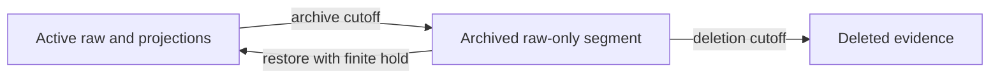

# Storage Maintenance

Agentmetry stores accepted OTLP payloads in a lossless SQLite journal and
derives dashboard projections from that journal. The database is local to the
application profile and must be treated as sensitive because telemetry can
contain prompts, responses, tool details, file paths, and command output.

## Automatic migration

On startup, Agentmetry checks the database storage generation before accepting
new telemetry. Older databases are migrated while the dashboard displays
maintenance progress. The migration rebuilds current projections from the
journal, verifies restored payload hashes and derived row counts, and preserves
the original database if validation fails.

Fresh installs and databases already at the current generation skip replay.

---

## Automatic retention

The Settings screen stores one local receive-time policy. Both values are exact
24-hour-day intervals between 1 and 36,500 days. The deletion interval must be
greater than the archive interval. Disabling the policy stops automatic
transitions without changing existing archives.

Agentmetry evaluates a fixed cohort at startup and every 24 hours while it is
running. An Active export reaches the archive cutoff when its recorded receive
time is at least the configured number of days old. Data received during a
maintenance cycle waits for a later cycle.



An archive segment contains exact pre-normalization OTLP protobuf and replay
metadata. One tar archive is compressed as a single zstd stream across multiple
exports. Observations and search/display projections are removed in the same
SQLite publication transaction, so archived data is absent from Web, HTTP, and
MCP queries.

The sibling directory `<database path>.archives` stores segment files. The
directory mode is `0700` and segment file mode is `0600` when the platform
honors POSIX permissions. Treat the directory as sensitive telemetry data.

Restore accepts a current segment or a half-open receive-time interval
`[start, end)`. Agentmetry verifies the segment, runs the current normalizer,
and atomically republishes the selected exports with their original export IDs.
The API acknowledges a restore only after its complete affected set has been
durably claimed; preparation then continues asynchronously and is visible in
retention operation status. A required finite hold begins at complete
publication and prevents immediate re-archiving. A partial restore rewrites
every unselected export into a verified replacement segment. A normalization
failure restores intact raw data as Active with a failed normalization outcome
and no derived rows; corrupt or unsupported protobuf fails the whole restore.

Deletion applies only to a whole current archive segment after every member
reaches the deletion cutoff. Active data is never deleted directly. Deleted
content cannot be restored; the database retains only non-content evidence of
the authorizing policy and prior segment.

The capacity panel reports operating-system allocated bytes for the database,
WAL, current archive, and staging files. It also reports mutually exclusive
SQLite page allocations for Active raw exports, normalized observations, and
query/display projections, with freelist pages shown separately as reusable
database space. Archive logical compressed size is distinct from filesystem
allocation. Estimated archive and restore peak additions produce a warning when
they exceed the containing filesystem's available bytes. These measurements do
not trigger deletion and do not change cutoff eligibility. A current archive
allocation includes only a `.tar.zst` file referenced by a current catalog row;
installed but unpublished files and `.candidate`/`.deleting` files count as
staging. The archive estimate is twice the smaller of the eligible raw bytes and
the 256 MiB per-segment input limit. The restore estimate is twice the summed
original bytes of the current segments (or of the claimed scope for restore
admission), covering a raw working copy plus publication work. These are
conservative admission estimates rather than a promise of final database size;
any later filesystem failure rolls back the atomic publication.

---

## Manual compaction

Quit every Agentmetry process that uses the target database, then run:

```sh
agentmetry -compact-database -database /absolute/path/to/agentmetry.db
```

The command streams the journal into a sibling candidate database, regenerates
current semantic projections, verifies every restored payload and SHA-256 hash
plus derived row counts, and replaces the source only after validation passes.
Lifecycle policy, archive references, stable export identities, operation
history, and terminal deletion evidence are copied into the validated database.
Do not interrupt the process intentionally during replacement.

---

## Interrupted replacement

A durable manifest records the replacement phase. On the next launch,
Agentmetry examines the source, candidate, and backup files and completes or
rolls back the replacement according to the last verified phase. Do not rename
or delete these sibling files before recovery has run.

Archive lifecycle recovery also runs before query and ingest services become
ready. It removes unreferenced candidates, fails an interrupted unpublished
restore without changing Archived data, finishes post-publication restore file
cleanup, rolls back reversible deletion staging, and finishes deletion after
its durable point of no return. SQLite decision evidence and installed/staged
file presence determine the recovery action.

---

## Backup and restore

Stop Agentmetry before copying a database, its SQLite sidecar files, and its
`<database path>.archives` directory. Keep those files and any sibling migration
manifest together. Restore them only to a trusted local path, then start the
current Agentmetry release and allow its recovery and migration gates to
complete before sending telemetry.

Direct SQL writes are unsupported. The physical schema is internal and may
change between releases; use the product APIs and documented import/export
surfaces for integrations.
