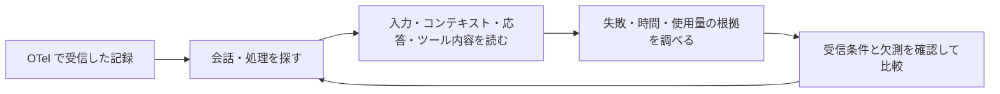

# Langfuse 分析：agentmetry に取り込む価値と優先順位

調査日：2026-09-03。agentmetry の調査対象は `ed6e5038d82d67298c8a569ad67f955caadd5cc9`。以下は採用判断の提案であり、実装済みの仕様や効果測定の結果ではない。

## 1. 採用方針

**agentmetry は、OTel 経由で受信した情報から、何が起きたかを調べる Telemetry ツールとする。** 入力プロンプト、参照した AGENTS.md・Skill・ファイル等のコンテキスト、応答、ツールの入出力も、受信した内容は閲覧・検索・関連づけの対象になる。採用候補は、既存の会話・手戻り分析・MCP を使い、問題のある実行とその根拠を調べやすくする改善に絞る。

この分析では、Git・リポジトリ・設定ファイル・transcript の別途取得、プロンプトの版管理、成果評価の入力・管理を対象外とする。受信していない内容は未報告として示す。送信元の既存 OTel 設定で本文の送信を有効にすることは、この範囲に含む。

取り込み方針は、利用者の判断への効果、既存データで成立する範囲、追加の運用負担で決める。

| 判断 | 対象 | 理由 |
| --- | --- | --- |
| 最初に改善する | 失敗の根拠への移動、本文の読みやすさ、Web/MCP の分析結果の一致 | 既存情報を活用でき、現在の調査手順を直接改善する |
| 次に検証する | 調査条件の保存、受信した本文の読み分け | 問題の再発見と、入力から処理結果までの調査を支える |
| 保存済みデータで検証する | span event の投影と本文・処理の対応づけ | 受信済みだが画面で利用できない情報を活用する |
| 調査対象の規模に応じて判断する | 長い trace の概要・拡大・絞り込み | 大量の受信記録から対象区間を探せるようにする |

採用候補が支える調査の流れを示す。

agentmetry の土台：[手戻り分析](https://github.com/kotokumu/agentmetry/blob/main/internal/query/rework.go)、[前後比較](https://github.com/kotokumu/agentmetry/blob/main/web/src/model/rework-comparison.ts)、[Codex の本文収集仕様](https://github.com/kotokumu/agentmetry/blob/main/docs/source-telemetry/codex.md)、[Claude Code の本文収集仕様](https://github.com/kotokumu/agentmetry/blob/main/docs/source-telemetry/claude-code.md)。

---

## 2. 調査方法と証拠の範囲

| 証拠 | 確認した内容 | この調査では判断できないこと |
| --- | --- | --- |
| Langfuse の公式資料・公開ソース | 観測、検索、評価、プロンプト管理、構成、Codex/Claude 連携 | 全プラン・全バージョンで同一機能が使えるか、運用性能の優劣 |
| Langfuse の公開画面の実操作 | セッションから trace の Peek を開く、generation を選ぶ、Tree/Timeline を切り替える、詳細を拡大する | 非公開プロジェクトの一覧操作、保存ビューの作成、評価の書き込み、実験の作成 |
| agentmetry の現行コード | データモデル、検索・遷移、手戻り分析、Web/MCP、設定 fingerprint | 実際の利用者がどれだけ速く正確に調査できるか |
| agentmetry のローカル画面 | 現行ソースをビルドし、一時 DB の合成データで会話・比較・根拠リンクの宛先・trace を確認 | 実業務の改善効果、大量データの性能、複数エージェントの実測 |

Langfuse は[公式の公開セッション](https://cloud.langfuse.com/project/clkpwwm0m000gmm094odg11gi/sessions/lf.docs.conversation.TL4KDlo)を使用する。記録内容は 2024 年の 2 trace で、表示は調査時点の UI である。公開された古い記録であることと、現在の画面操作を確認できることを分けて扱う。

agentmetry の合成データは 2 会話・計 23 span。1 回失敗して成功する例と、同じ失敗を 4 回繰り返して成功する例を投入する。後者は「4 個の反復エピソード」ではなく「4 回の失敗を含む 1 エピソード」である。モデル・設定・使用量は検証用の値であり、設定変更の効果を示すものではない。Web の TypeScript/Vite ビルドと Go ビルドは成功する。

Langfuse の公式サイトには v4 公開の告知がある一方、[Filter Search Bar](https://langfuse.com/docs/observability/features/filter-search-bar)には Cloud の preview 条件が残る。資料の記載、公開画面での確認、採用案を区別する。アクセシビリティ適合、描画速度、同一入力を両製品へ送る収集比較は未測定である。

---

## 3. プロダクトの 6 軸による分析

### 3-1. 利用者と、支援する判断

| | Langfuse | agentmetry |
| --- | --- | --- |
| 主な対象 | LLM アプリケーションやエージェントの実行、プロンプト、評価 | Claude Code/Codex によるローカルの開発作業 |
| 典型的な判断 | どの入力・処理・プロンプト版で品質、時間、コストが変わるか | どの入力に対して何が起き、どこで失敗・待ち・反復が生じたか |
| 制御できる範囲 | アプリ側の計装やプロンプト取得を組み込める | 既存エージェントが OTel 経由で送る情報に依存する |
| 採用時の含意 | 実行の階層・本文・指標を関連づける構造が参考になる | 観測された作業過程を説明し、成果の判定は利用者に委ねる |

Langfuse には[Codex 連携](https://langfuse.com/integrations/developer-tools/codex)と[Claude Code 連携](https://langfuse.com/integrations/developer-tools/claude-code)もあるため、利用対象は重なる。差別化の候補は「コーディングエージェントも表示できること」だけでなく、ローカルで導入でき、開発時の反復を根拠付きで説明できることである。[agentmetry の製品範囲](https://github.com/kotokumu/agentmetry/blob/main/README.md)

### 3-2. 必要なデータと欠測

Langfuse 本体も OpenTelemetry に対応する。専用の Codex/Claude 連携では Stop hook を使って transcript を読み、観測データへ変換する。**通信方式と、元データを集める方法は別の比較軸である。** [OTel 連携](https://langfuse.com/integrations/native/opentelemetry)

agentmetry は traces/logs/metrics を HTTP と gRPC で受け、元の protobuf を保存してから検索用のデータへ変換する。Codex の対応対象には tool の引数・出力を含むログもある。「OTLP だから本文を得られない」とは判断できない。[受信処理](https://github.com/kotokumu/agentmetry/blob/main/internal/ingest/otel/receiver.go)、[Codex の収集仕様](https://github.com/kotokumu/agentmetry/blob/main/docs/source-telemetry/codex.md)

採用前に区別すべき状態は次のとおりである。

| 状態 | agentmetry での意味 | 推奨する扱い |
| --- | --- | --- |
| 値が 0 | 報告された値がゼロ | 現行の欠測との区別を維持する |
| 元の情報が報告されていない | outcome や token 内訳がない | 不足する情報と、結論への影響を調査箇所に表示する |
| raw にあるが投影していない | 現行の `NormalizeTraces` は span event を走査しない | 保存済み情報の利用価値を確認する |
| 保存済み投影の一部だけを分析 | 分析対象の読み取り範囲が限定される | 読んだ件数と範囲を表示する |
| 保存済み投影の全件を分析 | `complete retained projection` | 元の実行を漏れなく収集した保証とは説明しない |

根拠：[TokenUsage](https://github.com/kotokumu/agentmetry/blob/main/internal/canonical/model.go)、[trace の正規化](https://github.com/kotokumu/agentmetry/blob/main/internal/ingest/otel/normalize.go)、[分析範囲](https://github.com/kotokumu/agentmetry/blob/main/internal/query/analysis.go)、[手戻りの根拠収集率](https://github.com/kotokumu/agentmetry/blob/main/internal/query/rework.go)。

transcript 連携には追加情報と維持負担の両方がある。Langfuse の Codex 実装は `call_id` で tool の入出力を結合し、token event から model step を復元する。子の記録が見つからない場合の省略、終了時刻の補完、usage の不整合時の除外もある。グラフ上の時刻がすべて直接計測値とは限らない。[parser](https://github.com/langfuse/codex-observability-plugin/blob/main/plugins/tracing/src/parse.ts)、[trace 変換](https://github.com/langfuse/codex-observability-plugin/blob/main/plugins/tracing/src/trace.ts)

agentmetry の検証対象は、受信・保存済みの OTel データと現在の投影との差である。本文・対応関係・時刻・重複を確認し、span event などの未利用情報を活用する。Langfuse の transcript 連携は収集経路の比較資料として扱い、agentmetry への採用候補には含めない。

### 3-3. データの意味と関係

Langfuse は session、trace、observation を分ける。専用 Codex plugin はターン、モデル処理、tool を関連づける。agentmetry にも source と run ID の組、PromptID、UsageID、span の親子、エージェントの親子がある。データ階層の新設より、既存の identity がどれだけ報告され、画面から辿れるかが焦点になる。[Langfuse データモデル](https://langfuse.com/docs/observability/data-model)、[agentmetry のモデル](https://github.com/kotokumu/agentmetry/blob/main/internal/canonical/model.go)

特に、次の関係は同一視しない。

| 関係 | 意味 | 表示への含意 |
| --- | --- | --- |
| エージェントの親子 | 誰が誰を起動・委譲したか | 現行 Agent topology の意味を維持する |
| span の親子・時系列 | どの処理に含まれるか、いつ動いたか | 待ち時間や並列処理の調査に使う |
| 開発タスクと会話 | 利用者の目標をどの実行が扱ったか | 1 会話が 1 タスクの完結を表すとは決めない |
| 入力プロンプトとモデルへの全入力 | ユーザーが入力した本文と、モデルが受け取った文脈全体は異なる | 受信した本文の種類を表示し、未受信の system prompt や履歴まで再現したと見せない |

Langfuse の Agent Graph は timing と nesting から処理間の関係を推論する。agentmetry の `parentAgentId` による関係とは対象が異なる。名称を理由に現行グラフを置き換えるべきではない。[Agent Graphs](https://langfuse.com/docs/observability/features/agent-graphs)、[Agent topology の実装](https://github.com/kotokumu/agentmetry/blob/main/web/src/components/agent-tree.ts)

### 3-4. 調査から行動までの導線

Langfuse の公開画面では、元のセッションを残した Peek 内で trace を開き、generation を選ぶとその本文へ進める。幅が不足する場合は拡大表示へ切り替えられる。参考になるのは、一覧・選択対象・本文の関係を保ったまま読む設計である。[Peek View の仕様](https://langfuse.com/changelog/2025-03-21-table-peek-view)

agentmetry には既に会話一覧と詳細の併置、検索状態の URL 保存、戻る際のエージェント選択・スクロール位置の保持がある。一方、手戻りの `Open first failed attempt` は trace ID だけを渡す。エピソードには span ID があるが、宛先で該当 span を選択する情報に使っていない。画面ではエラー行が自動展開されるため本文は読めるが、複数の失敗がある場合に「この指標の根拠」を一意に示せない。[根拠リンク](https://github.com/kotokumu/agentmetry/blob/main/web/src/components/rework-summary.ts#L95)、[エピソード型](https://github.com/kotokumu/agentmetry/blob/main/web/src/model/telemetry.ts#L21)、[ナビゲーション](https://github.com/kotokumu/agentmetry/blob/main/web/src/app/navigation.ts)

もう一つの具体的な差は Web と MCP にある。

| | 現行の出力 |
| --- | --- |
| Web Before/After | 5 個の正規化された診断指標、分母、欠測、harness の比較状態 |
| MCP `compare_runs` | 経過時間、activity 数、agent 数、token 総数、cost の差 |
| MCP `analyze_rework` | 手戻りと根拠情報。harness 情報はこの出力に含まれない |

推奨は、画面とエージェントが同じ観測指標・分母・不足情報を参照できる共通契約である。harness の差は現状の比較事実として記載するが、設定管理の拡張は提案しない。[Web の計算](https://github.com/kotokumu/agentmetry/blob/main/web/src/model/rework-comparison.ts#L96)、[MCP の出力型](https://github.com/kotokumu/agentmetry/blob/main/internal/transport/mcpserver/server.go#L175)、[MCP の比較](https://github.com/kotokumu/agentmetry/blob/main/internal/transport/mcpserver/server.go#L608)

### 3-5. 指標の妥当性と入力・コンテキストの扱い

Langfuse は Score による成果評価と、プロンプトの版管理を持つ。これらは今回の採用対象に含めない。agentmetry の手戻り・失敗率は観測された作業過程の指標として扱う。テスト成功の報告から要求達成を推定せず、意図した TDD の Red を低品質と判定しない。[Scores](https://langfuse.com/docs/evaluation/scores/data-model)、[版管理](https://langfuse.com/docs/prompt-management/features/prompt-version-control)

**入力プロンプトの本文は、OTel 経由で受信した実行記録として表示する。** 調査済みの source 仕様では、Codex の user prompt ログと Claude Code の user prompt ログ・interaction span に、設定に応じて本文が含まれる。本文の送信が無効な場合は秘匿・未報告の状態になる。送信元とバージョンによって得られる内容が異なるため、全入力が常に揃うとは扱わない。[Codex の本文と設定](https://github.com/kotokumu/agentmetry/blob/main/docs/source-telemetry/codex.md)、[Claude Code の本文と設定](https://github.com/kotokumu/agentmetry/blob/main/docs/source-telemetry/claude-code.md)

採用候補は「どの入力・コンテキストのもとで、どの応答・ツール実行・失敗があったか」を、受信した ID と時刻の根拠で辿る表示である。AGENTS.md、Skill、system/developer 指示、参照ファイル、tool 結果などは、OTel に含まれる範囲で対象とする。これらが各送信元から現在どこまで送られるかは、すべてを確認できているわけではない。

| OTel で受信した証拠 | 表示できること | 表示から断定しないこと |
| --- | --- | --- |
| 指示やコンテキストの本文と種類 | その内容を受信したこと。記録された種類・出典 | 受信していない指示や履歴を含む入力全体 |
| AGENTS.md 等の参照先・読み込み記録 | そのファイルを参照・読み込みした記録 | 本文がなければ内容は不明。モデルへの投入は未確認 |
| ファイルの読み込み結果・tool 出力 | その処理で得られた内容 | 後続のモデル呼び出しに全内容が渡ったこと |
| モデル呼び出しへの入力内容と対応 ID | その呼び出しに入力されたと報告された内容 | 省略・切り詰めがある場合の完全な文脈 |

本文の種類、対応関係の不足、送信元による省略を表示する。agentmetry 自身がファイルを読み出して未受信の内容を補完する処理や、入力本文を管理対象のプロンプト版へ変換する処理は追加しない。

現行 Before/After の候補条件は同じ source と時間の非重複であり、タスク・モデルの一致を保証しない。比較は観測値の差として示し、受信している条件と欠測を併記する。複数回を集計しても、その差だけで因果関係や生産性は確定しない。[比較の実装](https://github.com/kotokumu/agentmetry/blob/main/web/src/model/rework-comparison.ts)

### 3-6. 導入・維持コスト

| 対象 | 確認事実 | 採用への含意 |
| --- | --- | --- |
| 実行基盤 | Langfuse の self-host は Web/Worker、Postgres、ClickHouse、Redis/Valkey、S3/Blob を使う。agentmetry は Go、SQLite、埋め込み Web を中心に動く | ローカルで閉じる UI・分析の改善を先に進める |
| collector の追随 | Langfuse の Codex parser は新旧イベント形式を扱う。docs と plugin README に hook 設定キーの記載差もある | transcript の別途収集は対象外。既存 OTel の source profile の追随に範囲を絞る |
| 重複排除 | Langfuse の sidecar は完了ターンを記録するが、書き込みは best effort | 受信済み OTel の投影拡張でも logs/traces 間の usage 重複、再送、途中終了を検証する |
| cost の根拠 | Langfuse は報告値とモデル価格に基づく推定を扱う。agentmetry の `CostUSD` には由来・価格版の専用 field がない | 受信した金額とその由来を分かる範囲で表示する。外部価格の収集・管理は提案しない |

根拠：[self-hosting](https://langfuse.com/self-hosting)、[agentmetry の構成](https://github.com/kotokumu/agentmetry/blob/main/docs/architecture.md)、[Codex plugin](https://github.com/langfuse/codex-observability-plugin)、[sidecar](https://github.com/langfuse/codex-observability-plugin/blob/main/plugins/tracing/src/sidecar.ts)、[token/cost](https://langfuse.com/docs/observability/features/token-and-cost-tracking)、[agentmetry の cost 処理](https://github.com/kotokumu/agentmetry/blob/main/internal/canonical/tokens.go)。構成の差から速度やメモリ消費の優劣は断定しない。cost の由来の不足も、現行金額の誤りを実証したものではない。

---

## 4. UI の 7 軸による分析

### 4-1. 情報設計

Langfuse はセッション、trace、observation、評価、プロンプトを移動して調べる構造を持つ。agentmetry は会話を中心に整理され、この用途に合う。現行の会話詳細は「使用量 → 手戻り → 前後比較 → token 内訳・エージェント関係 → 実行本文」の順に配置される。通常幅では token 内訳とエージェント関係が横に並ぶ。合成データの画面でも本文より多数の診断カードが先に現れる。[現行の表示順](https://github.com/kotokumu/agentmetry/blob/main/web/src/components/conversation-workspace.ts#L208)

**提案：会話内に「実行を読む」「手戻り」「比較」の切替または目次を置く。** 選択した会話・エージェント・根拠を保ったまま目的を切り替える。全てを初期表示する必要性は、利用者が最初に行う調査で検証する。

### 4-2. レイアウトと情報密度

Langfuse の Peek は文脈を保つ一方、狭い表示では階層名や本文が詰まる。公開画面では拡大表示がその補助になる。agentmetry は既に会話一覧 264px と詳細の 2 列を持ち、950px 以下では一覧・詳細を切り替える。実行表は 8 列・最小幅 1160px、trace は最小幅 900px で、幅の制約は実装上も存在する。[workspace](https://github.com/kotokumu/agentmetry/blob/main/web/src/components/conversation-workspace.ts#L74)、[実行表](https://github.com/kotokumu/agentmetry/blob/main/web/src/components/activity-table.ts#L30)、[waterfall](https://github.com/kotokumu/agentmetry/blob/main/web/src/components/trace-waterfall.ts#L27)

**提案：実行行には判断に必要な概要を置き、選択した 1 件の本文と詳細を隣接パネルで読む。** OTel で受信した入力プロンプト、参照コンテキスト、応答、ツール内容を、種類が識別できる範囲で読み分ける。コンテキストには受信した出典と、参照・読み込み・モデル入力のどの証拠かを添える。狭い画面ではパネルを切り替える。現行データは内容を常に input/output の別 field で持つわけではないため、Langfuse と同じ入出力表示を無条件には約束しない。

### 4-3. 視覚デザインと読みやすさ

agentmetry の暗色・ミント色は一貫する。一方、大きな見出し、背景グリッド、カードの発光、選択表示に同系色が使われる。実行表の文字は `.78rem`、バッジは `.58rem` で、ブランド上の強調と調査に必要な情報の大きさに差がある。[app styles](https://github.com/kotokumu/agentmetry/blob/main/web/src/app/agentmetry-app.ts#L75)、[table styles](https://github.com/kotokumu/agentmetry/blob/main/web/src/components/activity-table.ts#L48)

Langfuse の公開 trace 画面は、選択対象、種別、メタデータ、本文が領域で分かれる。agentmetry への提案は、詳細画面の大見出し・常時装飾を抑え、失敗・選択・欠測・本文を先に見つけられる階層にすることである。色の模写ではなく、強調の役割を整理する。読み取り速度やコントラスト比の改善は未測定である。

### 4-4. 検索・絞り込み・再調査

Langfuse は構造化条件、全文検索、候補値、URL 保存を持ち、Saved Views は条件に加えて列や並び方も保持する。agentmetry は時間範囲・source・自由文・URL 保存が既にある。差は検索の有無ではなく、「失敗」「長時間」「特定モデル/ツール」という調査目的を条件にできる範囲にある。[Filter Search Bar](https://langfuse.com/docs/observability/features/filter-search-bar)、[Saved Views](https://langfuse.com/changelog/2025-05-20-save-table-views)、[現行フィルタ](https://github.com/kotokumu/agentmetry/blob/main/web/src/components/session-filter.ts)

**提案：まず失敗・所要時間・モデル等の少数の条件と、条件の保存を検証する。** 会話一覧には、ID に加えて日時や取得済みの使用量など、識別に役立つ情報を選ぶ。自然言語による検索生成は、この改善の前提ではない。

### 4-5. 時間・階層・並列の可視化

Langfuse は Tree/Timeline を切り替えられる。Responsive Timeline の公式仕様では、縮小時は色と形、拡大時は名前を使って読み分ける。公開画面でも Timeline への切替、ラベル表示の切替、拡大の操作部を確認できる。[Trace View](https://langfuse.com/changelog/2025-03-19-new-trace-view)、[Responsive Timeline](https://langfuse.com/changelog/2026-08-28-responsive-timeline)

agentmetry の waterfall には時間バー、親子の字下げ、log/metric のマーカー、欠損親、エラーの自動展開、200 件単位の表示窓がある。[waterfall の実装](https://github.com/kotokumu/agentmetry/blob/main/web/src/components/trace-waterfall.ts)

**提案：長い trace の全体概要と拡大、種別・エラーの絞り込みを検討する。** 全体図が未取得データを含む場合は、取得済み部分だけを完全な形として描かない。処理時間の重なりと、依存関係・原因を区別して表示する。優先度は実際に 200 件を超える trace を調べる頻度で決める。

### 4-6. 状態表示とアクセシビリティ

agentmetry は Loading/failed/empty、Retry、Not reported、Not applicable、Not connected、Unavailable、Partial evidence を区別する。focus 移動、`aria-live`、reduced motion への対応もある。欠測をゼロに見せない点は維持する価値が高い。[状態処理](https://github.com/kotokumu/agentmetry/blob/main/web/src/components/conversation-workspace.ts#L171)、[欠測表現](https://github.com/kotokumu/agentmetry/blob/main/web/src/presentation/missing-data.ts)、[app](https://github.com/kotokumu/agentmetry/blob/main/web/src/app/agentmetry-app.ts)

Langfuse の公開 trace には、ログレベル条件で非表示の observation があることを示す案内が出る。「非表示」「未取得」「存在しない」を分けて伝える参考になる。Filter Search Bar も不完全な式をそのまま適用しない。[検索の状態仕様](https://langfuse.com/docs/observability/features/filter-search-bar)

**提案：内部用語を、利用者が判断できる説明へ直す。** 例えば retained projection の完全性は「分析用に変換した保存済み記録は、全件分析済み」、変更取り消しが判定できない状態は「ファイルの変更前後を取得していないため判定できない」と説明する。これは文言案である。キーボードだけの一連の調査、200% 拡大、スクリーンリーダー、コントラストは別途確認する。

### 4-7. 調査から根拠確認への操作

Langfuse は対象にコメントや評価を残せる。コメントは本文の選択範囲にも関連づけられ、内容変更で参照が外れた状態も扱う。[Comments](https://langfuse.com/docs/observability/features/comments)

agentmetry は根拠リンクと Before/After を持つが、手戻りエピソードは上位 3 件だけを表示し、残りは analysis API の案内になる。[手戻り表示](https://github.com/kotokumu/agentmetry/blob/main/web/src/components/rework-summary.ts#L95)

**提案：全エピソードを画面から調査でき、根拠の該当 span と受信済みの本文に到達できるようにする。** 本文の検索、根拠へのリンク、調査条件を保った往復を優先する。成果評価・コメントの入力管理や設定変更の記録は採用対象に含めない。

---

## 5. 採用候補の優先順位と検証方法

工数は変更範囲に基づく相対的な見立てで、日数見積もりではない。検証方法は今後の提案であり、実施結果ではない。

| 順位 | 最小の取り込み候補 | 期待する変化 | 依存・負担 | 採否を決める検証 |
| --- | --- | --- | --- | --- |
| 1 | 根拠 span への移動と全エピソードの表示 | 指標の根拠を再探索せずに読める | 小〜中。既存 ID を活用。遷移先の選択状態が必要 | 複数失敗、4 件以上のエピソード、表示窓の外の span で、対象本文を特定して元の位置へ戻れるか |
| 2 | Web/MCP の比較契約を揃える | 人とエージェントが同じ根拠で比較できる | 小〜中。収集追加なし。計算と意味の共通化 | 同じ 2 会話で 5 指標・分母・欠測・partial の結果が一致するか |
| 3 | 目的別表示と実行の隣接詳細、視覚階層の整理 | 受信した入力・コンテキスト・ツール本文へ到達しやすくなる | 中。既存 activities を起点に、コンテキストは受信内容と投影の対応を確認。狭幅時の切替が必要 | 「失敗直前の指示と tool 内容」を探す正答率・操作数を現行と比較。参照先だけ・本文あり・モデル入力の記録ありを正しく区別できるか |
| 4 | 構造化フィルタと保存条件 | 繰り返し行う調査の条件を再現できる | 中。一覧用集計・API の条件対応が必要 | 「遅く、失敗した実行」を特定し、保存・再読込で同じ集合を得られるか |
| 5 | 収集範囲・出自の表示と、保存済み event 利用の試験 | 未観測と成功を区別し、受信済みの情報を活用できる | 表示は小〜中、追加投影は中。別の収集経路は追加しない | 現行投影と受信済み raw で本文、対応関係、時刻、usage 重複を比較 |
| 6 | 長い trace の概要・拡大・絞り込み | 並列処理や長い待ち区間を把握できる | 中〜大。未取得範囲の扱いが必要 | 12/200/1200 件の例で最長区間・並列箇所を正しく指せるか |

最初の改善単位は順位 1〜3 が妥当である。根拠へ辿る正確さ、受信した入力・処理内容を読む負担、エージェントからの利用という、同じ調査行動を支える改善になる。

---

## 6. 今回の採用対象外

| 対象 | 対象外とする理由 |
| --- | --- |
| Git・リポジトリ・設定ファイル・transcript の別途取得 | agentmetry が受信していない情報を集める責務が増える |
| プロンプト・設定の編集、版管理、配信 | OTel で記録された入力の閲覧を超え、実行設定の管理を担う |
| 成果評価、コメント入力管理、LLM judge、レビューキュー | 観測記録の調査を超え、評価の作成と運用を担う |
| 課題 dataset、実験 runner、外部評価基盤への連携 | 課題・実行環境・評価結果を管理する責務が増える |

既存の fingerprint や E2E の存在は調査事実として扱う。このレポートはそれらの削除を指示するものではなく、Langfuse から新たに取り込む候補の範囲を定める。

UI パターンや関連づけの考え方は、現行の agentmetry に合わせて独自に実装する案である。Langfuse のコードを直接移植する場合の依存関係・ライセンス確認は、この分析には含まない。
