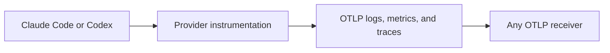

# Provider OpenTelemetry Data Specifications

- Status: Current
- Last reviewed: 2026-08-17

This directory contains dated data specifications for the OpenTelemetry data
exported by Claude Code and Codex. It describes provider output only. It does
not describe whether Agentmetry recognizes, stores, or normalizes a field.

---

## 1. Document set

| Provider | Data specification |
| --- | --- |
| Claude Code | [Claude Code OpenTelemetry data specification](claude-code.md) |
| Codex | [Codex OpenTelemetry data specification](codex.md) |

Each provider specification owns its source inventory. Its source-reference
table records the requested and resolved URLs, retrieval time, content type,
SHA-256, and any pinned implementation commit needed by an updater.

Agentmetry compatibility is a separate product specification. It is not part
of these provider snapshots.

---

## 2. Specification boundary

Each provider document specifies the data at the `OTLP` boundary:

- signal and OTLP container;
- resource and instrumentation-scope metadata;
- record, data-point, span, and span-event names;
- provider-defined attributes, values, and presence conditions;
- metric instrument, unit, and dimensions;
- span hierarchy and status behavior;
- content gates and version gates;
- facts the upstream sources do not define.

The documents do not define downstream recognition rules, canonical fields,
deduplication, storage, query projection, or product support.

---

## 3. Common document format

Both provider specifications use these sections in this order:

1. Snapshot metadata
2. Source references
3. OTLP export contract
4. Resource and scope schema
5. Log record schema
6. Metric schema
7. Trace schema
8. Content controls
9. Completeness and stability

Schema tables use these columns where applicable:

| Column | Meaning |
| --- | --- |
| OTLP location | Protobuf path or entity that carries the value |
| Name or field | Provider-emitted name or attribute key |
| OTLP type | OTLP value or instrument type established by the source |
| Provider encoding | Provider-specific serialization when it differs from the OTLP type |
| Presence | Always, conditional, or unspecified by the provider |
| Value/unit/meaning | Closed values, units, or provider semantics |
| Gate/condition | Configuration, version, platform, or runtime condition |
| Evidence | Published, Implemented, or Not established |
| Source | Stable source ID from section 2 |

`Unspecified` means the upstream source does not establish the property. It is
not an inferred default.

---

## 4. Evidence rules

| Label | Meaning |
| --- | --- |
| Published | The provider documentation names and describes the data |
| Implemented | Pinned first-party source establishes emission details not published as a stable contract |
| Not established | The upstream sources do not establish the property; an authored example is not a captured payload |

Provider documentation takes precedence over implementation observations.
Implementation observations are pinned to a commit and never presented as a
public compatibility promise.

---

## 5. Update rules

- Parse each provider document's source-reference table as its source
  inventory, fetch every captured source, and compare its SHA-256 with the
  stored hash.
- Update both provider documents with the same section and column structure.
- Preserve provider field names and closed value sets exactly.
- Record unknown type, requiredness, temporality, or hierarchy as
  `Unspecified`; do not infer it from downstream behavior.
- Label implementation-derived facts and constructed examples explicitly.
- Update the snapshot date only after the complete referenced scope is
  reviewed.
