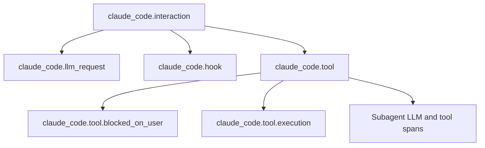

# Claude Code OpenTelemetry Data Specification

---

## 1. Snapshot metadata

| Field | Value |
| --- | --- |
| Provider | Claude Code |
| Snapshot date | 2026-08-17 |
| Evidence boundary | Official published documentation |
| Primary source | `CLAUDE-MONITORING` |

---

## 2. Source references

| ID | Authority | Requested URL | Final URL | Retrieved | Content-Type | SHA-256 | Pinned commit | Scope |
| --- | --- | --- | --- | --- | --- | --- | --- | --- |
| `CLAUDE-MONITORING` | Anthropic official documentation | [Monitoring Markdown](https://code.claude.com/docs/en/monitoring-usage.md) | `https://code.claude.com/docs/en/monitoring-usage.md` | `2026-08-17T18:06:14+09:00` | `text/markdown` | `37897e0deab05447a92714045067fed5b43e703f9b4d079c6bc6d5fe89b51423` | — | Export configuration, OTLP signals, attributes, metrics, log events, traces, and privacy controls |

The hash covers the exact bytes retrieved from the final URL.

---

## 3. OTLP export contract

| Signal | OTLP container | Gate/condition | Exporter and protocol | Default interval | Evidence | Source |
| --- | --- | --- | --- | --- | --- | --- |
| Logs | `ExportLogsServiceRequest.resource_logs` | `CLAUDE_CODE_ENABLE_TELEMETRY=1` and `OTEL_LOGS_EXPORTER=otlp` | `grpc`, `http/json`, or `http/protobuf`; no protocol default | 5,000 ms | Published | `CLAUDE-MONITORING` |
| Metrics | `ExportMetricsServiceRequest.resource_metrics` | `CLAUDE_CODE_ENABLE_TELEMETRY=1` and `OTEL_METRICS_EXPORTER=otlp` | `grpc`, `http/json`, or `http/protobuf`; no protocol default | 60,000 ms | Published | `CLAUDE-MONITORING` |
| Traces | `ExportTraceServiceRequest.resource_spans` | `CLAUDE_CODE_ENABLE_TELEMETRY=1`, `CLAUDE_CODE_ENHANCED_TELEMETRY_BETA=1` (or `ENABLE_ENHANCED_TELEMETRY_BETA=1`), and `OTEL_TRACES_EXPORTER=otlp` | `grpc`, `http/json`, or `http/protobuf` | 5,000 ms | Published | `CLAUDE-MONITORING` |

The shared endpoint is `OTEL_EXPORTER_OTLP_ENDPOINT`. Per-signal endpoint,
protocol, and header variables override or extend the shared settings. HTTP
uses `/v1/logs`, `/v1/metrics`, and `/v1/traces` in the documented examples.
For HTTP protocols, v2.1.212 and later sends `Content-Length`.

Agentmetry optionally reads the allowlisted request metadata
`x-agentmetry-harness-scope`, `x-agentmetry-harness-fingerprint`, and
`x-agentmetry-harness-label` from the documented OTLP header configuration.
These fields are an Agentmetry extension, not Claude Code record attributes;
see [Reported harness fingerprint relationship](../design/harness-config-correlation.md).

---

## 4. Resource and scope schema

### 4-1. Resource attributes

| OTLP location | Name or field | OTLP type | Provider encoding | Presence | Value/unit/meaning | Gate/condition | Evidence | Source |
| --- | --- | --- | --- | --- | --- | --- | --- | --- |
| `Resource.attributes` | `service.name` | unspecified | — | Always | `claude-code`; `claude-code-desktop` for Desktop Code-tab sessions | Runtime | Published | `CLAUDE-MONITORING` |
| `Resource.attributes` | `service.version` | unspecified | — | Always | Claude Code version; Desktop app version for Desktop Code-tab sessions | Runtime | Published | `CLAUDE-MONITORING` |
| `Resource.attributes` | `os.type` | unspecified | — | Always | OS type such as `linux`, `darwin`, or `windows` | None | Published | `CLAUDE-MONITORING` |
| `Resource.attributes` | `os.version` | unspecified | — | Always | OS version | None | Published | `CLAUDE-MONITORING` |
| `Resource.attributes` | `host.arch` | unspecified | — | Always | Architecture such as `amd64` or `arm64` | None | Published | `CLAUDE-MONITORING` |
| `Resource.attributes` | `wsl.version` | unspecified | — | Conditional | WSL version | WSL only | Published | `CLAUDE-MONITORING` |
| `Resource.attributes` | User-defined keys | OTLP scalar | — | Conditional | Values from `OTEL_RESOURCE_ATTRIBUTES` | Configuration and managed policy | Published | `CLAUDE-MONITORING` |

### 4-2. Instrumentation scope

| OTLP location | Name or field | OTLP type | Provider encoding | Presence | Value/unit/meaning | Gate/condition | Evidence | Source |
| --- | --- | --- | --- | --- | --- | --- | --- | --- |
| Provider meter name | Meter name | string | — | Metrics | `com.anthropic.claude_code`; the source does not explicitly state its serialization into `ScopeMetrics.scope.name` | None | Published | `CLAUDE-MONITORING` |
| `ScopeLogs.scope` | Name and version | unspecified | — | Unspecified | The source does not publish the log scope | None | Not established | `CLAUDE-MONITORING` |
| `ScopeSpans.scope` | Name and version | unspecified | — | Unspecified | The source does not publish the trace scope | Beta tracing | Not established | `CLAUDE-MONITORING` |

### 4-3. Shared record and data-point attributes

These keys are OTLP attributes, not resource attributes. Cardinality controls
apply to metric data points. Event-only keys never appear on metrics.

| OTLP location | Name or field | OTLP type | Provider encoding | Presence | Value/unit/meaning | Gate/condition | Evidence | Source |
| --- | --- | --- | --- | --- | --- | --- | --- | --- |
| Record/span/data-point attributes | `session.id` | string | — | Conditional on metrics; present on events/spans | Session identifier | `OTEL_METRICS_INCLUDE_SESSION_ID`, default `true` | Published | `CLAUDE-MONITORING` |
| Record/span/data-point attributes | `app.version` | string | — | Conditional on metrics; present on events/spans | Claude Code version | `OTEL_METRICS_INCLUDE_VERSION`, default `false` | Published | `CLAUDE-MONITORING` |
| Record/span/data-point attributes | `app.entrypoint` | string | — | Conditional | `cli`, `sdk-cli`, `sdk-ts`, `sdk-py`, `claude-vscode`, or another entrypoint | `OTEL_METRICS_INCLUDE_ENTRYPOINT`, default `false` for metrics | Published | `CLAUDE-MONITORING` |
| Record/span/data-point attributes | `organization.id` | string | — | When authenticated | Organization UUID | Availability | Published | `CLAUDE-MONITORING` |
| Record/span/data-point attributes | `user.account_uuid` | string | — | Conditional | Account UUID | `OTEL_METRICS_INCLUDE_ACCOUNT_UUID`, default `true` for metrics | Published | `CLAUDE-MONITORING` |
| Record/span/data-point attributes | `user.account_id` | string | — | Conditional | Tagged account ID | Same as `user.account_uuid` | Published | `CLAUDE-MONITORING` |
| Record/span/data-point attributes | `user.id` | string | — | Always | Installation identifier; IdP subject for gateway sessions | Identity mode | Published | `CLAUDE-MONITORING` |
| Record/span/data-point attributes | `user.email` | string | — | OAuth/gateway sessions | Authenticated email | Availability | Published | `CLAUDE-MONITORING` |
| Record/span/data-point attributes | `user.groups` | string | — | Gateway sessions | Comma-separated IdP groups | Claude apps gateway | Published | `CLAUDE-MONITORING` |
| Record/span/data-point attributes | `identity.source` | string | — | Gateway sessions | `gateway-oidc` | Claude apps gateway | Published | `CLAUDE-MONITORING` |
| Record/span/data-point attributes | `terminal.type` | string | — | When detected | Terminal identity | Availability | Published | `CLAUDE-MONITORING` |
| Log/span attributes | `prompt.id` | string | — | After a user prompt | UUID correlating events until the next prompt | Event only | Published | `CLAUDE-MONITORING` |
| Log/span attributes | `workspace.host_paths` | string array | — | Desktop selection | Host workspace paths | Event only | Published | `CLAUDE-MONITORING` |
| Log/span attributes | `workflow.run_id` | string | — | Workflow-owned agent events | `wf_`-prefixed run ID | v2.1.202+ | Published | `CLAUDE-MONITORING` |
| Log/span attributes | `workflow.name` | string | — | With `workflow.run_id` | Built-in name or `custom`; raw authored name when details enabled | v2.1.202+, `OTEL_LOG_TOOL_DETAILS` | Published | `CLAUDE-MONITORING` |

---

## 5. Log record schema

### 5-1. Common log envelope

| OTLP location | Name or field | OTLP type | Provider encoding | Presence | Value/unit/meaning | Gate/condition | Evidence | Source |
| --- | --- | --- | --- | --- | --- | --- | --- | --- |
| Provider event identifier | Event name | string | — | Every published event | Fully qualified `claude_code.<event>` name; the source does not state whether this populates native `LogRecord.event_name` | Logs enabled | Published | `CLAUDE-MONITORING` |
| `LogRecord.attributes` | `event.name` | string | — | Always | Unprefixed event name | Logs enabled | Published | `CLAUDE-MONITORING` |
| `LogRecord.attributes` | `event.timestamp` | unspecified | — | Always | ISO 8601 timestamp | Logs enabled | Published | `CLAUDE-MONITORING` |
| `LogRecord.attributes` | `event.sequence` | unspecified | — | Always | Monotonically increasing counter within a session | Logs enabled | Published | `CLAUDE-MONITORING` |
| `LogRecord.trace_id`, `span_id` | Trace correlation | OTLP native type | Provider encoding unspecified | Conditional | Active interaction IDs or inbound W3C context | Agent SDK/`-p`; behavior is versioned | Published | `CLAUDE-MONITORING` |
| `LogRecord.event_name`, body, severity fields | Native log fields | unspecified | — | Unspecified | The provider reference does not define them | None | Not established | `CLAUDE-MONITORING` |

The event tables list additional `LogRecord.attributes`. A type is normative
only when the source explicitly says integer, number, boolean, string array,
JSON string, or gives a quoted string representation. Other type labels are
semantic descriptions and do not establish the serialized OTLP `AnyValue`
variant. `String boolean` means the provider documents the literal strings
`"true"` and `"false"`; `boolean` means an OTLP boolean.

### 5-2. Interaction and model events

| Event name | Additional attributes and types | Presence and values | Gate/condition | Evidence | Source |
| --- | --- | --- | --- | --- | --- |
| `claude_code.user_prompt` | `prompt_length`, `prompt`, `message.uuid`, `command_name`, `command_source` | `command_source`: `builtin`, `custom`, `mcp`; message and command fields are conditional; serialized types unspecified | User submits a prompt; content redacted by default; message UUID v2.1.214+ | Published | `CLAUDE-MONITORING` |
| `claude_code.assistant_response` | `response_length`, `response`, `model`, `request_id`, `message.uuid`, `query_source` | Request ID conditional; response contains text blocks only; serialized types unspecified | Each API response containing text; v2.1.193+; content redacted by default | Published | `CLAUDE-MONITORING` |
| `claude_code.api_request` | Model/request/source fields; `cost_usd`; `cost_usd_micros` explicitly integer; duration and token counts; attribution fields | `speed`: `fast` or `normal`; `effort`: `low`, `medium`, `high`, `xhigh`, `max`; other serialized types unspecified | One per API request | Published | `CLAUDE-MONITORING` |
| `claude_code.api_error` | Model/error/request/source fields; `status_code` explicitly numeric; duration and attempt values; attribution fields | Status and request ID conditional; other serialized types unspecified | Failed API request | Published | `CLAUDE-MONITORING` |
| `claude_code.api_refusal` | Model/request/source fields; `attempt`; `server_fallback_hop`, `has_category`, `has_explanation` boolean; `category` string; attribution strings | Category: `cyber`, `bio`, `frontier_llm`, `reasoning_extraction`; category requires details and `has_category=true`; category/explanation flags are absent on fallback hops | Successful stream refusal; an intermediate `server_fallback_hop=true` event and a final `false` event can both occur | Published | `CLAUDE-MONITORING` |
| `claude_code.api_retries_exhausted` | `model`, `error`, `speed`; numeric `status_code`; `total_attempts`, `total_retry_duration_ms` with serialized types unspecified | Status conditional; speed `fast` or `normal` | Final failure after more than one attempt; accompanies final `api_error` | Published | `CLAUDE-MONITORING` |
| `claude_code.api_request_body` | `body` or `body_ref` string; `body_length`; `body_truncated` string boolean; `model`, `query_source` string | `body` and `body_ref` are mutually exclusive; inline length is UTF-16 code units, file length is UTF-8 bytes; truncation flag appears only after inline truncation | Every request attempt when raw body logging is enabled | Published | `CLAUDE-MONITORING` |
| `claude_code.api_response_body` | Same body fields plus `request_id` string | Same mutually exclusive body modes; request ID conditional | Each successful response when raw body logging is enabled | Published | `CLAUDE-MONITORING` |

Attribution fields follow distinct redaction rules: nonstandard user
`agent.name` values become `custom`; third-party plugin `skill.name` and
`plugin.name` values become `third-party`; `marketplace.name` appears only for
official marketplaces; user-configured `mcp_server.name` and `mcp_tool.name`
become `custom`, while built-in, claude.ai-proxied, and official-registry names
remain visible. These rules apply to API events and cost/token metrics.

### 5-3. Tool, permission, and MCP events

| Event name | Additional attributes and types | Presence and values | Gate/condition | Evidence | Source |
| --- | --- | --- | --- | --- | --- |
| `claude_code.tool_result` | `tool_name`, `tool_use_id`, `success`, `error_type`, `error`, `decision_type`, `decision_source`, `mcp_server_scope`, `tool_parameters`, `tool_input` string; `duration_ms`, `tool_input_size_bytes`, `tool_result_size_bytes` numeric values | `success` is string boolean; `decision_type=accept`; decision source: `config`, `hook`, `user_permanent`, `user_temporary`; error and detail payloads are gated | Tool finishes; rejected tools do not emit it | Published | `CLAUDE-MONITORING` |
| `claude_code.tool_decision` | `tool_name`, `tool_use_id`, `decision`, `tool_source`, `source`, `tool_parameters` string | `decision`: `accept`, `reject`; `tool_source`: `builtin`, `mcp`, `sdk_host_builtin_mcp` (v2.1.214+); source: `config`, `hook`, `user_permanent`, `user_temporary`, `user_abort`, `user_reject` | Permission decision occurs; details and most MCP identity are gated | Published | `CLAUDE-MONITORING` |
| `claude_code.permission_mode_changed` | `from_mode`, `to_mode`, `trigger` string | Trigger: `shift_tab`, `exit_plan_mode`, `auto_gate_denied`, `auto_opt_in`; trigger may be absent | Permission mode changes | Published | `CLAUDE-MONITORING` |
| `claude_code.mcp_server_connection` | `status`, `transport_type`, `server_scope`, `error_code`, `plugin_id_hash`, `plugin.name`, `server_name`, `error` string; `duration_ms` integer; `is_plugin` boolean | Status: `connected`, `failed`, `disconnected`; names/errors gated | MCP connection state changes | Published | `CLAUDE-MONITORING` |
| `claude_code.at_mention` | `mention_type`, `success` string | Mention: `file`, `directory`, `agent`, `mcp_resource`, `peer`; success is string boolean | Mention resolves; some early exits emit nothing; `peer` v2.1.232+ | Published | `CLAUDE-MONITORING` |

`tool_parameters` and `tool_input` are JSON-serialized strings, not nested
OTLP maps. `tool_input` truncates individual values above 512 characters and
the whole value to approximately 4,000 characters. In Claude Desktop-owned
sessions, built-in MCP `mcp_server_name` and `mcp_tool_name` can appear in
`tool_parameters` even when details are disabled. For user-configured MCP,
`tool_decision.tool_name` is `mcp_tool` when details are disabled. A permission
decision can rewrite the input, so `tool_decision.tool_parameters` can differ
from the later `tool_result` value.

### 5-4. Authentication, extensions, hooks, and lifecycle events

| Event name | Additional attributes and types | Presence and values | Gate/condition | Evidence | Source |
| --- | --- | --- | --- | --- | --- |
| `claude_code.auth` | `action`, `success`, `auth_method`, `error_category`, `status_code` string | Action: `login`, `logout`; success is string boolean; error fields conditional | Authentication action completes | Published | `CLAUDE-MONITORING` |
| `claude_code.internal_error` | `error_name`, `error_code` string | Message and stack are never included | Unexpected internal error; excluded providers/settings apply | Published | `CLAUDE-MONITORING` |
| `claude_code.plugin_installed` | Marketplace, trigger, plugin name/version strings | `marketplace.is_official` string boolean; trigger `cli` or `ui`; third-party identity gated | Plugin installation finishes | Published | `CLAUDE-MONITORING` |
| `claude_code.plugin_loaded` | `plugin.name`, `marketplace.name`, `plugin.version`, `plugin.scope`, `enabled_via`, `plugin_id_hash`; `has_hooks`, `has_mcp`, `host_owned_mcp` boolean; path counts; `safe_mode` string boolean | Scope: `official`, `org`, `user-local`, `default-bundle`; enabled via: `default-enable`, `org-policy`, `seed-mount`, `user-install`; identity/version redaction applies; `host_owned_mcp` v2.1.172+ | Once per enabled plugin at session start | Published | `CLAUDE-MONITORING` |
| `claude_code.skill_activated` | `skill.name`, `invocation_trigger`, `skill.source`, `skill.kind`, `plugin.name`, `marketplace.name` string | Trigger: `user-slash`, `claude-proactive`, `nested-skill`; `skill.kind=workflow` or absent; custom/third-party skill names become `custom_skill` unless details enabled | Skill invocation | Published | `CLAUDE-MONITORING` |
| `claude_code.hook_registered` | `hook_event`, `hook_type`, `hook_source`, `hook_matcher`, plugin identity; `safe_mode` string boolean | Hook type: `command`, `prompt`, `mcp_tool`, `http`, `agent`; source: `userSettings`, `projectSettings`, `localSettings`, `flagSettings`, `policySettings`, `pluginHook`; matcher gated | Once per configured hook at session start | Published | `CLAUDE-MONITORING` |
| `claude_code.hook_execution_start` | `hook_event`, `hook_name`, `hook_source`, `hook_definitions`; `num_hooks`; `managed_only`, `safe_mode` string boolean | `hook_source`: `policySettings` or `merged`; `safe_mode` v2.1.169+; definitions require both detailed beta tracing and `OTEL_LOG_TOOL_DETAILS=1` | Matching hook group begins | Published | `CLAUDE-MONITORING` |
| `claude_code.hook_execution_complete` | Start fields plus `num_success`, `num_blocking`, `num_non_blocking_error`, `num_cancelled`, `total_duration_ms` | Same source/safe-mode rules; definitions require both gates | Hook group finishes | Published | `CLAUDE-MONITORING` |
| `claude_code.hook_plugin_metrics` | `plugin_id`, `hook_event` string; up to 20 dynamic attributes | Dynamic names match `^[a-z][a-z0-9_]{0,39}$`; values boolean or number | Official-marketplace plugin hook emits metrics | Published | `CLAUDE-MONITORING` |
| `claude_code.compaction` | `trigger`, `success`, `error`, `precompute_reuse`; duration/token values | Trigger: `auto`, `manual`; success is string boolean; manual-only reuse: `hit`, `miss_custom_instructions`, `miss_hook`, `miss_not_ready`; reuse v2.1.153+ | Compaction completes | Published | `CLAUDE-MONITORING` |
| `claude_code.subagent_completed` | `agent_type`, `agent.source`, `model`, `final_model`, `plugin_id_hash`, `plugin.name`; `is_built_in`, `is_async`, `model_swapped` boolean; `total_tokens`, `total_tool_uses`, `duration_ms` | `total_tokens` is only the final API request footprint, never the run total; final model/swap fields v2.1.212+ | Subagent returns its result | Published | `CLAUDE-MONITORING` |
| `claude_code.feedback_survey` | `event_type`, `appearance_id`, `survey_type`, `response`; `enabled_via_override` boolean | Event type includes `appeared`, `responded`, `transcript_prompt_appeared`; override is a native boolean | Survey is shown or answered | Published | `CLAUDE-MONITORING` |
| `claude_code.retention_sweep` | `result`, `used_default`, `skip_reason`; `period_days`, `transcripts_deleted`, `session_files_deleted`, `artifacts_deleted`, `files_retained_fresh`, `files_past_cutoff`, `error_count` | Result: `complete`, `skipped`; skip reason is `user_source_disabled`, `settings_unknowable`, or `settings_invalid_key_set`; deletion/retention counters only on complete | Retention sweep runs; v2.1.227+ | Published | `CLAUDE-MONITORING` |

---

## 6. Metric schema

The official reference describes every metric as a counter. Its default
temporality preference is `delta` and can be changed to `cumulative`. It does
not publish the OTLP numeric point type, monotonicity, or SDK instrument
definition.

| OTLP location | Name or field | OTLP type | Provider encoding | Presence | Value/unit/meaning | Gate/condition | Evidence | Source |
| --- | --- | --- | --- | --- | --- | --- | --- | --- |
| `Metric.name` | `claude_code.session.count` | Counter | — | — | Unit `none`; `start_type`: `fresh`, `resume`, `continue`, `agents_view` | Session starts | Published | `CLAUDE-MONITORING` |
| `Metric.name` | `claude_code.lines_of_code.count` | Counter | — | — | Unit `none`; `type`: `added`, `removed`; `model` | Lines added or removed | Published | `CLAUDE-MONITORING` |
| `Metric.name` | `claude_code.pull_request.count` | Counter | — | — | Unit `none`; shared attributes | Pull/merge request created through shell or MCP | Published | `CLAUDE-MONITORING` |
| `Metric.name` | `claude_code.commit.count` | Counter | — | — | Unit `none`; shared attributes | Git commit created | Published | `CLAUDE-MONITORING` |
| `Metric.name` | `claude_code.cost.usage` | Counter | — | — | Unit `USD`; `model`; `query_source`: `main`, `subagent`, `auxiliary`; `speed=fast` when active and otherwise absent; `effort`: `low`, `medium`, `high`, `xhigh`, `max`; attribution fields above | After each API request | Published | `CLAUDE-MONITORING` |
| `Metric.name` | `claude_code.token.usage` | Counter | — | — | Unit `tokens`; `type`: `input`, `output`, `cacheRead`, `cacheCreation`; same source/speed/effort/attribution dimensions as cost | After each API request | Published | `CLAUDE-MONITORING` |
| `Metric.name` | `claude_code.code_edit_tool.decision` | Counter | — | — | Unit `none`; `tool_name`, `decision`, `source`, `language` | Edit/Write/NotebookEdit permission decision | Published | `CLAUDE-MONITORING` |
| `Metric.name` | `claude_code.active_time.total` | Counter | — | — | Unit `s`; `type`: `user`, `cli` | Active interaction or CLI processing | Published | `CLAUDE-MONITORING` |

Every data point can also carry the shared attributes from section 4. Metric
data-point custom resource keys are controlled by
`OTEL_METRICS_INCLUDE_RESOURCE_ATTRIBUTES`.

---

## 7. Trace schema

Tracing is beta.

Every span carries shared attributes and `span.type` equal to its span name.

| OTLP location | Name or field | OTLP type | Provider encoding | Presence | Value/unit/meaning | Gate/condition | Evidence | Source |
| --- | --- | --- | --- | --- | --- | --- | --- | --- |
| `Span.name` | `claude_code.interaction` | Span | Prompt string/length; interaction sequence and duration | — | Root per prompt; child of inbound context in Agent SDK/`-p`; status `UNSET` | Prompt text gated | Published | `CLAUDE-MONITORING` |
| `Span.name` | `claude_code.llm_request` | Span | Model/GenAI fields, request origin, agent/workflow, duration/TTFT, token/cache counts, IDs, attempts, outcome, stop reason | — | Interaction/tool child; status `ERROR` on failure | Beta tracing | Published | `CLAUDE-MONITORING` |
| `Span.events` | `gen_ai.request.attempt` | Span event | `attempt` integer; `client_request_id` string | — | Child event of `llm_request`; one per attempt | Beta tracing | Published | `CLAUDE-MONITORING` |
| `Span.name` | `claude_code.tool` | Span | Tool identity, duration, result tokens, agent/workflow, call ID, gated path/command/skill/subagent fields | — | Interaction or parent-tool child; status `UNSET` | Detail gates | Published | `CLAUDE-MONITORING` |
| `Span.events` | `tool.output` | Span event | Tool input and output body strings | — | Event on `claude_code.tool` | `OTEL_LOG_TOOL_CONTENT=1` | Published | `CLAUDE-MONITORING` |
| `Span.name` | `claude_code.tool.blocked_on_user` | Span | `duration_ms`, `decision`, `source` | — | Tool child; status `UNSET` | Permission wait | Published | `CLAUDE-MONITORING` |
| `Span.name` | `claude_code.tool.execution` | Span | Duration, tool IDs, success, error | — | Tool child; status `ERROR` on failure | Beta tracing | Published | `CLAUDE-MONITORING` |
| `Span.name` | `claude_code.hook` | Span | Hook identity/configuration, duration, outcome counts | — | Interaction child; status `ERROR` on failure | `ENABLE_BETA_TRACING_DETAILED=1`, `BETA_TRACING_ENDPOINT`; organization allowlist for interactive CLI only | Published | `CLAUDE-MONITORING` |

For direct Anthropic API requests and outbound HTTP MCP requests, Claude Code
propagates W3C `traceparent` subject to provider/base-URL rules. The API
`traceresponse` becomes a span link. Bash and PowerShell subprocesses receive
the active tool execution context through `TRACEPARENT`. Agent SDK and `-p`
sessions accept inbound `TRACEPARENT` and `TRACESTATE`; interactive sessions
ignore inbound context. A custom `ANTHROPIC_BASE_URL` disables propagation
unless `CLAUDE_CODE_PROPAGATE_TRACEPARENT=1`; third-party providers never
receive it. Inbound context can still attach `trace_id` and `span_id` to event
log records when the trace exporter is disabled. Event-context behavior differs
before v2.1.212 and v2.1.214 as documented by the source.

### 7-2. Span attribute inventory

| Span or event | Exact additional attribute keys | Gate/condition | Evidence | Source |
| --- | --- | --- | --- | --- |
| `claude_code.interaction` | `user_prompt`, `user_prompt_length`, `interaction.sequence`, `interaction.duration_ms` | Prompt value redacted unless enabled | Published | `CLAUDE-MONITORING` |
| `claude_code.llm_request` | `model`, `gen_ai.system`, `gen_ai.request.model`, `query_source`, `agent_id`, `parent_agent_id`, `workflow.run_id`, `workflow.name`, `speed`, `llm_request.context`, `duration_ms`, `ttft_ms`, `input_tokens`, `output_tokens`, `cache_read_tokens`, `cache_creation_tokens`, `request_id`, `gen_ai.response.id`, `client_request_id`, `attempt`, `success`, `status_code`, `error`, `response.has_tool_call`, `stop_reason`, `gen_ai.response.finish_reasons` | Optional fields depend on request origin and outcome | Published | `CLAUDE-MONITORING` |
| `gen_ai.request.attempt` event | `attempt`, `client_request_id` | One per retry attempt | Published | `CLAUDE-MONITORING` |
| `claude_code.tool` | `tool_name`, `duration_ms`, `result_tokens`, `agent_id`, `parent_agent_id`, `workflow.run_id`, `workflow.name`, `tool_use_id`, `gen_ai.tool.call.id`, `file_path`, `full_command`, `skill_name`, `subagent_type` | Path/command/skill/subagent values gated by tool details | Published | `CLAUDE-MONITORING` |
| `tool.output` event | Tool input and output body attributes | Tool content enabled; content limit applies | Published | `CLAUDE-MONITORING` |
| `claude_code.tool.blocked_on_user` | `duration_ms`, `decision`, `source` | Permission wait exists | Published | `CLAUDE-MONITORING` |
| `claude_code.tool.execution` | `duration_ms`, `tool_use_id`, `gen_ai.tool.call.id`, `success`, `error` | Error value detail is gated | Published | `CLAUDE-MONITORING` |
| `claude_code.hook` | `hook_event`, `hook_name`, `num_hooks`, `hook_definitions`, `duration_ms`, `num_success`, `num_blocking`, `num_non_blocking_error`, `num_cancelled` | Detailed beta tracing only | Published | `CLAUDE-MONITORING` |

---

## 8. Content controls

| Control | Affected OTLP data | Default | Enabled behavior | Gate/condition | Evidence | Source |
| --- | --- | --- | --- | --- | --- | --- |
| `OTEL_LOG_USER_PROMPTS` | Prompt log attribute and interaction span | Redacted | Includes prompt text | — | Published | `CLAUDE-MONITORING` |
| `OTEL_LOG_ASSISTANT_RESPONSES` | `assistant_response.response` | Redacted; inherits prompt setting when unset | Includes response text | — | Published | `CLAUDE-MONITORING` |
| `OTEL_LOG_TOOL_DETAILS` | Tool parameters/input, names, errors, workflow names | Omitted or generalized | Includes documented details | — | Published | `CLAUDE-MONITORING` |
| `OTEL_LOG_TOOL_CONTENT` | `tool.output` span event | Omitted | Includes tool input/output bodies | — | Published | `CLAUDE-MONITORING` |
| `OTEL_LOG_RAW_API_BODIES` | Request/response body log events | No events | Inline truncated body or file reference | — | Published | `CLAUDE-MONITORING` |
| `CLAUDE_CODE_OTEL_CONTENT_MAX_LENGTH` | Content-bearing attributes | 61,440 UTF-16 code units | Configures truncation ceiling | v2.1.214+ | Published | `CLAUDE-MONITORING` |

---

## 9. Completeness and stability

- The official reference presents the metric and log-event catalogs as the
  exported surface. Traces are explicitly beta.
- Attribute absence can be caused by configuration, authentication, runtime,
  platform, or a documented Claude Code version gate.
- The reference does not publish log body/severity, log and trace
  instrumentation-scope identity, metric numeric point type, metric
  monotonicity, or exact protobuf SDK version. These properties remain
  `Unspecified`.
- Types in this document are asserted only where the source states a numeric,
  integer, boolean, array, JSON string, or literal string representation.
- The SHA-256 and stable source ID make upstream changes detectable.
