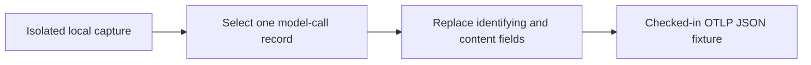

# Anonymized provider OTLP golden fixtures

## 1. Provenance

These fixtures contain one model-call log record selected from real local CLI
exports received by an isolated Agentmetry collector on 2026-09-09.

| Fixture | Producer | Original transport | Captured behavior |
| --- | --- | --- | --- |
| `claude-api-request.json` | Claude Code 2.1.265 | OTLP/gRPC protobuf | `api_request` emitted by a custom subagent |
| `codex-response-completed.json` | Codex CLI 0.153.2 | OTLP/HTTP protobuf | `codex.sse_event` with `response.completed` during a multi-agent run |

Both CLIs ran from the Agentmetry repository root in read-only mode and
delegated one heading-count task. Codex read `AGENTS.md` and `README.md`; Claude
read `AGENTS.md`. The checked-in JSON is the OTLP JSON encoding of the selected
records after anonymization; it is not the original wire payload.

The expected provider fields are documented in the repository's
[Claude Code telemetry specification](https://github.com/kotokumu/agentmetry/blob/main/docs/source-telemetry/claude-code.md)
and [Codex telemetry specification](https://github.com/kotokumu/agentmetry/blob/main/docs/source-telemetry/codex.md).

---

## 2. Anonymization contract

The fixtures preserve provider field names, OTLP value types, resource and
scope shape, model names, token counts, costs, durations, and native event-name
behavior. They replace timestamps, trace and span IDs, session and request IDs,
user and organization identifiers, host and terminal values, and all record
bodies with deterministic fixture values.

The integration test rejects local paths, non-reserved email addresses,
credential-like prefixes, private-key markers, and capture prompt text before
posting either fixture to the OTLP HTTP endpoint.
