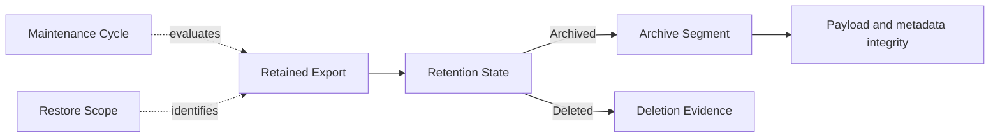

# Specification Analysis: add-telemetry-archive-retention

## 1. Boundary

| Item | Decision | Evidence |
|---|---|---|
| Product capability | Modify `otlp-ingestion` and add `telemetry-retention` | `otlp-ingestion` owns admission and initial lossless persistence. The proposal assigns every post-admission lifecycle transition to `telemetry-retention`. |
| Change classification | Observable behavior change | Archived exports leave active queries, can be restored, and can later be deleted automatically. |
| Included behavior | Opt-in receive-time policy, automatic archive and expiry, archive inventory, manual restore, finite restore hold, integrity and recovery, capacity reporting | Proposal Scope and SC-1 through SC-17. |
| Excluded behavior | Manual deletion, session-based lifecycle operations, archived querying, capacity-authorized expiry, indefinite holds, remote storage, and encryption | Proposal Out of Scope. |

---

## 2. Consumers and Observable Events

| Consumer / actor | Trigger / prior state | Interaction or event | Observable result |
|---|---|---|---|
| Agentmetry user | Retention is disabled or has no valid policy | Configures positive archive and deletion ages | A valid policy becomes active; an invalid update leaves the current policy unchanged. |
| Maintenance scheduler | Retention is enabled | Starts a maintenance cycle at startup or after the scheduling interval | The cycle selects a fixed cohort and advances each eligible export by at most one stable lifecycle state. |
| Web, HTTP, or MCP query consumer | An export changes between Active and Archived | Reads telemetry | Only complete Active derived state contributes to results. |
| Agentmetry user | One or more archive segments exist | Inspects archive inventory or capacity status | Receives bounded lifecycle, integrity, schedule, and storage measurements without archived telemetry content. |
| Agentmetry user | A segment or UTC receive-time interval identifies Archived exports | Requests restore with a finite hold | The exact Archived exports become Active atomically after integrity verification and current normalization; other lifecycle states are reported without mutation. |
| Maintenance scheduler | Every export in a segment is delete-eligible | Performs a later maintenance cycle | The archive content is physically removed and non-content deletion evidence remains. |
| Agentmetry process | Archive, restore, or delete is interrupted | Recovers durable lifecycle work | It preserves or selects verified authority when the operation began intact; for pre-existing corruption it preserves remaining bytes and verifiable lifecycle metadata without claiming payload recovery. It never publishes partial Active state. |
| Agentmetry user | The only archive payload copy fails later verification | Inspects or tries to restore it | The segment is reported corrupt and unrestorable; the detecting operation stops without destructive change, while a later scheduled expiry requires separately verifiable identity and membership evidence. |

---

## 3. Concept Analysis

| Concept or change | Specification decision | Evidence | Owner capability and rationale |
|---|---|---|---|
| Retained Export | One complete successfully admitted OTLP request has a stable logical identity and immutable original receive time across storage states. It includes the raw protobuf and replay metadata required by `otlp-ingestion`. | Existing lossless raw export requirement; proposal SC-2 and receive-time policy. | `otlp-ingestion`, because admission establishes identity, raw meaning, and replay metadata. |
| Current Normalization Outcome | The current normalizer produces either a successful current derived result or a current failed result with no derived data. A normalization failure is a valid Active outcome, not an integrity failure. | Existing atomic persistence requirement; proposal SC-2. | `otlp-ingestion`, because it defines normalization and derived persistence for both initial admission and replay. |
| Retention Policy | One optional enabled policy has whole-day archive and deletion cutoffs from 1 through 36,500 days inclusive, with deletion strictly later, plus a revision used to revalidate destructive authority. | Proposal Scope, SC-6, SC-7, SC-9, and SC-11. | `telemetry-retention`, because it defines post-admission eligibility. |
| Maintenance Cycle | One scheduled parent evaluation uses a fixed UTC instant and fixed cohort. Archive and delete work units are child Lifecycle Operations; the cycle does not itself hold Transition Authority. An export advances at most one stable lifecycle step in a cycle. | Proposal SC-7, SC-8, and SC-12; independent concurrent-ingestion scenario. | `telemetry-retention`, because it owns scheduled state transitions. |
| Retention Eligibility | A reusable decision derived only from immutable receive time, the current evaluation instant, the current enabled policy, stable lifecycle state, and any effective restore hold. Event time and capacity do not grant eligibility. | Proposal SC-3, SC-7, SC-9, SC-11, and SC-12. | `telemetry-retention`, because the decision governs both archive and expiry. |
| Archive Segment | A bounded immutable membership of complete Retained Exports stored in one verified lossless archive representation. Its identity is not export identity. Partial-restore replacements partition every unselected member exactly once and contain no selected member. | Proposal Scope, SC-10, and SC-16; independent period-cut and regrouping scenarios. | `telemetry-retention`, because grouping exists only for archive lifecycle work. |
| Segment Reference State | A segment identity remains resolvable as current, superseded with replacement identities, restored after all former members were successfully published Active, or deleted by retention expiry. Replacement edges are acyclic and terminate at current or terminal references. The historical restored state does not change when those exports later move again. Supersession and restored references contain no payload. | Proposal SC-4, SC-16. | `telemetry-retention`, because user operations address segment identities after content membership changes. |
| Archive Integrity | Verification is evidence at a point in time. Payload integrity is intact or corrupt, independently of lifecycle-metadata integrity being verifiable or unverifiable. A sole corrupt payload is not restorable and blocks the operation that detects it; a later deletion can proceed only from verifiable identity and membership metadata. | Proposal SC-5 and SC-13. | `telemetry-retention`, because it governs archive authority and recovery. |
| Archive Representation Format | Each segment identifies a versioned representation and codec. A reader either supports and verifies it or fails without changing lifecycle authority. | Existing codec metadata; independent old-format and old-codec scenarios. | `telemetry-retention`, because it defines long-lived archived interpretation. |
| Restore Scope | Exactly one current segment identity or one half-open UTC receive-time interval `[start, end)`. Period scope selects exports, not whole intersected segments. | Proposal Scope and SC-10. | `telemetry-retention`, because it defines restoration selection. |
| Retention Hold | A finite whole-day protection duration from 1 through 36,500 days becomes effective only after full Active publication. It expires at that instant plus an exact 24-hour multiple, never changes original receive time, and is not changed by a repeated request. | Proposal SC-3, SC-12, and SC-14. | `telemetry-retention`, because it temporarily changes lifecycle eligibility. |
| Lifecycle Operation | Durable work has a fixed affected-export set containing every export whose state or segment membership can change, transition authority over that set, and a recoverable result. A partial restore's selected restore set is a subset; its affected set also contains every unselected member moved into replacement segments. | Proposal SC-5, SC-10, SC-11, SC-14, and SC-16. | `telemetry-retention`, because concurrency and crash recovery cross archive, restore, and deletion. |
| Archive Inventory Entry | A bounded view of segment identity, receive-time bounds, export count, size, verification state, and scheduled deletion time. It is not archived content or authoritative storage evidence. | Proposal Scope. | `telemetry-retention`, because it exposes archive lifecycle state. |
| Capacity Report | Distinguishes allocated storage, logically occupied retention data, reusable storage, and estimated operation need when observable. It can warn or fail work safely but cannot authorize expiry. | Measured local profile and proposal Out of Scope. | `telemetry-retention`, because the values explain lifecycle storage impact without changing eligibility. |
| Deletion Evidence | Durable non-content evidence retains deleted export identity, immutable receive time, prior segment identity or equivalent scope evidence, deletion completion time, and authorization basis. It contains no raw payload, observations, projections, or archived session content. | Proposal SC-4, SC-14, and independent audit scenario. | `telemetry-retention`, because it makes the terminal state selectable and distinguishable from corruption or unknown data. |

### 3-1. Supporting Models



---

## 4. Main Spec Conceptual Model Replacements

### `otlp-ingestion`

```markdown
### Concept: retained-export

A **Retained Export** is one complete OTLP request that Agentmetry successfully
admits. Its logical identity, original receive time, pre-normalization protobuf,
signal, transport, integrity metadata, and replay metadata remain associated
across later storage-lifecycle states. The receive time is immutable and is
distinct from timestamps carried by telemetry records.

### Concept: current-normalization-outcome

An Active Retained Export has one **Current Normalization Outcome** produced by
the current normalizer. A successful outcome has its complete current
observations and canonical projections. A failed outcome retains the raw export,
normalization status, and error and has no observations or canonical projections.
Later retention transitions do not redefine admission, raw protobuf meaning, or
normalization semantics.
```

### `telemetry-retention`

```markdown
`telemetry-retention` uses Retained Export
[related] [[concept:otlp-ingestion/retained-export]] and Current Normalization
Outcome [related] [[concept:otlp-ingestion/current-normalization-outcome]] with
the meanings owned by `otlp-ingestion`.

### Concept: retention-policy

A **Retention Policy** is an explicitly enabled local policy containing
whole-day archive and deletion cutoffs from 1 through 36,500 days inclusive.
The deletion cutoff is strictly later than the archive cutoff. Retention age
uses an export's immutable receive time, not a timestamp carried by telemetry,
and a whole day is exactly 24 hours. A policy revision identifies one accepted
configuration.

### Concept: retention-state

A Retained Export has one stable **Retention State**:

| State | Meaning |
|---|---|
| Active | Replayable raw data and one complete Current Normalization Outcome are locally available. Successful derived data can contribute to queries. |
| Archived | An archive representation is retained and Active observations, projections, relationships, and aggregates for the export are absent, so it does not contribute to queries. An intact payload is verified and restorable; a corrupt payload is unrestorable. |
| Deleted | Agentmetry retains no restorable raw or derived content for the export. Only non-content deletion evidence can remain. |

**Restoring** is a transient state in which the pre-operation Archived bytes and
lifecycle state remain until the complete current Active result exists. A
**Retention Hold** is a finite whole-day protection interval from 1 through
36,500 days inclusive associated with a restored Active export. Its duration is
an exact multiple of 24 hours and it does not change original receive time.

### Concept: archive-segment

An **Archive Segment** is a finite grouping with immutable membership of complete
Retained Exports and one versioned archive representation. Segment identity does
not replace export identity. Its **Payload Integrity** is `intact` when every
payload verifies against its recorded size and hash and `corrupt` otherwise. Its
independent **Lifecycle Metadata Integrity** is `verifiable` when segment
identity, membership, receive times, and representation information are readable
and valid and `unverifiable` otherwise. A segment identity has one **Segment
Reference State**: `current` while it is present in inventory, `superseded` with
one or more replacement identities after partial restoration, `restored` after
all former members were successfully published Active, or `deleted` after
retention expiry. A restored reference records that historical publication and
does not change when those exports later move again. Replacement segments
partition every unselected member exactly once and contain no selected member.
Replacement edges are acyclic and every traversal terminates at a `current`,
`restored`, or `deleted` reference. A terminal reference contains no payload. An
inventory entry is a non-content view of a current segment's identity,
receive-time bounds, export count, size, both
integrity states, and scheduled deletion time or its unavailable reason.

### Concept: maintenance-cycle

A **Maintenance Cycle** has one fixed UTC evaluation instant and one fixed cohort
of complete Retained Exports. **Retention Eligibility** is a classification
derived from the current policy revision, that instant, immutable receive time,
current stable state, and an effective hold. Capacity is not part of that
classification. A cycle is a parent result whose archive and deletion work units
are child Lifecycle Operations. The cycle does not itself hold Transition
Authority.

### Concept: restore-scope

A **Restore Scope** is either one current Archive Segment identity or a half-open
UTC receive-time interval `[start, end)`. The interval denotes immutable receive
times greater than or equal to `start` and less than `end`; it is independent of
segment boundaries.

**Deletion Evidence** is the terminal non-content representation of a Deleted
export. It retains only export identity, immutable receive time, prior segment
identity or equivalent scope evidence, deletion completion time, and the
authorization basis. It never contains raw payload, observations, projections,
or archived session content.

A **Lifecycle Operation** is one durable archive, restore, or deletion attempt
with a stable identity, request instant, and fixed affected-export set. The set
contains every export whose Retention State or Archive Segment membership the
operation can change. A restore's selected restore set is a subset of its
affected-export set. Automatic operations also have a UTC evaluation instant.
An operation's status is `pending`, `running`, `completed`, `failed`, or
`cancelled`. **Transition Authority** is an exclusive relationship between a
running operation and every affected export; at most one operation holds it for
an export. Disjoint operations can run at the same time.
An overlapping restore can replace automatic-expiry authority before physical
deletion's serialized point of no return. Another restore cannot replace restore
authority. After deletion passes that point first, the export completes as
Deleted.

A **Capacity Report** records one measurement instant. Total allocation is the
operating-system allocated bytes for all Agentmetry database, archive, and
staging files. Active raw, observation, and query-projection bytes are mutually
exclusive SQLite pages assigned to those content classes. Archive Segment bytes
are operating-system allocated bytes for current segment files. Reusable bytes
are SQLite freelist pages, and available bytes are those reported for the
containing filesystem. The component classes do not sum to total allocation,
which also includes metadata, write-ahead logs, operation files, and allocation
granularity. An operation estimate is additional peak filesystem allocation
predicted for one archive or restore; either its byte value or an unavailable
reason is present. It is advisory and is not Retention Eligibility.
```

---

## 5. Requirement Candidates

| Requirement slug | Actor and event | Guarantee | Concepts used | Normative representations | Scenario tags |
|---|---|---|---|---|---|
| lossless-raw-export-retention | Ingestion admits an export; retention later changes its state | Raw meaning and replay metadata survive Active/Archived movement until authorized deletion | Retained Export, Current Normalization Outcome, Retention State | Invariant, prose | happy, normalization-failure, lifecycle |
| retention-policy | User enables, disables, or edits policy; a cycle evaluates time | Validate policy values and derive eligibility from fixed UTC receive-time age and current policy | Retention Policy, Retention Eligibility, Maintenance Cycle, Retention Hold | Partition Table, Invariants | happy, invalid, boundary, policy-change, clock-change |
| automatic-archive | Maintenance cycle selects eligible Active exports | Publish verified raw-only archive and remove all current derived state atomically; never archive and delete in one cycle | Maintenance Cycle, Archive Segment, Lifecycle Operation, Retention State | State Transition Table, Invariants | happy, concurrent-ingestion, cancellation, policy-change |
| archive-inventory-and-capacity | User inspects retained storage | Return bounded non-content inventory and distinct storage measurements; capacity never grants deletion authority | Archive Inventory Entry, Archive Integrity, Capacity Report | Classification Table, prose | happy, corrupt, reusable-space, insufficient-capacity |
| archive-restoration | User selects a segment or receive-time interval and hold | Classify matching lifecycle states, verify all selected Archived raw, rebuild with current normalizer, publish atomically, preserve an exact acyclic partition of unselected archive members, then apply hold | Restore Scope, Lifecycle Operation, Current Normalization Outcome, Retention Hold, Segment Reference State | Partition Table, State Transition Table, Invariants | happy, empty, mixed-state, boundary, integrity-error, normalization-failure, conflict, idempotency, capacity |
| automatic-archive-expiry | Later maintenance cycle finds every member eligible | Revalidate authority, physically remove the entire segment, and retain non-content deletion evidence | Retention Eligibility, Archive Segment, Archive Integrity, Deletion Evidence, Lifecycle Operation, Segment Reference State | Decision Table, State Transition Table, Invariants | happy, mixed-age, hold, policy-change, restore-race, deleted-restore |
| lifecycle-integrity-and-recovery | Process resumes interrupted archive, restore, or delete; verification detects corruption | Preserve authoritative verified data before completed deletion, recover idempotently, and fail closed in the detecting operation on unsupported or corrupt archives | Lifecycle Operation, Archive Integrity, Archive Representation Format, Deletion Evidence | Decision Table, Invariants | crash, cancellation, corruption, compatibility, duplicate-copy |
| retention-scheduling-and-status | Application starts or remains running with retention enabled | Evaluate at startup and at least every 24 hours and expose work and failures | Maintenance Cycle, Lifecycle Operation | Boundary Table, prose | startup, periodic, disabled, failure |

---

## 6. Unresolved Decisions

None.

---

## 7. Sources

- [OTLP ingestion specification](https://github.com/kotokumu/agentmetry/blob/main/openspec/specs/otlp-ingestion/spec.md)
- [SQLite storage schema](https://github.com/kotokumu/agentmetry/blob/main/internal/storage/sqlite/schema.hcl)
- [Journal payload implementation](https://github.com/kotokumu/agentmetry/blob/main/internal/journal/payload.go)
- `RETENTION-E1`, the repository and local-storage evidence packet recorded for this change
- Independent evolution-scenario review and conceptual-model stress test for this change
