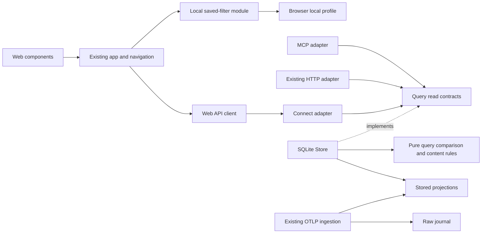

# Investigation construction plan

## Scope, Approval, and Gate Status

| Item | Decision / Evidence |
|---|---|
| Risk | High: additive public reads and changes across query, storage, transports, and Web state |
| Requirements | Accepted R1–R13 in evidence packet `OTEL-INVESTIGATION-1`; accepted design and task groups 1–9 |
| Human approval | The user requests implementation in accepted order with the latest 「では順番に」 on 2026-09-04. This records approval of the presented proposal, design, specs, and tasks; routine detailed decisions below remain within that scope |
| Initial model gate | PASS before independent scenarios are disclosed, as recorded in `model-review.md` |
| Independent inputs | `evolution-scenarios.md`, S1–S14, authored from the same frozen requirements/evidence without the proposed model/design |
| Responsibility and scenario assessment | PASS in this plan: current requirements have a cohesive owner; no scenario requires a new concept |
| Architecture assessment | Design author's scenario assessment passes below; independent architecture review remains required before construction |
| Interface, test, and detailed design | Specified below for independent review; these are planned contracts and tests, not implemented results |
| Migration safety plan | N/A: additive queries and response fields, no database schema change, raw rewrite, reprojection, or data migration. A demonstrated need for an index returns to migration review before adding one |

---

## Responsibility Assignment

| Responsibility / Decision | Owner | Information and Authority Used | State / Invariant Affected | Change Driver | Not Owner / Reason |
|---|---|---|---|---|---|
| Exact evidence identity and target lookup | Query identity/anchor contract; SQLite trace/activity reader | Existing source-qualified identities, trace/span references, stored projection | Exact target or explicit unavailable target; no substitute span | Diagnostic navigation R1 | Component cannot infer target from the first error or loaded page |
| Full conversation filtering | Query filter values and SQLite session reader | Grouped conversation membership, observed outcome/time/model/tool | Filter before pagination; one row per conversation; model/tool existence within same conversation | Investigation predicates R4 | Browser must not filter only downloaded rows |
| Five normalized metrics and pair eligibility | `internal/query` comparison functions | Explicit pair, summary timing, existing rework measurements and coverage | Same identities/units/operands/value/delta/reason across consumers | Diagnostic meaning R7/R8 | Connect, HTTP, MCP, and Web do not own formulas |
| Coherent pair read | SQLite implementation of comparison read | Existing read transaction and transaction-aware summary/activity/harness loaders | Eligibility, totals, analysis, and coverage agree within one read | Concurrent commits S9 | Two independent calls to `GetSessionRework` do not provide a shared snapshot |
| Existing analysis and all reported episodes | Existing query rework analysis; component exposes its results | Analysis episode set and exact evidence references | All returned episodes remain reachable; partial coverage remains visible | Rework investigation R2 | Presentation expansion never claims full original execution history |
| Received content kind, provenance, availability | Query content interpretation over existing projected fields | Source/activity metadata and verified provider mappings from tasks 1.1/1.2 | Read/reference is not model input; redacted/encrypted differs from unreported; raw-only is not canonical | Provider interpretation R9/R10 | Adapters and components do not infer semantics from filenames or retrieve files |
| Trace overall extent and overview | SQLite trace reader with query-owned result semantics | Stored projection timing/status/type/parent facts | Full extent independent of detail page/range; overview does not require bodies | Trace volume S8 | Waterfall viewport does not define retained extent |
| Analysis, overview, content, and visibility explanation | Query reports own evidence scope; Web owns current display conditions | Counts/completeness from read results; applied UI conditions | Complete projection analysis can coexist with absent body or hidden activity | Coverage R11 | One overloaded “complete” or “missing” flag cannot cover these axes |
| Applied filter and navigation state | Existing Web app/navigation | Validated conditions, target identity, agent, purpose, reading position, origin focus | Invalid draft does not relabel results; live changes do not replace selection | Investigation interaction R1/R3/R5 | Domain records do not own browser history or user focus |
| Saved filter lifecycle | Small Web saved-filter module using local profile storage | Versioned named condition sets and storage success/failure | Save/apply/replace/delete; relative time evaluated on application; no false persistence success | Local condition reuse S3/S14 | SQLite and MCP gain no preferences write API |
| Wire validation and delivery | Existing Connect/HTTP/MCP adapters and Web API client | Wire requests, query values/results, transport errors | Invalid input rejected; unsupported features explicit; existing public fields unchanged | Compatibility S12/S13 | Delivery layers translate rather than reinterpret diagnostics |
| Content disclosure defaults | Existing MCP read mapping and tools | Explicit include-content request and existing limits | Read-only; comparison is body-free; activity bodies remain opt-in | Consumer access R12 | Comparison does not implicitly exercise activity content access |
| Layout, display rounding, keyboard/focus | Existing Web components/styles and comparison presentation | Returned semantic results and investigation state | Body/return reachable at narrow width and 200%; visual labels do not rely on color | Accessibility R13 | Query does not own pixel layout or one-decimal labels |
| Provider/raw investigation and follow-up decision | Source-telemetry documentation/fixtures | Existing source docs, profiles, normalized projection, raw payload | No new mapping without separate supported change; gaps are valid results | Tasks 1.1/1.2/6.2/6.3 | Runtime collection does not expand to satisfy missing evidence |

---

## SOLID Risk Assessment

| Principle | Risk | Mitigation |
|---|---|---|
| SRP | App handlers mix metric policy, filter persistence, selection, and rendering | Query owns metric rules; saved-filter module owns local lifecycle; navigation owns user state; existing app coordinates reads and rendering |
| OCP | A fixed set of metrics/provider mappings becomes a registry/plugin framework | Keep fixed functions and verified provider branches; S11 creates a review trigger, not a plug-in requirement |
| LSP | One adapter rounds values, changes availability, or weakens identity/coverage | Shared query result contract and cross-adapter fixtures; presentation rounding is separate |
| ISP | A new broad investigation repository includes storage writes and every read | Add small query-owned comparison/overview read interfaces; reuse existing session/trace/activity read contracts |
| DIP | Metric functions accept protobuf, MCP, SQL rows, or browser data | Comparison functions accept query-owned values; SQLite and transports depend on `internal/query` |

Procedural risks: metric formulas in MCP/Web handlers; content-kind guesses in components; conditions decoded independently for URL and saved sets; selection inferred from the newest array element. Put each decision with its owner above. A query snapshot manager, filter DSL, generic repository, universal controller, and metric/provider registries are premature.

---

## Independent Evolution Scenario Impact

| Scenario / Confidence | Primary Decision Owner | Expected Propagation | Unexplained Impact | Duplicated Policy Decision | Verdict |
|---|---|---|---|---|---|
| S1 / Committed | Exact target query and Investigation state | Anchor read → navigation URL/history → episode/detail component → tests | None | None; link carries existing reference | PASS |
| S2 / Committed | Query conditions and session reader | Condition fields → server validation/SQL predicates → URL and fixed controls → tests | None | Client feedback mirrors input validity; matching is server-owned | PASS |
| S3 / Committed | Saved filter set and Investigation state | Versioned local conditions → application-time bounds → history restoration → tests | None | One Web condition codec for URL/saved state | PASS |
| S4 / Committed | Normalized comparison | Query eligibility → additive result/error mapping → Web/MCP presentation → tests | None | Existing `compare_runs` remains independent | PASS |
| S5 / Committed | Normalized comparison and Evidence coverage | Shared operands/availability/precision → adapters → result labels → fixtures | None | No second metric formula in Web/MCP | PASS |
| S6 / Observed | Received content evidence | Verified query interpretation → additive metadata mapping → content labels → provider fixtures | None | Components use result kind/availability, not provider guesses | PASS |
| S7 / Committed | Investigation state and presentation | Focus/selection/return behavior → responsive layout → component/browser checks | None | No domain/query policy affected by layout | PASS |

The same scenarios are applied after the responsibility assignment. No concept gains unrelated state or authority. The initial remove/merge decisions remain valid: content evidence and coverage keep different meanings; trace extent and viewport remain separate; saved conditions and active state keep separate lifecycles; passive episode and snapshot artifacts need no new service.

---

## Architecture Boundaries

| Boundary Candidate | Consumer / Evidence | State, Data, or Policy Owner | Constraint Protected | Dependency Direction | Simpler Existing Boundary Alternative | Decision |
|---|---|---|---|---|---|---|
| Existing query identity/filter/trace contracts | Connect/HTTP/MCP and Web trace/session views, R1/R4/R6 | Query owns read semantics; SQLite owns projected storage | Exact references, full-set predicates, stable overall extent | Transports → query; SQLite implements query reads | Extend existing `TraceFilter`, `SessionListFilter`, `GetTrace`, and activity anchor | Reuse; no separate generic investigation service |
| Comparison read interface | Connect comparison and MCP `compare_rework`, R7/S9 | Query owns result rules; SQLite owns read transaction | Pair-wide consistency and shared semantic output | Both adapters → query interface ← SQLite | Calling existing single-run methods twice loses consistency | Add one small `ReworkComparisonReader` |
| Pure comparison function | SQLite comparison reader and behavior tests, R7/R8 | Query comparison rules | No SQL/wire/presentation dependency | SQLite → query-owned values/function | Inlining in SQLite would locate diagnostic policy in storage | Add a plain function, not a strategy hierarchy |
| Trace overview read interface | Web trace explorer, task 7.1 | Query overview semantics; SQLite metadata projection | Full retained extent without all bodies | Connect → query interface ← SQLite | Existing body-bearing detail read cannot guarantee body-free overview | Add one small `TraceOverviewReader`; preserve legacy `GetTrace` |
| Content evidence function/value | Existing activity mappings in Connect/HTTP/MCP, R9–R12 | Query interpretation of projected content | Provenance and redaction meaning consistent across consumers | Adapters → query result metadata | Repeating provider rules in each adapter loses consistency | Plain query function/value; no content fetcher or new collector |
| Existing transport boundary | Web Connect client and MCP callers, S12/S13 | Adapter owns wire shape, protocol errors, content opt-in | Additive compatibility and body disclosure | Wire DTO ↔ query values; query never imports transport | Existing adapters already protect these concerns | Extend existing files; no extra transport abstraction |
| Existing Web app/navigation | Components and browser history, R1/R3/R5 | Web owns selected identity, applied conditions, origin/focus | Live updates preserve reading/return state | Components/events → navigation/app; app → API client | Existing navigation values/functions suffice | Extend existing state; no global state framework |
| Local saved-filter module | Fixed filter controls, S3/S14 | Web profile owns versioned named data | Local storage failure does not corrupt active/applied state | App → module → browser storage | App-inline persistence would intermingle local lifecycle with navigation | Small module; use the browser Storage contract directly or its used `getItem`/`setItem` subset; no custom persistence framework |
| Raw ingestion/projection boundary | Existing receiver/storage and mapping audit, S10/S11 | Ingestion owns original/raw retention and canonical mapping | Unsupported raw fields remain accepted but not fabricated as canonical content | Receiver → raw/projection; investigation reads projection | Existing boundary fully covers this change | Preserve; new mapping work requires a separate change |



### Architecture scenario impact

| Scenario / Confidence | Primary Boundary or Owner | Expected Propagation | Unexplained Impact | Verdict |
|---|---|---|---|---|
| S8 / Committed | Overview/detail reads and trace state | Body-free timing/type/status projection; full extent/count plus overview coverage; range predicates before detail page; viewport preserves selection | None; metadata can be read without body materialization | PASS |
| S9 / Observed | SQLite read transaction; Web identity-based reconciliation | Reuse transaction-aware summary/activity/harness loaders for both pair members; derive all comparison facts from that cohort; preserve selected ID and range during streamed updates | None; no persisted snapshot model needed | PASS |
| S10 / Committed | Raw/projection boundary and exact target read | Not-found identity result; missing-parent metadata; independent analysis/content/visibility labels | None; no raw-browser read or external retrieval added | PASS |
| S11 / Evidence-backed plausible | Existing provider mapping boundary | Evidence audit and separately supported mapping change when justified; current unknown fields remain raw-retained | None; no scheduled mapping change or extension point | PASS with explicit follow-up gate |
| S12 / Committed | Existing MCP boundary and additive comparison read | Add `compare_rework` with explicit pair; preserve `compare_runs`; keep body opt-in on existing reads | None; no permissions side effect from comparing | PASS |
| S13 / Committed | Local condition codec and Web API compatibility handling | Reject unknown stored version/condition; show unsupported server; retain last applied query; never silently ignore requested conditions | None; an explicit compatibility signal is required for additive filters on an older server | PASS subject to interface compatibility rules below |
| S14 / Committed | Saved-filter module | Report storage errors; preserve actual stored collection; active query continues | None; telemetry query/storage schema unaffected | PASS |

No duplicated policy or disproportionate propagation is identified. Independent architecture review is pending; this author assessment does not substitute for that review.

---

## Proposed Interfaces / Signatures

Names below are proposed contracts, not claims of existing exports. Existing query identity, `ActivityAnchor`, `Page`, session/trace readers, Web client, and transport boundaries are reused. SQL helpers remain private. A final name adjustment that preserves the contract is a routine implementation choice.

| Name | Consumer | Responsibility | Signature | Preconditions | Postconditions / Result Semantics | Errors / Side Effects |
|---|---|---|---|---|---|---|
| Extended `SessionListFilter` | Session list adapters and SQLite | Describe supported predicates | Existing fields plus observed-failure predicate, optional minimum/maximum elapsed duration, model, tool | Known fields; valid numeric values; nonnegative bounds; minimum ≤ maximum; existing string limits | Full conversation AND predicates before pagination; independent model/tool existence in grouped conversation; missing time/outcome fails positive predicate | Invalid input is rejected before query; read-only |
| Extended `TraceFilter` / `GetTrace` | Connect/HTTP/MCP trace/detail consumers; existing trace callers | Exact anchor and focused detail read | `GetTrace(context.Context, TraceFilter) (Trace, error)`; add optional `SpanID`, then time range, activity kinds, observed-error condition; Connect request uses additive `anchor_span_id` | Valid trace/span; ordered finite range; supported kinds; existing page bounds | Native trace-signal span row only; anchor takes precedence over tail/page; rank uses the same global trace/log ordering as page reads; full total/extent remains unfiltered | Invalid condition error; `ErrTraceTargetNotFound` distinct from `ErrTraceNotFound`; correlated logs alone do not satisfy a span target; no writes |
| `TraceOverviewReader` | Connect and Web trace explorer | Body-free timing overview | `GetTraceOverview(context.Context, TraceID) (TraceOverview, error)` | Valid trace identity | Overall extent/count, lightweight activity timing/type/status/parent references, overview count and complete/partial/unknown coverage; no content or body-bearing attributes | Trace not found / read failure; read-only |
| `ReworkComparisonReader` | Connect and MCP comparison | Read an explicit pair coherently | `CompareRework(context.Context, ReworkComparisonPair) (ReworkComparison, error)` | Pair carries baseline/current `ConversationIdentity`; syntactically valid identities | Pair identity, valid or ineligible result, five rows when eligible, coverage and existing harness facts; body-free | Missing subject remains not found; ineligible identity/time is a reasoned result; storage failure is operational error; one read snapshot |
| `CompareReworkSnapshots` | SQLite comparison implementation | Own shared eligibility and arithmetic | `CompareReworkSnapshots(baseline, current ReworkDiagnosticSnapshot) ReworkComparison` | Inputs retain explicit identity, valid/missing time state, optional measured operands and coverage | Reject same conversation/cross-source/invalid or overlapping time; preserve raw ratio and delta; unavailable row retains available operands and reason | No side effects; inconsistent operands unavailable; no baseline substitution |
| `DescribeActivityContent` | Existing activity response mappings | Attach supported content meaning | `DescribeActivityContent(Activity) ContentEvidence` | Existing projected activity facts only | Bounded derived source/activity association, supported or unknown semantic kind, reference/read/model-input strength, readable/unreported/explicit producer-redacted/encrypted availability; existing content limits retained | Total interpretation; no I/O; never forwards the complete Attributes map, ciphertext, or body-reference payload as readable content; MCP body opt-in remains enforced |
| Additive Connect reads | Generated client and Web API module | Deliver shared comparison and overview | `CompareRework(request{baseline,current})`; `GetTraceOverview(request{traceId})` | Wire identities and request limits validated | Map query results without formulas/rounding; unknown optional outputs remain explicit | InvalidArgument, NotFound, Unimplemented, Internal as appropriate; read-only |
| Additive MCP `compare_rework` | MCP callers | Deliver normalized pair comparison | Input `{baseline:{source,runId},current:{source,runId}}`; output comparison report | Both identities explicit; no implicit latest run | Same five raw metric rows/coverage as Connect; no body content; read-only annotation and tool guidance | Structured invalid argument/not-found/operational errors; ineligible pair reason; no change to `compare_runs` |
| Web client comparison/overview methods | Existing app | Decode/validate additive read results | `compareRework(pair, signal?)`; `getTraceOverview(traceId, signal?)` | Typed pair/trace identity | Typed shared results; detect unsupported server or malformed payload rather than empty successful data | Abort/failure/unsupported states are separate; no local fallback metric formulas |
| Web condition codec | Navigation, saved-filter module, fixed controls | One normalized Web condition vocabulary | `parseInvestigationConditions(input): valid-or-invalid`; URL encode/decode uses that value | Input may contain invalid/unknown fields | Either all supported conditions preserved or explicit field/version error; no silent drop | Pure; active state changes only after validation and successful query |
| Saved-filter functions | Existing app/filter controls | Read/save/replace/delete local definitions | `loadSavedFilters(storage)`; `saveFilter(storage, record)`; `replaceFilter(storage, id, conditions)`; `deleteFilter(storage, id)` | Versioned record with name and supported normalized conditions; existing ID required for replace/delete | Success reflects persisted data; apply copies conditions and reevaluates relative time at current application time | Report malformed JSON, unsupported version/conditions, unavailable storage, write failure; only local profile writes |
| Navigation target/state extensions | Evidence links and app components | Keep URL target and history return state | Existing location/state helpers extended with span, purpose, selected activity, relevant position and originating focus reference | IDs/conditions valid; origin remains a safe local route under existing rules | Source, conversation, agent, applied filters, view, selection, scroll/range and return focus survive supported navigation | Invalid URL state is visible when it changes requested meaning; no content stored in URL/history |

### Result and compatibility rules

| Contract Area | Required Semantics |
|---|---|
| Identity and pair | Requests and results retain source plus conversation ID for each role. Equality and eligibility use normalized conversation identities. Group resolution must not silently compare a conversation to itself through two aliases |
| Metric row | Fixed IDs: `initial_validation_success_proxy`, `rework_token_share`, `retry_cycle_effort_share`, `tool_failure_rate`, `recurring_loops_per_100_validations`. Each side carries numerator, denominator, availability/reason and raw value when available; row carries unit and raw delta only when both sides are available |
| Arithmetic | Preserve the baseline five operand definitions and ratio guards. Raw `value = numerator / denominator * 100`; raw `delta = current.value - baseline.value`. Missing numerator and zero/unavailable denominator are unavailable. Reported zero numerator with positive denominator remains available zero |
| Presentation | Web labels retain one-decimal rounding and may classify the visible difference using that rounded delta. The query/wire delta is never overwritten by display rounding. Existing harness display remains available without adding configuration-management scope |
| Eligibility | Baseline/current must differ, have the same source, have valid start/end intervals, and satisfy baseline end ≤ current start. Equal boundary timestamps are permitted; baseline end after current start is ineligible. Existing aggregate comparison retains one-to-ten explicit runs, cross-source support, and its fields |
| Trace anchor with visibility conditions | `SpanID` names the native stored span, and UI matching requires `signal === "trace"` plus the exact trace/span IDs. Logs carrying the same IDs never become the target. If the native span is absent, return `ErrTraceTargetNotFound`. Anchor takes precedence over tail/page, with rank and page using the same combined global ordering. A separate unfiltered anchored read keeps a filtered-out selection accessible; “Outside current filters” differs from “target not found” |
| Trace time intersection | Focused detail includes activities intersecting the requested interval, including a long span that starts before the interval. Boundary timestamps and zero-duration records are handled consistently and tested; overall trace extent/count does not change |
| Overview payload | Only identity, timing, type, status and parent metadata needed to render the overview; never content/body-bearing attributes. When all retained metadata is read, coverage is complete relative to retained projection. Any deliberate bounded/truncated result states its returned/total coverage rather than implying all activities were loaded |
| Nullable wire values | Optional values preserve absence rather than defaulting to numeric zero. Unknown enums and malformed required data produce an explicit invalid/unsupported state at the client |
| Additive filter compatibility | Protobuf ignores unknown request fields on older servers. New filter behavior therefore requires positive support evidence: include an additive applied-condition echo or supported-investigation capability in the response contract. The Web client verifies all requested non-default conditions are acknowledged before presenting results as applied. Absence/mismatch produces unsupported server and keeps last valid results identifiable |
| Existing caller compatibility | Optional new request fields default to current behavior; old responses/fields and pagination rules remain meaningful. Existing trace/session APIs continue to work. New comparison/overview RPC absence returns unavailable UI, not a misleading empty result |
| Time conditions | Saved/URL time values remain existing `1h`/`24h`/`7d` relative conditions. They are evaluated when the query is applied; no absolute frozen dataset or new time DSL is implied |

### Example Call Sites

These examples illustrate planned contracts; they are not implemented or executed code.

```go
// SQLite owns one read transaction for both roles and calls query policy once.
// loadDiagnosticSnapshot reuses existing transaction-aware loaders privately.
baseline := loadDiagnosticSnapshot(ctx, tx, pair.Baseline)
current := loadDiagnosticSnapshot(ctx, tx, pair.Current)
report := query.CompareReworkSnapshots(baseline, current)

// Both public comparison adapters depend on the same narrow read contract.
report, err := comparisonReader.CompareRework(ctx, pair)

// Exact evidence reuses the trace reader; overview is explicitly body-free.
trace, err := traceReader.GetTrace(ctx, anchoredFilter)
overview, err := overviewReader.GetTraceOverview(ctx, traceID)

// Existing activity mapping includes query-derived metadata, not raw retrieval.
evidence := query.DescribeActivityContent(activity)
```

```ts
// Planned Web calls; each result is validated before changing applied state.
const conditions = parseInvestigationConditions(draft);
const comparison = await client.compareRework({ baseline, current }, signal);
const overview = await client.getTraceOverview(traceId, signal);
const saved = loadSavedFilters(localStorage);
const result = replaceFilter(localStorage, savedId, conditions.value);
const href = traceLocation(traceId, appliedConditions, { spanId });
```

### Boundary Decisions

| Boundary | Hidden detail | Reason |
|---|---|---|
| Query comparison read | SQLite transaction, grouping graph, SQL, storage timestamps | Consumers require one consistent comparison, not persistence procedures |
| Pure query rules | Wire null encoding and presentation decimals | Diagnostic meaning must remain identical across Web/MCP |
| Trace overview read | Metadata query and full-count rollups | UI needs honest extent/coverage without knowing storage layout |
| Existing activity mapping | Provider attribute locations and semantic evidence interpretation | UI/MCP consume provenance without inventing provider mappings |
| Web API module | Connect generation, enum mapping and compatibility detection | App handles ready/unavailable/error states using domain-facing values |
| Saved-filter module | Storage key and versioned JSON encoding | Active investigation state must not depend on serialized storage details |

### Interface Traceability

| Public Contract | Requirement / Invariant / External Dependency | Owner Concept / Module / Boundary | Consumer | Why Separate |
|---|---|---|---|---|
| Session filter additions and support acknowledgement | R4/R5; old-server unknown-field behavior S13 | Query conditions and transport | List UI, existing list adapters | Full-set selection cannot be reconstructed from paginated UI data; acknowledgement prevents silent loss |
| Trace anchor/range additions | R1/R6; native-span-only target | Activity identity and trace read | Trace explorer/evidence links; Connect/HTTP/MCP reads | Existing trace read is the smallest valid boundary; no new selected-activity wire identity is needed |
| Trace overview | R6/R11; no-all-bodies requirement | Trace and evidence coverage | Trace explorer | Existing detail payload contains bodies and only a page |
| Comparison read | R7/R8; snapshot consistency S9 | Normalized comparison/query read | Connect and MCP | Independent single-run calls do not protect one-cohort consistency |
| Pure comparison function | R7/R8; shared units/precision/missingness | Query comparison | SQLite | Keeps policy out of storage and transports |
| Content evidence value/function | R9/R10/R11 | Received content evidence/query | Existing activity adapters | Prevents independent provider/provenance inference per consumer |
| New RPCs/tool and Web methods | R7/R12; compatibility S12/S13 | Delivery boundaries | Web/MCP users | Existing aggregate tool has a different eligibility contract |
| Web condition codec | R4/R5 | Investigation conditions | Navigation/saved filters/controls | URL and saved storage must carry identical conditions |
| Saved-filter functions | R5; local storage lifecycle S14 | Saved filter set | Filter controls | Named persistent lifecycle differs from active navigation state |
| Navigation extensions | R1/R3/R5/R13 | Investigation state | Evidence/detail views | Selection and return context must survive page/view changes |

Interface risks: preserve source-qualified values instead of growing primitive argument lists; keep reader interfaces consumer-sized; do not export SQL transactions or generated DTOs into query; use named predicate data rather than a boolean that switches between incompatible comparison modes. Existing content opt-in and observed-error predicates are meaningful request data, not a reason to create strategies.

---

## Requirement Coverage

| Requirement / Acceptance Criterion | Observable Behavior | Automated Test or Verification Method | Verification Owner | Required Evidence |
|---|---|---|---|---|
| R1 exact/off-page/missing evidence and return | Open requested span and restore full origin | Query/SQLite/Connect tests; navigation/component tests; browser journey | Implementation owner | Exact ID assertion, not-found assertion, restored agent/filter/view/position/focus |
| R2 every episode and scope | Five returned episodes are reachable and partial coverage remains visible | Rework summary component test | Web owner | Fourth/fifth evidence actions usable; coverage label retained |
| R3 view/detail/live behavior | Read received bodies and retain selection in narrow/live cases | App/component tests and browser narrow layout | Web owner | Same selected identity/body before and after view/live transition; reachable return |
| R4 full-set filters | Match page-external grouped conversation with distinct model/tool records; reject invalid input | SQLite query/adapter and Web condition tests | Query/Web owners | Unique result IDs, predicate boundaries, last-applied query label |
| R5 saved/URL/history conditions | CRUD works across reload; relative range advances; errors explicit | Saved-filter/URL/component tests with controlled clock/storage | Web owner | Named record state and applied bounds; unsupported/corrupt/write-failure outcomes |
| R6 overview/range/type/error/selection | Full reference survives 1200 records and page/range changes | SQLite/Connect tests; waterfall/app tests; browser fixture | Query/Web owners | Counts/extent/coverage, no overview bodies, selected record remains accessible |
| R7 same five raw diagnostics | Web and MCP consume matching fixed pair results | Query unit, SQLite fixture, Connect/MCP mapping, Web presentation tests | Query/transport/Web owners | IDs, unit, numerator, denominator, availability/reason, raw value/delta; separate rounding assertion |
| R8 eligibility/missingness/aggregate compatibility | Invalid pair rejected; zero differs from missing; old aggregate requests still work | Query and MCP behavior tests | Query/MCP owners | All invalid pair cases, null/zero operands, one-to-ten and cross-source aggregate outputs |
| R9 provenance | Reference/read/input/unknown remain distinct | Content interpretation/provider fixtures and UI mappings | Query/Web owners | Actual received field, source/activity identity and appropriate label; no file retrieval |
| R10 provider/redaction | Codex marker redacted; absent Claude content unreported | Provider-specific query/component fixtures | Query/Web owners | No speculative setting cause; marker not displayed as readable prompt |
| R11 coverage axes/raw-only | Full projection analysis can have unreported body; filtered is not missing; span event remains raw-only | Query/MCP/UI tests and raw/projection fixture audit | Query/transport/Web/audit owners | Independent coverage/body/visibility states; retained raw unchanged |
| R12 body defaults/read-only | Comparison body-free; explicit existing content reads still work | MCP tool schema/response tests and existing read tests | MCP owner | Read-only annotation; no body fields; include-content and page limits preserved |
| R13 keyboard/focus/200% | Full evidence/detail/return operable without color alone | Component focus tests plus browser keyboard/200%/narrow/reduced-motion verification | Web owner | Focus destinations and reachable controls recorded; screenshot or browser operation notes for visual constraints |
| Accepted tasks 1/6.2/6.3/8 | Provider audit, contract inventory and truthful docs | Source/fixture inspection and documentation review | Audit/documentation owner | Real source fields, version/source references, fixture identity, follow-up mapping decision |
| Accepted task 9 | End-to-end local synthetic journey and regression gates | Required test/build/strict commands and browser/MCP fixture | Integration owner | Actual command outputs and journey record before checking tasks |

---

## Test Specifications

| Behavior | Given | When | Then | Test Level | Notes |
|---|---|---|---|---|---|
| Exact span beyond page | Multiple failed spans and requested target outside first page | Open evidence via trace/span | Target page contains exact target; selection/focus is that identity | SQLite + API + Web | Existing conversation-anchor URL remains valid |
| Missing target | Retained trace exists but requested span does not | Open evidence | Unavailable target names requested identity and return remains usable | Query/API + Web | Never select first error |
| Complete episode access | Analysis returns five episodes and partial coverage | Expand additional episodes | All five evidence controls are accessible with partial label | Component | Does not change analysis algorithm |
| Body reading across views | Prompt/tool body selected with agent and position | Switch execution/rework/comparison and return | Selection and navigation state survive | Component/app | Narrow layout offers detail/list return |
| Live arrival during reading | User reads an old activity; new record arrives | Apply projection update | Body, selected ID, viewport and reading position remain stable | App | Reconcile by identity, not array index |
| Conversation-level filter | Match lies outside first page; model/tool on distinct records | Apply all conditions | One matching conversation appears; unknown outcome/time excluded | SQLite/API | Include group membership and two sources sharing an ID |
| Invalid filter draft | Existing valid result shown | Enter invalid/contradictory duration or unsupported field | Request is not applied; valid result remains labelled with old conditions | Web + adapter | Also server-side invalid-wire rejection |
| Saved conditions reuse | Named 24h condition saved at time A | Reload and apply at time B | Same relative condition; evaluated window uses B; URL shares condition | Module/app | Controlled clock; no frozen result claim |
| Saved CRUD failure | Valid saved collection; storage throws | Save/replace/delete | Error shown; persisted collection not claimed changed; active query usable | Module/app | Use actual Storage contract substitute, not call-order mocks |
| Shared raw metrics | Fixed eligible pair with nonterminating ratios and known counts | Compare through query, Connect, MCP, Web | Same five operands/values/deltas/reasons; display rounding separate | Unit/integration/adapter/presentation | Assert every metric's numerator, denominator and unit. For 5000/10000 → 5004/10000, raw delta is approximately 0.04 percentage points; Web displays 0.0/unchanged |
| Pair eligibility | Same identity, cross-source ID collision, overlap, invalid interval, touching intervals | Compare each explicit pair | Correct rejection; touching valid intervals eligible; no substitute | Query + MCP | Aggregate comparison cases remain accepted |
| Missing versus zero | Complete analysis with null numerator, zero denominator, and reported zero | Compare | Missing/zero denominator unavailable; positive denominator + zero numerator available zero | Query/adapter | Coverage remains complete independently |
| Concurrent pair read | Projection changes while one pair read is in progress | Commit change between controlled read points | Each successful result is consistent with a single cohort for time/operands/coverage | SQLite integration | Prefer real temporary SQLite and controlled concurrency over mocking SQL call sequence |
| Content interpretation | Provider-specific reference/read/input/unknown/redacted/absent fixtures | Read existing activity | Source/activity and evidence kind/availability accurately shown | Query + adapters + Web | Unsupported span event never creates canonical body |
| Trace range overview | 12, 200, then 1200 metadata-bearing activities with long overlap/missing parent | Read overview and zoom/filter details | Overall reference unchanged; intersecting spans visible; missing parent explicit; overview has no body | SQLite/API + component | Assert complete/partial coverage separately from detail count |
| Selected target outside range | Activity selected, then range/type/error condition excludes it | Render detail and clear condition | Detail remains reachable; hidden label distinct; clearing reveals target | App/waterfall | No fabricated missing state |
| New server capability absent | Old server ignores new filter fields or lacks new RPC | Apply structured filter or request comparison | Explicit unsupported state; unacknowledged results not shown as applied | Client/app | Test semantic condition acknowledgement, not transport success alone |
| Keyboard enlarged layout | Synthetic data with errors, body, episodes; browser at 200% | Keyboard opens evidence, reads, returns and switches/filter/expands | Focus visible and restored; controls reachable; state text independent of color | Component + browser | Browser verification is needed for real zoom/layout; reduced-motion setting included |
| Content access compatibility | MCP default reads and explicit content request | Compare, read without content, read with content | Compare/read-default body-free; explicit read retains existing limits | MCP | Existing aggregate fields and one-to-ten run behavior preserved |

### Invariant Tests

| Invariant | Example | Expected Result |
|---|---|---|
| Source-qualified identity | Two sources use `run-1` | They never become the same conversation or eligible cross-source pair |
| Exact evidence identity | Three failed spans and off-page requested span | Only requested identity selected |
| Native span target | A span and several logs share trace/span IDs; separately, only logs survive | Native trace-signal row selected; logs-only case is target unavailable |
| Canonical pair identity | A root and child reference resolve to the same logical conversation | Same-transaction root resolution rejects self-comparison |
| Metric precision | Baseline 1/3 and current 2/3 | Raw values and delta preserved; one-decimal display derived separately |
| Missingness is not zero | Null numerator versus reported `0` with positive denominator | First unavailable, second available zero |
| Snapshot consistency | Live commit alters timing and tokens together | A result never combines old time with new token/coverage cohort |
| Extent independent of viewport | Zoom from whole 1200-record trace into middle | Overall start/end/count unchanged |
| Collection scope independent of completeness | All retained projection read but body absent | Complete retained analysis plus unreported content |
| Visibility independent of availability | Selected record excluded by type filter | Outside current filters; record remains selected/reachable |
| Content authority | AGENTS.md path or read output without request linkage | Reference/read evidence, model inclusion unconfirmed |
| Persistence truth | Local storage write throws | No successful-save state or implicit active-query change |

### Error / Edge Case Tests

| Case | Given | When | Then |
|---|---|---|---|
| Invalid anchor syntax or conflicting trace ID | Invalid trace/span or mismatch | Request anchored detail | Invalid input; no unanchored fallback |
| Target absent but trace retained | Exact missing span | Open evidence | Not-found target and usable origin |
| Invalid/missing pair time | Zero/unparseable/end-before-start facts | Compare | Reasoned invalid-time result; aggregate compatibility preserved |
| Unknown saved version/condition and corrupt JSON | Local saved data not understood | Load/apply | Specific unsupported/corrupt error; no silent condition deletion |
| Storage unavailable | Access or mutation fails | Load/save/replace/delete | Honest failure state; normal query workflow remains available |
| Trace long span intersects range | Span begins before and ends within/after range | Request range | Included under documented overlap semantics |
| Missing parent | Child retained but parent absent | Render trace | Missing-parent identifier; no invented edge |
| Explicit redaction/encryption | Supported producer marker or indicator | Read content | Producer state identified; marker is not readable prompt text |
| Unknown body kind | Received content without supported semantic mapping | Read detail | General activity content/unknown kind; no inferred filename semantics |
| Partial overview or analysis | Read explicitly limited | Render coverage | Returned count/scope shown; never full original history claim |
| Unsupported server | Missing RPC or condition acknowledgement | Apply new feature | Unavailable state, not empty successful result |

Testability feedback: use real temporary SQLite for grouping/pagination/snapshot guarantees; test public behavior rather than private SQL helper order. Pure query functions need no mocks. Web tests assert selected IDs, visible state and focus. Browser zoom/reduced-motion evidence supplements component tests because DOM assertions alone do not prove visual reachability.

---

## Detailed Implementation Units

| Implementation Unit | Implements Concept / Responsibility / Contract | Dependencies | Behavior / Test | Migration or Rollback Impact |
|---|---|---|---|---|
| Provider/contract audit documents and fixtures | Tasks 1.1–1.3, 6.2/6.3, 8.2 | Existing source snapshots, profiles, representative OTLP fixtures | Field/source/ID/body tables; raw/projection differences; explicit follow-up decision | No runtime/storage changes |
| Query identity/filter/result extensions | R1/R4/R6/R9/R11; `SessionListFilter`, `TraceFilter`, overview/content values | Existing query identities and canonical values | Invalid inputs, exact target, coverage and content values | Additive; default existing read behavior preserved |
| SQLite trace anchor/range/overview reads | Tasks 2.1, 7.1 | Existing read transaction, trace rollup/metadata, private SQL reader | 12/200/1200 records; exact/missing target; intersection; no overview body | No schema; legacy trace read remains |
| SQLite conversation predicate extensions | Task 5.1 | Existing grouped session membership and projected fields | Pre-page full-set AND, known outcome/time, distinct model/tool, no duplicates | No schema/index initially; inspect query plan |
| Pure Go comparison | Task 3.1; shared eligibility/precision | Existing rework measurements and query snapshots | Five metrics, null/zero, invalid pair, partial coverage, raw delta | Additive; existing analysis preserved |
| SQLite coherent comparison read | Task 3.2 | Existing tx-aware summary/activity/harness loaders; pure query comparison | Concurrent fixture and identity/group resolution | No stored snapshot or migration |
| Transport/protobuf/generated additions | Tasks 2.1, 3.2/3.3, 5.1, 6.1, 7.1 | Narrow readers; existing mapper/generator conventions | Wire identity/nulls/coverage, old API, body defaults, capability acknowledgement | New optional fields/RPCs; old clients keep working |
| Web API/comparison presentation | Task 3.4 | Generated client; typed shared result | Fixed Web/MCP output parity, one-decimal display, harness, unsupported server | Remove duplicated formula after shared read integration |
| Web navigation and purpose state | Tasks 2.2, 4.1, 5.2 | Existing navigation/app; typed conditions and selected identity | URL/history/origin/agent/view/scroll/focus; invalid draft; old anchor URLs | Additive history data; old routes/default view remain readable |
| Episode and activity detail components | Tasks 2.3, 4.2–4.4, 6.1 | Query content evidence, existing body reads, navigation state | Every episode, body/metadata, absence/redaction, narrow/live/focus/zoom | Reuses existing body limits; no content persisted in UI state storage |
| Saved-filter module and controls | Task 5.3 | Shared Web condition codec; browser Storage | CRUD/reload/relative time/unsupported/corrupt/failure | New versioned local key; rollback leaves telemetry untouched |
| Waterfall overview/range interaction | Tasks 7.2/7.3 | Overview/detail client; selected ID and viewport state | Long waits/parallel intervals, filter clear, live stability, missing parents | Existing overall trace reference retained |
| Usage/operation documentation | Tasks 8.1/8.2 | Verified implemented contracts and audit outputs | Truthful examples; aggregate vs normalized; relative conditions; content limits | Documentation only; do not claim pending behavior complete |
| Integration verification record | Tasks 9.1–9.3 | All changed units and synthetic temporary DB | Required Go/Vitest/build/strict commands and browser/MCP journey | No release/tag operation; task checks require actual evidence |

### Simplest Viable Representation

| Implementation Unit | Simplest Viable Representation | State / Identity / Lifecycle / Boundary Need | Rejected Simpler Alternative | Verdict |
|---|---|---|---|---|
| Query filters/identity/coverage/results | Existing structs plus explicit optional values and validation functions | Preserve identity, nullability, condition/coverage meaning | Loose string maps obscure unknown input and missing values | PASS |
| Comparison rule | Plain functions over query-owned snapshot values | Stateless formula and eligibility rules | Adapter-local expressions duplicate policy | PASS |
| Comparison reader | One-method query read interface implemented by existing Store | Two real transport consumers; pair-wide transaction guarantee | Two existing independent reads cannot guarantee one cohort | PASS |
| Overview reader | One-method query read interface implemented by existing Store | Real Web consumer; body-free overview constraint | Reusing body-bearing detail page hides full extent and loads unnecessary body data | PASS |
| SQLite implementations | Methods on existing Store; private transaction-aware helpers | Existing store/transaction ownership | New repositories/session managers add no guarantee | PASS |
| Content interpretation | Plain query function and value derived from existing fields | Provenance invariant and verified provider variation | Component-only heuristics duplicate and weaken meaning | PASS |
| Transport additions | Existing server methods, DTO mapping and generated schema | Existing public delivery boundary | New generic adapter layer adds no needed behavior | PASS |
| Navigation/state extensions | Existing app state and navigation values/functions | Selection/return/focus lifecycle | Independent per-view selected indexes lose identity | PASS |
| Saved filter storage | Small module using existing Storage interface; versioned values | Named local persistent lifecycle and fallible external API | App-inline encoding couples persistence failure to navigation | PASS; no custom class or repository |
| Components/style updates | Existing component functions and local view state | Presentation, incremental expansion and focused detail | Global UI framework replacement has no supporting requirement | PASS |
| Audit/docs/integration record | Documents and existing fixtures/tests | Evidence traceability and task completion | Runtime abstraction cannot replace documentary verification | PASS |

---

## TDD Plan

Implementation follows accepted task order: complete group 1 evidence, group 2 exact navigation, group 3 comparison, then groups 4–7 with stated dependencies. Group 8 documentation follows each completed behavior; group 9 closes verification. Each new automatable behavior gets a failing behavior test before production changes. Table entries specify the next smallest cycle, not permission to implement the entire row before testing.

| Behavior / Criterion | Construction Mode | Red Test or Baseline / Verification | Smallest Implementation | Refactor Target / Evidence |
|---|---|---|---|---|
| 1.1/1.2 provider content evidence | Documentation/fixture audit | Verify received field, source, associated ID, projection/raw/body availability separately for Claude/Codex | Record existing mappings and unknown/absent cases | Source/version/fixture traceability; no invented canonical fields |
| 1.3 existing contracts | Baseline characterization | Relevant existing navigation/anchor, Web metrics, MCP aggregate/content/page tests | Record passing inputs/outputs and precision correction | Preserve exact aggregate and existing content limits |
| 2.1 off-page exact target | Red-Green-Refactor | Failing SQLite/API fixture asks for specified span beyond first page | Add anchor-aware offset/read within existing trace path | Reuse existing identity/anchor validation; then add absent-target cycle |
| 2.2 evidence link and return | Red-Green-Refactor | Failing navigation/UI test asserts span URL and full origin restoration | Pass explicit target and retain history state/focus | Keep one navigation representation; preserve existing conversation anchor |
| 2.3 all episodes | Red-Green-Refactor | Five episodes; fourth/fifth unavailable in current UI | Incremental display over all returned episodes | Coverage stays attached; no analysis change |
| 3.1 shared metrics/eligibility | Red-Green-Refactor | Fixed baseline/current oracle for each metric; separate missing/time cases | Add pure query comparison and explicit result values | Remove repeated ratio guards while keeping per-metric reasons; raw precision evidence |
| 3.2 coherent read and Connect API | Red-Green-Refactor | Pair result consistency under controlled live commit; adapter parity | One tx across both subjects and additive generated RPC | Reuse tx-aware loaders; no transaction leaked to query API |
| 3.3 MCP comparison | Red-Green-Refactor plus compatibility baseline | New read-only tool fixture; existing aggregate/body defaults remain green | Add explicit-pair tool delegating reader | No formula in tool handler; preserve one-to-ten aggregate cases |
| 3.4 Web shared presentation | Red-Green-Refactor for new response flow; green refactor for formula removal | Shared result fixture, unsupported server, harness and tiny-delta display | Client method and result rendering; remove local calculation after replacement passes | Raw values remain unchanged; one-decimal display retained |
| 4.1 purpose views | Red-Green-Refactor | View switch loses selected conversation/activity/agent under test | Explicit purpose in existing app/navigation state | Shared selection owner, no duplicated per-view selection |
| 4.2 activity detail | Red-Green-Refactor | Prompt/tool body detail and live/narrow return cases | Adjacent detail or narrow switch using selected ID | Preserve body limits and list position |
| 4.3 content evidence | Red-Green-Refactor | Provider-specific reference/read/input/unknown/redacted/unreported cases | Query-derived metadata plus thin UI labels | No provider inference copied into adapters/components |
| 4.4 accessible hierarchy | Component TDD plus defined browser verification | Keyboard/focus behavior tests; browser 200%/narrow/reduced-motion checklist | Minimal semantic controls/layout/style changes | Record reachable body/return and textual failure/selection/missing states |
| 5.1 structured server predicates | Red-Green-Refactor | Match beyond page with model/tool in different grouped records | Add validated predicates to existing full-set session read | No post-page filtering; check query plan without speculative index |
| 5.2 condition URL/history | Red-Green-Refactor | AND semantics, invalid draft, old-server ignored condition | Shared normalized condition codec and acknowledgement handling | Applied state changes only on acknowledged success |
| 5.3 saved filters | Red-Green-Refactor | Save/reload/apply at later time, then replace/delete/error cases | Versioned local collection functions and fixed controls | Persistence result distinct from active/applied state |
| 6.1 separate coverage states | Red-Green-Refactor | Complete analysis plus absent body, filtered selected record, explicit redaction | Add scope/availability/visibility labels from their owners | Remove overloaded missing/complete state inference |
| 6.2/6.3 raw difference/follow-up | Fixture audit/documentation | Representative raw event/attributes vs projection with ID/time/usage and duplicate-count concern | Record supported gaps; define traceable later mapping task only if justified | No mapping expansion or external collection in this change |
| 7.1 overview/range reads | Red-Green-Refactor | 12/200/1200 trace with body markers, long spanning interval and missing parent | Metadata-only overview; range predicates before detail page | Stable full totals and explicit returned coverage |
| 7.2 waterfall focus/filter | Red-Green-Refactor | Zoom/select/filter-clear preserves target and overall reference | Connect overview and focused details to existing waterfall | Time overlap remains temporal, not causal |
| 7.3 live/narrow/keyboard trace | Red-Green-Refactor plus browser check | New span does not move chosen range; outside filter differs from not loaded | Reconcile current viewport/selection by identity | Browser identifies longest and parallel intervals correctly |
| 8.1/8.2 documentation | Verified documentation update | Inspect implemented API/tool/UI and audit sources | Update usage and limitations when implementation exists | No premature completed-feature claims |
| 9.1 regression gates | Required integration verification | `go test ./...`; `go test -tags=integration ./...`; `npm --prefix web test -- --run`; `npm --prefix web run build` | Run after focused tests; fix regressions | Capture actual results; no paid provider-live requirement |
| 9.2 local investigation journey | Synthetic integration/browser/MCP verification | Temporary DB: filter → exact span → content → return → comparison | Execute journey on fixed telemetry; compare both clients on unchanged snapshot | Record identity, selection, missingness and raw metric parity |
| 9.3 plan consistency | Required validation | `openspec validate improve-otel-investigation --strict` | Reconcile checkboxes to actual completed tests/audits | Do not mark tasks complete because planning files exist |

### Construction Log

Construction has not started in this artifact. Each implementation cycle records: behavior/task ID; failing test and expected failure; smallest passing change; refactor performed; tests run and result. Behavior-preserving refactors record their passing baseline. Browser/documentation criteria record the defined verification evidence. The implementation owner appends evidence during construction without inventing completed results.

### Construction readiness review

Root review: interface traceability and detailed representation tables pass. All new reads are additive; query owns semantic rules, SQLite owns transactions, and Web owns navigation/presentation. The independent architecture review passes after confirming canonical alias rejection, native-span-only anchors, and bounded content evidence. Existing user approval remains applicable because these decisions enforce the accepted requirements without extending scope. The test-design review's B1–B15 and explicit five-metric oracle form the construction checks. Group 1 is verified; group 2 may begin.
