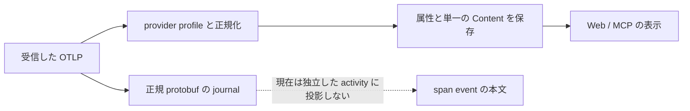

# OTel 入力・コンテキストの可用性

## 1. 確認範囲と表示の境界

**既存 projection で表示できる中心は、Claude Code の prompt/response/tool input と、Codex の prompt/tool output である。** AGENTS.md や Skill の本文を一括して「モデルへの入力」と表示できる契約は確認できない。参照、tool の入出力、モデルへの入力は、受信した証拠に応じて区別する。

| 対象 | 確認した版・範囲 |
| --- | --- |
| agentmetry | `ed6e5038d82d67298c8a569ad67f955caadd5cc9` の profile、normalizer、保存・read API、Web、既存テスト。確認日 2026-09-04 |
| Claude Code | [source 仕様](https://github.com/kotokumu/agentmetry/blob/main/docs/source-telemetry/claude-code.md) の 2026-08-17 snapshot。公式文書 `CLAUDE-MONITORING` の保存された記述を使用する。上流の最新動作の再取得・実測ではない |
| Codex | [source 仕様](https://github.com/kotokumu/agentmetry/blob/main/docs/source-telemetry/codex.md) の 2026-08-17 snapshot。上流実装の固定 commit は `c6058ccaa91ab17159cf805bf4d6d4edd87fe5fc`。それ以降の版の送信内容は未検証 |
| fixture | リポジトリ内で `pdata` または `source.Event` を組み立てる合成データ。実ユーザーの capture ではない。providerlive テスト、外部 API 呼出し、私的な telemetry は使用しない |

表の「raw 保持」は、受信済み OTLP を正規 protobuf として journal に保存できることを指す。HTTP JSON の元の文字列・並び順を保存するという意味ではない。正常に decode できた export を対象とし、送信元が省略した本文を復元するものではない。[受信処理](https://github.com/kotokumu/agentmetry/blob/main/internal/ingest/otel/receiver.go#L83)

この図は現行実装の経路を示す。`NormalizeTraces` は span attributes を読み、`span.events` を巡回しない。`BuildTraceObservations` も span 単位であり、event を別の observation にしない。[正規化](https://github.com/kotokumu/agentmetry/blob/main/internal/ingest/otel/normalize.go#L23)、[observation 作成](https://github.com/kotokumu/agentmetry/blob/main/internal/ingest/otel/observations.go#L16)

---

## 2. Claude Code

Claude の根拠は、snapshot の log schema、trace schema、content controls と [Claude profile](https://github.com/kotokumu/agentmetry/blob/main/internal/source/claude/plugin.go#L30) である。表の ID は送信される場合に使用できる。本文がないことだけで、設定無効・秘匿・未送信の理由を特定しない。

| 内容 | 受信 field・出典 | 対応 ID | raw 保持 | 現行 projection と Web | 可用性・意味の限界 |
| --- | --- | --- | --- | --- | --- |
| ユーザープロンプトの log | `claude_code.user_prompt` の `prompt`、`prompt_length`。snapshot §5-2 / §8 | `session.id` → run、`prompt.id` → PromptID。`message.uuid` は属性保持のみ。native trace/span ID は存在時 | 受信 field を保持 | `prompt` → `content` → log Body → Activity.Content。本文を表示可能 | `OTEL_LOG_USER_PROMPTS` で本文を制御。既定は秘匿。これは記録されたユーザープロンプトであり、system 指示を含む完全な API 入力ではない |
| interaction span のプロンプト | `claude_code.interaction` の `user_prompt`、`user_prompt_length`。snapshot §7-2 | `session.id`、`prompt.id`、trace/span ID | 受信 field を保持 | `user_prompt` は現在の content alias に含まれない。属性には残るが本文として出ない | log の `prompt` と別 field。span に存在しても UI 本文が空になる。既定は秘匿 |
| assistant の応答 | `claude_code.assistant_response` の `response`、`response_length`、`model`。snapshot §5-2 / §8 | `session.id`、`prompt.id`、条件付き `request_id`、`message.uuid` | 受信 field を保持 | `response` → `content`。イベントは `gen_ai.response.completed`。本文を表示可能 | text blocks のみ。`OTEL_LOG_ASSISTANT_RESPONSES` で制御し、未設定時は prompt 設定を継承。モデルの全出力形式を含む保証はない |
| tool の引数・操作先 | `tool_result.tool_input` / `tool_parameters`、`tool_decision.tool_parameters`。tool span の `full_command` / `file_path`。snapshot §5-3 / §7-2 | `tool_use_id` → `gen_ai.tool.call.id`、`session.id`、`prompt.id`、存在時 trace/span ID | 受信 field を保持 | profile の優先順で一つを `content` にする。通常 `tool_input` → `tool_parameters` → `full_command` → `file_path` | detail 設定で省略される。`tool_input` は JSON 文字列で、値ごと・全体の切詰めがある。permission 判断前後の引数は同一とは限らない |
| tool の出力本文 | `claude_code.tool` の `tool.output` span event。snapshot §7-1 / §7-2 / §8 | 親 span の trace/span ID、親属性の tool call ID。event 自体の固有 ID は未確認 | event ごと保持 | span event を読み取らず、tool 出力本文としての投影・表示はない | `OTEL_LOG_TOOL_CONTENT` が必要。snapshot は「input/output body attributes」とだけ記載し、正確な属性名・型を列挙していない。ここで推定の field 名を導入しない |
| 生の API request / response | `api_request_body` / `api_response_body` log の `body` または `body_ref`、`body_length`、`body_truncated`。snapshot §5-2 / §8 | `session.id`、`prompt.id`。response 側は条件付き `request_id`。request ごとの結合が常に一意かは未確認 | inline 本文または参照文字列を保持 | `body` / `body_ref` は content alias に含まれる。受信すれば単一文字列として表示可能。構造化されたモデル入出力の専用表示はない | raw body logging は既定で無効。`body_ref` は本文でなくファイル参照であり、agentmetry は参照先を取得しない。inline 切詰めを全量と表示しない |
| AGENTS.md / CLAUDE.md / 通常ファイルの参照 | tool の `file_path` / `tool_input` に対象がある場合。`at_mention` は `mention_type` / `success`。snapshot §5-3 / §7-2 | tool call、prompt、session、trace/span の各 ID が存在する範囲 | 受信 field を保持 | path / 引数は表示可能。`at_mention` に path や本文の公開 field は確認できない | 読み取り操作先だけではファイル本文やモデルへの入力を証明しない。自動ロードされた指示ファイル本文の専用イベントは snapshot にない |
| Skill の使用・内容 | `skill_activated` の `skill.name` / `skill.source` / `invocation_trigger`、tool span の `skill_name`。snapshot §5-4 / §7-2 | session、prompt、存在時 trace/span ID | 受信 field を保持 | 属性として保持。Skill 本文の専用投影はない。単なる activation は Content にならない | 名前・起動事実と本文は別。名称は details 設定によって一般化される。`tool.output` や inline API body 内に本文がある可能性は、対応 fixture で未検証 |
| system/developer 指示を含む入力全体 | 上記 inline `api_request_body.body` に存在する場合の候補 | request への関連づけは受信 ID に依存 | 受信本文を保持 | 現状は body 文字列。role や由来を解析する契約はない | 専用の指示 field と AGENTS.md 由来の対応関係は未確認。`llm_request.context` の名前だけから入力全文と解釈しない |

profile は元の属性を clone して alias を追加する。`content` は `prompt`、`response`、`tool_input`、`tool_parameters`、`full_command`、`file_path`、`error`、`body`、`body_ref` の優先順である。複数の内容が同一 record にあっても、現行 Web はその全 field を個別表示しない。[alias の実装](https://github.com/kotokumu/agentmetry/blob/main/internal/source/claude/plugin.go#L55)

---

## 3. Codex

Codex の根拠は、snapshot が固定する central event 実装の log/trace-safe field と [Codex profile](https://github.com/kotokumu/agentmetry/blob/main/internal/source/codex/profile.go#L24) である。上流の event 一覧は網羅的な保証ではないため、「未確認」は Codex のすべての経路で送信不能という意味ではない。

| 内容 | 受信 field・出典 | 対応 ID | raw 保持 | 現行 projection と Web | 可用性・意味の限界 |
| --- | --- | --- | --- | --- | --- |
| ユーザープロンプトの log | `codex.user_prompt` の `prompt` / `prompt_length`。snapshot §5-2 / §8 | `conversation.id` → run。profile は `turn_id` / `turn.id` / `prompt_id` / `prompt.id` を受信時に PromptID へ寄せる。native trace/span ID は存在時 | 受信 field を保持 | canonical の `prompt` 選択で Activity.Content。本文を表示可能 | `otel.log_user_prompt=false` では `[REDACTED]`。現行 UI は秘匿状態型として扱わず、この文字列を表示する |
| trace-safe な user prompt event | `Span.events` の `codex.user_prompt`。`prompt_length` と入力数。snapshot §7-2 | 所属 span の trace/span ID、event の `conversation.id` | event ごと保持 | event を独立投影しない。本文は元から含まれない | `prompt` を省略する。log の本文を trace-safe event から再構成できない |
| assistant の応答本文 | `codex.sse_event` の `event.kind=response.completed` は usage / time 等。snapshot §5-2 / §7-2 | conversation、条件付き request/response ID。profile の UsageID は受信 field または会話＋時刻 | 受信 field を保持 | `gen_ai.response.completed` として usage は投影されるが、この mapping 自体は応答本文を作らない | snapshot の central event には assistant text の field を確認できない。応答完了イベントの存在は本文受信を意味しない |
| tool の引数 | log `codex.tool_result.arguments` と `tool_name` / `call_id`。snapshot §5-2 | `call_id` は属性保持。rework 側で tool identity として参照。conversation、存在時 trace/span ID | 受信 field を保持 | `arguments` JSON 内の `message` を Content に使う。一般の `cmd` / `command` / file path 等の引数全体は Content に出さない | 即時失敗では call_id / arguments がない場合がある。prompt logging 無効でも arguments はこの固定実装で出力される |
| tool の出力 | log `codex.tool_result.output`。snapshot §5-2 / §8 | tool の引数と同じ record / call_id | 受信 field を保持 | 非空の `output` を `Result: ...` として Content に含める。入出力があれば一つの文字列に結合 | 出力本文の表示は可能。field ごとの全文性・秘匿の統一状態はない。出力が後続モデル入力に含まれたことまでは示さない |
| trace-safe な tool result event | `Span.events` の `codex.tool_result`。入力/出力長・行数、tool origin、失敗情報。snapshot §7-2 | 親 span の trace/span ID、受信された conversation / call_id の範囲 | event ごと保持 | event を独立投影しない。arguments / output 本文は元から含まれない | log の tool result と同じ内容と扱わない。本文がない理由はこの signal の仕様であり、空文字の tool result を意味しない |
| agent への指示 | profile が扱う tool `arguments.message`、agent communication の sender / receiver fields | `sender_thread_id`、`receiver_thread_id`、target、conversation。spawn send は session link を作る | 受信 field を保持 | message と output を結合。message が `gAAAA` で始まる場合は説明文字列に置換 | この prefix 判定は agentmetry の既存処理であり、snapshot の一般的な暗号形式の保証ではない。暗号文は元属性に残り、復号しない |
| AGENTS.md / Skill / 参照ファイルの内容 | tool arguments に参照先、tool output に本文が存在する場合の候補 | 同一 tool result の call_id、conversation、存在時 trace/span ID | 受信した arguments / output を保持 | output は表示可能。一般引数内の path は Web の独立 field として出ない | AGENTS.md 自動注入の本文・由来を表す専用 field は snapshot にない。ファイル名からモデル入力と推定しない。該当する実行内容 fixture は未確認 |
| Skill の注入・system/developer 指示 | snapshot §6-3 に `codex.skill.injected` 等の metric catalog。system/developer 本文の専用 event は未確認 | metric に付く context の範囲。モデル request 単位の input ID は未確認 | 受信 metric / 属性を保持 | Skill 本文・role 別入力を表示する投影はない | metric 名や skill tag は本文ではない。metric の実際の出力は callsite と版に依存し、完全な context 一覧を表さない |

Codex の `arguments` / `output` は、Claude の `tool_input` / `tool.output` と保存場所・表示経路が異なる。共通の「tool 内容」ラベルだけで対応づけず、provider と signal と field を持った出典を使う。[tool 内容の構成](https://github.com/kotokumu/agentmetry/blob/main/internal/source/codex/profile.go#L100)

---

## 4. 共通の保存・read contract

| 経路 | 現行の動作 | 入力表示で維持する条件 |
| --- | --- | --- |
| log の内容 | `DeriveActivity` の非空 Content が native LogRecord body に優先する。Content がなければ native body を使う | native body 由来か属性由来かを新しい表示で区別する場合、現行の Content 文字列だけから逆算しない |
| span の内容 | resource と span 属性をマージして Content を派生する。span event はそのマージに入らない | 未投影 event を「未送信」と説明しない |
| 保存 | Content と属性を保存。raw journal と semantic projection は別。意味のない runtime span は query 用テーブルに出ない | raw の全件と UI activity の全件を同一視しない |
| Web read API | protobuf Activity は単一 `content` と限定 metadata を持つ。元属性一覧と本文の由来・秘匿・切詰めの型はない | 既存データで先行する表示と、API に追加が必要な証拠表示を分ける |
| Web の本文 | activity table は 180 文字超を展開式、trace は本文を表示。空は `—` | 空、秘匿、未返却、未投影、filter 非表示を同じ意味にしない |
| MCP の本文 | `includeContent` は既定 false。`contentState` は `not_returned` / `unavailable` / `available` | 本文 opt-in を維持する。非空の `[REDACTED]` は現在 `available` となるため、現行の state を本文の完全性の証拠にしない |

根拠：[Content 派生](https://github.com/kotokumu/agentmetry/blob/main/internal/canonical/activity.go#L5)、[log 正規化](https://github.com/kotokumu/agentmetry/blob/main/internal/ingest/otel/normalize.go#L62)、[activity 読み出し](https://github.com/kotokumu/agentmetry/blob/main/internal/storage/sqlite/overview.go#L287)、[Activity schema](https://github.com/kotokumu/agentmetry/blob/main/proto/agentmetry/v1/agentmetry.proto#L99)、[Web 本文](https://github.com/kotokumu/agentmetry/blob/main/web/src/components/activity-table.ts#L262)、[MCP state](https://github.com/kotokumu/agentmetry/blob/main/internal/transport/mcpserver/server.go#L1021)。

---

## 5. 既存 fixture と検証できる範囲

| 実在するテスト・fixture | 確認できること | 確認できないこと |
| --- | --- | --- |
| [TestClaudeTelemetryBuildsDashboardParityProjection / claudeLogs / claudeTraces](https://github.com/kotokumu/agentmetry/blob/main/internal/source/claude/parity_test.go#L22) | pdata の prompt / response と trace tool から session、本文、PromptID、UsageID、関連 trace を得る。Read の対象は `main.go` | native capture との一致、AGENTS.md 本文、tool.output event、raw API body、秘匿設定ごとの差 |
| [TestPluginProfilesClaudePromptResponseAndToolResultContent](https://github.com/kotokumu/agentmetry/blob/main/internal/source/claude/plugin_test.go#L187) | `source.Event` の prompt / response / tool_input を content にする。tool input は `file_path=main.go` の JSON 文字列 | tool output 本文、body_ref、切詰め、interaction.user_prompt |
| [TestPluginProfilesClaudeTraceAgentAndToolOperations](https://github.com/kotokumu/agentmetry/blob/main/internal/source/claude/plugin_test.go#L114) | tool_use_id と full_command の投影、agent identity | 実ファイルの本文取得・モデル入力への使用 |
| [TestCodexNativeUsageBuildsOneObservedDashboardTotal / codexUsageLogs / codexUsageTraces](https://github.com/kotokumu/agentmetry/blob/main/internal/source/codex/parity_test.go#L21) | pdata の prompt、response.completed usage、trace の対応づけと usage の二重計上防止 | assistant 応答本文。prompt fixture に文字列はあるが Content 自体の assertion はない。tool 引数・出力の全経路 |
| [TestNormalizeSpawnResultFromCodexOTLP](https://github.com/kotokumu/agentmetry/blob/main/internal/source/codex/profile_test.go#L12) | `source.Event` にある arguments.message の暗号 prefix と output / target を扱い、派生 Content に暗号文を出さない | trace-safe field との対比、通常の exec 引数の表示、暗号方式や元属性の秘匿保証 |
| [TestNormalizeLogsUsesEventNameAndBody](https://github.com/kotokumu/agentmetry/blob/main/internal/ingest/otel/normalize_test.go#L90) | native log body の fallback | provider 固有本文 field の網羅性 |
| [TestTraceObservationsProjectSemanticMetadataWithoutDuplicatingPayload](https://github.com/kotokumu/agentmetry/blob/main/internal/ingest/otel/observations_test.go#L12) | `tool-finished` event と link を持つ合成 span から observation を 1 件作る | event 本文の取り出し、provider の tool.output key、journal round trip の本文同一性 |
| [TestCommitExportAtomicallyStoresJournalObservationsAndReadModel](https://github.com/kotokumu/agentmetry/blob/main/internal/storage/sqlite/journal_test.go#L56)、[TestCommitExportRetainsRawPayloadWhenNormalizationFails](https://github.com/kotokumu/agentmetry/blob/main/internal/storage/sqlite/journal_test.go#L169) | export の payload と projection の保存関係、正規化失敗時の raw 保持 | 使用する payload は簡略 byte 列。provider 固有の内容を含む export の完全な round trip |
| [TestGetRunTimelineHidesContentByDefault](https://github.com/kotokumu/agentmetry/blob/main/internal/transport/mcpserver/server_test.go#L214) | 本文を既定で返さず、opt-in で返す | provider 別の秘匿・切詰め・参照先だけの判定 |

AGENTS.md の名前を持つ [fingerprint テスト](https://github.com/kotokumu/agentmetry/blob/main/internal/harness/fingerprint_test.go) はローカルファイルの hash 計算であり、OTel に本文が載ることの証拠には使わない。両 provider の `providerlive` テストも CLI 出力の usage を正規化するもので、本文の OTLP capture を検証するものではない。

2026-09-04 の限定実行では、Claude の本文 alias / parity、Codex の spawn content / usage parity、native log body / trace 属性、journal 保存 / 正規化失敗時の保持に関する既存 8 テストが成功する。対象 package は `internal/source/claude`、`internal/source/codex`、`internal/ingest/otel`、`internal/storage/sqlite`。その他の表中テストはソースを確認し、この調査では追加実行しない。

---

## 6. 後続タスクで使う判断

| 対象 | 判断 | 根拠と追加確認 |
| --- | --- | --- |
| タスク 4.2：本文パネル | 現在の Activity.Content で先行可能 | Claude prompt/response/tool input、Codex prompt/tool output を読む。空や marker を新しい本文に置換しない |
| タスク 4.3：種別・受信出典 | provider / signal / event / field の根拠を使う。Content だけから元 field を断定しない | 既存 read API は元属性を返さない。必要な証拠だけを限定して渡す契約が必要。AGENTS.md の名前だけでモデル入力に分類しない |
| タスク 6.1：可用性 | projection の取得範囲、本文の受信状態、表示条件を分ける | 明示 marker、`body_ref`、`body_truncated` を失わない。理由がない欠落を「秘匿」と断定しない |
| タスク 6.2：raw と投影の差 | Claude interaction.user_prompt、Claude tool.output event、Codex trace-safe event、一般 tool arguments を調査対象にする | exact field、対応 ID、event 時刻、重複を fixture で検証する。Claude tool.output の field 名は snapshot だけでは確定できない |
| タスク 6.3：拡張の採否 | 本文の価値が確認できた mapping のみ後続 change にする | AGENTS.md/Skill の自動収集、body_ref のファイル取得、リポジトリ照会へ置き換えない。受信しないものは未報告のまま扱う |

未確定の本文 mapping があっても、根拠 span への移動・Web/MCP 比較・既存本文パネルは進められる。モデルへの入力が明示された本文と tool の出力を区別できる証拠がない場合、表示は「受信した本文」までに留める。
