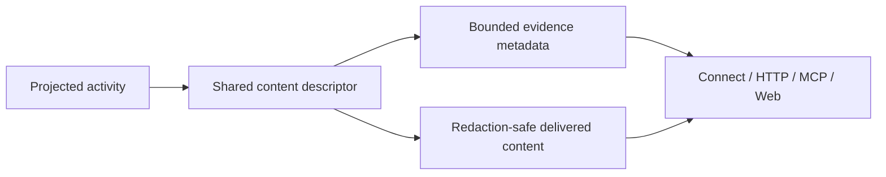

# Content evidence implementation

Task 4.3 and the query/Connect/HTTP/MCP/Web-model portion of 6.1 are implemented. `DescribeActivityContent` is a pure query function over the received projected activity. The 2026-09-04 implementation uses the provider aliases documented in `content-availability.md`; it performs no external reads or ingestion changes.

---

## 1. Contract

`ContentEvidence` carries source, activity ID, signal, semantic kind, evidence strength, body availability, allowlisted field names, truncation and explicit redaction reason. It carries no attribute values, body references, ciphertext or body. A received reference remains visible through the existing content field, with `reference` evidence and `not_reported` body availability. Codex output is read/output evidence and never establishes model inclusion. Explicit Claude request bodies are confirmed only as the received request body, without claims about omitted content.

Unknown provider/legacy content remains `unknown`; empty content is `not_reported`, without guessing producer configuration. Codex producer redaction and the existing encrypted-input rule produce `redacted` where the whole projected content is unreadable. The adapters suppress that body. Encrypted input may coexist with readable output, which remains available and keeps the encrypted-input reason. Metadata includes only the matching projected field keys, never the full attributes map.

Connect adds optional `Activity.content_evidence` at field 30. Legacy HTTP activity responses add the same descriptor to copied query values. All adapters share `ContentForDelivery` for explicit redaction suppression. MCP uses the same interpretation and overrides availability to `not_returned` when includeContent is omitted/false. Its existing contentState remains compatible. The Web mapper accepts these codes and falls back to unknown semantics for absent, incompatible or differently associated metadata. Existing `coverage.activityCoverage` describes projection analysis independently; it is not derived from content availability or presentation filters. No new schema/storage state is needed for that separation.

---

## 2. Verification

| Layer | Actual red | Actual green |
|---|---|---|
| Query | gotests scaffold with 25 independent provider cases failed against the empty descriptor implementation | `go test ./internal/query -run '^TestDescribeActivityContent$' -count=1`; full query suite also passed |
| Connect/MCP mappers | 3 Connect and 4 MCP cases failed for missing metadata and returned redaction markers | Focused mapper suites passed; proto comparison uses protocmp |
| Shared delivery / legacy HTTP | Redaction case failed before suppression; all five activity response paths failed for missing metadata and returned redaction markers | Three shared-delivery cases and five HTTP paths passed; full query/HTTP suites passed. HTTP mapping preserves the input records and excludes attributes |
| Public transport parity | Initial execution was blocked by the loopback sandbox; an unrelated incomplete harness fixture was then corrected | `TestActivityContentEvidencePublicTransportParity` passed over temporary Connect/MCP HTTP servers. It checks exact metadata, body opt-in, absence/redaction, complete projection coverage and no attribute/body sentinel leak |
| Web model/mapper | 6 new cases failed before mapper existed | API test file: 15/15 passed; `npx tsc -b` passed |
| Generated contract | Additive proto field | Repository `buf generate` passed with configured remote generators; no manual generated edits |

Focused Go rerun and `git diff --check` passed. A concurrent full transport run encountered the sandbox listener restriction and the filter worker's expected red test; it is not reported as a completed full regression gate. The final integration gate belongs to the root task.

---

## 3. Files

- Optional query Activity descriptor field in `overview.go`; new query descriptor and tests: `internal/query/activity_content.go`, `activity_content_test.go`.
- Additive proto/generated Activity metadata; Connect/MCP activity mappings and tests; HTTP response mapping and `content_test.go`.
- Web `model/telemetry.ts`, `api/agentmetry-client.ts`, and mapper tests.

Component rendering is owned by the Web worker and root. The raw journal comparison and projection follow-up decision are recorded separately by tasks 6.2/6.3/8.2.
