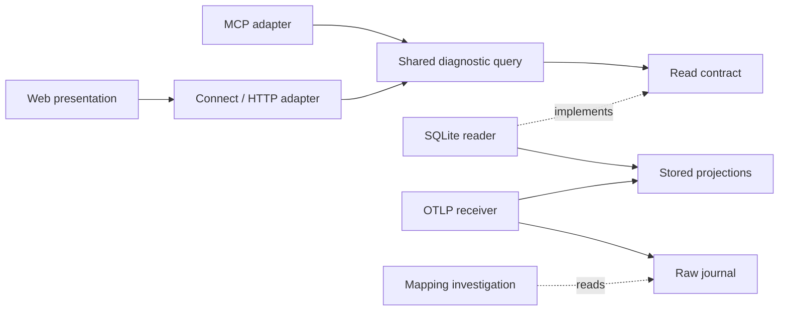

## Context

現行の [query](https://github.com/kotokumu/agentmetry/blob/main/internal/query/api.go) は source と会話 ID、ページ、activity anchor を扱う。[trace query](https://github.com/kotokumu/agentmetry/blob/main/internal/query/trace.go) は全体の時刻・件数とページ内 activities を返す。[navigation](https://github.com/kotokumu/agentmetry/blob/main/web/src/app/navigation.ts) は会話内の trace/span 指定と戻り状態を持つが、trace URL は trace ID だけを受ける。

[Web の比較計算](https://github.com/kotokumu/agentmetry/blob/main/web/src/model/rework-comparison.ts) はフロントエンドにある。[MCP の compare_runs](https://github.com/kotokumu/agentmetry/blob/main/internal/transport/mcpserver/server.go) は 1〜10 件の明示された実行の集計値を返し、正規化した前後比較とは契約が異なる。Web は [protobuf API](https://github.com/kotokumu/agentmetry/blob/main/proto/agentmetry/v1/agentmetry.proto) と Connect を使う。

---

## Goals / Non-Goals

**Goals:**

- 既存 query を共有し、Web/MCP で診断の意味を一致させる。
- source-qualified identity と activity anchor を、根拠移動・詳細・URL 状態で共通に扱う。
- 受信した証拠の種類と、不足・未投影・非表示を独立して表現する。

**Non-Goals:**

- 全画面の状態を一つの汎用フレームワークへ置き換えること。
- raw のブラウザ直接走査、未検証の provider mapping、常駐の再投影処理。
- 既存の集計比較 API に新しい前後比較の制限を適用すること。

---

## Decisions

### 責任と依存方向

| 責任 | 所有する層・対象 | 境界 |
| --- | --- | --- |
| 診断値・比較可否・分母・coverage | Go の `internal/query` | UI や MCP の型に依存しない |
| 条件に合う会話集合、対象 span と概要の取得 | query の read contract と `internal/storage/sqlite` | ページ読込済みの集合だけで絞り込まない |
| ワイヤ形式・入力検証・互換性 | protobuf/Connect、HTTP、MCP adapter | 診断の式を adapter ごとに複製しない |
| URL・履歴・選択・目的別 view | Web app/navigation | 診断の式を持たず、返却値を表示する |
| 本文・欠測・時系列の見せ方 | Web components/presentation | 証拠を超える因果・モデル入力の判定をしない |
| provider ごとの受信情報と投影可否の確認 | source-telemetry 文書、既存 profile/normalizer の調査 | 不明な上流フィールドを新仕様として定義しない |

### 根拠移動と詳細

trace URL に任意の対象 span を追加し、ID から対象を含む範囲を query で取得する。既存の会話内 anchor と戻り状態を再利用し、履歴には選択中の目的別 view も保持する。URL は対象、履歴状態は戻り位置を担う。trace 全体のエラー自動展開だけに依存すると複数失敗を区別できないため、対象の明示選択を追加する。

エピソードは返却済みの全件を段階表示する。分析自体が partial の場合は総実行の全件表示とは説明しない。本文詳細は既存 activity の content/attributes を起点にし、大きい本文の制限と「続きがある」状態を引き継ぐ。

### 共有比較と互換性

Go query に baseline/current の診断比較を置く。Web は追加の protobuf/Connect read API を使い、MCP は read-only の `compare_rework` を追加する。既存 `compare_runs` は 1〜10 件の集計比較として維持する。単一 tool に別種の可否条件を混ぜる案は、既存利用の制限や暗黙の baseline 選択を招くため採らない。

5 指標の計算と可否判定は現行 Web の意味を基準に固定データで照合し、Web 側の重複計算を除く。新しい report は値・分子・分母・単位・差・availability と読み取り範囲を返す。同一の query 内で比較対象を読み、更新中の前後を混ぜない。既存 harness 表示は維持するが、本比較の追加に設定管理を結びつけない。

### 入力・コンテキストと raw の境界

raw journal は現在の原本保持契約を維持する。UI の内容は既存 canonical projection から取得し、raw を保持している事実だけで本文を取得済みとは示さない。参照先だけ、read/tool の戻り本文、明示されたモデル入力を区別し、分類できない本文は一般の activity content として扱う。

作業群 5 の最初の調査で Claude Code と Codex を別々に確認し、「raw に存在」「既存 projection に存在」「欠落・秘匿」「意味を判断できない」を記録する。AGENTS.md 等の文脈が存在しないことも有効な調査結果とする。span event の投影変更が必要なら、原本・identity・usage 重複・保存済みデータへの適用範囲を明確にした別 change の要件を作る。この判断は、既存本文で進められる作業群 1〜4 を止めない。

### フィルタと保存条件

会話一覧のサーバー側 read contract に observed failure、経過時間の下限/上限、model、tool を追加する。経過時間は会話の記録済み開始から終了までとし、tool の時間とは混ぜない。model/tool は会話内の存在条件で AND 結合する。少数の定型コントロールから始め、汎用の検索言語は導入しない。

保存条件は Web profile の local storage に版付きで保持する。名前・保存条件の置換・削除を扱い、本文の複製は保存しない。SQLite に利用者設定 API を作る案は、単一ローカル UI のためにサーバー書き込み面を増やすので採らない。URL と保存条件は同じ正規化済み filter を使う。時間範囲は既存の 1h/24h/7d の相対条件で、再適用時に評価し直す。

### 長い trace と状態保持

全体の概要は保存済み projection の軽量な時刻・種別・状態から生成し、本文は選択範囲で取得する。詳細 200 件の窓を全体図として描く案は採らない。query は全体の範囲・対象件数・概要の coverage を返し、部分結果にはその旨を示す。拡大は表示範囲だけを変え、全体時刻と選択は保持する。live 更新時も、利用者が読んでいる本文や範囲を強制移動しない。

---

## Risks / Trade-offs

- 受信したコンテキストが source ごとに異なる → 先行調査と別々の fixture で可用性を明記し、一般の本文表示から開始する。
- 診断の計算移動で丸めや欠測が変わる → 既存の意味を入力/期待値 fixture に固定し、query と両 adapter を比較する。
- 条件検索や概要の集計が重くなる → 本文を集計対象から分け、実行計画を確認して必要な index だけを追加する。
- 新着データがある間の一覧・比較の不一致 → query 内の読み取り整合性を確保し、結果の範囲を表示する。
- 保存条件が後の schema と合わなくなる → 版を検証し、未対応条件を黙って落とさず再編集を促す。
- 色・狭いパネルに依存した状態表示 → ラベル、focus、狭幅時の切替、200% 拡大で検証する。

---

## Migration Plan

1. 既存の読み取り契約と検証データを確保し、Go の共有比較と追加 read API を導入する。
2. Web を追加 API へ切り替え、既存の比較・navigation のテストを維持する。
3. 作業群ごとに UI を導入し、保存条件に版を付ける。未対応の古い API では新機能を利用不可として表示する。
4. index の追加が必要な場合は既存 migration の方式に従い、raw の書き換えを行わない。旧 UI へ戻しても既存 read API と保存済み telemetry が使える追加的な変更とする。
