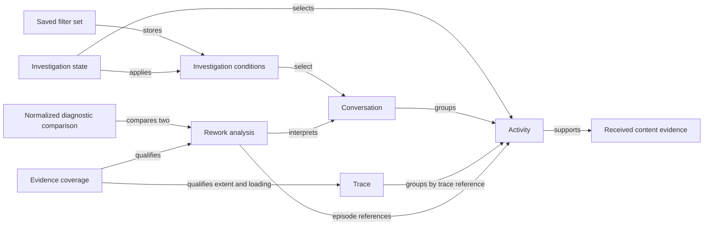

# Investigation conceptual model

## Initial model and minimality verdict

**PASS — initial minimality gate.** The model uses evidence packet `OTEL-INVESTIGATION-1`, its accepted investigation and diagnostics requirements, and baseline `ed6e5038d82d67298c8a569ad67f955caadd5cc9`. Independently authored evolution scenarios and the proposed design, proposal, and tasks are excluded from this initial gate.

The concepts below describe problem meaning and responsibility candidates. They do not require a corresponding class, interface, service, or package. Existing conversation, activity, trace, and rework concepts remain the foundation.

---

## Conceptual Model

| Concept | Meaning | State | Behavior | Constraint / Invariant |
|---|---|---|---|---|
| Conversation | A received execution grouping identified within a source | Source-qualified identity, observed start/end, projected activities | Establish membership and conversation-level observed properties | Equal unqualified IDs from different sources are different conversations; absent duration or outcomes are not positive evidence |
| Activity | One addressable projected execution record | Existing activity identity; trace/span reference when present; parent, time, kind, metadata | Establish exact selection and reported parent relationship | An exact evidence request never falls back to a different record; absent parent remains absent |
| Received content evidence | The meaning and availability of content associated with an activity | Source, activity identity, known/unknown kind, available body or explicit availability state, supported provenance | Distinguish reference, received read/tool output, and explicitly reported model input using verified provider interpretation | Read/reference alone does not confirm model-input inclusion; unknown absence is unreported; explicit producer redaction/encryption is not readable content |
| Evidence coverage | The scope within which retained, projected, analyzed, loaded, and visible information is described | Scope, retained-projection counts/completeness, loaded subset, display conditions; unknown information stays unknown | Explain completeness relative to a named scope | Complete analysis of projections does not prove collection of the complete execution; filtering and content availability do not redefine projection completeness |
| Trace | The trace-identified temporal and parent-linked grouping of projected activities | Trace identity, overall observed extent, activity count, reported parent links | Establish overall time reference and retain missing-parent evidence | A selected time range or detail page does not redefine overall extent; overlap does not prove causality |
| Rework analysis | Existing diagnostic interpretation of a conversation's retained projection | Source-qualified subject, measured inputs, reported episodes, analysis coverage | Associate every reported episode with its evidence and measurements | All reported episodes remain reachable; counts and measurements retain their analysis scope; observed tool success is not task achievement |
| Normalized diagnostic comparison | The ordered baseline/current pair and its five diagnostic results | Explicit pair, eligibility result, snapshot-scoped analyses, metric operands, units, values, deltas, availability reasons | Validate eligibility and derive shared results | Distinct same-source conversations with valid times and baseline end no later than current start; unavailable operands/denominators never fabricate zero; presentation rounding does not change values/deltas |
| Investigation conditions | Reusable predicates for selecting conversations or a visible activity subset | Time condition, source, text, observed failure, duration, model/tool; trace range/type/error conditions where applicable | Validate conditions, resolve relative time, and evaluate conditions at their declared scope | Conversation conditions apply before pagination and deduplication is preserved; model/tool may match different activities; invalid or unsupported conditions are not silently discarded |
| Saved filter set | Named investigation conditions retained in a local Web profile | Name, supported stored conditions, persistence outcome | Save, apply, replace, delete; re-evaluate relative time when applied | A save failure is not success; application restores conditions rather than a frozen result set; stored unsupported conditions remain explicit |
| Investigation state | The user's current selection, reading position, applied query, and return context | Conversation/activity selection, purpose view, selected agent, draft/applied conditions, range, list/detail position, originating control and focus | Select exact evidence, switch views, apply valid conditions, return, reconcile incoming updates | Live arrivals do not replace the selected activity or reading position; unavailable target keeps return context; last valid results retain their applied-query identity |

---

## Relationships

| Concept A | Relationship | Concept B | Notes |
|---|---|---|---|
| Conversation | Groups records by source-qualified membership | Activity | Navigation and analysis keep this identity together |
| Trace | Groups records by trace identity | Activity | A trace can refer to several source-qualified conversations; a conversation and trace are not interchangeable |
| Activity | Supplies the received facts for | Received content evidence | Body retrieval uses the existing activity-read limits |
| Rework analysis | Summarizes observed behavior of | Conversation | Each result identifies its subject and analyzed coverage |
| Rework analysis | References evidence through reported episodes | Activity | Episode detail is an analysis-owned result; its trace/span reference remains exact |
| Evidence coverage | Qualifies the available/analyzed scope of | Trace / Rework analysis | Loaded and filtered subsets remain distinct from total retained projection |
| Normalized diagnostic comparison | Uses baseline/current roles for | Rework analysis | Both roles come from one coherent retained-data read; legacy aggregate comparison keeps its own existing contract |
| Investigation conditions | Select conversations or visible activities in | Conversation / Trace | These scopes are explicit; selection is independent of current visibility |
| Saved filter set | Stores reusable conditions for | Investigation conditions | It does not own query results or active navigation |
| Investigation state | Applies conditions and holds selected record/return context for | Investigation conditions / Activity | Browser history restores applied state; invalid drafts do not relabel the displayed results |

---

## Concept Justification

| Concept | Requirement / Evidence | Rule / Identity / Lifecycle / Authority | Why Removing or Merging Loses Meaning |
|---|---|---|---|
| Conversation | R1, R4, R7–R8; source-qualified query evidence | Source-qualified identity and membership | A trace may cross conversation boundaries; unqualified IDs can collide across sources |
| Activity | R1, R3, R9; exact diagnostic trace/span reference | Exact evidence identity and reported metadata | Conversation selection alone cannot distinguish multiple failed spans or preserve an activity being read |
| Received content evidence | R9–R10, R12; provider-specific mappings and raw-only events | Authority of received content and explicit availability | A body string or generic missing flag cannot distinguish a reference from model input, or unreported from producer-redacted content |
| Evidence coverage | R2, R6–R8, R11 | Completeness relative to retained projection and analysis/display scope | Merging it into content availability or visible count makes complete analysis and missing bodies indistinguishable |
| Trace | R6; baseline trace includes full counts/extent and a detail page | Overall temporal scope and reported parent relationships | Conversation membership does not supply trace extent; viewport time has a different lifecycle from the overall trace |
| Rework analysis | R2, R7–R8; existing episodes and measured diagnostics | Ownership of diagnostic interpretation, episodes, and coverage | Raw activities do not themselves express analysis coverage or the reported episode set |
| Normalized diagnostic comparison | R7–R8; five baseline Web diagnostics | Ordered pair eligibility, normalization, missingness, and difference rules | An individual analysis cannot enforce pair eligibility or express a cross-analysis difference |
| Investigation conditions | R4–R6; existing time/source/text filters | Predicate validity, scope, and relative-time meaning | Navigation state alone cannot explain which full-set query produced results or what a saved condition means |
| Saved filter set | R5 | Named local lifecycle and persistence success | Active conditions do not have a name or save/replace/delete lifecycle; browser history is not the saved collection |
| Investigation state | R1, R3–R6, R13; existing return state | Authority over active selection, applied query, reading position, and focus | Domain records cannot own a user's navigation origin or prevent live updates from moving that user's selection |

---

## Minimality Check

| Candidate | Semantic Remove / Merge Test | Decision | Reason |
|---|---|---|---|
| Conversation | Remove identity; merge with Trace | Keep existing concept | Loses source-qualified membership and permits cross-source identity substitution |
| Activity | Merge with Conversation | Keep existing concept | Loses the precise evidence target and metadata/body association |
| Received content evidence | Merge with Activity body string | Keep meaning; may be an activity-owned value and rules | Provenance, explicit redaction, and unknown absence would be erased |
| Evidence coverage | Merge with availability or one loaded count | Keep meaning; use explicit scope information | Raw retention, analysis completeness, and filtered visibility describe different facts |
| Trace | Merge with Conversation or selected time range | Keep existing concept | Trace relationships and full extent would become dependent on the viewed subset |
| Rework analysis | Merge episodes and measurements directly into conversation navigation | Keep existing concept | Analysis ownership and coverage would be tied to UI state |
| Normalized diagnostic comparison | Merge with single-run analysis or legacy aggregate comparison | Keep separate rule set | Pair-specific restrictions must not constrain one-to-ten-run aggregate requests |
| Investigation conditions | Merge into raw URL strings or Saved filter set | Keep meaning; one condition vocabulary | Validity/scope are shared across query, URL/history, and saved conditions; unsaved conditions remain valid |
| Saved filter set | Merge with active Investigation state | Keep local lifecycle | Replacing a stored definition and changing the active view are independent operations |
| Investigation state | Split selection, detail, focus, origin, and purpose into separate conceptual controllers | Keep one state concept | These values jointly preserve a single user's investigation; no independent controller lifecycle is required |
| Failure episode | Introduce a new service or lifecycle around an existing reported episode | Retain analysis-owned passive result | R2 needs every reported result and exact references, not new episode management |
| Diagnostic metric definition | Introduce registry/provider plug-ins for five accepted metrics | Reject additional abstraction | A fixed cohesive rule set suffices; no runtime metric registration is required |
| Content provider / resolver / collector | Introduce generic resolution or external retrieval | Reject | Verified existing mappings are sufficient; collection beyond received OTLP is excluded |
| Trace overview / zoom manager | Separate extent, range, and filters into a new service concept | Merge into Trace, Evidence coverage, and Investigation state | Each rule already has an owner; an extra manager adds only coordination |
| Snapshot manager | Introduce persistent versions or snapshot lifecycle management | Reject additional concept | A coherent read is required; new persisted snapshot identity or version management is not |
| Filter parser / serializer / validator | Admit each transformation step as a model | Reject separate concepts | Parsing and serialization implement Investigation conditions; they have no independent problem identity |
| Provider configuration or outcome score | Model missing-content causes or productivity | Reject | No accepted requirement grants evidence or authority for those conclusions |

---

## Passive Data Artifacts

| Artifact | Meaning and owner | Required constraint | Representation decision |
|---|---|---|---|
| Conversation reference | Conversation identity carried by navigation/query/analysis | Source and conversation ID travel together | Reuse the existing identity vocabulary |
| Evidence reference | Target activity reference carried by a reported episode | Trace ID and span ID resolve the exact requested activity; retain source-qualified conversation when supplied | Value within activity/episode/navigation data |
| Failure episode result | Rework analysis output containing observed failure/retry evidence | Preserve every returned episode and its analysis coverage | Reuse existing reported episode structure |
| Diagnostic operands and result row | Normalized comparison's measurements and result | Preserve null versus zero, numerator, denominator, unit, availability reason, unrounded value/delta | Explicit result values; no separate lifecycle |
| Retained data snapshot | Cohort of retained facts used in one comparison read | Conversation timing, token totals, analysis inputs, and coverage agree within the read despite live arrivals | Read-consistency constraint; no persistent version model is required |
| Navigation return record | Investigation state's origin selection/position/focus | Missing evidence does not erase it | State data; no separate navigation service concept |

---

## Stateful Concepts

| Concept | State / Transition | Allowed / Forbidden | Enforcing Owner | Invariant |
|---|---|---|---|---|
| Investigation state | Selected target → loading → selected detail or unavailable target | Keep exact requested identity and return context; forbid alternate selection on lookup failure | Investigation state | Selection identity is independent of page position |
| Investigation state | View switch, live arrival, range/filter change | Keep selection and reading/return position; indicate when selection is outside visible conditions | Investigation state | Invisible is not missing; new data does not steal reading focus |
| Investigation state | Draft conditions → validation → applied conditions/results | Invalid drafts produce an error while the last applied query remains identifiable | Investigation state with Investigation conditions | Displayed results are never attributed to unapplied conditions |
| Saved filter set | Unsaved → save/replace/delete attempt → persisted result or reported failure | Confirm persistence only after success; report unsupported stored conditions on application | Saved filter set | Saved and active state are not conflated |
| Investigation conditions | Relative time condition → applied time bounds | Evaluate relative time at application; retain its relative meaning for saved reapplication | Investigation conditions | A saved relative range does not freeze a dataset |
| Normalized diagnostic comparison | Explicit pair → ineligible result or coherent comparison result | Invalid identity/time does not select a substitute baseline | Normalized diagnostic comparison | Pair identity and metric inputs agree |

---

## Relationship Semantics

| Concept A | Concept B | Cardinality / Direction | Lifecycle Ownership | Consistency Constraint |
|---|---|---|---|---|
| Conversation | Activity | One conversation groups zero or more retained projected activities | Projection owns stored membership | Activity membership preserves source-qualified conversation identity |
| Trace | Conversation | A trace references zero or more conversations; no one-to-one assumption | Neither owns the other's lifecycle | Grouping by trace does not replace source-qualified conversation identity |
| Activity | Activity parent | Zero or one reported parent reference per applicable record | Received record supplies the reference | A missing parent reference target remains visibly unresolved; overlap adds no parent link |
| Activity | Received content evidence | An activity can carry content evidence for supported fields | Activity read owns received facts | Content always retains source/activity association; external retrieval cannot fill a gap |
| Rework analysis | Activity | One analysis references zero or more activities through episodes | Analysis owns episode output, not activity retention | All reported episode evidence actions use their exact references |
| Normalized diagnostic comparison | Rework analysis | Exactly two roles: baseline and current | Comparison owns ordered pairing only | Both analyses and their conversation facts belong to one coherent retained-data read |
| Saved filter set | Investigation conditions | One saved set contains one supported condition set | Local profile owns saved definition | Applying copies/evaluates conditions; later active edits do not implicitly replace the saved set |
| Investigation state | Activity | Zero or one selected activity within the active investigation | User navigation owns selection | Reloaded pages and live arrivals do not infer a replacement selection |

---

## Responsibility Candidates

| Owner | Cohesive responsibility | Collaborators / inputs | Observable output |
|---|---|---|---|
| Investigation conditions | Validate and preserve full condition meaning across query/URL/saved state | User input, URL/history, stored condition data, application time | Valid conditions or explicit unsupported/invalid reason |
| Conversation query | Evaluate accepted conversation predicates before pagination | Stored projection, valid conditions | Unique matching conversations and page information |
| Activity read and content evidence | Resolve exact received evidence and interpret supported provenance | Source/activity references, existing projected attributes/body, verified provider rules | Selected activity/body metadata or explicit unavailable target/content state |
| Trace read | Preserve total extent while selecting a detail range | Trace identity, range/type/error conditions, stored projection | Overall reference, scoped detail, missing-parent evidence, coverage |
| Rework analysis | Supply existing measured diagnostic evidence and all reported episodes | Conversation projection within a coherent read | Analysis with coverage and exact episode references |
| Normalized diagnostic comparison | Apply shared eligibility and five metric rules | Explicit pair, snapshot-consistent conversation facts/analyses | Same unrounded semantic result for Web and MCP |
| Investigation state and presentation | Preserve navigation/selection; render body/detail/coverage; manage keyboard focus and visual rounding | Read results, applied conditions, user actions, streamed changes | Stable view and accessible evidence/return controls |
| Saved filter set | Own named local persistence behavior | Supported conditions and local Web profile storage | Applied/replaced/deleted conditions or persistence error |
| Existing transport content policy | Preserve explicit content opt-in and read-only behavior | MCP read/compare requests and existing activity-read limits | No implicit body in comparison; unchanged aggregate comparison contract |

The baseline [Web comparison](https://github.com/kotokumu/agentmetry/blob/main/web/src/model/rework-comparison.ts) rounds the difference inside `compareReworkSnapshots`. R7 requires the shared semantic value and delta to retain precision. Presentation may preserve the existing one-decimal display and its visual change classification. This is an intentional behavior correction, not a claim that the baseline already returns an unrounded delta.

---

## Structural Risks

- Missing concepts: none identified against R1–R13 in the initial gate. Failure episode and retained snapshot vocabulary is retained as owned data; neither requires a new lifecycle abstraction.
- Hidden state: selected record can be mistaken for an array index; query drafts can overwrite applied identity; relative time can be stored as accidental fixed time; independent comparison reads can mix live revisions. These states and consistency rules are explicit above.
- Change-prone areas: provider content mappings, public diagnostic response compatibility, stored filter compatibility, and live UI reconciliation. Unsupported provider mappings remain outside construction scope.
- Boundary candidates: existing SQLite read consistency, existing Web/HTTP/MCP transport boundaries, browser history/local profile persistence, and provider interpretation at the received projection boundary. Concrete ports/adapters are deferred to architecture design where a real consumer requires them.
- Operational constraint: trace extent must remain available without loading every body; source and projection limits remain visible. No latency promise or ingestion schema expansion is introduced.
- Accessibility responsibility: focus restoration and visible textual/structural states belong to investigation presentation, with keyboard and 200% zoom verification required by R13.
