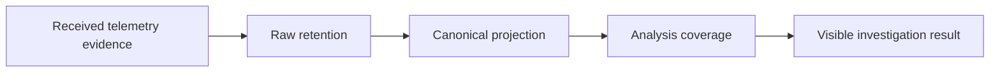

# Specification Analysis: improve-otel-investigation

## 1. Boundary

| Item | Decision | Evidence |
|---|---|---|
| Product capability | New `telemetry-investigation` and `telemetry-diagnostics` capabilities | Proposal and delta specs |
| Change classification | Observable behavior change | Web and MCP expose new navigation, filtering, content, trace, and comparison behavior |
| Included behavior | Evidence navigation, episode access, purpose-based views, structured and saved filters, trace exploration, shared diagnostics, evidence strength, and coverage | Delta specs |
| Excluded behavior | External file collection, configuration management, outcome scoring, unsupported projection mappings, and inferred execution facts | Proposal Non-goals |

---

## 2. Consumers and Observable Events

| Consumer / actor | Trigger / prior state | Interaction or event | Observable result |
|---|---|---|---|
| Web investigator | A diagnostic names retained evidence | Opens the evidence and returns | Reaches the exact activity and restores the prior investigation state |
| Web investigator | A conversation has many activities or diagnostic episodes | Changes view, selects content, filters, or zooms a trace | Reads the requested retained projection without losing selection or coverage context |
| Web or MCP comparison consumer | Two eligible conversations and one retained snapshot are selected | Requests normalized diagnostics | Receives the same metric meaning, values, missing reasons, and analysis limits |
| Content consumer | Received telemetry contains a reference, body, redaction marker, or no body | Requests content | Sees the supported content kind and availability without inferred data |

---

## 3. Concept Analysis

| Concept or change | Specification decision | Evidence | Owner capability and rationale |
|---|---|---|---|
| Investigation State | Source-qualified conversation, selected activity, view, filters, trace range, and return position | Investigation delta | `telemetry-investigation`; it owns navigation continuity |
| Evidence Target | Exact retained activity identified by available source, trace, span, or activity identities | Investigation delta | `telemetry-investigation`; it owns evidence navigation |
| Conversation Filter | Conditions evaluated over the complete retained conversation before pagination | Investigation delta | `telemetry-investigation`; it owns result selection |
| Trace Overview | Coverage-declared timing summary distinct from loaded activity details | Investigation delta | `telemetry-investigation`; it owns long-trace navigation |
| Normalized Diagnostic | Named measurement with unit, operands, denominator, value, delta, and availability | Diagnostics delta | `telemetry-diagnostics`; it owns cross-client metric meaning |
| Content Evidence | Received content or absence classified by provenance and supported semantic kind | Diagnostics delta | `telemetry-diagnostics`; it owns evidence interpretation |
| Coverage | Separate statements about collection, retained projection analysis, body availability, and display visibility | Diagnostics delta | `telemetry-diagnostics`; it owns limits placed on conclusions |

### 3-1. Supporting Models



Each arrow is a separate boundary. Evidence can be retained without projection, projected without a body, analyzed while hidden by a display filter, or absent because the producer did not report it.

---

## 4. Main Spec Conceptual Model Replacements

### `telemetry-investigation`

```markdown
An **Investigation State** identifies the source-qualified conversation, selected activity, purpose-based view, active conversation filters, trace time range, and return position used by an investigator. Navigation and live updates preserve the parts of this state that remain valid.

An **Evidence Target** is an exact retained projected activity named by the identifiers available from a diagnostic. A target can be available, unavailable, or outside the currently loaded page. Unavailability does not authorize substitution with another activity.

A **Conversation Filter** is a set of time, source, text, observed-failure, elapsed-duration, model, and tool conditions evaluated against the complete retained projection of each conversation before pagination. Model and tool conditions each require a matching activity in the same conversation; they do not require both values on one activity. A saved filter stores conditions, while a relative time condition is evaluated when applied rather than storing a result snapshot.

A **Trace Overview** is a coverage-declared timing summary for a trace. It retains the trace's overall extent while an investigator selects a time range and loads detailed activities. Loaded-detail coverage, overview coverage, temporal overlap, and parent relationships are distinct; temporal overlap alone does not establish dependency or causality.

### References

- `[product behavior]` [Agentmetry README](https://github.com/kotokumu/agentmetry/blob/main/README.md)
```

### `telemetry-diagnostics`

```markdown
A **Normalized Diagnostic** is a measurement identified by its metric identity, unit, numerator, denominator, value, delta, and availability reason. Initial validation success proxy, rework token share, retry-cycle effort share, tool failure rate, and recurring failure loops per 100 validations use the same meanings in Web and MCP. Presentation rounding does not change the underlying result.

**Content Evidence** records what the producer delivered and what the supported projection can establish. Its semantic kinds distinguish a file reference, received tool or file-read output, and explicitly reported model input. These kinds describe evidence strength: a reference or read output does not prove later model-input inclusion. Explicit producer redaction, an unreported body, a body omitted by request, and an unsupported raw-only field are distinct availability states.

**Coverage** consists of independent statements about collection, retained raw data, canonical projection, analysis over the retained projection, body availability, and display filtering. Complete analysis of projected records does not imply complete collection or body availability. A record hidden by a display filter remains distinct from missing or unprojected evidence.

Provider-specific mappings determine which content kinds and redaction states are supported. Claude Code and Codex mappings retain separate meanings where their emitted telemetry differs.

### References

- `[provider evidence]` [Claude Code telemetry](https://github.com/kotokumu/agentmetry/blob/main/docs/source-telemetry/claude-code.md)
- `[provider evidence]` [Codex telemetry](https://github.com/kotokumu/agentmetry/blob/main/docs/source-telemetry/codex.md)
- `[raw-retention contract]` [OTLP ingestion specification](https://github.com/kotokumu/agentmetry/blob/main/openspec/specs/otlp-ingestion/spec.md)
```

---

## 5. Requirement Candidates

| Requirement slug | Actor and event | Guarantee | Concepts used | Normative representations | Scenario tags |
|---|---|---|---|---|---|
| `direct-navigation-to-diagnostic-evidence` | Investigator opens diagnostic evidence | Exact target opens and return state is preserved | Investigation State, Evidence Target | State Transition | happy, unavailable, pagination |
| `access-to-every-reported-failure-episode` | Investigator requests additional episodes | Every reported episode remains accessible with coverage | Coverage | Invariant | pagination, partial |
| `purpose-based-conversation-views-and-activity-detail` | Investigator changes view or selection | Selected content remains readable and stable | Investigation State | State Transition | responsive, live-update |
| `structured-conversation-filters` | Investigator applies conditions | Full-result filtering precedes pagination | Conversation Filter | Decision, Partition | happy, invalid, missing-value |
| `local-saved-investigation-filters` | Investigator stores or applies conditions | Local named conditions and navigation state round trip | Conversation Filter, Investigation State | State Transition | relative-time, compatibility |
| `trace-overview-and-focused-time-ranges` | Investigator explores a long trace | Overview and detail ranges retain distinct coverage | Trace Overview, Evidence Target | Invariant | partial, missing-parent |
| `accessible-investigation-controls` | Keyboard user investigates at enlarged zoom | Controls, focus, and state remain perceivable and operable | Investigation State | Invariant | accessibility |
| `shared-diagnostic-comparison-meaning` | Web or MCP compares an eligible pair | Five normalized diagnostics agree | Normalized Diagnostic | Invariant | cross-client, rounding |
| `explicit-comparison-eligibility-and-missing-values` | Consumer requests comparison | Eligibility and unavailable values are explicit | Normalized Diagnostic, Coverage | Partition, Decision | invalid, missing-denominator |
| `content-provenance-and-evidence-strength` | Consumer reads received content | Provenance and semantic strength remain distinct | Content Evidence | Classification | reference, tool-output |
| `provider-specific-content-interpretation` | Consumer reads provider content | Provider mappings and availability states remain accurate | Content Evidence | Partition | redacted, unreported |
| `retained-projected-and-visible-coverage` | Consumer assesses analysis completeness | Coverage boundaries remain separate | Coverage | Invariant | raw-only, hidden, unavailable |
| `preserve-content-access-defaults` | MCP or Web consumer requests diagnostics | Existing body-access defaults remain in effect | Content Evidence | Invariant | privacy-default |

---

## 6. Unresolved Decisions

None.

---

## 7. Sources

- [Change proposal](https://github.com/kotokumu/agentmetry/blob/main/openspec/changes/improve-otel-investigation/proposal.md)
- [Telemetry investigation delta](https://github.com/kotokumu/agentmetry/blob/main/openspec/changes/improve-otel-investigation/specs/telemetry-investigation/spec.md)
- [Telemetry diagnostics delta](https://github.com/kotokumu/agentmetry/blob/main/openspec/changes/improve-otel-investigation/specs/telemetry-diagnostics/spec.md)
