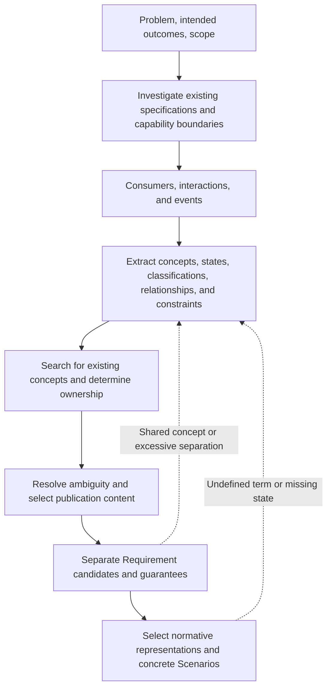

# Specification Modeling Guide

This procedure forms the Conceptual Model on which a change depends before Requirements are listed. In Quality Workflow,
record the analysis in `model.md`. `README.md` owns the notation for main specs.

## 1. Modeling Flow

Consumers include users, callers, external systems, other components, and automated processes. Interactions and events include
calls, operations, messages, schedules, and time triggers. Do not add categories that do not exist in the project.

Do not retain every analysis result in a main spec. Keep candidates, research notes, and Unresolved Decisions in `model.md`.
Retain only confirmed definitions needed to understand the Requirements in the main spec. Analysis tables and optional sections
are not exhaustive checklists.

---

## 2. Investigating Existing Specifications and Boundaries

1. Read the existing Requirements and capabilities identified by the proposal.
2. Search main specs for the same consumers, interactions, events, and concepts.
3. Classify the target as an observable capability, a reusable product rule, or an implementation-only change.
4. Do not create a new capability when an existing capability owns the responsibility.
5. Do not use a technical layer, data structure, framework, or shared utility as a boundary.

Describe a boundary as which consumer receives which observable result in response to which trigger.

---

## 3. Consumers and Events

List each target interaction or event as "prior state or trigger → consumer action or event → observable result." Do not
turn the number of listed entries directly into the number of Requirements. One Requirement can express multiple entry points
that converge on the same guarantee.

---

## 4. Extracting Concepts

Examine the following for each interaction or event.

| Perspective | Question |
|---|---|
| Identity | What must be distinguished? How is it identified, and is it unique? |
| State | Which states can it take? What are its initial and terminal states? |
| Classification | Which classification axes exist, and what does each value mean? |
| Value | What are the accepted range, unit, default, precision, and format? |
| Relationship | What are the containment, reference, ownership, and cardinality rules? |
| Invariant | Which relationships or conditions define a valid concept at all times? Which operation-level guarantees must preserve them? |
| Lifecycle | What do creation, change, termination, resumption, and deletion mean? |
| Derived concept | Does a calculated value or decision used in multiple places have a name? |

When the same calculation or decision appears in multiple Requirements, define its name and meaning as a derived concept.
Do not create a concept solely because a physical table, DTO, API, class, or file exists.

---

## 5. Selecting and Owning Concepts

Retain only concepts that stabilize interpretation of the Requirements in a main spec. Keep the following in the analysis in
`model.md`:

- An obvious noun that appears only once.
- A structure that exists only in the implementation.
- An attribute unnecessary to understand a Requirement.
- A candidate considered during investigation but not adopted.

When an existing concept is available, reuse its authoritative term and definition. The capability that most strongly defines
its meaning, invariants, and lifecycle owns it. Owning its creation process alone does not determine ownership.

When changing a main spec's Conceptual Model, prepare its publication content in `Main Spec Conceptual Model Replacements` in
`model.md` and follow `Deltas and Publication` in `README.md`.

---

## 6. Resolving Ambiguity

Check for the following:

- An undefined identity rule or uniqueness guarantee where one is needed.
- Gaps, overlaps, or unreachable values in states or classifications.
- Undecided ownership or cardinality of related concepts.
- Missing units, time bases, boundaries, or defaults.
- Remaining synonyms or terms with multiple meanings.
- Unverifiable adjectives such as "fast," "appropriate," or "large-scale."
- Interpretations that agree for successful results but diverge for failures, retries, or concurrent execution.

Do not guess when existing specifications, primary sources, and explicit policies do not determine one result. When multiple
reasonable interpretations would change a Requirement's meaning, scope, or result, place the decision in `Unresolved Decisions`
and do not proceed to specs until it is resolved. Resolve every item in the proposal's `Decisions Required` in the model or
carry it forward to that section.

---

## 7. Forming Requirements

Separate Requirements when their guarantees can change or be verified independently.

Reasons to separate:

- The guarantee differs by consumer or permission.
- Acceptance conditions or failure outcomes differ.
- State transitions, outputs, Side Effects, or invariants differ.
- The Concurrency and Idempotency contract is independent.
- A guarantee can change independently of other guarantees.

Reasons not to separate:

- Only the entry point differs, such as UI, API, CLI, or event, while the observable guarantee is the same.
- A decision table can express differences among classification values for the same action.
- Only the implementation component differs.

Map each candidate to "consumer and event / guarantee / concepts used / required normative representations / important Scenario
classes." The Conceptual Model is incomplete when readers must infer shared concepts backward from the Requirements.

---

## 8. Selecting Representations and Scenarios

For each Requirement candidate, identify the structure of every rule and apply `Selecting a Specification Representation` in
`README.md`. Record the selected normative representations and useful Scenario tags. Do not leave a normative
representation only in `model.md`.

After the Requirement is complete, write at least one representative Scenario. Include a `happy` Scenario when the Requirement
permits a successful result. Add error, boundary, permission, concurrency, idempotency, and compatibility examples only when
they materially improve verification. Do not reproduce every row of a normative table as a Scenario. Do not add classifications
unrelated to the project. Return to concept extraction when a Scenario reveals an undefined term, state, or value.

A Scenario MUST NOT invent a new normative rule. If its THEN result cannot be derived from the Requirement, revise the Requirement.
