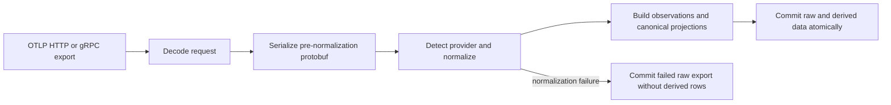

# OTLP Ingestion Specification

## Purpose

Defines how Agentmetry admits OTLP exports, retains their original data, detects
Claude Code and Codex sources, normalizes provider fields, and persists
observations and canonical projections.

---

## Processing model

---

## Evidence

| Specification area | Implementation | Tests |
| --- | --- | --- |
| Transport and failure response | [receiver.go](https://github.com/theoden9014/agentmetry/blob/main/internal/ingest/otel/receiver.go) | [receiver_test.go](https://github.com/theoden9014/agentmetry/blob/main/internal/ingest/otel/receiver_test.go) |
| Raw payload encoding | [payload.go](https://github.com/theoden9014/agentmetry/blob/main/internal/journal/payload.go) | [payload_test.go](https://github.com/theoden9014/agentmetry/blob/main/internal/journal/payload_test.go) |
| Signal normalization | [normalize.go](https://github.com/theoden9014/agentmetry/blob/main/internal/ingest/otel/normalize.go) | [normalize_test.go](https://github.com/theoden9014/agentmetry/blob/main/internal/ingest/otel/normalize_test.go) |
| Observation construction | [observations.go](https://github.com/theoden9014/agentmetry/blob/main/internal/ingest/otel/observations.go) | [observations_test.go](https://github.com/theoden9014/agentmetry/blob/main/internal/ingest/otel/observations_test.go) |
| Claude Code normalization | [plugin.go](https://github.com/theoden9014/agentmetry/blob/main/internal/source/claude/plugin.go) | [plugin_test.go](https://github.com/theoden9014/agentmetry/blob/main/internal/source/claude/plugin_test.go) |
| Codex normalization | [profile.go](https://github.com/theoden9014/agentmetry/blob/main/internal/source/codex/profile.go) | [profile_test.go](https://github.com/theoden9014/agentmetry/blob/main/internal/source/codex/profile_test.go) |
| Atomic persistence and projection | [store.go](https://github.com/theoden9014/agentmetry/blob/main/internal/storage/sqlite/store.go), [schema.hcl](https://github.com/theoden9014/agentmetry/blob/main/internal/storage/sqlite/schema.hcl) | [journal_test.go](https://github.com/theoden9014/agentmetry/blob/main/internal/storage/sqlite/journal_test.go), [store_test.go](https://github.com/theoden9014/agentmetry/blob/main/internal/storage/sqlite/store_test.go) |

---

## Requirements

### Requirement: OTLP transport admission

Agentmetry SHALL accept OTLP logs, metrics, and traces over the configured HTTP
and gRPC receivers. The default HTTP receiver SHALL expose `POST /v1/logs`,
`POST /v1/metrics`, and `POST /v1/traces` on `127.0.0.1:4318`. The default gRPC
receiver SHALL listen on `127.0.0.1:4317`.

For HTTP, a request whose `Content-Type` contains `json` SHALL be decoded as
OTLP JSON. Every other request SHALL be decoded as OTLP protobuf. The HTTP
receiver SHALL reject a body larger than 32 MiB before decoding. The gRPC
receiver SHALL NOT apply that HTTP pre-read limit. Journal encoding SHALL still
reject an original protobuf larger than 32 MiB, and the gRPC receiver SHALL
report that commit failure as `Unavailable` after decoding and normalization.

#### Scenario: SC-TRANSPORT-01 — Admit OTLP JSON over HTTP

- **GIVEN** a valid OTLP JSON logs request with a JSON content type
- **WHEN** the client posts it to `/v1/logs`
- **THEN** Agentmetry decodes it as logs and submits it for one journal commit

#### Scenario: SC-TRANSPORT-02 — Reject malformed HTTP payload

- **GIVEN** a body that cannot be decoded using the selected OTLP encoding
- **WHEN** the client posts it to an OTLP HTTP endpoint
- **THEN** Agentmetry responds with HTTP 400 and does not commit the export

#### Scenario: SC-TRANSPORT-03 — Reject oversized HTTP payload

- **GIVEN** an OTLP HTTP request body larger than 32 MiB
- **WHEN** Agentmetry reads the request
- **THEN** Agentmetry rejects the request before normalization or persistence

#### Scenario: SC-TRANSPORT-04 — Report commit failure by transport

- **GIVEN** a decoded export whose journal commit fails
- **WHEN** the export arrived over HTTP or gRPC
- **THEN** Agentmetry reports HTTP 503 for HTTP or `Unavailable` for gRPC

### Requirement: Lossless raw export retention

Agentmetry SHALL serialize a decoded request to protobuf before provider
normalization and SHALL use those bytes as the replayable raw export. A
successfully committed raw export SHALL retain its signal, transport, receive
time, stored payload, codec, SHA-256, original protobuf size, detected source,
normalizer version, normalization status, and normalization error. Agentmetry
SHALL NOT store the compressed payload length as separate metadata.

Provider aliases and canonical fields SHALL NOT be written back into the raw
protobuf. Data omitted from canonical projections SHALL remain recoverable from
the raw export when the journal commit succeeds.

#### Scenario: SC-RAW-01 — Preserve pre-normalization data

- **GIVEN** a decoded export containing provider attributes and OTLP detail not represented canonically
- **WHEN** Agentmetry normalizes and commits the export
- **THEN** the raw payload contains the original decoded OTLP data and no provider-added aliases

#### Scenario: SC-RAW-02 — Replay a retained export

- **GIVEN** a committed raw export with a valid codec, hash, and size metadata
- **WHEN** Agentmetry replays it with a normalizer
- **THEN** Agentmetry can reconstruct the decoded request from the retained protobuf

### Requirement: Source detection

Agentmetry SHALL classify each normalized source event by applying registered
source profiles in registration order. The standard registry SHALL evaluate
Claude Code before Codex and SHALL select the first matching profile.

The matching input SHALL be the lowercase concatenation of the source event
name, string `event.name`, and string `service.name`. Claude Code SHALL match
when that input contains `claude`; Codex SHALL match when it contains `codex`.
An event that matches neither profile SHALL use source `unknown` and retain its
unmodified attributes for canonical signal handling.

The source event name SHALL be the span name for traces, the metric name for
metrics, and native `EventName` followed by `event.name` and `otel.name`
fallbacks for logs. Resource attributes SHALL be merged before matching, and a
record or data-point attribute SHALL override the same resource key for
canonical projection. Metric observations SHALL derive their source and context
from metric-level resource attributes only.

#### Scenario: SC-SOURCE-01 — Select Claude on an ambiguous match

- **GIVEN** an event whose matching input contains both `claude` and `codex`
- **WHEN** the standard source registry classifies the event
- **THEN** Agentmetry selects the Claude Code profile

#### Scenario: SC-SOURCE-02 — Select Codex from provider markers

- **GIVEN** an event whose signal name, `event.name`, or `service.name` contains `codex` and does not contain `claude`
- **WHEN** the standard source registry classifies the event
- **THEN** Agentmetry selects the Codex profile

#### Scenario: SC-SOURCE-04 — Retain an unknown source

- **GIVEN** an event whose signal name, string `event.name`, and string `service.name` contain neither provider marker
- **WHEN** Agentmetry classifies the event
- **THEN** Agentmetry assigns source `unknown` without discarding the event

#### Scenario: SC-SOURCE-03 — Prefer local service metadata

- **GIVEN** a resource `service.name` and a different local `service.name`
- **WHEN** Agentmetry builds the source matching input
- **THEN** the local value participates in matching

### Requirement: Alias preservation

Provider normalization SHALL add canonical aliases without removing source
attributes. An existing canonical destination SHALL take precedence over a
source alias unless a provider-specific rule explicitly states that it
overwrites the destination. Codex tool normalization SHALL overwrite
`tool_name` with its namespace-stripped value. A non-empty target or target type
extracted from Codex tool arguments SHALL overwrite the corresponding canonical
target, and a target extracted from output JSON SHALL overwrite the arguments
target. Values replaced in canonical attributes SHALL remain in the raw export.

#### Scenario: SC-ALIAS-01 — Preserve an existing canonical value

- **GIVEN** an event using an ordinary source alias with a canonical destination and no documented provider-specific overwrite rule
- **WHEN** provider normalization copies the alias
- **THEN** Agentmetry keeps the canonical destination and retains the source attribute

### Requirement: Claude Code event normalization

Agentmetry SHALL prefer non-empty string `event.name` over the native event
name for Claude Code. It SHALL remove one leading `claude_code.` and apply this
mapping:

| Claude Code source event | Canonical event |
| --- | --- |
| `assistant_response` | `gen_ai.response.completed` |
| `api_request` | `gen_ai.model.request` |
| `llm_request` | `gen_ai.model.request.trace` |
| `api_error` | `gen_ai.model.error` |
| Empty | `gen_ai.telemetry.event` |
| Any other value | `gen_ai.<source-event>` |

#### Scenario: SC-CL-EVT-01 — Normalize a Claude API request

- **GIVEN** a Claude Code event named `claude_code.api_request`
- **WHEN** Agentmetry normalizes the event
- **THEN** its canonical name is `gen_ai.model.request`

#### Scenario: SC-CL-EVT-03 — Normalize a Claude assistant response

- **GIVEN** a Claude Code event named `claude_code.assistant_response`
- **WHEN** Agentmetry normalizes the event
- **THEN** its canonical name is `gen_ai.response.completed`

#### Scenario: SC-CL-EVT-04 — Normalize a Claude LLM request

- **GIVEN** a Claude Code event named `claude_code.llm_request`
- **WHEN** Agentmetry normalizes the event
- **THEN** its canonical name is `gen_ai.model.request.trace`

#### Scenario: SC-CL-EVT-05 — Normalize a Claude API error

- **GIVEN** a Claude Code event named `claude_code.api_error`
- **WHEN** Agentmetry normalizes the event
- **THEN** its canonical name is `gen_ai.model.error`

#### Scenario: SC-CL-EVT-02 — Normalize a generic Claude event

- **GIVEN** a Claude Code event named `claude_code.tool_result`
- **WHEN** Agentmetry normalizes the event
- **THEN** its canonical name is `gen_ai.tool_result`

### Requirement: Claude Code attribute normalization

Agentmetry SHALL add the following Claude Code aliases when the canonical
destination is absent:

| Source attribute, in precedence order | Canonical destination |
| --- | --- |
| `session.id` | `gen_ai.conversation.id` |
| `agent_id` | `gen_ai.agent.id` |
| `agent_definition`, `agent.name`, `subagent_type` | `gen_ai.agent.definition` |
| `parent_agent_id` | `gen_ai.agent.parent.id` |
| `model` | `gen_ai.request.model` |
| `target_agent_id` | `gen_ai.agent.target.id` |
| `target_agent_type` | `gen_ai.agent.target.type` |
| `prompt.id` | `gen_ai.turn.id` |
| `client_request_id` | `gen_ai.client.request.id` |
| `request_id` | `gen_ai.request.id` |
| `agent.name`, `subagent_type` | `gen_ai.agent.type` |
| `tool_use_id` | `gen_ai.tool.call.id` |
| `tool_name` | `gen_ai.tool.name` |

If agent definition is still absent and agent ID has the form
`<definition>@session-...`, Agentmetry SHALL derive the definition from the
prefix. If agent type is still absent, Agentmetry SHALL map `query_source` as
follows:

| `query_source` | `gen_ai.agent.type` |
| --- | --- |
| `main`, `repl_main_thread` | `root` |
| `compact`, `auxiliary` | `auxiliary` |
| `subagent` | `subagent` |
| Empty | Absent |
| Other | Value without a leading `agent:` |

Claude Code read-time agent metadata SHALL also derive a missing definition
from agent ID and remove a leading `agent:` from agent type.

#### Scenario: SC-CL-ATTR-01 — Derive a Claude agent definition

- **GIVEN** a Claude Code event with agent ID `reviewer@session-123` and no definition
- **WHEN** Agentmetry normalizes agent metadata
- **THEN** `gen_ai.agent.definition` is `reviewer`

#### Scenario: SC-CL-ATTR-02 — Map a Claude root query

- **GIVEN** a Claude Code event with `query_source=repl_main_thread` and no canonical agent type
- **WHEN** Agentmetry normalizes attributes
- **THEN** `gen_ai.agent.type` is `root`

### Requirement: Claude Code content normalization

Agentmetry SHALL select the first non-empty string, or first present non-string,
from `prompt`, `response`, `tool_input`, `tool_parameters`, `full_command`,
`file_path`, `error`, `body`, and `body_ref`, in that order, as the canonical
`content` attribute. Canonical activity extraction SHALL consume that value only
when it is a string.

#### Scenario: SC-CL-CONT-01 — Select the first non-empty Claude content field

- **GIVEN** a Claude Code event with an empty `prompt` and a non-empty `response`
- **WHEN** Agentmetry normalizes content
- **THEN** canonical `content` equals `response`

#### Scenario: SC-CL-CTRL-01 — Preserve Claude producer content controls

- **GIVEN** Claude telemetry whose content was omitted, redacted, or truncated by producer configuration
- **WHEN** Agentmetry receives the export
- **THEN** Agentmetry processes only the received fields and does not evaluate or reverse the producer setting

### Requirement: Claude Code usage normalization

For a Claude Code `api_request`, Agentmetry SHALL set
`gen_ai.usage.role=authoritative_call`, map output, cache-read, and cache-write
counters, and derive usage identity from `client_request_id` then `request_id`.
When canonical input tokens are absent, Agentmetry SHALL calculate them as
source input tokens plus cache-read tokens plus cache-creation tokens. It SHALL
not add those cache counters again when canonical input tokens already exist.

For a Claude Code `llm_request`, Agentmetry SHALL set
`gen_ai.usage.role=corroborating` and derive the same usage identity, but SHALL
not add token counters.

For every normalized Claude event, when non-negative `cost_usd_micros` is
parseable, Agentmetry SHALL set
`gen_ai.usage.cost_usd` to the value divided by 1,000,000 and SHALL set
`cost_usd` only when it is absent. A negative or unparseable micro-cost SHALL
not produce that alias. When another valid cost candidate exists, Agentmetry
SHALL continue canonical cost derivation from that candidate.

#### Scenario: SC-CL-USAGE-01 — Calculate authoritative Claude input usage

- **GIVEN** an `api_request` with 100 input, 20 cache-read, and 10 cache-creation tokens
- **WHEN** Agentmetry normalizes usage
- **THEN** canonical input usage is 130 and its role is `authoritative_call`

#### Scenario: SC-CL-USAGE-02 — Avoid duplicate Claude usage

- **GIVEN** an `llm_request` carrying token fields
- **WHEN** Agentmetry normalizes usage
- **THEN** the role is `corroborating` and no token counter is added by the provider profile

#### Scenario: SC-CL-COST-01 — Convert Claude micro-cost

- **GIVEN** a Claude event with `cost_usd_micros=1250000`
- **WHEN** Agentmetry normalizes cost
- **THEN** `gen_ai.usage.cost_usd` is `1.25`

#### Scenario: SC-CL-COST-02 — Ignore an invalid Claude micro-cost alias

- **GIVEN** a Claude event with an invalid `cost_usd_micros` and no other valid cost candidate
- **WHEN** Agentmetry normalizes cost
- **THEN** the invalid micro-cost creates no canonical cost

### Requirement: Codex event normalization

Agentmetry SHALL prefer non-empty string `event.name` over the native event name
for Codex and apply this mapping:

| Condition | Canonical event |
| --- | --- |
| `codex.sse_event` and `event.kind=response.completed` | `gen_ai.response.completed` |
| `codex.agent_communication` and `kind=spawn` | `gen_ai.agent.delegation` |
| `codex.agent_communication` and `kind=followup` | `gen_ai.agent.delegation` |
| Other `codex.agent_communication` | `gen_ai.agent.message` |
| Other name beginning `codex.` | `gen_ai.<suffix>` |
| Name without `codex.` | Original name |

`codex.agent_communication` SHALL be treated as an Agentmetry compatibility
input implemented by the local Codex profile. It is not part of the upstream
Codex data snapshot.

For `kind=spawn` and `state=send`, Agentmetry SHALL map `sender_thread_id` to
`agentmetry.session.parent.id` and `receiver_thread_id` to
`agentmetry.session.child.id`. When `model=codex-auto-review`, Agentmetry SHALL
overwrite `gen_ai.agent.type` with `system`.

#### Scenario: SC-CX-EVT-01 — Normalize a completed Codex response

- **GIVEN** `codex.sse_event` with `event.kind=response.completed`
- **WHEN** Agentmetry normalizes the event
- **THEN** its canonical name is `gen_ai.response.completed`

#### Scenario: SC-AM-CX-EXT-01 — Create Codex spawn session aliases

- **GIVEN** a sent `codex.agent_communication` spawn with sender and receiver thread IDs
- **WHEN** Agentmetry normalizes the event
- **THEN** it creates parent and child session aliases and names the event `gen_ai.agent.delegation`

#### Scenario: SC-CX-EVT-02 — Normalize a generic Codex event

- **GIVEN** a Codex event named `codex.tool_result`
- **WHEN** Agentmetry normalizes the event
- **THEN** its canonical name is `gen_ai.tool_result`

### Requirement: Codex attribute normalization

Agentmetry SHALL add the following Codex aliases when the canonical destination
is absent:

| Source attribute, in precedence order | Canonical destination |
| --- | --- |
| `conversation.id` | `gen_ai.conversation.id` |
| `turn_id`, `turn.id`, `prompt_id`, `prompt.id` | `gen_ai.turn.id` |
| `model` | `gen_ai.request.model` |
| `sender_thread_id` | `gen_ai.agent.id` |
| `agent_definition`, `agent.name`, `subagent_type` | `gen_ai.agent.definition` |
| `agent_type` | `gen_ai.agent.type` |
| `receiver_thread_id` | `gen_ai.agent.target.id` |
| `input_token_count`, `input_tokens` | `gen_ai.usage.input_tokens` |
| `output_token_count`, `output_tokens` | `gen_ai.usage.output_tokens` |
| `cached_token_count`, `cached_input_tokens` | `gen_ai.usage.cache_read.input_tokens` |
| `cache_write_token_count`, `cache_write_tokens` | `gen_ai.usage.cache_write.input_tokens` |
| `reasoning_token_count`, `codex.usage.reasoning_output_tokens`, `reasoning_output_tokens` | `gen_ai.usage.reasoning_tokens` |

#### Scenario: SC-CX-ATTR-01 — Apply Codex turn precedence

- **GIVEN** a Codex event with both `turn_id` and `prompt.id` and no canonical turn ID
- **WHEN** Agentmetry normalizes attributes
- **THEN** `gen_ai.turn.id` equals `turn_id`

### Requirement: Codex usage normalization

When at least one canonical usage counter exists, Agentmetry SHALL set usage
role to `authoritative_call` for `gen_ai.response.completed` and to
`corroborating` for every other canonical event. It SHALL derive usage identity
from `gen_ai.client.request.id`, `gen_ai.request.id`, `request_id`, or
`response.id`, in that order. If none exists and both conversation ID and event
timestamp exist, it SHALL use `<conversation-id>|<event-timestamp>`.

Codex normalization SHALL NOT add cache or reasoning counters to input or output
tokens. Canonical total tokens SHALL be input plus output only.

#### Scenario: SC-CX-USAGE-01 — Mark a completed Codex response authoritative

- **GIVEN** a normalized completed response with at least one usage counter
- **WHEN** Agentmetry assigns usage authority
- **THEN** its usage role is `authoritative_call`

#### Scenario: SC-CX-USAGE-02 — Build fallback Codex usage identity

- **GIVEN** usage without request identity but with conversation ID and event timestamp
- **WHEN** Agentmetry normalizes usage
- **THEN** usage ID is the conversation ID and timestamp joined by `|`

### Requirement: Codex tool and content normalization

When non-empty string `tool_name` exists, Agentmetry SHALL remove a leading
collaboration namespace, write the normalized value to both `tool_name` and
`gen_ai.tool.name`, and process `arguments` and `output`. Without a non-empty
tool name, it SHALL NOT extract target or content from those fields.

Agentmetry SHALL accept `arguments` as an object or JSON object string. It SHALL
derive target type from non-empty `agent_type` and target ID from non-empty
`target`, falling back to `task_name`. A target in a JSON object `output` SHALL
override the arguments target.

Agentmetry SHALL construct canonical content from non-empty arguments `message`
and non-empty string `output`, joined by a newline when both exist. A message
beginning `gAAAA` SHALL be replaced with
`Instruction content encrypted by source telemetry`. Output content SHALL be
prefixed with `Result: `.

#### Scenario: SC-CX-TOOL-01 — Redact encrypted Codex instruction content

- **GIVEN** a Codex tool event whose arguments message begins with `gAAAA`
- **WHEN** Agentmetry normalizes content
- **THEN** canonical content contains the fixed encrypted-content placeholder and not the source ciphertext

#### Scenario: SC-CX-TOOL-02 — Require a Codex tool name for extraction

- **GIVEN** Codex arguments and output without a non-empty tool name
- **WHEN** Agentmetry normalizes the event
- **THEN** it does not derive target agent or canonical content from those fields

#### Scenario: SC-CX-CONT-01 — Combine Codex tool message and output

- **GIVEN** a Codex tool event with a non-empty tool name, arguments message `inspect`, and output `done`
- **WHEN** Agentmetry normalizes content
- **THEN** canonical content is `inspect` followed by a newline and `Result: done`

#### Scenario: SC-CX-CTRL-01 — Preserve Codex producer prompt controls

- **GIVEN** a Codex prompt value emitted as clear text or `[REDACTED]` by producer configuration
- **WHEN** Agentmetry receives the log record
- **THEN** Agentmetry retains the received value without applying an additional prompt-redaction rule

### Requirement: Token usage validation

Agentmetry SHALL interpret canonical token counters from integer values,
integer-valued floats, JSON numbers, and decimal strings. An unparseable or
negative raw candidate SHALL be treated as unreported rather than automatically
failing the batch. Explicit zero SHALL remain reported and distinct from
missing.

When the applicable counters are reported, Agentmetry SHALL reject normalized
usage where cache read plus cache write exceeds input, reasoning exceeds output,
or input plus output overflows a signed 64-bit integer. A validation failure in
any projected trace record, log record, or supported metric data point SHALL
fail normalization for the batch.

#### Scenario: SC-USAGE-01 — Reject inconsistent cache usage

- **GIVEN** reported canonical input tokens of 10 and reported cache tokens totaling 11
- **WHEN** Agentmetry validates the normalized record
- **THEN** normalization fails for the batch

#### Scenario: SC-USAGE-02 — Allow partial usage

- **GIVEN** a record with reported output tokens and no input or cache counters
- **WHEN** Agentmetry validates usage
- **THEN** the partial usage is valid

#### Scenario: SC-USAGE-03 — Treat an invalid raw counter as missing

- **GIVEN** a raw negative counter that does not become a canonical reported counter
- **WHEN** Agentmetry derives and validates usage
- **THEN** the raw value alone does not cause normalization failure

### Requirement: Trace projection

Agentmetry SHALL merge resource attributes with each span's attributes, with
span attributes taking precedence, and normalize every span before semantic
selection. It SHALL create a trace observation and canonical span projection
only for a semantic span.

A span SHALL be semantic when its normalized name is
`gen_ai.response.completed`, `gen_ai.user_prompt`, `gen_ai.model.request`,
`gen_ai.model.request.trace`, `gen_ai.model.error`,
`gen_ai.agent.delegation`, `gen_ai.agent.message`, `gen_ai.tool`,
`gen_ai.tool.call`, `gen_ai.tool_result`, or `gen_ai.tool.result`, or when the
span has a non-empty tool, target, content, cost, agent-context, or token-usage
field. Span events SHALL NOT participate in semantic selection.

A canonical span SHALL retain trace ID, span ID, parent span ID, name, start and
end timestamps, status, canonical attributes, provider source, agent context,
usage, and cost when present. Resource attribute values SHALL remain in
canonical attributes. Span events, span links, native span kind, resource and
scope objects, resource schema URL, instrumentation scope metadata, and scope
schema URL SHALL remain available only in the raw export.

#### Scenario: SC-TRACE-01 — Project a semantic span

- **GIVEN** a span containing canonical agent, tool, content, usage, cost, or recognized event semantics
- **WHEN** Agentmetry normalizes traces
- **THEN** it creates one observation and one canonical span row for that input span

#### Scenario: SC-TRACE-02 — Retain an incidental span raw-only

- **GIVEN** a runtime span with no semantic signal
- **WHEN** Agentmetry normalizes traces
- **THEN** it creates neither an observation nor a canonical span row, while the raw export retains the span

#### Scenario: SC-TRACE-EVENT-01 — Retain span events raw-only

- **GIVEN** a span event containing provider trace-safe fields
- **WHEN** Agentmetry normalizes its enclosing export
- **THEN** it does not derive an observation or canonical projection from the span event

#### Scenario: SC-CX-TRACE-01 — Preserve Codex native span fields by destination

- **GIVEN** a semantic Codex span with native IDs, status, kind, and attributes
- **WHEN** Agentmetry projects the span
- **THEN** IDs, status, and canonical attributes are projected, native kind has no canonical field, and all original fields remain in the raw export

### Requirement: Log projection

Agentmetry SHALL create one observation and one canonical log row for every log
record, including an unknown event. Canonical event-name precedence SHALL be
native `EventName`, `event.name`, then `otel.name` before provider
normalization. A matched Claude Code or Codex profile SHALL override that name
with a non-empty provider `event.name`. Canonical content produced by a provider
profile SHALL take precedence over the stringified log body.

A canonical log SHALL retain timestamp, trace and span IDs, severity, body,
canonical attributes, provider source, agent context, usage, and cost when
present. Resource attribute values SHALL remain in canonical attributes.
Resource and scope objects, resource schema URL, instrumentation scope metadata,
and scope schema URL SHALL remain available only in the raw export. Parent and
child session aliases SHALL produce a session link.

#### Scenario: SC-LOG-01 — Project an unknown log event

- **GIVEN** a valid log record that matches no source profile
- **WHEN** Agentmetry normalizes logs
- **THEN** it creates a canonical log row with source `unknown`

#### Scenario: SC-LOG-02 — Prefer provider content over log body

- **GIVEN** a log record with both provider-normalized content and a body
- **WHEN** Agentmetry builds the canonical log
- **THEN** canonical activity content uses the provider-normalized content

#### Scenario: SC-LOG-03 — Prefer provider event name after receiver fallback

- **GIVEN** a matched provider log whose native `EventName` differs from non-empty attribute `event.name`
- **WHEN** Agentmetry applies provider normalization
- **THEN** the final canonical event name is derived from attribute `event.name`

### Requirement: Metric projection

Agentmetry SHALL create canonical metric points for Gauge, Sum, and Histogram
data points. Gauge and Sum points SHALL use their numeric point value. A
Histogram point SHALL use its sum when present and its count otherwise.

Each point SHALL merge resource and data-point attributes with the data-point
value taking precedence, then apply provider normalization and usage
validation. Metric name, type, selected value, timestamp, canonical attributes,
provider source, agent identity, run, model, and cost SHALL be projected.
Canonical token counters SHALL NOT be stored in dedicated SQLite metric
columns; token attributes SHALL remain in canonical attributes and raw data.

Resource attribute values SHALL remain in canonical attributes. Histogram
buckets, explicit bounds, exemplars, aggregation temporality, resource and scope
objects, instrumentation scope metadata, and schema URLs SHALL remain available
only in the raw export. Summary and ExponentialHistogram SHALL create no
canonical metric point, but their raw data SHALL remain retained.

#### Scenario: SC-CX-MET-01 — Retain unsupported metric metadata in raw data

- **GIVEN** a Codex metric with unit, temporality, bounds, buckets, or exemplars
- **WHEN** Agentmetry projects the metric
- **THEN** those fields have no dedicated canonical destination and remain in the raw export

#### Scenario: SC-CL-MET-01 — Keep Claude usage metrics generic

- **GIVEN** a supported `claude_code.token.usage` metric point
- **WHEN** Agentmetry normalizes metrics
- **THEN** it creates a generic metric row without dedicated token-usage semantics

#### Scenario: SC-METRIC-01 — Project a histogram sum

- **GIVEN** a Histogram data point with both count and sum
- **WHEN** Agentmetry normalizes metrics
- **THEN** the canonical metric value equals the sum

#### Scenario: SC-METRIC-02 — Fall back to histogram count

- **GIVEN** a Histogram data point without a sum
- **WHEN** Agentmetry normalizes metrics
- **THEN** the canonical metric value equals the count

#### Scenario: SC-METRIC-03 — Keep unsupported metric types raw-only

- **GIVEN** a Summary or ExponentialHistogram metric
- **WHEN** Agentmetry normalizes metrics
- **THEN** it creates no canonical metric point while retaining the original metric in the raw export

### Requirement: Observation cardinality

Trace observations SHALL use semantic input-span ordinal as their source unit.
The ordinal SHALL be the position in the original OTLP span sequence; skipped
nonsemantic spans SHALL therefore leave gaps between stored observation
ordinals.
Log observations SHALL use input log-record ordinal. Metric observations SHALL
use one OTLP Metric as their source unit, while canonical metric projections
SHALL use one data point as their unit.

A metric observation SHALL derive source and context from metric-level resource
attributes, not from individual data-point attributes. Summary and
ExponentialHistogram metrics SHALL still produce a metric-level observation.

Trace observation source name SHALL be the raw span name. Log observation
source name SHALL be native `EventName`, falling back only to `event.name`.
Metric observation source name SHALL be the raw metric name.

#### Scenario: SC-OBS-01 — Distinguish metric observation from points

- **GIVEN** one supported OTLP Metric containing three data points
- **WHEN** Agentmetry constructs observations and projections
- **THEN** it creates one metric observation and three canonical metric points

#### Scenario: SC-OBS-02 — Observe an unsupported metric type

- **GIVEN** one Summary metric
- **WHEN** Agentmetry constructs observations and projections
- **THEN** it creates one metric observation and no canonical metric point

#### Scenario: SC-OBS-03 — Preserve the input span ordinal

- **GIVEN** a semantic span, a nonsemantic span, and another semantic span in that order
- **WHEN** Agentmetry constructs trace observations
- **THEN** the stored observation ordinals are the first and third input-span ordinals

### Requirement: Atomic persistence and normalization failure

Agentmetry SHALL commit the raw export metadata, observations, canonical
projections, session links, and rollups in one storage transaction. On
successful normalization, it SHALL persist the raw export and all derived data.

On normalization failure, Agentmetry SHALL attempt to persist the raw export
with failed status and error, and SHALL persist neither observations nor
canonical projections. The raw failure SHALL be retained only if journal
encoding and the storage transaction succeed. If that failed-status journal
commit succeeds, the receiver SHALL acknowledge the transport request as
accepted. A storage commit failure SHALL not leave a partial journal commit.

The journal source SHALL be derived from observation and projection sources. An
empty source set SHALL produce `unknown`; one distinct source SHALL produce that
source; two or more distinct sources SHALL produce `mixed`. A normalization
failure has an empty derived source set and SHALL therefore record `unknown`.

#### Scenario: SC-PERSIST-01 — Retain a normalization failure

- **GIVEN** a decoded export whose canonical usage validation fails
- **WHEN** Agentmetry commits the batch successfully
- **THEN** the raw export has failed status and no observation or projection is stored
- **AND** the transport request is acknowledged as accepted

#### Scenario: SC-PERSIST-02 — Avoid partial persistence

- **GIVEN** a storage failure during journal commit
- **WHEN** Agentmetry rolls back the transaction
- **THEN** no raw export, observation, projection, link, or rollup from that commit remains

### Requirement: Projection retry identity

Agentmetry SHALL upsert canonical spans by trace ID and span ID. Canonical log
and metric rows SHALL append another row when an equivalent export is retried.
Every accepted, successfully normalized retry SHALL insert a new raw export.
Each observation-producing input item in that retry SHALL insert a new
observation. An empty export or incidental-only trace SHALL insert no
observation. An accepted normalization-failed retry SHALL insert only a failed
raw export and no observations or projections.

#### Scenario: SC-RETRY-01 — Retry a span export

- **GIVEN** a canonical span already stored with a trace ID and span ID
- **WHEN** an export produces the same canonical span identity
- **THEN** Agentmetry updates the span projection instead of appending a second span row

#### Scenario: SC-RETRY-02 — Retry a log export

- **GIVEN** an equivalent log record was previously stored
- **WHEN** the client retries the export
- **THEN** Agentmetry appends another canonical log row, raw export, and log observation

#### Scenario: SC-RETRY-03 — Retry a metric export

- **GIVEN** an equivalent metric data point was previously stored
- **WHEN** the client retries the export
- **THEN** Agentmetry appends another canonical metric row, raw export, and metric observation
